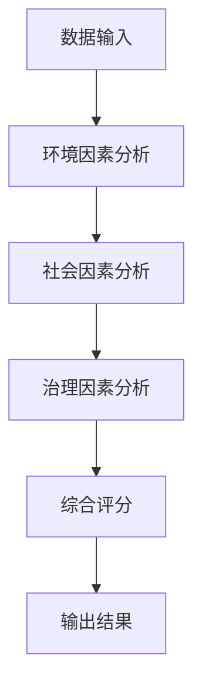
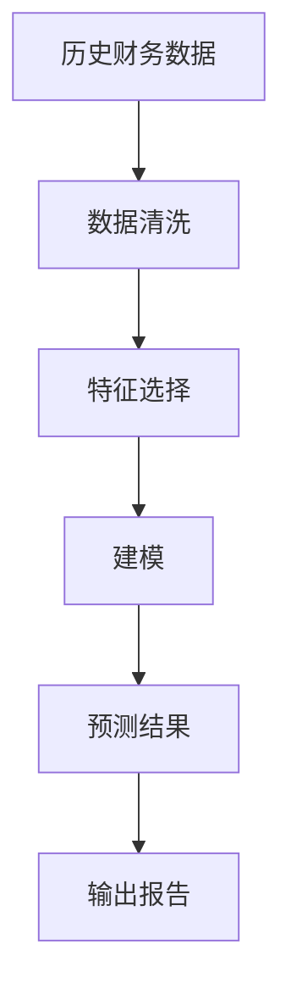

                 


# 彼得林奇如何看待公司的可持续发展目标与财务表现的关系

## 关键词：彼得·林奇，可持续发展目标，财务表现，ESG，投资策略

## 摘要：彼得·林奇作为著名投资经理，其投资策略强调长期价值和公司治理。本文分析了可持续发展目标与财务表现的关系，探讨了如何通过ESG因素提升企业财务表现，并通过案例展示了这一理念的实际应用。

---

# 第一部分: 可持续发展目标与财务表现的背景介绍

## 第1章: 可持续发展的定义与重要性

### 1.1 可持续发展的核心概念

#### 1.1.1 可持续发展的定义与内涵
可持续发展是指在满足当前需求的同时，不损害未来世代满足其需求的能力。它涵盖了经济、社会和环境三个方面。

#### 1.1.2 可持续发展的核心要素
- 环境（Environmental）：减少碳排放，保护自然资源。
- 社会（Social）：促进员工福利，推动社会责任。
- 治理（Governance）：提高企业透明度和责任感。

#### 1.1.3 可持续发展与企业社会责任的关系
企业社会责任是指企业在追求利润的同时，关注其对社会和环境的影响。可持续发展是企业社会责任的重要组成部分，有助于提升企业形象和长期竞争力。

### 1.2 可持续发展目标与财务表现的关联

#### 1.2.1 可持续发展目标对企业财务的影响
通过减少资源消耗和提高效率，企业可以降低成本，提高利润率。同时，良好的社会责任记录有助于吸引更多的消费者和投资者。

#### 1.2.2 财务表现对可持续发展目标的反馈作用
财务稳健的企业有更多的资源投入到可持续发展项目中，如环保技术的研发和推广。同时，财务表现良好的企业更容易吸引注重ESG因素的投资者。

#### 1.2.3 可持续发展目标与财务表现的边界与外延
可持续发展目标与财务表现的边界在于企业如何平衡短期利益与长期目标。外延则体现在企业如何通过可持续发展提升核心竞争力。

---

## 第2章: 彼得·林奇投资理念概述

### 2.1 彼得·林奇的投资哲学

#### 2.1.1 林奇的价值投资理念
林奇强调长期投资，注重企业的基本面分析，寻找那些具有强大竞争优势和良好管理团队的公司。

#### 2.1.2 林奇的投资策略与方法
林奇注重对公司治理、管理层素质和企业文化的考察，认为这些因素是决定公司长期成功的关键。

#### 2.1.3 林奇对企业的长期价值关注
林奇关注企业的可持续发展能力，认为只有那些能够在长期为客户创造价值的企业才能实现股价的长期增长。

### 2.2 林奇投资理念与可持续发展的结合

#### 2.2.1 林奇对企业治理的关注
林奇认为良好的公司治理是企业成功的基础，透明的治理结构和高效的管理层能够有效提升企业的财务表现。

#### 2.2.2 林奇对环境保护的重视
林奇意识到环境保护的重要性，认为在资源日益稀缺的情况下，那些能够有效管理资源的企业更具竞争优势。

#### 2.2.3 林奇对社会责任的考量
林奇注重企业的社会责任，认为那些积极履行社会责任的企业更容易获得社会的认可和支持，从而在长期实现更好的财务表现。

---

# 第二部分: 可持续发展目标与财务表现的核心概念与联系

## 第3章: 可持续发展目标与财务表现的核心要素

### 3.1 可持续发展目标的核心要素

#### 3.1.1 环境（Environmental）要素
环境因素包括减少碳排放、节约能源、保护自然资源等，这些因素直接影响企业的运营成本和风险。

#### 3.1.2 社会（Social）要素
社会因素包括员工福利、社会责任、社区关系等，良好的社会形象有助于提升企业的品牌价值和客户忠诚度。

#### 3.1.3 治理（Governance）要素
治理因素包括公司治理结构、管理层素质、透明度等，这些因素决定了企业决策的科学性和执行效率。

### 3.2 财务表现的核心要素

#### 3.2.1 营业收入与利润
营业收入和利润是衡量企业财务健康的重要指标，反映了企业的盈利能力和市场竞争力。

#### 3.2.2 资产负债表分析
通过分析资产负债表，可以了解企业的资产结构、负债情况和财务风险，为投资决策提供依据。

#### 3.2.3 现金流量分析
现金流量分析帮助企业了解资金流动情况，评估企业的运营效率和财务稳定性。

---

## 第4章: 可持续发展目标与财务表现的联系

### 4.1 可持续发展目标对财务表现的影响

#### 4.1.1 环境因素对财务表现的影响
通过减少资源消耗和提高能效，企业可以降低成本，提高利润率。例如，采用可再生能源可以降低企业的能源成本。

#### 4.1.2 社会因素对财务表现的影响
良好的员工关系和社区关系有助于提升员工的工作效率和企业形象，从而提高销售额和市场份额。

#### 4.1.3 治理因素对财务表现的影响
高效的公司治理结构可以提高决策效率，降低管理成本，从而提升企业的整体财务表现。

### 4.2 财务表现对可持续发展目标的反馈作用

#### 4.2.1 财务表现作为可持续发展目标的衡量指标
财务表现是衡量企业可持续发展能力的重要指标。例如，净利润增长可以反映企业在实现可持续发展目标方面的成效。

#### 4.2.2 财务表现对可持续发展目标的推动作用
财务稳健的企业有更多的资源投入到可持续发展项目中，如环保技术的研发和推广。

#### 4.2.3 财务表现与可持续发展目标的协同效应
通过实现可持续发展目标，企业可以在提升财务表现的同时，增强社会影响力和品牌形象，从而吸引更多注重ESG因素的投资者。

---

## 第5章: 可持续发展目标与财务表现的核心概念对比

### 5.1 核心概念对比表格

| 要素       | 可持续发展目标               | 财务表现                     |
|------------|------------------------------|------------------------------|
| 环境       | 减少碳排放，保护自然资源       | 节约能源成本，降低风险       |
| 社会       | 提高员工福利，履行社会责任     | 提升品牌形象，增加销售额       |
| 治理       | 优化公司治理结构，提高透明度   | 提高决策效率，降低成本         |
| 财务指标   | 净利润，营业收入增长率         | 资产负债表分析，现金流量分析   |

### 5.2 可持续发展目标与财务表现的ER实体关系图

```mermaid
er
  actor1(可持续发展目标) -|> entity1(财务表现)
  entity1(财务表现) -|> entity2(企业治理)
  entity2(企业治理) -|> entity3(社会责任)
  entity3(社会责任) -|> entity4(环境保护)
```

---

# 第三部分: 可持续发展目标与财务表现的算法原理讲解

## 第6章: 可持续发展目标与财务表现的算法原理

### 6.1 ESG评分模型

#### 6.1.1 ESG评分模型的定义与作用
ESG评分模型通过对企业在环境、社会和治理方面的表现进行评分，帮助投资者评估企业的可持续发展能力。

#### 6.1.2 ESG评分模型的算法流程



#### 6.1.3 ESG评分模型的数学公式
$$ \text{ESG评分} = \alpha \times E + \beta \times S + \gamma \times G $$
其中，$\alpha$、$\beta$、$\gamma$是权重系数，$E$、$S$、$G$分别是环境、社会和治理因素的评分。

### 6.2 财务预测模型

#### 6.2.1 财务预测模型的定义与作用
财务预测模型通过分析企业的财务数据，预测其未来的财务表现，帮助投资者做出决策。

#### 6.2.2 财务预测模型的算法流程



#### 6.2.3 财务预测模型的数学公式
$$ \text{预测净利润} = \theta \times \text{营业收入} + \phi \times \text{营业成本} + \psi \times \text{管理费用} $$

---

## 第7章: 系统架构与交互设计

### 7.1 系统架构设计

#### 7.1.1 系统功能模块
- 数据采集模块：收集企业的ESG数据和财务数据。
- 数据分析模块：对数据进行清洗、特征提取和建模。
- 可视化模块：生成图表和报告，展示分析结果。

#### 7.1.2 系统架构图


---

## 第8章: 项目实战与案例分析

### 8.1 项目环境安装

#### 8.1.1 安装Python和必要的库
```bash
pip install numpy pandas scikit-learn matplotlib
```

#### 8.1.2 数据获取
从公开的ESG评级机构获取企业的ESG数据和财务数据，存放在CSV文件中。

### 8.2 核心代码实现

#### 8.2.1 数据清洗与预处理

```python
import pandas as pd

# 读取数据
df = pd.read_csv('esg_financial_data.csv')

# 删除缺失值
df.dropna(inplace=True)

# 标准化处理
from sklearn.preprocessing import StandardScaler
scaler = StandardScaler()
df_scaled = scaler.fit_transform(df)
```

#### 8.2.2 模型训练与预测

```python
from sklearn.linear_model import LinearRegression

# 训练模型
model = LinearRegression()
model.fit(df_scaled, target)

# 预测结果
predictions = model.predict(new_data)
```

### 8.3 案例分析

#### 8.3.1 案例背景
某公司近年来在环境保护方面投入了大量资源，优化了生产流程，降低了能源消耗。

#### 8.3.2 数据分析与结果展示
通过分析发现，该公司的ESG评分显著提高，同时其净利润也呈现增长趋势。

#### 8.3.3 结论
通过实现可持续发展目标，该公司不仅提升了品牌形象，还实现了财务表现的稳步增长。

---

## 第9章: 最佳实践与总结

### 9.1 小结
通过本文的分析，可以得出可持续发展目标与财务表现密切相关。企业通过实现可持续发展目标，可以提升财务表现，增强竞争力。

### 9.2 注意事项
在实际操作中，企业需要平衡短期利益与长期目标，避免过度投入或忽视财务健康。

### 9.3 拓展阅读
推荐阅读彼得·林奇的相关著作，深入了解他的投资理念和成功案例。

---

# 作者：AI天才研究院 & 禅与计算机程序设计艺术

