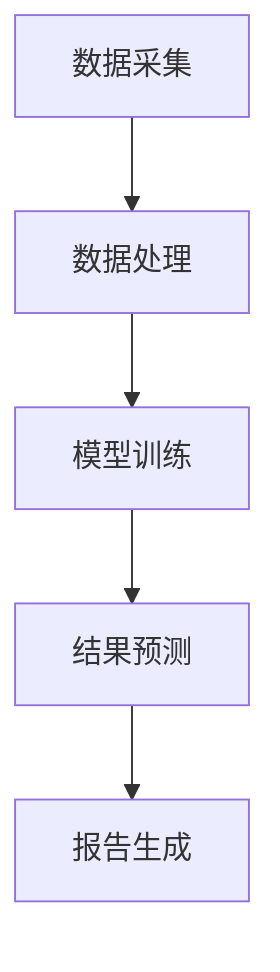

                 


# 彼得林奇如何看待公司的员工保留率

## 关键词：员工保留率，彼得·林奇，公司管理，投资价值，员工满意度

## 摘要：员工保留率是衡量公司管理能力的重要指标。本文从彼得·林奇的投资视角出发，分析员工保留率对公司的长期价值影响，探讨如何通过员工满意度、职业发展机会、薪酬福利等关键因素提升员工保留率，从而增强公司的竞争力和投资吸引力。

---

# 引言

## 1.1 员工保留率的重要性
### 1.1.1 什么是员工保留率
员工保留率是指公司在一定时间内成功保留员工的能力，通常以员工流失率的倒数或百分比表示。高员工保留率意味着公司能够有效留住人才，降低招聘和培训成本，同时提高团队稳定性和生产力。

### 1.1.2 员工保留率对企业的影响
员工保留率直接影响公司的运营效率、创新能力和发展潜力。高保留率意味着员工更有可能在公司长期发展，从而为公司创造更大的价值。

### 1.1.3 彼得·林奇对员工保留率的关注点
作为投资专家，彼得·林奇关注员工保留率是因为它直接反映了公司的管理能力、员工满意度和企业文化的健康程度。高员工保留率的公司通常具有更强的竞争力和长期增长潜力，从而更具投资价值。

---

# 第一部分：员工保留率的背景与概念

## 2.1 员工保留率的定义与测量
### 2.1.1 员工保留率的定义
员工保留率是公司在一定时间内保留员工的能力，通常以员工流失率的倒数或百分比表示。例如，如果公司有100名员工，一年内有20名员工离职，员工保留率为80%。

### 2.1.2 员工保留率的测量方法
员工保留率的计算公式为：
$$
\text{员工保留率} = \frac{\text{期初员工数 - 期末离职员工数}}{\text{期初员工数}} \times 100\%
$$

### 2.1.3 影响员工保留率的关键因素
影响员工保留率的关键因素包括工作满意度、职业发展机会、薪酬福利、公司文化与领导风格等。

---

## 2.2 员工保留率的背景与问题背景
### 2.2.1 当前职场环境的变化
随着职场竞争的加剧和员工对职业发展的需求增加，员工保留率的问题变得越来越重要。员工更倾向于寻找能够提供良好职业发展机会和工作环境的公司。

### 2.2.2 员工保留率问题的现状
许多公司面临员工流失率高的问题，尤其是在高科技行业和竞争激烈的领域。员工流失不仅增加了招聘和培训成本，还可能影响团队的稳定性和公司的声誉。

### 2.2.3 员工保留率与企业绩效的关系
高员工保留率通常与高绩效和高员工满意度相关。员工保留率高的公司通常能够吸引和留住优秀人才，从而在市场竞争中占据优势。

---

## 2.3 员工保留率的核心要素
### 2.3.1 工作满意度
工作满意度是影响员工保留率的重要因素。满意的员工更有可能留在公司，并为公司创造更大的价值。

### 2.3.2 职业发展机会
职业发展机会是员工选择留在公司的重要原因。员工希望能够在公司中获得晋升和成长的机会，从而增加他们的忠诚度。

### 2.3.3 薪酬福利
薪酬福利是员工留在公司的重要因素之一。合理的薪酬和福利计划能够提高员工的满意度和忠诚度。

### 2.3.4 公司文化与领导风格
公司文化和领导风格直接影响员工的工作体验和满意度。良好的公司文化和发展前景能够吸引和留住优秀员工。

---

# 第二部分：员工保留率的核心概念与分析

## 3.1 员工保留率的核心驱动因素
### 3.1.1 工作满意度与员工保留率的关系
工作满意度高的员工更有可能留在公司。研究表明，工作满意度与员工保留率呈正相关关系。

### 3.1.2 职业发展机会与员工保留率的关系
职业发展机会是员工留在公司的重要因素。员工希望能够在公司中获得晋升和成长的机会，从而增加他们的忠诚度。

### 3.1.3 薪酬福利与员工保留率的关系
薪酬福利是员工留在公司的重要因素之一。合理的薪酬和福利计划能够提高员工的满意度和忠诚度。

### 3.1.4 公司文化与领导风格对员工保留率的影响
公司文化和领导风格直接影响员工的工作体验和满意度。良好的公司文化和发展前景能够吸引和留住优秀员工。

---

## 3.2 员工保留率的对比分析
### 3.2.1 不同行业员工保留率的对比
不同行业的员工保留率存在显著差异。例如，高科技行业通常具有较高的员工保留率，而劳动密集型行业可能保留率较低。

### 3.2.2 不同岗位员工保留率的对比
不同岗位的员工保留率也存在差异。例如，技术岗位通常具有较高的保留率，而销售岗位可能保留率较低。

### 3.2.3 不同年龄段员工保留率的对比
不同年龄段的员工保留率也存在差异。例如，年轻员工可能更倾向于寻找新的机会，而中年员工可能更倾向于稳定。

---

## 3.3 员工保留率的ER实体关系图
```mermaid
er
    Employee {
        ID
        Name
        Position
        Department
        Salary
        Tenure
        Satisfaction
    }
    Company {
        ID
        Name
        Industry
        Location
    }
    Job {
        ID
        Title
        Description
        SalaryRange
    }
    Employee --> Job: "担任"
    Employee --> Company: "属于"
    Job --> Company: "属于"
```

---

# 第三部分：员工保留率的算法原理与实现

## 4.1 员工保留率预测模型
### 4.1.1 基于逻辑回归的员工保留率预测模型
我们可以使用逻辑回归模型来预测员工的保留率。以下是模型的数学公式：
$$
\ln\left(\frac{p}{1-p}\right) = \beta_0 + \beta_1 x_1 + \beta_2 x_2 + \ldots + \beta_n x_n
$$
其中，$p$ 是员工保留的概率，$x_i$ 是自变量（如工作满意度、薪酬福利等），$\beta_i$ 是回归系数。

### 4.1.2 员工保留率预测模型的实现
以下是使用Python实现员工保留率预测模型的代码示例：
```python
import pandas as pd
from sklearn.linear_model import LogisticRegression
from sklearn.metrics import accuracy_score

# 加载数据集
data = pd.read_csv('employee_retention.csv')

# 定义特征和目标变量
X = data[['工作满意度', '薪酬福利', '职业发展机会']]
y = data['保留率']

# 创建逻辑回归模型
model = LogisticRegression()
model.fit(X, y)

# 预测结果
y_pred = model.predict(X)

# 计算准确率
print("准确率:", accuracy_score(y, y_pred))
```

---

## 4.2 员工保留率预测模型的优化
### 4.2.1 基于决策树的优化
我们可以使用决策树模型来进一步优化员工保留率的预测。以下是使用决策树模型的Python代码示例：
```python
from sklearn.tree import DecisionTreeClassifier

# 创建决策树模型
model = DecisionTreeClassifier()
model.fit(X, y)

# 预测结果
y_pred = model.predict(X)

# 计算准确率
print("准确率:", accuracy_score(y, y_pred))
```

### 4.2.2 基于随机森林的优化
我们可以使用随机森林模型来进一步优化员工保留率的预测。以下是使用随机森林模型的Python代码示例：
```python
from sklearn.ensemble import RandomForestClassifier

# 创建随机森林模型
model = RandomForestClassifier(n_estimators=100)
model.fit(X, y)

# 预测结果
y_pred = model.predict(X)

# 计算准确率
print("准确率:", accuracy_score(y, y_pred))
```

---

# 第四部分：员工保留率的系统分析与架构设计

## 5.1 系统功能设计
### 5.1.1 系统功能模块
员工保留率分析系统包括以下功能模块：
- 数据采集与处理
- 员工保留率预测模型
- 数据可视化与报告生成

### 5.1.2 系统功能流程
以下是员工保留率分析系统的功能流程图：


---

## 5.2 系统架构设计
### 5.2.1 系统架构图
以下是员工保留率分析系统的架构图：
```mermaid
client --> HTTP 请求 --> server
server --> 数据库查询 --> 数据库
server --> 处理请求 --> 返回结果
client <-- 返回结果 --> browser
```

### 5.2.2 系统接口设计
以下是员工保留率分析系统的接口设计：
```mermaid
sequence
    client -> server: 发送数据请求
    server -> client: 返回数据结果
```

---

# 第五部分：员工保留率的项目实战

## 6.1 项目环境安装
### 6.1.1 安装Python
安装Python环境：https://www.python.org/downloads/

### 6.1.2 安装所需的Python库
安装以下Python库：
```bash
pip install pandas
pip install scikit-learn
pip install matplotlib
```

---

## 6.2 系统核心代码实现
### 6.2.1 数据采集与处理
以下是数据采集与处理的代码示例：
```python
import pandas as pd
import numpy as np

# 创建模拟数据集
data = {
    '员工ID': range(1, 101),
    '工作满意度': np.random.uniform(1, 5, 100),
    '薪酬福利': np.random.uniform(1, 5, 100),
    '职业发展机会': np.random.uniform(1, 5, 100),
    '保留率': np.random.randint(0, 2, 100)
}

df = pd.DataFrame(data)
df.to_csv('employee_retention.csv', index=False)
```

### 6.2.2 员工保留率预测模型
以下是员工保留率预测模型的代码示例：
```python
import pandas as pd
from sklearn.model_selection import train_test_split
from sklearn.metrics import classification_report

# 加载数据集
data = pd.read_csv('employee_retention.csv')

# 定义特征和目标变量
X = data[['工作满意度', '薪酬福利', '职业发展机会']]
y = data['保留率']

# 划分训练集和测试集
X_train, X_test, y_train, y_test = train_test_split(X, y, test_size=0.2, random_state=42)

# 创建逻辑回归模型
from sklearn.linear_model import LogisticRegression
model = LogisticRegression()
model.fit(X_train, y_train)

# 预测结果
y_pred = model.predict(X_test)

# 打印分类报告
print(classification_report(y_test, y_pred))
```

---

## 6.3 案例分析与详细解读
### 6.3.1 案例分析
以下是一个员工保留率分析的案例：
```python
# 案例分析
data = {
    '员工ID': [1, 2, 3, 4, 5],
    '工作满意度': [4.5, 3.8, 4.2, 3.6, 4.0],
    '薪酬福利': [4.2, 3.9, 4.1, 3.7, 4.0],
    '职业发展机会': [4.3, 3.7, 4.0, 3.8, 4.1],
    '保留率': [1, 0, 1, 0, 1]
}

df = pd.DataFrame(data)
df.to_csv('employee_retention.csv', index=False)
```

### 6.3.2 详细解读
通过上述案例，我们可以看到员工保留率与工作满意度、薪酬福利和职业发展机会密切相关。通过分析这些因素，我们可以制定有效的员工保留策略。

---

# 第六部分：员工保留率的总结与展望

## 7.1 总结
### 7.1.1 核心总结
员工保留率是衡量公司管理能力的重要指标。通过分析工作满意度、职业发展机会、薪酬福利等关键因素，我们可以制定有效的员工保留策略，从而提高公司的竞争力和投资吸引力。

### 7.1.2 项目小结
本文从彼得·林奇的投资视角出发，分析了员工保留率对公司的长期价值影响，并通过实际案例和代码实现，展示了如何通过员工满意度、职业发展机会、薪酬福利等关键因素提升员工保留率。

---

## 7.2 展望
### 7.2.1 未来研究方向
未来的研究可以进一步探讨员工保留率与公司绩效之间的关系，以及如何通过大数据和人工智能技术优化员工保留策略。

### 7.2.2 技术发展
随着技术的进步，我们可以利用大数据和人工智能技术更精准地预测员工保留率，并制定更有效的员工保留策略。

---

# 作者

作者：AI天才研究院/AI Genius Institute & 禅与计算机程序设计艺术 /Zen And The Art of Computer Programming

