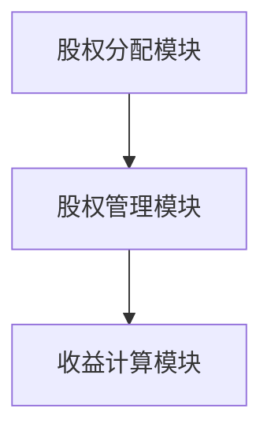

                 


# 彼得林奇如何看待公司的员工持股计划

## 关键词：
员工持股计划, 彼得·林奇, 投资视角, 公司治理, 激励机制, 数学模型

## 摘要：
本文从彼得·林奇的投资视角探讨员工持股计划在公司治理中的作用，分析其对员工激励和公司绩效的影响。通过数学模型和系统架构，深入解读员工持股计划的实施策略，结合实际案例，提供可行的解决方案和最佳实践。

---

## 第一部分：员工持股计划的背景与核心概念

### 第1章：员工持股计划的定义与背景

#### 1.1 员工持股计划的定义

员工持股计划（Employee Stock Ownership Plan，ESOP）是一种通过让员工持有公司股份来激励员工、提高公司凝聚力和绩效的机制。ESOP通常允许员工以优惠价格购买公司股票，或通过公司匹配的方式增加员工持股比例。

#### 1.2 员工持股计划的背景与意义

员工持股计划起源于20世纪60年代的美国，旨在通过员工持股增强员工对公司发展的责任感和归属感。ESOP不仅有助于吸引和留住优秀人才，还能有效提高员工的工作积极性和创新意识，从而提升公司整体绩效。

---

## 第二部分：彼得·林奇的投资视角

### 第2章：彼得·林奇的投资理念与员工持股计划

#### 2.1 彼得·林奇的投资理念

彼得·林奇是一位著名投资家，他强调价值投资和长期持有优质资产。他认为，员工持股计划是公司治理中的重要组成部分，能够有效激励员工，增强公司的长期发展潜力。

#### 2.2 彼得·林奇对员工持股计划的评价

林奇认为，员工持股计划的成功取决于公司整体的健康状况和员工的参与度。他特别关注员工持股计划的透明度和公平性，认为这能够确保员工对公司发展方向的认同和支持。

---

## 第三部分：员工持股计划的实施策略

### 第3章：员工持股计划的设计与管理

#### 3.1 员工持股计划的设计原则

- **参与范围**：确定哪些员工可以参与持股计划，通常包括管理层和核心员工。
- **分配比例**：根据员工的职位和贡献，分配不同比例的股份。
- **实施周期**：设定持股计划的实施周期，通常为3-5年，以确保员工的长期激励效果。

#### 3.2 员工持股计划的管理与执行

- **管理机构**：设立专门的管理机构，负责持股计划的日常运营和监督。
- **实施流程**：包括股权分配、股权锁定、股权解锁等关键步骤。
- **监控与评估**：定期评估持股计划的实施效果，确保其与公司战略目标一致。

---

## 第四部分：员工持股计划的数学模型与系统架构

### 第4章：员工持股计划的数学模型分析

#### 4.1 员工持股计划的收益分配模型

假设公司总股本为N，员工持股比例为P，员工持有的股份数为S = P * N。员工的收益取决于公司股价的增长，公式为：

$$ \text{收益} = S \times (P_{\text{new}} - P_{\text{old}}) $$

其中，\( P_{\text{new}} \)和\( P_{\text{old}} \)分别为新旧股价。

#### 4.2 员工持股计划的系统架构设计

系统架构包括股权分配模块、股权管理模块和收益计算模块。系统架构图如下：



---

## 第五部分：案例分析与项目实战

### 第5章：案例分析与项目实战

#### 5.1 案例分析

以某科技公司为例，假设公司总股本为1000万股，管理层和技术骨干占总股本的20%。通过员工持股计划，员工购买了10%的股份，公司匹配5%的股份。最终，员工持股比例达到25%，显著提升了员工的凝聚力和公司的绩效。

#### 5.2 项目实战

- **环境安装**：使用ERP系统进行股权管理。
- **核心实现**：通过Python编写股权分配和收益计算的代码。
- **代码示例**：

```python
def calculate_profit(stocks, old_price, new_price):
    return stocks * (new_price - old_price)

# 示例计算
stocks = 1000
old_price = 50
new_price = 60
profit = calculate_profit(stocks, old_price, new_price)
print(f"收益为：${profit}")
```

---

## 第六部分：结论与展望

### 第6章：结论与展望

员工持股计划是公司治理中的重要机制，彼得·林奇的投资理念为我们提供了 valuable insights。通过科学的设计和管理，员工持股计划能够有效激励员工，提升公司绩效。未来，随着公司治理的不断发展，员工持股计划将更加注重公平性和透明度，成为企业成功的重要推动力。

---

## 作者：AI天才研究院/AI Genius Institute & 禅与计算机程序设计艺术 /Zen And The Art of Computer Programming

---

**小结：** 通过本文的分析，我们从彼得·林奇的投资视角深入探讨了员工持股计划的实施策略和数学模型，结合实际案例，为读者提供了全面的解决方案和最佳实践。

