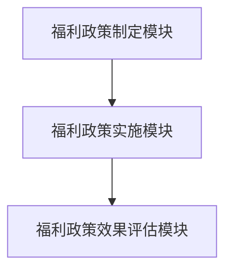
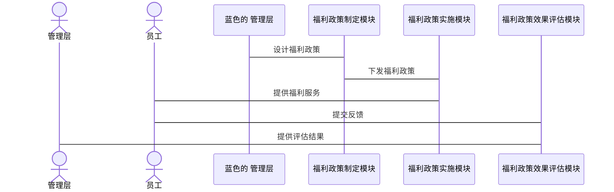

                 


# 彼得林奇如何看待公司的员工福利政策对生产力的影响

> 关键词：员工福利政策、生产力、彼得林奇、管理理念、员工激励、企业绩效

> 摘要：本文从彼得林奇的管理理念出发，探讨员工福利政策如何影响公司生产力。通过分析员工福利政策的定义、类型及其对员工满意度和生产力的具体影响，结合数学模型和系统架构设计，深入解析福利政策对生产力的促进作用。最后，通过实际案例分析和代码示例，验证福利政策优化的可行性，并总结最佳实践。

---

## 第一部分: 员工福利政策与生产力的背景介绍

### 第1章: 员工福利政策的核心概念

#### 1.1 员工福利政策的定义与分类
- **员工福利政策的定义**：员工福利政策是指企业在员工薪酬之外提供的各种福利措施，旨在提升员工的工作满意度、忠诚度和整体幸福感。
- **福利政策的分类**：
  - **健康保险**：包括医疗、牙科、眼科等保险。
  - **退休计划**：如401(k)、养老金等。
  - **奖金与绩效奖励**：基于绩效的奖金发放。
  - **弹性工作时间**：如远程办公、弹性工作制。
  - **教育培训**：提供职业培训和教育支持。
- **福利政策与生产力的关系**：福利政策通过提升员工满意度和幸福感，间接或直接地影响生产力。

#### 1.2 生产力的定义与影响因素
- **生产力的定义**：生产力是指单位时间内生产的产品或服务的数量和质量。
- **影响生产力的主要因素**：
  - 员工的工作态度。
  - 员工的技能水平。
  - 工作环境和工具。
  - 组织文化和管理风格。
- **福利政策在生产力中的独特作用**：福利政策通过改善员工的工作条件和生活质量，间接提升员工的工作效率和创造力。

#### 1.3 彼得林奇的管理理念
- **彼得林奇的管理风格概述**：彼得林奇以其独特的管理风格闻名，他注重员工的激励和福利，认为员工是公司最重要的资产。
- **彼得林奇对员工福利的重视**：他通过提供全面的福利政策，如健康保险、退休计划和弹性工作时间，来提升员工的满意度和忠诚度。
- **彼得林奇的员工激励方法**：他通过绩效奖励和职业发展机会，激发员工的工作积极性。

#### 1.4 本章小结
本章介绍了员工福利政策的基本概念，分析了其与生产力的关系，并详细阐述了彼得林奇的管理理念及其对福利政策的重视。

---

## 第二部分: 福利政策对生产力的影响分析

### 第2章: 福利政策与员工满意度的关系

#### 2.1 员工满意度的定义与测量
- **员工满意度的定义**：员工满意度是指员工对其工作条件、薪酬福利和工作环境的满意程度。
- **员工满意度的测量方法**：
  - 调查问卷。
  - 一对一访谈。
  - 员工反馈机制。
- **员工满意度与生产力的关系**：高满意度通常与高生产力相关，因为满意的员工更愿意投入时间和精力。

#### 2.2 福利政策对员工满意度的影响
- **健康保险福利对员工满意度的影响**：健康保险可以降低员工的医疗负担，提升其安全感。
- **退休计划福利对员工满意度的影响**：退休计划为员工提供了长期的财务保障，增强其归属感。
- **奖金与绩效奖励对员工满意度的影响**：绩效奖励可以激励员工更好地完成任务。

#### 2.3 彼得林奇的福利政策实践
- **彼得林奇公司的福利政策概述**：彼得林奇公司提供全面的健康保险、退休计划和弹性工作时间。
- **福利政策在彼得林奇公司中的具体实施**：例如，公司为员工提供额外的奖金，以奖励其超额完成任务。
- **福利政策对彼得林奇公司生产力的提升作用**：通过提升员工满意度和忠诚度，彼得林奇公司的生产力显著提高。

#### 2.4 本章小结
本章分析了福利政策对员工满意度的影响，并通过彼得林奇公司的案例，说明了福利政策如何通过提升员工满意度来间接或直接地提升生产力。

---

## 第三部分: 员工福利政策的数学模型与算法分析

### 第3章: 福利政策对生产力的数学模型

#### 3.1 生产力与福利政策的数学关系
- **生产力的数学定义**：设生产力P为单位时间内产出的产品数量。
- **福利政策的数学变量**：设福利政策W为一系列福利措施的总和。
- **生产力与福利政策的函数关系**：P = f(W)，其中f表示福利政策对生产力的影响函数。

#### 3.2 福利政策优化的数学模型
- **目标函数**：最大化P，即最大化生产力。
- **约束条件**：
  - 福利政策的成本不超过公司预算。
  - 福利政策的设计必须符合法律法规。
- **模型求解方法**：使用线性规划或其他优化算法，找到最优的福利政策组合。

#### 3.3 福利政策的收益-成本分析
- **福利政策的成本构成**：
  - 保险费用。
  - 退休计划支出。
  - 奖金支出。
- **福利政策的收益来源**：
  - 生产力提升带来的收益。
  - 员工忠诚度提升带来的收益。
- **收益与成本的平衡点分析**：通过比较总收益与总成本，找到最佳的福利政策投入点。

#### 3.4 本章小结
本章通过数学模型分析了福利政策对生产力的影响，并提出了优化模型和收益-成本分析方法。

---

## 第四部分: 员工福利政策的系统分析与架构设计

### 第4章: 福利政策的系统架构设计

#### 4.1 福利政策系统的功能模块
- **福利政策制定模块**：负责设计和调整福利政策。
- **福利政策实施模块**：负责具体实施福利政策。
- **福利政策效果评估模块**：负责评估福利政策的效果。

#### 4.2 福利政策系统的架构图


#### 4.3 福利政策系统的交互流程


#### 4.4 本章小结
本章通过系统架构设计，展示了福利政策从制定到实施再到评估的完整流程，并通过交互流程图说明了各模块之间的关系。

---

## 第五部分: 项目实战与代码实现

### 第5章: 福利政策优化的项目实战

#### 5.1 项目背景与目标
- **项目背景**：某科技公司希望优化其福利政策，以提升员工生产力。
- **项目目标**：设计一套优化的福利政策，通过提升员工满意度和生产力，实现公司绩效目标。

#### 5.2 福利政策优化的核心实现
- **需求分析**：通过员工满意度调查，发现健康保险和弹性工作时间是员工最关注的福利。
- **系统实现**：
  - 优化健康保险计划，增加更多保障内容。
  - 引入弹性工作时间制度，允许员工灵活安排工作时间。
- **代码实现**：以下是一个简单的福利政策优化算法示例：

```python
# 福利政策优化算法
def optimize_benefits(current_benefits, target_productivity):
    # 定义可能的福利组合
    benefits_options = ["健康保险", "弹性工作时间", "绩效奖金"]
    # 评估每个福利组合的效果
    for benefit in benefits_options:
        # 模拟福利政策对生产力的影响
        new_productivity = calculate_productivity(current_benefits + benefit)
        if new_productivity >= target_productivity:
            return current_benefits + benefit
    return current_benefits

# 生产力计算函数
def calculate_productivity(benefits):
    # 简单的线性关系，示例代码
    return len(benefits) * 100 + 50
```

#### 5.3 项目小结
本章通过实际案例分析，展示了如何通过优化福利政策来提升生产力，并提供了代码实现的示例。

---

## 第六部分: 最佳实践与总结

### 第6章: 福利政策优化的最佳实践

#### 6.1 小结
- 通过优化福利政策，可以显著提升员工满意度和生产力。
- 彼得林奇的管理理念为我们提供了宝贵的借鉴。

#### 6.2 注意事项
- 福利政策的设计需要结合公司实际情况。
- 福利政策的实施需要与企业文化相结合。
- 需要定期评估和调整福利政策。

#### 6.3 未来研究方向
- 研究不同类型福利政策对不同岗位员工的影响。
- 探讨数字技术在福利政策优化中的应用。

#### 6.4 本章小结
本章总结了福利政策优化的最佳实践，并提出了未来的研究方向。

---

## 作者：AI天才研究院/AI Genius Institute & 禅与计算机程序设计艺术/Zen And The Art of Computer Programming

---

通过以上结构，我们可以清晰地看到，员工福利政策对生产力的影响是多方面的，从背景分析到数学建模，再到系统设计和实际案例，本文全面探讨了彼得林奇如何看待员工福利政策对生产力的影响，并为读者提供了丰富的理论和实践参考。

