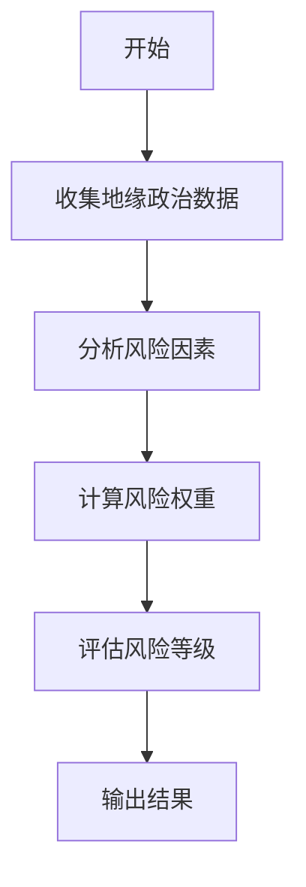

                 


# 彼得林奇如何看待公司的地缘政治风险

> 关键词：彼得·林奇，地缘政治风险，投资策略，风险管理，企业战略，政治经济学

> 摘要：本文从彼得·林奇的投资哲学出发，系统地分析了地缘政治风险对企业经营和投资决策的影响。通过结合理论与实践，文章详细探讨了地缘政治风险的核心概念、评估方法、应对策略，以及如何将地缘政治风险纳入企业战略管理。本文旨在为投资者和企业管理者提供一套完整的地缘政治风险管理框架。

---

# 第一部分: 地缘政治风险的背景与概念

## 第1章: 地缘政治风险的背景介绍

### 1.1 地缘政治风险的核心概念

#### 1.1.1 地缘政治风险的定义与内涵
地缘政治风险是指由于地理位置、国家间关系、政治制度、经济政策、社会文化等因素的相互作用，对企业经营环境产生的不确定性风险。这些风险可能影响企业的供应链、市场份额、利润和声誉。

#### 1.1.2 地缘政治风险的分类与特征
地缘政治风险可以分为以下几类：
- **国家风险**：包括政治不稳定、政策变化、战争冲突等。
- **区域风险**：涉及特定地区的经济、社会和政治环境。
- **行业风险**：某些行业更容易受到地缘政治风险的影响，例如能源、国防和科技行业。

地缘政治风险的特征包括：
- **不可预测性**：地缘政治事件往往出人意料。
- **复杂性**：地缘政治风险涉及多个变量，难以量化。
- **长期性**：某些地缘政治风险可能持续多年，甚至数十年。

#### 1.1.3 地缘政治风险的边界与外延
地缘政治风险的边界包括：
- **国家层面**：包括政府政策、政治稳定性等。
- **国际层面**：包括国际贸易摩擦、国际制裁等。
- **企业层面**：包括企业运营、供应链、市场准入等。

地缘政治风险的外延包括：
- **宏观经济影响**：如汇率波动、通货膨胀等。
- **微观经济影响**：如企业成本、利润变化等。

### 1.2 彼得·林奇的视角与方法

#### 1.2.1 彼得·林奇的投资哲学
彼得·林奇是美国著名投资经理，以其独特的投资策略和对市场的深刻理解闻名。他认为，投资成功的关键在于对行业和公司的深入了解，以及对市场趋势的敏锐洞察。

#### 1.2.2 彼得·林奇对地缘政治风险的关注点
彼得·林奇在其投资生涯中，非常注重分析地缘政治风险对企业的影响。他认为，地缘政治风险是投资决策中不可忽视的重要因素，尤其是在跨国投资中。

#### 1.2.3 彼得·林奇的地缘政治风险分析框架
彼得·林奇的地缘政治风险分析框架包括以下几个方面：
- **政治稳定性**：分析目标国家的政治环境是否稳定。
- **经济政策**：评估目标国家的经济政策是否对企业有利。
- **国际关系**：关注目标国家与主要国家的关系，尤其是贸易关系。
- **行业敏感性**：评估企业所在行业的敏感性，例如能源行业更容易受到地缘政治影响。

## 第2章: 地缘政治风险的核心概念与联系

### 2.1 地缘政治风险的核心要素

#### 2.1.1 政治环境
政治环境是地缘政治风险的核心要素之一。包括政府稳定性、政策变化、政治冲突等。

#### 2.1.2 经济环境
经济环境包括经济政策、经济结构、经济波动等，这些因素可能直接影响企业的经营环境。

#### 2.1.3 社会环境
社会环境包括社会稳定性、文化差异、社会舆论等，这些因素可能影响企业的市场准入和品牌声誉。

#### 2.1.4 国际关系
国际关系包括国际贸易摩擦、国际制裁、外交关系等，这些因素可能影响企业的供应链和市场准入。

### 2.2 地缘政治风险与公司经营的联系

#### 2.2.1 地缘政治风险对公司战略的影响
地缘政治风险可能影响公司的战略决策，例如供应链布局、市场进入策略、风险管理策略等。

#### 2.2.2 地缘政治风险对投资决策的影响
地缘政治风险是投资者在选择投资标的时需要考虑的重要因素，尤其是在跨国投资中。

#### 2.2.3 地缘政治风险对供应链管理的影响
地缘政治风险可能影响企业的供应链管理，例如原材料供应中断、物流成本增加等。

### 2.3 地缘政治风险的ER实体关系图

```mermaid
erDiagram
    nation {
        id : int
        name : string
        political_system : string
        economic_policy : string
    }
    company {
        id : int
        name : string
        industry : string
    }
    risk_factor {
        id : int
        name : string
        severity : int
    }
    nation --|> risk_factor : "受地缘政治影响"
    company --|> risk_factor : "面临地缘政治风险"
```

---

# 第二部分: 地缘政治风险的评估与分析

## 第3章: 地缘政治风险的算法原理与数学模型

### 3.1 地缘政治风险评估的算法原理

#### 3.1.1 算法原理概述
地缘政治风险评估的算法原理包括以下几个步骤：
1. 数据收集：收集目标国家的政治、经济、社会和国际关系数据。
2. 风险因子识别：识别影响地缘政治风险的关键因子。
3. 风险因子权重计算：根据因子的重要性计算权重。
4. 风险评估：根据因子和权重计算风险等级。

#### 3.1.2 算法流程图



#### 3.1.3 算法实现的伪代码

```python
def geopolitical_risk_assessment(nation, company):
    # 收集数据
    data = collect_data(nation, company)
    # 分析风险因子
    factors = identify_factors(data)
    # 计算权重
    weights = calculate_weights(factors)
    # 评估风险
    risk_level = assess_risk(factors, weights)
    return risk_level
```

### 3.2 地缘政治风险评估的数学模型

#### 3.2.1 风险因子权重计算模型
风险因子权重可以通过层次分析法（AHP）计算：

$$
w_i = \frac{a_i}{\sum_{j=1}^{n} a_j}
$$

其中，$w_i$ 是第 $i$ 个因子的权重，$a_i$ 是第 $i$ 个因子的得分，$n$ 是因子总数。

#### 3.2.2 风险等级评估模型
风险等级可以通过加权求和法计算：

$$
R = \sum_{i=1}^{n} w_i \times f_i
$$

其中，$R$ 是风险等级，$w_i$ 是第 $i$ 个因子的权重，$f_i$ 是第 $i$ 个因子的风险值。

---

## 第4章: 地缘政治风险的系统分析与架构设计

### 4.1 系统分析与设计

#### 4.1.1 问题场景介绍
假设我们正在为一家跨国公司设计一个地缘政治风险评估系统，该系统需要实时监控全球地缘政治风险，并为公司提供风险预警和应对策略。

#### 4.1.2 系统功能设计
- 数据采集模块：收集全球政治、经济、社会和国际关系数据。
- 风险评估模块：分析数据，计算风险等级。
- 风险预警模块：根据风险等级触发预警。
- 应对策略模块：提供应对策略建议。

#### 4.1.3 系统架构设计

```mermaid
graph LR
    Client[客户端] --> API Gateway[API网关]
    API Gateway --> DataCollector[数据采集模块]
    DataCollector --> Storage[数据存储]
    DataCollector --> RiskAnalyzer[风险分析模块]
    RiskAnalyzer --> RiskDatabase[风险数据库]
    RiskAnalyzer --> RiskReporter[风险报告模块]
    RiskReporter --> Client
```

---

## 第5章: 地缘政治风险的项目实战

### 5.1 项目环境与数据准备

#### 5.1.1 数据来源
- 国际关系数据：来自外交部报告、新闻媒体。
- 经济数据：来自世界银行、国际货币基金组织。
- 社会数据：来自社会调查、文化研究。

#### 5.1.2 数据预处理
- 数据清洗：去除重复数据、处理缺失值。
- 数据标准化：将数据标准化为统一格式。

### 5.2 系统核心实现

#### 5.2.1 数据采集模块实现

```python
def collect_data(nation):
    # 收集国际关系数据
    relation_data = fetch_from_API(nation)
    # 收集经济数据
    economic_data = fetch_from_API(nation)
    # 收集社会数据
    social_data = fetch_from_API(nation)
    return relation_data, economic_data, social_data
```

#### 5.2.2 风险评估模块实现

```python
def assess_risk(factors, weights):
    risk_level = 0
    for i in range(len(factors)):
        risk_level += weights[i] * factors[i]
    return risk_level
```

### 5.3 实际案例分析

#### 5.3.1 案例背景
假设我们正在评估一家在中东地区的能源公司，该公司面临地缘政治风险，例如地区冲突和政策变化。

#### 5.3.2 风险评估与结果解读
根据模型计算，该公司在中东地区的地缘政治风险等级为 8.5（满分为 10），属于高风险区域。因此，公司需要采取相应的风险管理策略，例如多元化供应链、加强与当地政府的沟通等。

---

## 第6章: 总结与展望

### 6.1 最佳实践 tips
- 定期评估地缘政治风险。
- 建立风险管理团队。
- 保持与政府和行业协会的沟通。

### 6.2 小结
本文从彼得·林奇的投资哲学出发，系统地分析了地缘政治风险对企业经营和投资决策的影响。通过结合理论与实践，文章详细探讨了地缘政治风险的核心概念、评估方法、应对策略，以及如何将地缘政治风险纳入企业战略管理。

### 6.3 注意事项
- 地缘政治风险具有不可预测性，企业需要保持灵活性。
- 风险评估模型需要根据实际情况进行调整和优化。

### 6.4 拓展阅读
- 彼得·林奇的《彼得·林奇的成功投资策略》
- 地缘政治经济学的经典著作

---

# 作者：AI天才研究院/AI Genius Institute & 禅与计算机程序设计艺术 /Zen And The Art of Computer Programming

