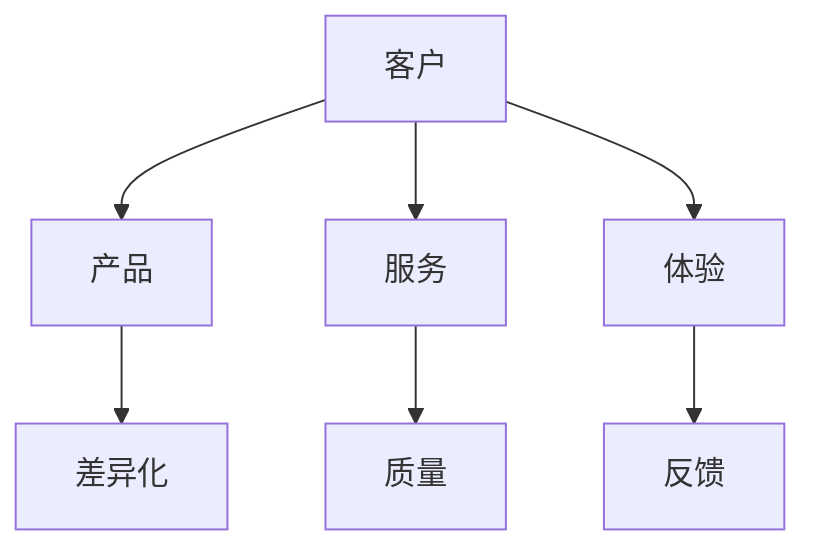
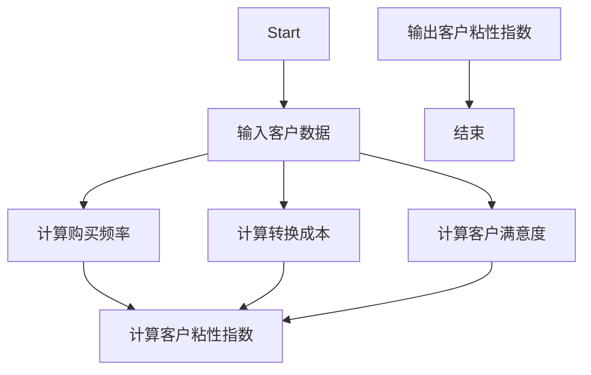
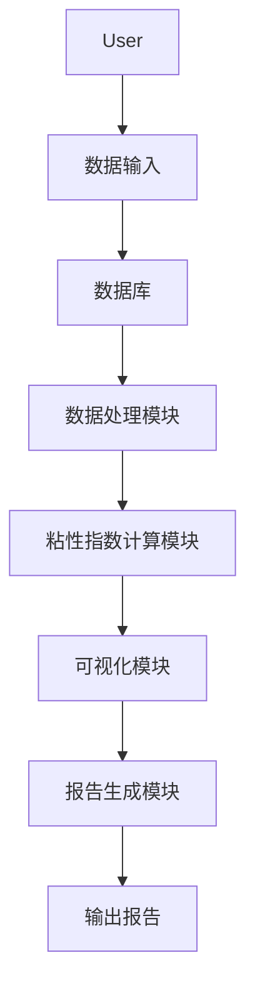
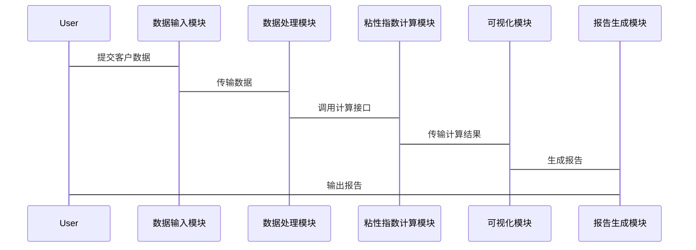

                 


# 彼得林奇如何看待公司的客户粘性

## 关键词：客户粘性、客户忠诚度、长期价值、竞争优势、服务质量、产品差异化、投资决策

## 摘要：本文深入探讨了彼得·林奇对客户粘性的看法，分析了客户粘性如何影响公司的长期价值。通过定义客户粘性、分析其驱动因素、构建数学模型和系统设计，以及提供实际案例，本文详细阐述了客户粘性在投资决策中的重要性，为读者提供了全面的理解和应用方法。

---

## 第一部分：客户粘性概述

### 第1章：客户粘性的定义与重要性

#### 1.1 客户粘性的定义

客户粘性是指客户对公司产品或服务的依赖程度，这种依赖使得客户更倾向于持续购买公司的产品或服务，而不是转向竞争对手。客户粘性不仅仅是客户忠诚度的体现，更是一种客户行为的长期性表现。

客户粘性与客户忠诚度的区别在于，忠诚度更多是情感上的依赖，而粘性则更强调客户行为的持续性和稳定性。客户粘性高的公司通常能够在市场波动中保持稳定的客户基础，从而在竞争中占据优势。

客户粘性对公司的长期价值至关重要。粘性客户不仅能够为公司带来稳定的收入，还能降低客户获取成本，因为公司不需要频繁地获取新客户来填补流失的客户。此外，粘性客户还能够为公司提供持续的反馈，帮助公司改进产品和服务。

#### 1.2 客户粘性的关键特征

客户粘性的核心概念可以通过以下对比表格和ER图来展示：

**对比表格：**

| 属性         | 粘性客户特征           | 非粘性客户特征         |
|--------------|----------------------|-----------------------|
| 购买频率      | 高                   | 低                   |
| 转换成本      | 高                   | 低                   |
| 客户满意度    | 高                   | 低                   |
| 产品依赖性    | 强                   | 弱                   |
| 客户忠诚度    | 高                   | 低                   |

**ER图（Mermaid流程图）：**



通过上述对比和ER图，可以看出客户粘性高的客户通常具有更高的购买频率、更高的转换成本、更高的客户满意度和更强的产品依赖性。这些特征使得粘性客户成为公司的重要资产。

#### 1.3 彼得·林奇对客户粘性的看法

彼得·林奇认为，客户粘性是公司竞争优势的重要来源。他认为，一家公司如果能够吸引并保持大量的粘性客户，那么这家公司在市场中的竞争优势就会更加明显。客户粘性高的公司通常能够在经济衰退或市场波动中保持稳定的收入来源，从而在投资中更具吸引力。

彼得·林奇还强调了客户粘性对公司长期价值的影响。他认为，客户粘性高的公司通常具有更强的定价能力，能够在市场中获得更高的利润率。此外，客户粘性还能够降低公司的营销成本，因为公司不需要花费大量的资源来获取新客户。

---

## 第二部分：客户粘性的驱动因素

### 第2章：客户粘性的核心驱动因素

#### 2.1 产品差异化

产品差异化是客户粘性的核心驱动因素之一。差异化的产品能够满足客户特定的需求，从而提高客户对产品的依赖性。以下是产品差异化对客户粘性的影响：

- 产品差异化使客户难以找到替代品，从而提高了客户的转换成本。
- 产品差异化能够提高客户满意度，从而增强客户的忠诚度。
- 产品差异化使公司在市场中具有更强的竞争力，从而吸引更多的客户。

#### 2.2 服务质量

服务质量是客户粘性的另一个关键驱动因素。高质量的服务能够提高客户的满意度和忠诚度，从而增强客户粘性。以下是服务质量对客户粘性的影响：

- 高质量的服务能够提高客户的满意度，从而增强客户的忠诚度。
- 高质量的服务能够降低客户的转换成本，从而减少客户流失。
- 高质量的服务能够提高客户的口碑效应，从而吸引更多潜在客户。

#### 2.3 客户体验

客户体验是客户粘性的第三个关键驱动因素。优质的客户体验能够提高客户的满意度和忠诚度，从而增强客户粘性。以下是客户体验对客户粘性的影响：

- 优质的客户体验能够提高客户的满意度，从而增强客户的忠诚度。
- 优质的客户体验能够降低客户的转换成本，从而减少客户流失。
- 优质的客户体验能够提高客户的口碑效应，从而吸引更多潜在客户。

---

## 第三部分：客户粘性的数学模型与算法

### 第3章：客户粘性指数的计算

#### 3.1 客户粘性指数的定义

客户粘性指数是衡量客户粘性高低的一个量化指标。它是通过综合考虑客户的购买频率、转换成本、客户满意度等因素来计算的。

客户粘性指数的数学公式如下：

$$ 客户粘性指数 = \frac{购买频率 + 转换成本 + 客户满意度}{3} $$

其中，购买频率、转换成本和客户满意度的权重分别为0.3、0.3和0.4。

#### 3.2 客户粘性指数的算法流程

以下是客户粘性指数的算法流程图（Mermaid流程图）：



#### 3.3 客户粘性指数的Python实现

以下是计算客户粘性指数的Python代码：

```python
def calculate_customer_stickiness(customers):
    stickiness_index = []
    for customer in customers:
        purchase_frequency = customer['purchase_frequency']
        switching_cost = customer['switching_cost']
        customer_satisfaction = customer['customer_satisfaction']
        # 权重：购买频率0.3，转换成本0.3，客户满意度0.4
        stickiness_index_value = (purchase_frequency * 0.3) + (switching_cost * 0.3) + (customer_satisfaction * 0.4)
        stickiness_index.append(stickiness_index_value)
    return stickiness_index

# 示例数据
customers = [
    {'purchase_frequency': 5, 'switching_cost': 4, 'customer_satisfaction': 3},
    {'purchase_frequency': 4, 'switching_cost': 3, 'customer_satisfaction': 4},
    {'purchase_frequency': 3, 'switching_cost': 2, 'customer_satisfaction': 5},
]

# 计算客户粘性指数
stickiness_index = calculate_customer_stickiness(customers)
print("客户粘性指数：", stickiness_index)
```

通过上述代码，我们可以计算出每个客户的粘性指数，从而更好地了解客户的粘性程度。

---

## 第四部分：客户粘性系统的分析与

### 第4章：客户粘性分析系统的架构设计

#### 4.1 系统功能设计

客户粘性分析系统的主要功能包括：

- 数据收集：收集客户的购买频率、转换成本、客户满意度等数据。
- 数据分析：计算客户的粘性指数，识别粘性客户和非粘性客户。
- 可视化展示：通过图表展示客户的粘性指数分布情况。
- 报告生成：生成客户粘性分析报告，提供改进建议。

#### 4.2 系统架构设计

以下是客户粘性分析系统的架构设计图（Mermaid流程图）：



#### 4.3 系统接口设计

客户粘性分析系统的接口设计如下：

- 数据输入接口：接收客户的购买频率、转换成本和客户满意度数据。
- 数据处理接口：对数据进行清洗和预处理。
- 粘性指数计算接口：计算客户的粘性指数。
- 可视化接口：生成客户粘性指数的图表。
- 报告生成接口：生成客户粘性分析报告。

#### 4.4 系统交互设计

以下是客户粘性分析系统的交互设计图（Mermaid序列图）：



---

## 第五部分：客户粘性的项目实战

### 第5章：客户粘性指数的实战分析

#### 5.1 环境安装

为了运行客户粘性指数计算代码，需要安装以下环境：

- Python 3.6或更高版本
- 数据处理和分析的库（如Pandas、NumPy）

#### 5.2 核心实现源代码

以下是客户粘性指数计算的Python代码：

```python
import pandas as pd

def calculate_customer_stickiness(customers_df):
    # 计算购买频率、转换成本和客户满意度的加权和
    customers_df['粘性指数'] = (customers_df['购买频率'] * 0.3) + (customers_df['转换成本'] * 0.3) + (customers_df['客户满意度'] * 0.4)
    return customers_df

# 示例数据
data = {
    '客户ID': [1, 2, 3],
    '购买频率': [5, 4, 3],
    '转换成本': [4, 3, 2],
    '客户满意度': [3, 4, 5]
}

customers_df = pd.DataFrame(data)
customers_df = calculate_customer_stickiness(customers_df)
print(customers_df)
```

#### 5.3 代码应用解读与分析

通过上述代码，我们可以计算出每个客户的粘性指数。例如，客户1的粘性指数为：

$$ 粘性指数 = (5 \times 0.3) + (4 \times 0.3) + (3 \times 0.4) = 1.5 + 1.2 + 1.2 = 4.9 $$

客户1的粘性指数为4.9，表明其粘性较高。同样地，客户2和客户3的粘性指数分别为：

- 客户2：$$ (4 \times 0.3) + (3 \times 0.3) + (4 \times 0.4) = 1.2 + 0.9 + 1.6 = 3.7 $$
- 客户3：$$ (3 \times 0.3) + (2 \times 0.3) + (5 \times 0.4) = 0.9 + 0.6 + 2.0 = 3.5 $$

从上述计算结果可以看出，客户1的粘性指数最高，表明客户1是公司的粘性客户，而客户3的粘性指数最低，表明客户3可能是公司的非粘性客户。

#### 5.4 案例分析

假设我们有一个SaaS公司，客户的数据如下：

| 客户ID | 购买频率 | 转换成本 | 客户满意度 |
|-------|----------|----------|------------|
| 1     | 5        | 4        | 3          |
| 2     | 4        | 3        | 4          |
| 3     | 3        | 2        | 5          |

通过计算，我们可以得出客户的粘性指数分别为4.9、3.7和3.5。从结果可以看出，客户1的粘性指数最高，表明客户1是公司的核心粘性客户。而客户3的粘性指数最低，表明客户3可能是公司的潜在流失客户。

#### 5.5 项目小结

通过上述案例分析，我们可以看到客户粘性指数在实际应用中的重要性。公司可以通过计算客户的粘性指数，识别出粘性客户和非粘性客户，并采取相应的策略来提高客户的粘性。

---

## 第六部分：客户粘性的最佳实践

### 第6章：最佳实践与注意事项

#### 6.1 最佳实践

- **关注客户体验**：通过提供优质的产品和服务，提高客户的满意度和忠诚度。
- **建立客户反馈机制**：通过收集客户反馈，及时改进产品和服务，增强客户的粘性。
- **持续优化产品**：通过不断创新和优化产品，提高产品的差异化程度，增强客户的粘性。
- **关注客户流失预警**：通过监测客户的购买频率和满意度，及时发现潜在的客户流失，并采取措施加以挽回。

#### 6.2 小结

客户粘性是公司长期价值的重要来源。通过理解和应用彼得·林奇的客户粘性理论，公司可以更好地识别和管理粘性客户，从而在竞争中占据优势。

#### 6.3 注意事项

- 在计算客户粘性指数时，需要注意数据的准确性和完整性。
- 在实际应用中，需要根据公司的实际情况调整权重和计算方法。
- 在分析客户粘性时，需要结合其他因素，如市场环境和竞争对手的情况。

#### 6.4 拓展阅读

- 彼得·林奇的《投资最重要的事情》
- 克里斯·安德森的《长尾理论》
- 《客户关系管理》

---

## 结语

客户粘性是公司长期价值的重要来源。通过理解和应用彼得·林奇的客户粘性理论，公司可以更好地识别和管理粘性客户，从而在竞争中占据优势。希望本文能够为读者提供有价值的见解和实践指导。

---

## 作者

作者：AI天才研究院/AI Genius Institute & 禅与计算机程序设计艺术 /Zen And The Art of Computer Programming

---

感谢您的阅读！希望这篇文章能够帮助您更好地理解彼得·林奇如何看待公司的客户粘性，并为您的投资决策提供有价值的参考。

