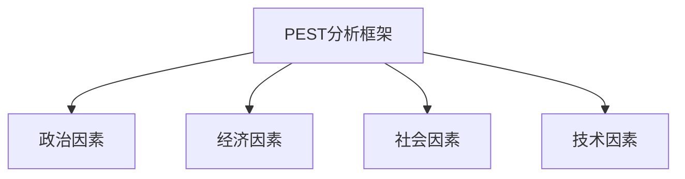
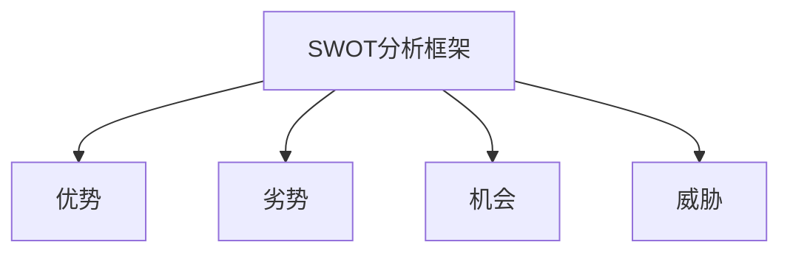
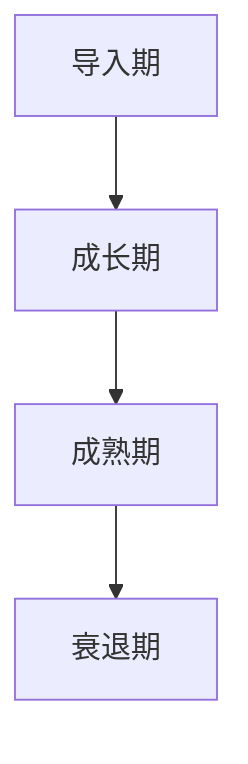

                 

# 彼得·林奇如何看待公司的市场定位

## 关键词：市场定位，投资策略，彼得·林奇，企业战略，竞争分析

## 摘要：  
彼得·林奇是全球著名投资家，他提出了许多关于市场定位的独到见解。市场定位是企业成功的关键，也是投资者评估公司价值的重要因素。本文将从市场定位的核心概念、影响因素、分析框架、评估方法和实际案例等方面，详细分析彼得·林奇如何看待公司的市场定位，并为投资者提供实用的分析工具和策略。

---

## 第一章：市场定位的核心概念与背景

### 1.1 市场定位的定义  
市场定位是指企业在目标市场中确定自身位置的过程。它不仅关乎企业的产品或服务，还涉及行业、竞争对手、客户需求和产品特点等多个维度。  

### 1.2 市场定位的核心要素  
- **行业定位**：企业所处行业的整体趋势和竞争格局。  
- **竞争对手定位**：竞争对手的核心竞争力和市场策略。  
- **客户需求定位**：目标客户的需求、痛点和偏好。  
- **产品与服务定位**：企业的核心产品或服务在市场中的独特性。  

### 1.3 彼得·林奇的市场定位理念  
彼得·林奇认为，市场定位是投资者评估公司价值的重要依据。他强调，只有理解一家公司的市场定位，才能判断其长期发展潜力和投资价值。  

---

## 第二章：影响市场定位的因素

### 2.1 行业趋势与市场环境  
行业趋势是市场定位的重要背景。例如，技术进步、政策变化和宏观经济波动都会影响行业的市场定位。  

### 2.2 竞争格局分析  
竞争对手的市场定位直接影响企业的生存空间。彼得·林奇建议投资者分析竞争对手的核心竞争力，以判断企业的市场定位是否具有可持续性。  

### 2.3 客户需求分析  
客户的需求是市场定位的核心。彼得·林奇强调，企业必须深入了解客户的真实需求，才能制定有效的市场定位策略。  

### 2.4 公司能力分析  
公司的资源、技术和管理能力决定了其市场定位的可行性。彼得·林奇认为，只有具备强大能力的企业，才能在激烈的市场竞争中占据有利位置。  

---

## 第三章：市场定位的分析框架

### 3.1 PEST分析法  
PEST分析法是一种常用的宏观环境分析工具，包括：  
- **政治因素**：政策法规对行业的影响。  
- **经济因素**：经济周期对市场需求的影响。  
- **社会因素**：社会趋势对客户需求的影响。  
- **技术因素**：技术进步对行业竞争力的影响。  

### 3.2 SWOT分析法  
SWOT分析法用于评估企业的优势、劣势、机会和威胁。  

### 3.3 行业生命周期分析  
行业生命周期包括导入期、成长期、成熟期和衰退期。彼得·林奇认为，企业在不同生命周期阶段的市场定位策略应有所不同。  

---

## 第四章：市场定位的评估与投资策略

### 4.1 财务指标分析  
财务指标是评估市场定位的重要工具。例如：  
- **市盈率（P/E）**：衡量企业的估值水平。  
- **市净率（P/B）**：衡量企业的资产价值。  
- **ROE（净资产收益率）**：衡量企业的盈利能力。  

公式：  
$$ROE = \frac{\text{净利润}}{\text{净资产}}$$  

### 4.2 非财务指标分析  
非财务指标包括市场份额、品牌影响力和客户忠诚度等。彼得·林奇认为，这些指标是评估市场定位的重要补充。  

### 4.3 动态评估与投资策略  
市场定位是动态变化的，投资者需要定期评估企业的市场定位变化，并根据变化调整投资策略。  

---

## 第五章：彼得·林奇的经典案例分析

### 5.1 微软的市场定位  
微软通过Windows操作系统和Office软件，在操作系统和办公软件市场占据了主导地位。彼得·林奇认为，微软的成功源于其清晰的市场定位和强大的执行力。  

### 5.2 苹果的市场定位  
苹果通过创新的产品设计和高端品牌形象，成功在科技行业中占据了独特的市场定位。彼得·林奇认为，苹果的市场定位策略是投资者的典范。  

### 5.3 亚马逊的市场定位  
亚马逊通过电子商务和云计算服务，成功实现了从线上零售到科技巨头的转型。彼得·林奇认为，亚马逊的市场定位体现了长期战略眼光。  

---

## 第六章：市场定位与投资策略的结合

### 6.1 投资者的市场定位分析框架  
投资者可以通过以下步骤分析企业的市场定位：  
1. **行业分析**：了解行业的趋势和竞争格局。  
2. **竞争对手分析**：评估竞争对手的核心竞争力。  
3. **客户需求分析**：了解目标客户的需求和偏好。  
4. **公司能力分析**：评估企业的资源和能力。  

### 6.2 长期投资策略  
彼得·林奇强调，市场定位是长期投资的核心。投资者应选择那些在市场中具有竞争优势的企业进行投资。  

### 6.3 短期投资策略  
虽然市场定位是长期投资的关键，但在短期内，投资者也可以通过市场波动获利。然而，彼得·林奇提醒投资者，短期交易风险较高，应谨慎操作。  

---

## 第七章：市场定位的未来趋势与挑战

### 7.1 数字化转型对市场定位的影响  
随着数字化转型的加速，企业的市场定位将面临新的挑战和机遇。例如，线上零售和人工智能技术正在改变传统的市场定位模式。  

### 7.2 全球化与本地化市场的平衡  
全球化为企业提供了更大的市场空间，但也带来了本地化市场的挑战。彼得·林奇认为，企业需要在全球化与本地化之间找到平衡点。  

### 7.3 可持续发展与市场定位  
随着环保意识的增强，可持续发展已成为企业市场定位的重要因素。彼得·林奇认为，未来的投资将更加关注企业的社会责任和环保表现。  

---

## 结论

彼得·林奇的市场定位理论为投资者提供了重要的分析工具。通过深入了解企业的市场定位，投资者可以更好地评估公司的价值和潜力。然而，市场定位是动态变化的，投资者需要不断学习和适应市场的变化。希望本文能为投资者提供有价值的 insights，帮助他们在复杂的市场中做出明智的投资决策。

---

## 作者：AI天才研究院/AI Genius Institute & 禅与计算机程序设计艺术 /Zen And The Art of Computer Programming

