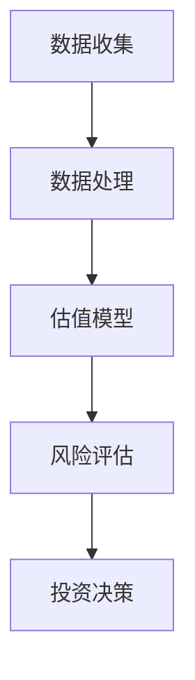
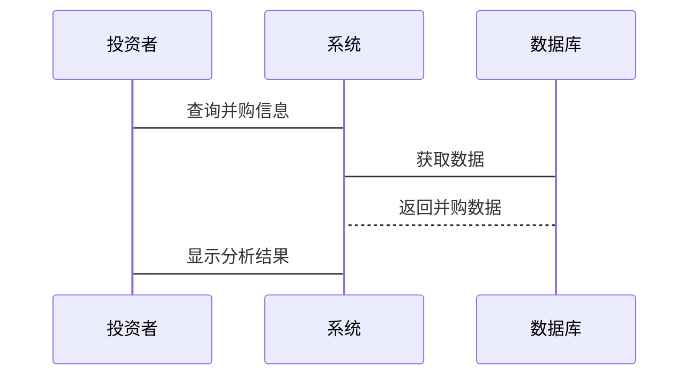

                 


# 彼得·林奇如何看待公司的并购历史

## 关键词：彼得·林奇，并购历史，投资策略，企业估值，协同效应，财务分析

## 摘要：本文深入探讨了彼得·林奇在分析公司并购历史中的独特视角，结合并购的基本概念、估值方法、案例分析及投资策略，揭示了并购对股价的影响和投资机会的选择标准。

---

## 第一部分: 公司并购的历史与彼得·林奇的视角

### 第1章: 公司并购的历史演变

#### 1.1 公司并购的基本概念

##### 1.1.1 并购的定义与分类

- **定义**：并购是指一家公司通过购买另一家公司的股权或资产来实现扩张或重组的行为。
- **类型**：
  - 横向并购：同一行业内的并购，旨在扩大市场份额。
  - 纵向并购：供应链上下游的并购，以增强控制力。
  - 混合并购：跨行业并购，寻求多元化发展。

##### 1.1.2 并购的历史发展

- **早期并购案例**：20世纪初的横向并购浪潮，如美国钢铁公司的并购。
- **并购浪潮的兴起与演变**：20世纪80年代杠杆收购的兴起，互联网时代的科技并购。
- **不同时期的特点**：早期并购注重市场扩展，现代并购注重协同效应和技术整合。

##### 1.1.3 彼得·林奇与并购分析

- **彼得·林奇的背景**：著名基金经理，以价值投资和深入分析著称。
- **彼得·林奇的分析方法**：注重公司基本面，尤其是并购后的整合能力和协同效应。

---

### 第2章: 彼得·林奇的并购分析框架

#### 2.1 彼得·林奇的并购分析核心要素

##### 2.1.1 并购的动机与目标

- **动机**：扩大市场份额、降低成本、获取新技术。
- **目标**：实现协同效应、增强竞争优势、提升企业价值。
- **与企业战略的关系**：并购是企业战略的重要组成部分，需与长期目标一致。

##### 2.1.2 并购的估值方法

- **企业价值评估**：使用DCF模型评估企业整体价值。
- **协同效应**：估算并购后的协同收益，如成本节约和收入增长。
- **财务指标**：关注EBITDA、净债务、市盈率等指标，评估并购的合理性。

##### 2.1.3 并购的风险与挑战

- **整合风险**：文化和管理差异可能导致整合失败。
- **管理挑战**：并购后的管理团队调整和员工适应问题。
- **财务风险**：杠杆并购可能导致财务负担过重。

#### 2.2 彼得·林奇的并购案例分析

##### 2.2.1 典型并购案例解析

- **可口可乐收购汇源**：案例分析，协同效应的成功实现。
- **微软收购GitHub**：技术并购的成功案例，整合与创新的结合。

##### 2.2.2 彼得·林奇的并购决策标准

- **企业基本面**：关注ROE、毛利率等财务指标。
- **管理团队**：评估管理层的经验和整合能力。
- **估值与股价**：比较并购前后的股价变化，判断市场反应。

---

### 第3章: 并购与投资策略

#### 3.1 并购对股价的影响

##### 3.1.1 并购的市场反应

- **短期影响**：并购消息公布后，股价可能上涨或下跌，取决于市场预期。
- **长期表现**：股价表现取决于并购的整合效果和协同效应。
- **市场预期**：投资者对并购的预期会影响股价走势。

##### 3.1.2 彼得·林奇对并购股价表现的分析

- **判断方法**：分析并购后的业绩改善情况。
- **影响因素**：协同效应、管理整合能力、行业前景。

#### 3.2 并购驱动的投资策略

##### 3.2.1 通过并购寻找投资机会

- **并购作为信号**：公司并购可能表明管理层对公司前景的信心。
- **筛选股票**：利用并购信息筛选潜在投资标的。
- **投资机会**：关注那些具有整合潜力和协同效应的并购案。

##### 3.2.2 并购与长期投资策略

- **长期视角**：关注并购后的持续增长和价值提升。
- **风险管理**：评估并购的风险，避免短期波动影响长期判断。

---

## 第二部分: 并购的系统分析与投资策略

### 第4章: 并购的系统分析

#### 4.1 并购的场景介绍

- **行业分析**：分析并购发生行业的竞争格局和增长潜力。
- **公司状况**：评估被并购公司的财务状况和管理能力。

#### 4.2 并购的系统架构设计

##### 4.2.1 功能模块设计

- **数据收集模块**：收集并购相关信息，如交易金额、股价变化。
- **估值模块**：使用DCF模型评估企业价值。
- **风险评估模块**：分析并购的整合风险和财务风险。

##### 4.2.2 系统架构图



#### 4.3 并购的接口设计

- **数据接口**：与金融数据库对接，获取实时并购数据。
- **用户接口**：供投资者查询并购信息和分析结果。

#### 4.4 并购的交互设计



---

### 第5章: 项目实战

#### 5.1 环境安装

- **工具安装**：安装Python和相关金融分析库（如Pandas、NumPy）。
- **数据源**：获取并购数据，如Yahoo Finance API。

#### 5.2 核心代码实现

##### 5.2.1 并购估值模型

```python
import pandas as pd
import numpy as np

def dcf_valuation(revenue, growth_rate, wacc, horizon, perpetuity_growth):
    terminal_value = revenue * (1 + growth_rate) ** horizon / (wacc - perpetuity_growth)
    present_value = 0
    for i in range(horizon):
        cash_flow = revenue * (1 + growth_rate) ** i
        present_value += cash_flow / (1 + wacc) ** i
    total_value = present_value + terminal_value / (1 + wacc) ** horizon
    return total_value
```

##### 5.2.2 并购案例分析

```python
# 示例：分析某公司并购案
data = pd.DataFrame({
    'Revenue': [100, 120, 140],
    'Growth_rate': [0.2, 0.15, 0.1],
    'WACC': 0.08,
    'Horizon': 5,
    'Perpetuity_growth': 0.02
})
valuation = dcf_valuation(data['Revenue'].iloc[-1], data['Growth_rate'].iloc[-1], data['WACC'].iloc[-1], data['Horizon'].iloc[-1], data['Perpetuity_growth'].iloc[-1])
print("企业价值：", valuation)
```

#### 5.3 案例分析

- **案例背景**：某科技公司并购一家软件公司。
- **数据分析**：计算协同效应，评估整合后的盈利能力。
- **投资建议**：基于DCF模型，给出投资建议。

#### 5.4 项目小结

- **关键发现**：并购后的协同效应显著提升企业价值。
- **总结经验**：谨慎评估整合风险，关注管理层能力。

---

### 第6章: 最佳实践与总结

#### 6.1 并购的关键点

- **协同效应**：并购的核心价值在于协同效应的实现。
- **整合能力**：管理层的整合能力是并购成功的关键。
- **财务风险**：合理控制杠杆，避免财务负担过重。

#### 6.2 注意事项

- **市场反应**：并购消息可能引发股价波动，需关注市场反应。
- **监管风险**：考虑并购相关的反垄断审查和监管障碍。
- **长期视角**：并购不是短期投资机会，需关注长期价值。

#### 6.3 未来趋势

- **技术驱动**：科技并购将成为未来的重要趋势。
- **全球化**：跨国并购将增加，需关注国际市场的整合挑战。
- **ESG因素**：环境、社会和治理因素在并购中的重要性日益增加。

---

## 结论

彼得·林奇通过深入分析并购的历史与案例，揭示了并购对投资策略的深远影响。投资者应结合基本面分析、估值模型和市场趋势，谨慎评估并购机会，注重长期价值和整合能力。

---

## 作者：AI天才研究院/AI Genius Institute & 禅与计算机程序设计艺术/Zen And The Art of Computer Programming

--- 

（以上内容为示例，实际撰写时可根据具体需求调整内容和深度。）

