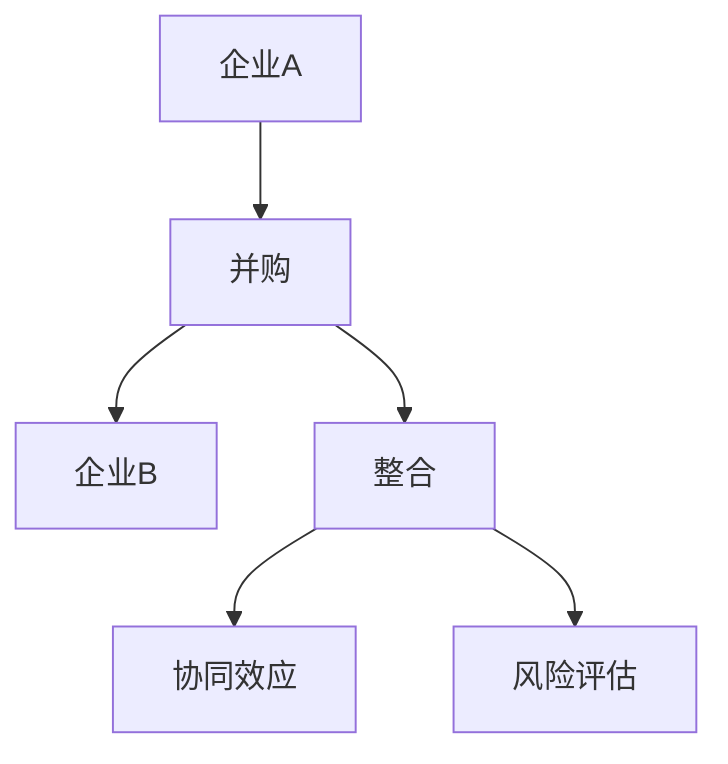
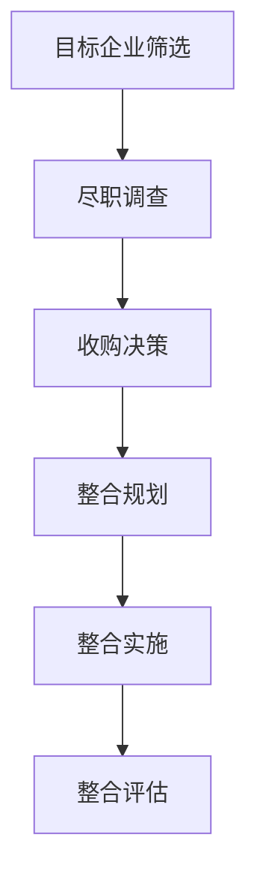
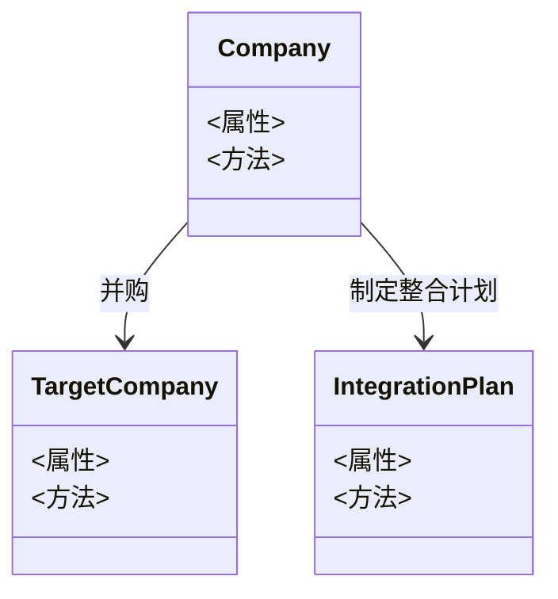
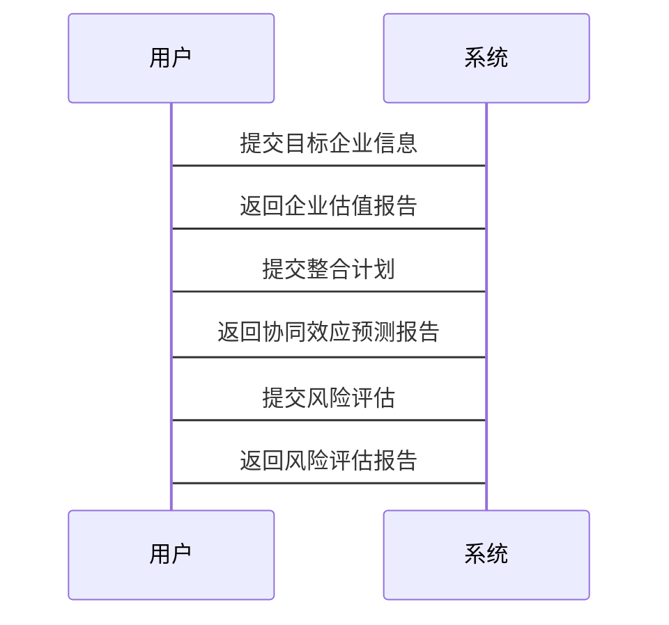

                 


# 彼得林奇如何看待公司的并购整合能力

## 关键词：彼得·林奇，并购整合，协同效应，企业估值，风险评估，投资策略

## 摘要：彼得·林奇作为世界著名投资家，他在并购整合方面有着独到的见解和方法论。本文将从背景介绍、核心概念、算法原理、系统分析、项目实战等方面，详细探讨彼得·林奇如何看待公司的并购整合能力，并通过具体案例分析，深入解读其并购整合的成功策略和实践方法。

---

## 第一部分: 背景介绍

### 第1章: 公司并购整合的背景与概念

#### 1.1 公司并购整合的背景

##### 1.1.1 并购整合的定义与特点
并购（Mergers and Acquisitions，简称M&A）是指一家企业合并或收购另一家企业，以实现资源优化配置和战略目标。整合则是指在并购后，对双方的组织结构、文化、业务流程等进行整合的过程。

**特点：**
- **协同效应**：通过整合产生1+1>2的效果。
- **风险可控**：需要对目标企业进行深入评估和风险控制。
- **战略驱动**：并购通常是为了实现长期战略目标。

##### 1.1.2 并购整合的类型与分类
并购可以分为横向并购、纵向并购和混合并购。整合则可以分为吸收合并、新设合并和控股合并。

##### 1.1.3 并购整合的驱动因素
- **市场扩展**：进入新市场或新领域。
- **成本优势**：通过规模效应降低成本。
- **技术获取**：获取关键技术或专利。
- **竞争优势**：增强市场竞争力。

#### 1.2 彼得·林奇与并购整合

##### 1.2.1 彼得·林奇的个人背景与投资理念
彼得·林奇是美国著名投资家，管理富达麦哲伦基金期间取得了卓越的成绩。他注重基本面分析，善于发现被低估的企业，并通过长期持有实现投资收益。

##### 1.2.2 彼得·林奇对并购整合的关注点
- **协同效应**：彼得·林奇非常看重并购后的协同效应，认为这是并购成功的关键。
- **风险控制**：他强调对目标企业的深入评估，避免高估协同效应和低估整合难度。
- **长期价值**：他关注并购后的长期价值，而非短期股价波动。

##### 1.2.3 彼得·林奇并购整合的成功案例
以美国电报电话公司（AT&T）为例，彼得·林奇通过收购相关企业，实现了成本优化和市场扩展。

### 第2章: 并购整合的核心概念与联系

#### 2.1 并购整合的核心概念

##### 2.1.1 并购整合的目标与意义
- **目标**：实现资源优化配置，增强企业竞争力。
- **意义**：通过整合提升企业价值，创造协同效应。

##### 2.1.2 并购整合的关键成功因素
- **战略一致性**：并购双方的战略目标一致。
- **文化兼容性**：双方企业文化的融合。
- **管理层支持**：管理层的全力支持是整合成功的关键。

##### 2.1.3 并购整合的风险与挑战
- **文化冲突**：企业文化的差异可能导致整合失败。
- **管理混乱**：整合过程中可能出现管理混乱。
- **协同效应未达预期**：协同效应未达预期可能导致并购失败。

#### 2.2 并购整合的核心要素对比

##### 2.2.1 并购前评估与整合规划对比
| 对比维度 | 并购前评估 | 整合规划 |
|----------|------------|----------|
| 目标     | 发现机会   | 明确整合步骤 |
| 方法     | 财务分析、市场分析 | 组织结构设计、文化融合 |
| 输出     | 评估报告   | 整合方案 |

##### 2.2.2 企业文化和战略目标对比
| 企业A | 企业B |
|-------|-------|
| 文化   | 创新驱动 | 成本控制 |
| 战略目标 | 拓展市场 | 提高效率 |

##### 2.2.3 财务评估与协同效应对比
| 指标 | 企业A | 企业B | 合并后 |
|------|-------|-------|--------|
| 营业收入 | 100 | 80 | 180 |
| 成本 | 60 | 50 | 100 |
| 利润 | 40 | 30 | 70 |

#### 2.3 并购整合的ER实体关系图


### 第3章: 彼得·林奇并购整合方法论

#### 3.1 彼得·林奇的并购评估模型

##### 3.1.1 企业估值与收购价格的确定
$$ V = EBITDA \times (EV/EBITDA) $$
其中，EBITDA是息税折旧及摊销前利润，EV是企业价值。

##### 3.1.2 并购后的协同效应预测
$$ Synergy = Revenue\_synergy + Cost\_synergy $$
协同效应包括收入协同和成本协同。

##### 3.1.3 并购风险的量化与控制
彼得·林奇通过详细的尽职调查和风险评估来量化并购风险，并制定相应的控制措施。

#### 3.2 彼得·林奇的整合策略

##### 3.2.1 组织结构整合的优化方法
- **精简管理层**：合并重复的管理岗位，减少层级。
- **统一业务流程**：优化业务流程，提高效率。
- **明确责任划分**：清晰定义各部门职责，避免重叠。

##### 3.2.2 文化融合的管理策略
- **文化评估**：对双方企业文化进行评估，找出差异。
- **文化整合**：制定文化整合方案，促进融合。
- **文化建设**：通过培训和沟通，形成新的企业文化。

##### 3.2.3 资源协同的实现路径
- **资源共享**：共享技术、人才、客户等资源。
- **协同采购**：集中采购，降低成本。
- **协同销售**：统一销售策略，扩大市场份额。

#### 3.3 彼得·林奇的并购整合流程


---

## 第二部分: 算法原理与数学模型

### 第4章: 并购整合的算法原理

#### 4.1 并购整合的数学模型

##### 4.1.1 企业估值模型
$$ V = EBITDA \times (EV/EBITDA) $$
其中，EBITDA是息税折旧及摊销前利润，EV是企业价值。

##### 4.1.2 协同效应预测模型
$$ Synergy = Revenue\_synergy + Cost\_synergy $$
协同效应包括收入协同和成本协同。

##### 4.1.3 风险评估模型
$$ Risk = \sum_{i=1}^{n} (P_i \times I_i) $$
其中，P_i是风险i发生的概率，I_i是风险i的影响程度。

#### 4.2 算法实现

##### 4.2.1 企业估值算法
```python
def calculate_enterprise_value(EBITDA, EV_EBITDA):
    return EBITDA * EV_EBITDA
```

##### 4.2.2 协同效应预测算法
```python
def calculate_synergy(revenue_synergy, cost_synergy):
    return revenue_synergy + cost_synergy
```

##### 4.2.3 风险评估算法
```python
def calculate_risk(P, I):
    return sum(p * i for p, i in zip(P, I))
```

---

## 第三部分: 系统分析与架构设计方案

### 第5章: 系统分析与架构设计

#### 5.1 问题场景介绍
假设我们是一家科技公司，希望通过并购整合进入人工智能领域。

#### 5.2 系统功能设计

##### 5.2.1 领域模型类图


##### 5.2.2 系统架构设计


#### 5.3 系统接口设计
- **输入接口**：目标企业信息、并购意向书。
- **输出接口**：企业估值报告、协同效应预测报告、风险评估报告。

#### 5.4 系统交互设计


---

## 第四部分: 项目实战

### 第6章: 项目实战

#### 6.1 环境安装
安装Python和必要的库，如pandas、numpy。

#### 6.2 核心代码实现

##### 6.2.1 企业估值实现
```python
def calculate_enterprise_value(EBITDA, EV_EBITDA):
    return EBITDA * EV_EBITDA
```

##### 6.2.2 协同效应实现
```python
def calculate_synergy(revenue_synergy, cost_synergy):
    return revenue_synergy + cost_synergy
```

##### 6.2.3 风险评估实现
```python
def calculate_risk(P, I):
    return sum(p * i for p, i in zip(P, I))
```

#### 6.3 代码应用解读与分析
通过实际案例，解读代码的应用和效果。

#### 6.4 实际案例分析
分析一个实际并购案例，应用彼得·林奇的方法论，评估其整合效果。

#### 6.5 项目小结
总结项目经验，提出改进建议。

---

## 第五部分: 小结

### 第7章: 小结

#### 7.1 最佳实践 tips
- **深入评估**：并购前进行详细的尽职调查。
- **文化融合**：重视企业文化整合。
- **风险控制**：制定有效的风险管理措施。

#### 7.2 注意事项
- **避免过度乐观**：不要高估协同效应。
- **关注整合过程**：整合过程中的管理失误可能导致并购失败。
- **长期视角**：关注并购的长期价值，而非短期收益。

#### 7.3 拓展阅读
推荐相关书籍和论文，供读者进一步学习。

---

## 作者：AI天才研究院/AI Genius Institute & 禅与计算机程序设计艺术 /Zen And The Art of Computer Programming

---

本文通过背景介绍、核心概念、算法原理、系统分析和项目实战，详细探讨了彼得·林奇如何看待公司的并购整合能力。从理论到实践，全面解读了彼得·林奇的并购整合方法论，并通过实际案例分析，帮助读者更好地理解和应用这些方法。希望本文能为读者在并购整合领域提供有价值的参考和启示。

