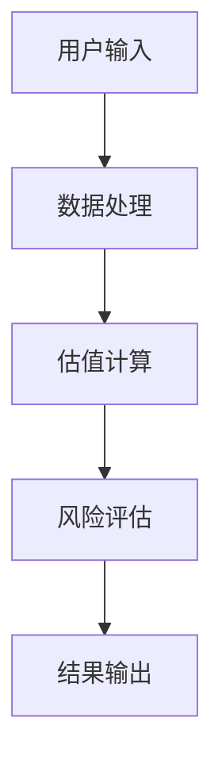
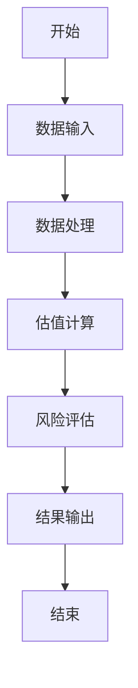
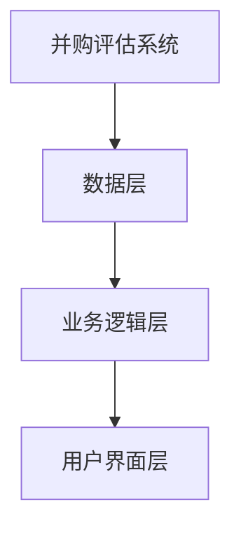
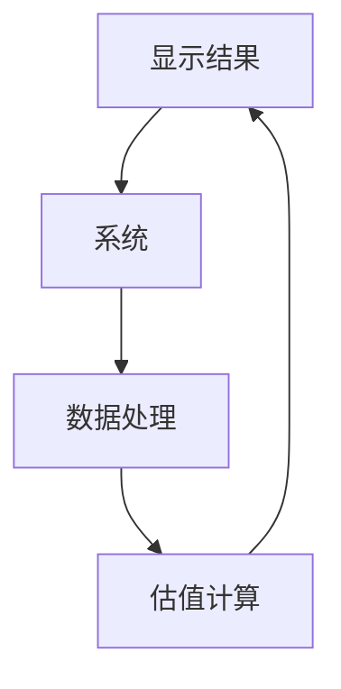

                 


# 彼得林奇如何看待公司的并购策略

> 关键词：彼得·林奇，并购策略，投资哲学，企业价值评估，并购整合

> 摘要：本文探讨了彼得·林奇在公司并购策略上的独特见解，分析了并购的核心概念、算法原理、系统架构以及实际案例。通过结合理论与实践，深入解析了并购策略的关键要素和注意事项，为读者提供实用的指导。

---

## 第一部分: 公司并购策略的背景与核心概念

### 第1章: 公司并购的基本概念与重要性

#### 1.1 公司并购的基本概念

##### 1.1.1 公司并购的定义
公司并购（Mergers and Acquisitions, M&A）是指一家公司（并购方）对另一家公司（被并购方）进行合并或收购的行为。并购可以是全资收购，也可以是部分收购，目的是通过整合资源、技术或市场来实现增长。

##### 1.1.2 公司并购的类型
公司并购主要分为两类：
- **合并（Mergers）**：两家或更多的公司合并成一家公司，通常是为了实现规模经济或协同效应。
- **收购（Acquisitions）**：一家公司收购另一家公司，通常是以现金、股票或其他资产作为支付手段。

##### 1.1.3 公司并购的动机与目的
公司并购的动机多种多样，常见的包括：
- **扩大市场份额**：通过收购竞争对手，迅速进入新市场或增加市场占有率。
- **获取新技术或专利**：通过收购拥有先进技术或知识产权的公司，提升自身竞争力。
- **降低成本**：通过合并同类业务，减少重复投资，降低运营成本。
- **战略调整**：为了调整业务结构，剥离非核心资产或扩展新的业务领域。

#### 1.2 公司并购的重要性和影响

##### 1.2.1 公司并购对企业发展的作用
并购可以帮助企业快速实现增长，避免了从零开始发展的漫长过程。通过并购，企业可以迅速获得新的技术、客户、市场和人才，从而在竞争中占据优势。

##### 1.2.2 公司并购对行业竞争格局的影响
并购活动会改变行业的竞争格局，可能导致市场集中度提高，形成寡头垄断。同时，并购也可能引发行业内的整合潮，推动技术创新和管理优化。

##### 1.2.3 公司并购对股东价值的影响
成功的并购可以为股东创造价值，但失败的并购也可能导致股东价值的损失。因此，并购的决策和实施过程需要谨慎评估和管理。

### 第2章: 彼得·林奇的投资理念与并购策略

#### 2.1 彼得·林奇的投资哲学

##### 2.1.1 林奇的投资理念概述
彼得·林奇是美国著名的投资经理人，以其在富达投资管理公司的长期任职期间取得了卓越的投资业绩。他的投资理念强调对企业基本面的深入分析，寻找具有竞争优势和增长潜力的公司。

##### 2.1.2 林奇对并购策略的独特见解
林奇认为，并购是企业增长的重要手段，但必须基于对被并购公司的深入研究和合理估值。他强调，成功的并购需要对目标公司的财务状况、管理团队和市场前景有清晰的了解。

##### 2.1.3 林奇并购策略的核心原则
- **注重基本面**：林奇强调对被并购公司的基本面进行详细分析，包括盈利能力、财务状况和管理能力。
- **合理估值**：在并购过程中，合理的估值是确保投资回报的关键。林奇通常使用市盈率、市净率等指标来评估公司的价值。
- **长期视角**：林奇认为，并购不是短期交易，而是为了长期的资产增值。因此，在并购后，需要注重整合和管理，确保目标公司的持续发展。

#### 2.2 彼得·林奇并购策略的关键要素

##### 2.2.1 企业基本面分析的重要性
林奇认为，并购的核心在于对目标公司基本面的深入分析。这包括对公司的收入、利润、资产负债表和现金流量的详细审查。通过基本面分析，可以识别潜在的风险和机会。

##### 2.2.2 估值方法与并购价格的确定
林奇常用市盈率（P/E）和企业价值与息税折旧及摊销前利润（EV/EBITDA）等指标来评估公司的估值。他强调，合理的估值是并购成功的基石，避免支付过高的并购溢价。

##### 2.2.3 并购后的整合与管理
并购完成后，整合是关键。林奇认为，成功的整合需要在文化、战略和管理上进行协调。同时，要确保被并购公司在并购后能够保持其竞争优势，避免管理混乱和员工流失。

---

## 第二部分: 并购策略的核心概念与分析框架

### 第3章: 并购策略的核心概念与联系

#### 3.1 并购策略的核心概念

##### 3.1.1 企业价值评估
企业价值评估是并购决策的核心环节。林奇常用DCF模型（贴现现金流模型）和可比公司分析法来评估企业的内在价值。

##### 3.1.2 并购动机与目标选择
明确的并购动机有助于选择合适的并购目标。林奇强调，目标公司应具备良好的财务状况、管理团队和市场前景。

##### 3.1.3 并购风险与回报
并购存在一定的风险，包括市场风险、整合风险和财务风险。林奇认为，成功的并购需要在风险和回报之间找到平衡点。

#### 3.2 并购策略的核心要素对比

##### 3.2.1 并购类型对比分析
- **横向并购**：在同一行业内的并购，目的是扩大市场份额。
- **纵向并购**：在供应链上下游的并购，目的是增强垂直整合能力。
- **混合并购**：跨行业的并购，目的是 diversification and risk reduction.

##### 3.2.2 并购动机对比分析
- **战略并购**：为了长期战略目标进行的并购。
- **财务并购**：为了短期财务收益进行的并购。

##### 3.2.3 并购风险对比分析
- **财务风险**：并购可能导致债务增加和财务负担。
- **整合风险**：并购后的文化和管理整合可能失败。
- **市场风险**：并购可能因市场变化而受损。

### 第4章: 并购策略的分析框架

#### 4.1 并购战略的制定与实施

##### 4.1.1 并购战略的制定步骤
1. **明确战略目标**：确定并购的目的和预期收益。
2. **市场分析**：识别潜在的并购目标和行业趋势。
3. **目标筛选**：根据财务和战略标准筛选目标公司。
4. **估值与谈判**：进行合理的估值，制定并购方案。
5. **整合计划**：制定并购后的整合计划，包括文化、管理和资源的整合。

##### 4.1.2 并购战略的实施过程
- **尽职调查**：对目标公司进行详细的财务、法律和管理调查。
- **谈判与签约**：与目标公司进行谈判，签订并购协议。
- **整合与监控**：并购完成后，进行整合，并监控整合效果。

##### 4.1.3 并购战略的监控与调整
- **监控绩效**：定期评估并购后的绩效，确保达成预期目标。
- **调整策略**：根据监控结果，调整整合策略，解决问题。

#### 4.2 并购策略的数学模型与公式

##### 4.2.1 企业价值评估模型
企业价值（EV）可以通过以下公式计算：
$$ EV = EBITDA \times (EV/EBITDA \text{ 倍数}) $$

##### 4.2.2 并购溢价计算公式
并购溢价是指并购价格超过目标公司净资产公允价值的部分：
$$ \text{并购溢价} = \text{并购价格} - \text{净资产公允价值} $$

##### 4.2.3 并购后的协同效应分析
协同效应是指并购后双方协同工作所产生的额外价值：
$$ \text{协同效应} = \text{并购后总价值} - (\text{并购前A公司价值} + \text{并购前B公司价值}) $$

---

## 第三部分: 并购策略的算法原理与系统分析

### 第5章: 并购策略的算法原理

#### 5.1 并购价值评估的算法原理

##### 5.1.1 贴现现金流模型（DCF）
DCF模型通过将未来现金流贴现为现值来评估企业价值。公式如下：
$$ V = \sum_{t=1}^{n} \frac{CF_t}{(1 + r)^t} + \frac{TV}{(1 + r)^n} $$
其中，$CF_t$ 是第 t 年的现金流，$r$ 是贴现率，$TV$ 是终值。

##### 5.1.2 市盈率法与市净率法
- **市盈率法**：通过比较目标公司的市盈率和行业平均水平，评估其估值是否合理。
- **市净率法**：通过比较目标公司的市净率和行业平均水平，评估其估值是否合理。

##### 5.1.3 企业价值倍数法（EV/EBITDA）
企业价值倍数法通过比较目标公司的 EV/EBITDA 倍数与行业平均水平，评估其估值是否合理。

#### 5.2 并购风险评估的算法原理

##### 5.2.1 风险评估指标与方法
- **贝塔系数**：衡量目标公司相对于市场的系统性风险。
- **VaR（Value at Risk）**：衡量在一定置信水平下的潜在损失。

##### 5.2.2 风险矩阵分析
风险矩阵分析通过将风险发生的概率和影响程度进行组合，评估风险的严重性。

##### 5.2.3 风险对并购价值的影响
$$ \text{调整后的并购价值} = \text{初始并购价值} \times (1 - \text{风险调整系数}) $$

### 第6章: 并购策略的系统分析与架构设计方案

#### 6.1 并购评估系统的功能设计

##### 6.1.1 系统功能模块划分
- **数据输入模块**：输入目标公司的财务数据和市场数据。
- **估值计算模块**：计算目标公司的企业价值。
- **风险评估模块**：评估并购的风险。
- **结果输出模块**：输出并购建议和报告。

##### 6.1.2 系统功能流程图


##### 6.1.3 系统功能流程图


#### 6.2 并购策略的系统架构设计

##### 6.2.1 系统架构图


##### 6.2.2 系统接口设计
- **输入接口**：接收目标公司的财务数据和市场数据。
- **输出接口**：输出并购建议和报告。

##### 6.2.3 系统交互序列图


---

## 第四部分: 项目实战与案例分析

### 第7章: 并购策略的项目实战

#### 7.1 环境安装与数据准备
- **安装Python**：安装Python 3.x及以上版本。
- **安装相关库**：安装pandas、numpy、scipy等数据分析库。

#### 7.2 系统核心实现源代码

##### 7.2.1 企业价值评估代码
```python
import pandas as pd
import numpy as np
from scipy import stats

def calculate_ev(ticker, ticker_financials):
    # 获取历史财务数据
    df = ticker_financials.get_data(ticker)
    
    # 计算自由现金流
    free_cash_flow = df['Operating Cash Flow'] - df['Capital Expenditure']
    
    # 计算加权平均资本成本（WACC）
    beta = df['Beta']
    marketRiskPremium = 5%  # 市场风险溢价
    tax_rate = df['Tax Rate']
    cost_of_equity = 10%  # 股权成本
    cost_of_debt = 5%  # 债务成本
    debt_equity_ratio = 0.5  # 债务与股权比例
    
    # 计算WACC
    wacc = (debt_equity_ratio / (1 + debt_equity_ratio)) * cost_of_debt * (1 - tax_rate) + (1 / (1 + debt_equity_ratio)) * cost_of_equity
    
    # 计算DCF估值
    terminal_growth_rate = 2%  # 终值增长率
    terminal_value = free_cash_flow[-1] * (1 + terminal_growth_rate) / (wacc - terminal_growth_rate)
    dcf_value = terminal_value / (1 + wacc)
    
    return dcf_value
```

##### 7.2.2 并购风险评估代码
```python
import pandas as pd
import numpy as np

def calculate_risk(ticker, market_data):
    # 获取目标公司股票数据
    df = market_data.get_data(ticker)
    
    # 计算贝塔系数
    beta = df['Beta']
    
    # 计算VaR
    confidence_level = 0.95  # 置信水平
    VaR = np.percentile(df['Return'], 100 * (1 - confidence_level))
    
    return beta, VaR
```

#### 7.3 代码应用解读与分析
通过上述代码，我们可以实现企业价值的评估和并购风险的分析。企业价值评估部分使用了DCF模型，考虑了公司的自由现金流和加权平均资本成本。并购风险评估部分使用了贝塔系数和VaR方法，帮助我们识别和量化并购中的潜在风险。

#### 7.4 实际案例分析与详细讲解
以微软收购GitHub为例，分析其并购策略和整合过程。GitHub是全球最大的代码托管平台，微软通过收购GitHub，进一步巩固了在开发者工具市场的地位，同时也提升了其云服务的竞争力。

#### 7.5 项目小结
通过项目实战，我们深入理解了并购策略的实施过程，包括企业价值评估、风险分析和整合管理。实际案例分析帮助我们更好地掌握了理论知识，并为未来的并购决策提供了参考。

---

## 第五部分: 最佳实践与小结

### 第8章: 最佳实践与注意事项

#### 8.1 并购策略的最佳实践
- **深入研究目标公司**：在并购前，必须对目标公司的财务状况、管理团队和市场前景进行详细调查。
- **合理估值**：避免支付过高的并购溢价，确保并购价格合理。
- **注重整合管理**：并购后，制定详细的整合计划，确保文化、战略和资源的有效整合。

#### 8.2 并购策略的注意事项
- **避免盲目并购**：并购并非总是最佳选择，需根据公司实际情况决定。
- **控制并购风险**：通过合理的风险管理手段，降低并购失败的可能性。
- **长期视角**：并购是长期战略的一部分，需注重长期价值的创造。

### 第9章: 总结与展望

#### 9.1 本文小结
本文从彼得·林奇的投资理念出发，分析了并购策略的核心概念、算法原理和系统架构。通过实际案例分析和项目实战，深入探讨了并购策略的实施过程和注意事项。

#### 9.2 未来展望
随着全球化和科技的进步，并购策略将更加复杂和多样化。未来的研究可以进一步探讨并购后的整合管理、风险管理以及数字化工具在并购中的应用。

---

## 作者：AI天才研究院/AI Genius Institute & 禅与计算机程序设计艺术 /Zen And The Art of Computer Programming

