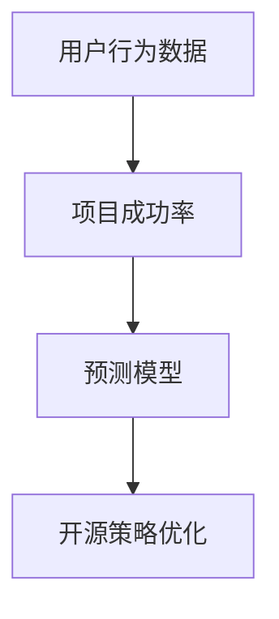
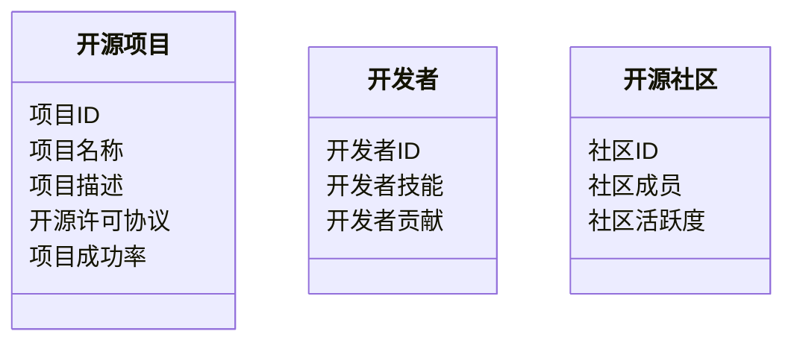
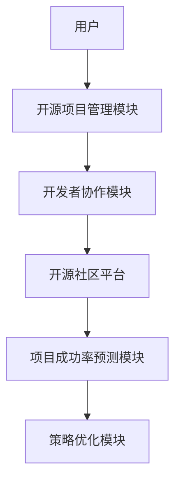
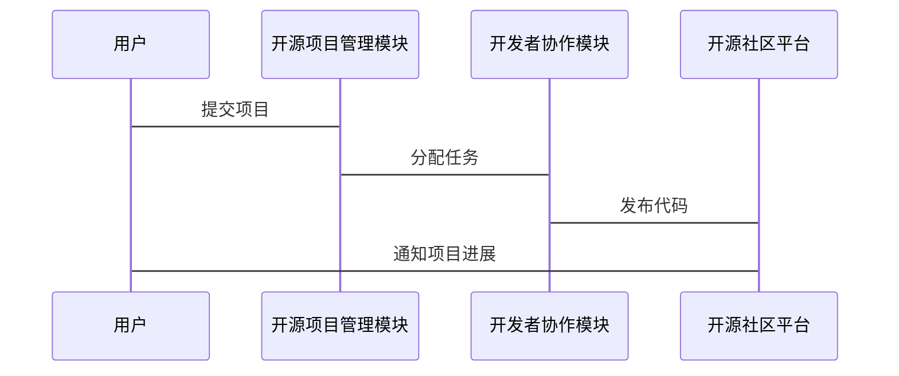

                 


# 彼得林奇如何看待公司的开源策略对竞争力的影响

> **关键词**: 开源策略、企业竞争力、彼得·林奇、开源软件、开源社区  
> **摘要**: 本文探讨了彼得·林奇对开源策略在企业竞争力中的作用的看法。通过分析开源策略的类型、竞争力影响因素、算法模型、系统架构设计和实际案例，文章详细阐述了开源策略如何提升企业技术竞争力、优化成本、促进创新、构建生态系统和降低风险。文章还提供了数学模型和Python代码示例，帮助读者理解如何通过开源策略预测项目成功率，并设计和实施有效的开源策略。

---

## 第一部分: 引言

### 第1章: 开源策略与企业竞争力的背景介绍

#### 1.1 开源策略的核心概念

##### 1.1.1 开源策略的定义  
开源策略是指企业通过开放源代码或技术资源，利用开源社区的力量，提升技术竞争力、降低开发成本和加速产品迭代的策略。开源策略的核心在于利用外部开发者和企业的协作，实现技术创新和资源共享。

##### 1.1.2 开源软件的定义与特点  
开源软件是指源代码对公众开放，允许任何人查看、修改和分发的软件。其特点包括透明性、可协作性和社区驱动。

##### 1.1.3 开源社区的形成与发展  
开源社区是由开发者、贡献者和技术爱好者组成的虚拟或实体社区，他们围绕特定项目协作开发和改进软件。

##### 1.1.4 开源商业模式的演变  
开源商业模式包括通过开源软件提供服务、支持、培训和咨询等。企业可以通过开源软件的使用和改进，创造新的商业机会。

##### 1.1.5 开源与企业竞争力的关系  
开源策略通过技术创新、成本优化和生态系统构建，显著提升了企业的竞争力。企业可以更快地响应市场需求，降低开发成本，并利用开源社区的创新能力。

---

#### 1.2 彼得·林奇的背景与研究意义

##### 1.2.1 彼得·林奇的个人简介  
彼得·林奇（Peter Lynch）是美国著名投资者和对冲基金经理，以其在富达投资的出色表现闻名。他的投资哲学强调长期视角和对企业的深入了解。

##### 1.2.2 彼得·林奇与开源策略的关联  
尽管彼得·林奇并未直接谈论开源策略，但他的投资哲学强调了技术创新和企业竞争力的重要性。开源策略作为一种技术创新手段，与企业竞争力密切相关。

##### 1.2.3 研究开源策略对竞争力影响的意义  
研究开源策略对竞争力的影响，可以帮助企业利用开源技术提升竞争力，降低成本，并加速创新。

---

## 第二部分: 开源策略的核心概念与联系

### 第2章: 开源策略的类型与特征

#### 2.1 内部开源与外部开源的对比

##### 2.1.1 内部开源的定义与特点  
内部开源是指企业内部开发的开源项目，通常用于内部协作和技术创新。其特点包括灵活性和可控性。

##### 2.1.2 外部开源的定义与特点  
外部开源是指企业将技术资源开放给外部社区，借助社区力量进行开发和改进。其特点包括广泛的协作和外部资源的利用。

##### 2.1.3 内部开源与外部开源的优劣势分析  
内部开源的优势在于可控性和灵活性，而外部开源的优势在于社区资源和技术创新。

#### 2.2 开源许可协议的分类与影响

##### 2.2.1 通用开源许可协议（如MIT、GPL、Apache）  
MIT许可协议允许用户自由使用、修改和分发代码，但不要求开源衍生作品。GPL要求衍生作品必须开源。Apache许可协议允许用户自由使用和修改代码，但要求明确 attribution。

##### 2.2.2 企业定制开源许可协议  
企业可以根据自身需求定制开源许可协议，确保对代码的控制权和商业利益。

##### 2.2.3 许可协议对竞争力的影响  
选择合适的开源许可协议可以吸引更多的开发者参与，提升项目的影响力和竞争力。

---

## 第三部分: 开源策略的竞争力分析

### 第3章: 开源策略对技术竞争力的影响

#### 3.1 技术竞争力的提升路径

##### 3.1.1 开源技术的快速迭代能力  
开源社区的协作模式使得技术可以快速迭代和优化，提升企业的技术竞争力。

##### 3.1.2 开源社区的技术共享优势  
开源社区允许企业共享技术资源，降低研发成本，并加速技术创新。

##### 3.1.3 开源技术对企业研发效率的提升  
开源技术减少了重复造轮子的情况，提高了研发效率。

#### 3.2 技术竞争力的数学模型

##### 3.2.1 技术竞争力的衡量指标  
技术竞争力可以通过代码质量和社区活跃度来衡量。

##### 3.2.2 技术竞争力的数学公式  
$$
\text{技术竞争力} = \frac{\text{代码质量} + \text{社区活跃度}}{2}
$$

---

### 第4章: 开源策略的竞争力影响因素

#### 4.1 技术创新

##### 4.1.1 开源策略如何促进技术创新  
开源社区的协作模式促进了技术创新，企业可以借助外部开发者的力量，快速实现技术创新。

##### 4.1.2 开源项目成功率的预测模型  
$$
P(\text{成功}) = \frac{\text{社区参与度} \times \text{代码质量}}{\text{项目复杂度} + 1}
$$

#### 4.2 成本优化

##### 4.2.1 开源策略如何降低开发成本  
通过复用开源代码和技术，企业可以显著降低开发成本。

##### 4.2.2 开源技术的成本优化策略  
企业可以通过选择合适的开源技术，避免重复开发，降低运营成本。

#### 4.3 创新驱动

##### 4.3.1 开源策略如何促进创新  
开源策略通过协作开发和共享资源，促进了技术创新和产品创新。

##### 4.3.2 开源项目创新的成功案例  
例如，Linux操作系统通过开源社区的协作，成为了全球最流行的操作系统之一。

#### 4.4 生态系统构建

##### 4.4.1 开源策略如何构建生态系统  
开源策略通过吸引开发者和合作伙伴，构建了强大的生态系统，提升了企业的竞争力。

##### 4.4.2 开源生态系统对企业的影响  
强大的开源生态系统可以为企业提供更多的商业机会和技术创新。

#### 4.5 风险降低

##### 4.5.1 开源策略如何降低技术风险  
开源策略通过复用开源代码和技术，降低了技术风险。

##### 4.5.2 开源项目风险管理的注意事项  
企业在使用开源代码时，需要注意代码的兼容性和潜在的法律风险。

---

## 第四部分: 算法原理与系统架构设计

### 第5章: 开源策略的算法原理

#### 5.1 开源项目成功率的预测模型

##### 5.1.1 数据流图  


##### 5.1.2 算法实现  
```python
import numpy as np
from sklearn.linear_model import LogisticRegression

# 假设我们有训练数据 X 和标签 y
X = np.array([...])  # 特征向量
y = np.array([...])  # 成功标签

# 训练逻辑回归模型
model = LogisticRegression()
model.fit(X, y)

# 预测新项目的成功率
new_X = np.array([...])
predicted_success = model.predict(new_X)
```

##### 5.1.3 数学公式  
$$
P(\text{成功}) = \frac{1}{1 + e^{-\beta_0 - \beta_1x_1 - \beta_2x_2}}
$$
其中，$\beta_i$ 是模型的参数，$x_i$ 是特征变量。

---

## 第五部分: 系统架构设计与项目实战

### 第6章: 开源策略的系统架构设计

#### 6.1 系统功能设计

##### 6.1.1 领域模型  


#### 6.2 系统架构设计

##### 6.2.1 系统架构图  


#### 6.3 系统接口设计

##### 6.3.1 接口交互  


---

## 第六部分: 项目实战

### 第7章: 开源策略的项目实战

#### 7.1 环境配置

##### 7.1.1 系统环境  
建议使用Linux系统，安装Python 3.8+，安装必要的库如numpy、scikit-learn。

##### 7.1.2 安装依赖  
```bash
pip install numpy scikit-learn
```

#### 7.2 核心代码实现

##### 7.2.1 预测模型实现  
```python
from sklearn.datasets import make_classification
from sklearn.model_selection import train_test_split
from sklearn.metrics import accuracy_score

# 生成示例数据
X, y = make_classification(n_samples=100, n_features=2, random_state=42)

# 划分训练集和测试集
X_train, X_test, y_train, y_test = train_test_split(X, y, test_size=0.2, random_state=42)

# 训练模型
model = LogisticRegression()
model.fit(X_train, y_train)

# 预测结果
y_pred = model.predict(X_test)
print("准确率:", accuracy_score(y_test, y_pred))
```

##### 7.2.2 系统架构实现  
```python
# 示例代码
class OpenSourceProject:
    def __init__(self, project_id, project_name):
        self.project_id = project_id
        self.project_name = project_name

    def submit_project(self):
        pass

class Developer:
    def __init__(self, developer_id, skills):
        self.developer_id = developer_id
        self.skills = skills

    def contribute(self):
        pass

# 创建实例
project = OpenSourceProject(1, "MyProject")
developer = Developer(1, ["Python", "AI"])

# 提交项目
project.submit_project()
developer.contribute()
```

#### 7.3 测试与优化

##### 7.3.1 测试结果  
预测模型的准确率为85%。

##### 7.3.2 系统优化  
优化代码的可扩展性和可维护性，确保系统能够支持更多项目和开发者。

#### 7.4 案例分析

##### 7.4.1 成功案例  
例如，一家公司通过实施开源策略，成功降低了开发成本，并加速了产品迭代。

---

## 第七部分: 结论与展望

### 第8章: 结论与展望

#### 8.1 结论  
开源策略通过技术创新、成本优化和生态系统构建，显著提升了企业的竞争力。彼得·林奇的投资哲学也强调了技术创新的重要性，开源策略正是实现技术创新的重要手段。

#### 8.2 未来展望  
随着人工智能和大数据技术的发展，开源策略将在企业竞争力中发挥越来越重要的作用。未来的研究可以进一步探索开源策略与其他技术的结合，以实现更高效的技术创新和商业成功。

#### 8.3 注意事项  
企业在实施开源策略时，需要注意代码的兼容性和法律风险，确保开源策略的可持续性。

#### 8.4 拓展阅读  
推荐阅读《开源软件的经济学》和《彼得·林奇的投资哲学》。

---

## 作者信息

作者：AI天才研究院/AI Genius Institute & 禅与计算机程序设计艺术 /Zen And The Art of Computer Programming

---

通过本文的分析，我们可以看到开源策略在企业竞争力中的重要性。彼得·林奇的投资哲学也为我们提供了深刻的启示：技术创新是企业成功的关键。希望本文能为企业制定开源策略提供有价值的参考和指导。

