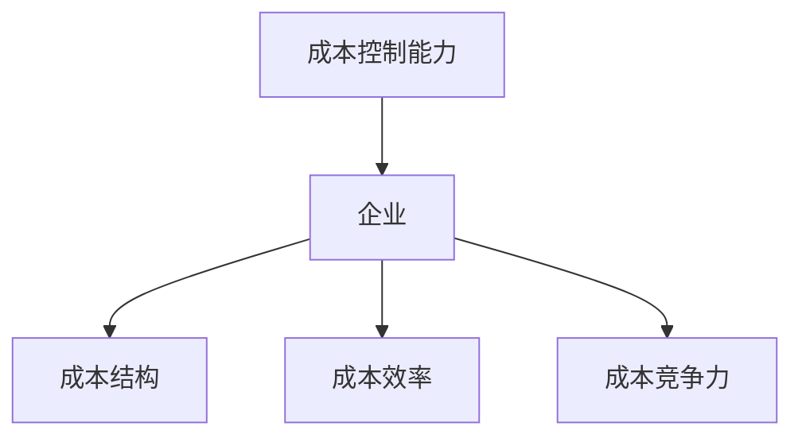
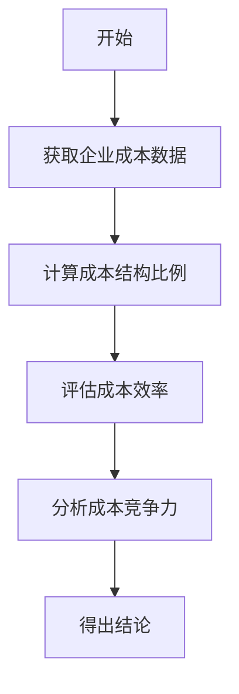
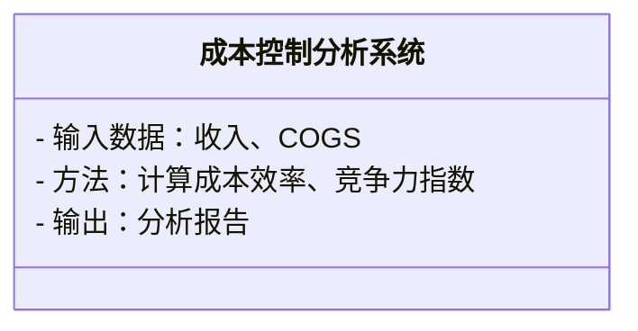
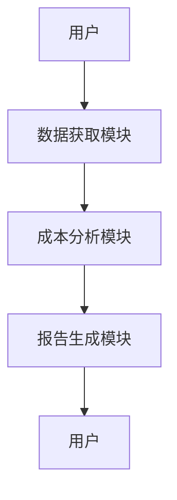

                 


# 彼得林奇如何看待公司的成本控制能力

> 关键词：彼得林奇，成本控制能力，投资分析，企业成本管理，财务分析方法

> 摘要：本文深入探讨了彼得林奇在评估公司成本控制能力时的方法和见解。通过分析成本结构、效率和竞争力，结合实例和图表，详细阐述了如何将这些因素纳入投资决策，帮助投资者识别具备持续成本优势的企业。

---

## 第一部分：成本控制能力的背景与重要性

### 第1章：成本控制能力的定义与重要性

#### 1.1 成本控制能力的定义
- **成本控制能力**是指企业有效管理和优化其运营成本的能力，直接影响企业的盈利能力、竞争力和可持续发展。

#### 1.2 成本控制能力在企业中的作用
- 成本控制能力是企业核心竞争力的重要组成部分，能够提升利润率、增强市场应对能力和提高资本效率。

#### 1.3 彼得林奇对成本控制能力的关注
- 彼得林奇作为投资大师，高度重视企业的成本控制能力，认为这是评估企业长期盈利能力的关键因素。

---

## 第2章：成本控制能力的核心概念与联系

### 2.1 成本控制能力的构成要素
- **成本结构**：固定成本与可变成本的比率，影响企业的规模效应和成本优化空间。
- **成本效率**：单位产品成本的最低化能力，反映了企业的生产效率。
- **成本竞争力**：与竞争对手相比的成本优势，决定了市场地位。

### 2.2 成本控制能力与企业财务健康度的关系
- **盈利能力**：成本控制直接影响净利润率，是企业赚钱能力的核心指标。
- **现金流**：优化成本能改善现金流，增强企业的流动性。
- **估值**：优秀的成本控制能力通常会提升市场对企业的估值。

### 2.3 核心概念的对比分析
- **对比表格**：展示了成本控制能力与其他财务指标的差异和联系。

| 指标         | 定义                           | 关键作用                           |
|--------------|--------------------------------|------------------------------------|
| 成本控制能力 | 企业优化成本的能力             | 提升利润率，增强竞争力             |
| 净利润率     | 净利润与收入的比率             | 反映企业盈利能力                   |
| 现金流       | 现金流入与流出的净额           | 衡量企业财务健康度                 |

### 2.4 实体关系图（ER图）


---

## 第3章：成本控制能力的算法原理

### 3.1 算法原理概述
- 彼得林奇的成本控制分析模型基于对企业成本结构的深入研究，结合财务指标评估企业的成本效率和竞争力。

### 3.2 成本分析模型


### 3.3 财务指标评估模型
- 使用Python实现的模型，计算成本效率和竞争力指数。

```python
import pandas as pd

def calculate_cost_efficiency(revenue, cost_of_goods_sold):
    return cost_of_goods_sold / revenue

def calculate_cost_competition(cost_efficiency, industry_average):
    return (cost_efficiency / industry_average) * 100
```

### 3.4 数学模型与公式
- 成本效率公式：
  $$ \text{成本效率} = \frac{\text{COGS}}{\text{收入}} $$
- 成本竞争力指数：
  $$ \text{成本竞争力} = \left( \frac{\text{成本效率}}{\text{行业平均成本效率}} \right) \times 100 $$

---

## 第4章：系统分析与架构设计

### 4.1 系统功能设计
- 使用Mermaid类图展示系统模块及其关系。



### 4.2 系统架构设计
- 展示系统的主要组件和交互流程。



---

## 第5章：项目实战

### 5.1 环境安装与配置
- 安装Python和相关库（pandas、numpy）。

### 5.2 核心功能实现
- 实现成本效率和竞争力指数的计算。

```python
import pandas as pd

# 示例数据
data = {
    '公司': ['A', 'B', 'C'],
    '收入': [1000, 1500, 2000],
    'COGS': [500, 700, 800]
}

df = pd.DataFrame(data)

# 计算成本效率
df['成本效率'] = df['COGS'] / df['收入']

# 行业平均成本效率
industry_avg = df['成本效率'].mean()

# 计算成本竞争力指数
df['成本竞争力指数'] = (df['成本效率'] / industry_avg) * 100

print(df)
```

### 5.3 案例分析
- 通过具体案例分析，展示如何应用上述模型评估企业的成本控制能力。

---

## 第6章：最佳实践与注意事项

### 6.1 小结
- 成本控制能力是企业长期盈利能力的关键因素，投资者应深入分析企业的成本结构和效率。

### 6.2 注意事项
- 数据准确性：确保使用可靠的数据来源。
- 行业差异：不同行业的成本控制标准不同，需进行横向比较。
- 动态分析：关注企业成本控制能力的长期趋势。

### 6.3 拓展阅读
- 推荐阅读彼得林奇的《投资最重要的事情》和《股票投资致富之路》。

---

## 第7章：总结

### 7.1 内容回顾
- 本文系统地介绍了彼得林奇的成本控制分析方法，从概念、算法到实战，全面解析了如何评估企业的成本管理能力。

### 7.2 未来展望
- 随着技术的发展，成本控制分析将更加依赖数据驱动的方法，投资者需不断学习和适应新的工具和方法。

---

## 作者：AI天才研究院 & 禅与计算机程序设计艺术

---

**本文为技术博客文章，未经授权不得转载。**

