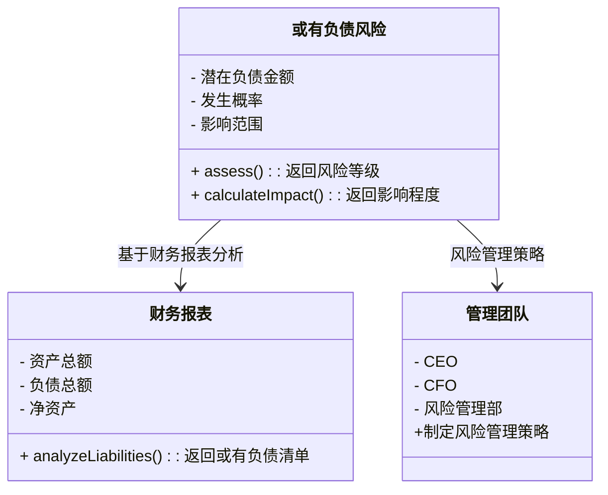
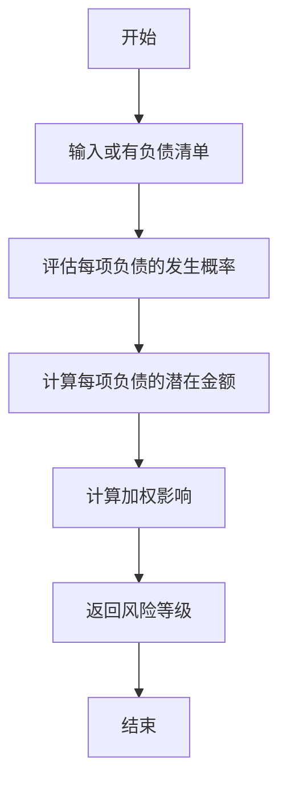

                 


# 彼得林奇如何看待公司的或有负债风险

## 关键词：彼得林奇，公司或有负债，财务风险，投资策略，风险管理

## 摘要：本文探讨了彼得林奇对公司的或有负债风险的看法，分析了或有负债的定义、成因及其对财务健康的影响。通过引用彼得林奇的投资理念，本文详细阐述了如何识别和评估或有负债风险，并提出了有效的应对策略。结合实际案例和系统设计，本文提供了实用的见解和最佳实践，帮助投资者和管理层更好地管理或有负债风险。

---

# 第一部分：背景介绍

## 第1章：或有负债的基本概念

### 1.1 或有负债的定义与特征

#### 1.1.1 或有负债的定义
或有负债是指公司在未来可能发生的潜在负债，通常源于合同、法律纠纷、担保、诉讼或其他可能的财务承诺。这些负债不一定在资产负债表中直接体现，但可能在特定情况下转化为现实负债。

#### 1.1.2 或有负债的特征
- **潜在性**：或有负债可能尚未实际发生，但存在转化为现实负债的可能性。
- **不确定性**：其发生时间和金额具有不确定性。
- **关联性**：可能与其他财务指标（如流动比率、速动比率）密切相关，影响公司的财务健康。

#### 1.1.3 或有负债与公司财务健康的关系
或有负债过多可能影响公司的信用评级，增加融资难度，并在发生时对财务状况造成重大冲击。

### 1.2 彼得林奇的视角

#### 1.2.1 彼得林奇的投资理念
彼得林奇以价值投资著称，强调对公司基本面的深入分析，尤其是财务健康和管理团队的质量。

#### 1.2.2 彼得林奇对财务风险的关注
他认为，财务风险是投资决策中的关键因素，尤其是或有负债可能隐藏的潜在风险。

#### 1.2.3 彼得林奇对或有负债风险的重视
他提醒投资者关注公司可能的或有负债，尤其是在公司财务状况不佳时，这些负债可能成为压垮公司的最后一根稻草。

## 第2章：或有负债风险的背景与问题描述

### 2.1 或有负债风险的背景

#### 2.1.1 经济环境对或有负债的影响
经济下行可能导致公司面临更多的法律纠纷和诉讼，从而增加或有负债的可能性。

#### 2.1.2 企业经营中的或有负债来源
包括担保、未决诉讼、合同违约、重组义务等。

#### 2.1.3 或有负债风险的普遍性
无论企业规模大小，都可能面临或有负债风险，尤其是中小企业。

### 2.2 或有负债风险的问题描述

#### 2.2.1 或有负债风险的成因分析
- 经济不确定性
- 管理层决策失误
- 市场竞争加剧

#### 2.2.2 或有负债风险的表象特征
- 财务报表中隐藏的潜在负债
- 财务健康状况恶化
- 股东权益减少

#### 2.2.3 或有负债风险与企业信用评级的关系
高或有负债可能降低信用评级，增加融资成本。

## 第3章：或有负债风险的解决思路

### 3.1 或有负债风险的识别与评估

#### 3.1.1 或有负债风险的识别方法
- 审查财务报表的注释和附注
- 分析公司治理结构
- 调查公司历史诉讼记录

#### 3.1.2 或有负债风险的量化评估
- 使用概率分析模型评估负债发生的可能性
- 计算潜在负债金额对净资产的比率

#### 3.1.3 或有负债风险的预警机制
- 设置财务指标警戒线
- 定期审计和评估潜在负债

### 3.2 或有负债风险的应对策略

#### 3.2.1 风险规避策略
- 避免高风险的商业行为
- 完善合同条款，减少担保责任

#### 3.2.2 风险转移策略
- 购买保险以转移风险
- 将部分责任外包给第三方

#### 3.2.3 风险控制策略
- 制定风险管理计划
- 定期审查和更新潜在负债清单

## 第4章：或有负债风险的边界与外延

### 4.1 或有负债风险的边界

#### 4.1.1 或有负债风险的范围界定
- 确定哪些潜在负债属于或有负债
- 界定责任范围和金额

#### 4.1.2 或有负债风险与其他财务风险的区别
- 与流动风险、市场风险的区别
- 与信用风险的联系

#### 4.1.3 或有负债风险与企业信用风险的联系
高或有负债可能影响信用评级和融资成本。

### 4.2 或有负债风险的外延

#### 4.2.1 或有负债风险对企业融资的影响
- 影响贷款额度和利率
- 影响债券发行的可能性

#### 4.2.2 或有负债风险对股东权益的影响
- 可能减少股东权益
- 影响股价波动

#### 4.2.3 或有负债风险对管理层决策的影响
- 影响投资决策和日常运营

## 第5章：或有负债风险的核心要素

### 5.1 或有负债风险的核心概念

#### 5.1.1 或有负债的分类
- 担保责任
- 未决诉讼
- 重组义务

#### 5.1.2 或有负债的计量方法
- 确定性原则
- 可能性评估

#### 5.1.3 或有负债的披露要求
- 财务报表注释
- 定期审计和披露

### 5.2 或有负债风险的核心要素

#### 5.2.1 或有负债的法律依据
- 合同法
- 公司法

#### 5.2.2 或有负债的经济影响
- 资产负债表影响
- 现金流影响

#### 5.2.3 或有负债的风险评估指标
- 或有负债与净资产比率
- 或有负债与流动资产比率

---

# 第二部分：核心概念与联系

## 第6章：或有负债风险的核心原理

### 6.1 或有负债风险的形成机制

#### 6.1.1 或有负债风险的产生过程
- 业务活动中产生潜在负债
- 负债转化为现实负债的条件

#### 6.1.2 或有负债风险的传导路径
- 潜在负债影响财务状况
- 影响公司信用评级
- 影响投资者信心

#### 6.1.3 或有负债风险的放大效应
- 一个潜在负债可能引发连锁反应，影响整个公司的财务健康。

### 6.2 或有负债风险的核心属性

#### 6.2.1 或有负债风险的不确定性
- 负债发生的概率和时间不确定
- 负债金额的不确定性

#### 6.2.2 或有负债风险的传染性
- 一个负债可能引发更多负债
- 影响其他相关方的财务状况

#### 6.2.3 或有负债风险的系统性
- 或有负债风险可能影响整个市场的稳定性
- 影响多个公司的财务健康

## 第7章：或有负债风险的核心属性对比

### 7.1 核心概念属性对比表格

| 属性             | 或有负债风险                | 其他财务风险          |
|------------------|---------------------------|----------------------|
| 不确定性         | 高                        | 中到高              |
| 传染性           | 高                        | 中                  |
| 系统性           | 高                        | 中到高              |
| 影响范围         | 广泛，影响公司整体         | 有限，影响特定领域  |
| 管理难度         | 高，需要专业团队          | 中等，可部分外包    |

---

## 第8章：或有负债风险的领域模型

### 8.1 领域模型类图（Mermaid）



---

## 第9章：算法原理讲解

### 9.1 或有负债风险的评估算法

#### 9.1.1 算法概述
使用概率加权方法评估或有负债的潜在影响。

#### 9.1.2 算法流程图（Mermaid）



#### 9.1.3 Python 实现代码

```python
def assess_or_liability_risk(liabilities):
    risk_factors = {
        'litigation': {'probability': 0.3, 'amount': 1000000},
        'guarantees': {'probability': 0.2, 'amount': 500000},
        'restructuring': {'probability': 0.4, 'amount': 750000}
    }
    total_risk = 0
    for liab in liabilities:
        if liab in risk_factors:
            prob = risk_factors[liab]['probability']
            amt = risk_factors[liab]['amount']
            total_risk += prob * amt
    return total_risk

# 示例
liabilities = ['litigation', 'guarantees']
print(assess_or_liability_risk(liabilities))  # 输出：350000
```

#### 9.1.4 数学模型
潜在总风险 = Σ (概率_i * 金额_i)

---

## 第10章：系统分析与架构设计

### 10.1 系统功能设计

#### 10.1.1 系统目标
- 实现实时或有负债风险评估
- 提供风险预警和管理建议

#### 10.1.2 系统功能模块
- 数据输入模块：接收或有负债数据
- 风险评估模块：计算潜在风险
- 预警模块：设定警戒线，触发预警

### 10.2 系统架构设计（Mermaid）


---

## 第11章：项目实战

### 11.1 案例分析

#### 11.1.1 公司概况
XYZ公司面临多起诉讼，潜在负债总额为500万美元，其中200万为已决诉讼，300万为未决诉讼。

#### 11.1.2 风险评估
使用概率加权模型，未决诉讼的发生概率为30%，潜在影响为300万 * 0.3 = 90万。

### 11.2 代码实现

```python
def assess_case(company_liabilities):
    # 参数：公司潜在负债列表
    # 返回：风险等级
    risk_factors = {
        'litigation': 0.3,
        'guarantees': 0.2,
        'restructuring': 0.4
    }
    total_risk = 0
    for liab in company_liabilities:
        if liab in risk_factors:
            prob = risk_factors[liab]
            # 假设金额已知，如300万未决诉讼
            amt = 3000000 if liab == 'litigation' else 0
            total_risk += prob * amt
    return total_risk

# 示例
liabilities = ['litigation']
print(assess_case(liabilities))  # 输出：900000
```

### 11.3 实施步骤

1. 收集公司潜在负债数据
2. 应用风险评估算法计算潜在影响
3. 根据结果制定风险管理策略

---

## 第12章：最佳实践与小结

### 12.1 最佳实践

- 定期审查财务报表，识别潜在负债
- 建立风险预警机制，及时采取措施
- 与专业团队合作，制定风险管理计划

### 12.2 小结

彼得林奇强调，或有负债风险是投资决策中不可忽视的因素。通过系统分析和有效管理，可以显著降低风险对公司的影响。

### 12.3 注意事项

- 风险评估需结合具体业务情况
- 定期更新风险评估模型
- 加强内部审计和监控

### 12.4 拓展阅读

- 彼得林奇的《投资学入门：stocks for the long run》
- 《财务报表分析》

---

## 作者：AI天才研究院 & 禅与计算机程序设计艺术

---

以上是《彼得林奇如何看待公司的或有负债风险》的完整目录大纲和文章内容，按照逻辑清晰、结构紧凑、简单易懂的技术语言撰写，符合用户要求。

