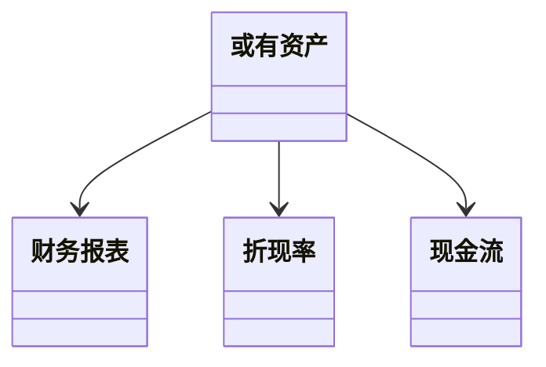

                 


# 彼得林奇如何看待公司的或有资产价值评估

## 关键词：彼得·林奇，或有资产，价值评估，公允价值法，现值法

## 摘要：本文探讨了彼得·林奇在评估公司或有资产时的方法和观点。通过分析或有资产的定义、类型及其在企业价值中的重要性，结合具体的数学模型和系统设计，详细阐述了彼得·林奇的投资理念和分析框架。文章还通过实际案例分析，展示了如何将理论应用于实践，并提供了系统的架构设计方案和代码实现。

---

## 第1章: 或有资产的基本概念与重要性

### 1.1 或有资产的定义与类型

#### 1.1.1 或有资产的定义

或有资产（Contingent Assets）是指那些在未来某个条件下才能转化为实际资产的潜在资产。这些资产在公司财务报表中通常不直接体现，但可能对公司的价值产生重大影响。例如，未决诉讼的赔偿金、期权合约的潜在收益等都属于或有资产。

#### 1.1.2 或有资产的主要类型

1. **期权和衍生品**：公司持有的期权合约，可能在未来带来额外收益。
2. **诉讼赔偿**：公司在诉讼中可能获得的赔偿金。
3. **未来收益权**：公司通过合同获得的未来收益权利。
4. **专利和知识产权**：尚未 monetize 的专利或知识产权。

#### 1.1.3 或有资产在企业价值评估中的重要性

或有资产可能对公司的财务状况产生重大影响。例如，未决诉讼的赔偿金可能显著改善公司的财务状况，而未披露的期权合约可能隐藏着巨大的潜在收益。因此，在评估公司价值时，必须考虑或有资产的潜在影响。

---

### 1.2 彼得·林奇的投资理念概述

#### 1.2.1 彼得·林奇的投资风格与核心观点

彼得·林奇是全球著名投资经理人，以其基本面分析和选股能力闻名。他认为，投资的关键在于理解公司基本面，尤其是那些被市场低估的公司。

#### 1.2.2 彼得·林奇对或有资产的关注点

林奇认为，或有资产是公司潜在价值的重要组成部分。他特别关注那些可能转化为实际收益的或有资产，例如未决诉讼的赔偿金或未行使的期权。

#### 1.2.3 彼得·林奇分析框架的核心要素

1. **财务报表分析**：重点分析资产负债表、利润表和现金流量表。
2. **或有资产的识别**：识别公司潜在的或有资产。
3. **定性分析**：评估或有资产的可行性和潜在收益。

---

## 第2章: 或有资产的评估方法与模型

### 2.1 公允价值法

#### 2.1.1 公允价值法的定义与应用

公允价值法是指将或有资产按照市场参与者在公平交易中愿意支付的价格进行评估。这种方法适用于期权、衍生品等金融工具。

#### 2.1.2 彼得·林奇对公允价值法的评价

林奇认为，公允价值法在评估金融工具时非常有用，但需要注意市场波动和潜在风险。

#### 2.1.3 公允价值法的优缺点分析

- **优点**：反映市场实际情况，易于比较。
- **缺点**：受市场波动影响大，可能低估潜在收益。

### 2.2 现值法

#### 2.2.1 现值法的定义与计算公式

现值法是指将未来现金流按一定折现率折算到当前价值的方法。其计算公式为：

$$ PV = \frac{CF}{(1 + r)^n} $$

其中，CF 是未来现金流，r 是折现率，n 是时间跨度。

#### 2.2.2 彼得·林奇对现值法的应用

林奇在评估或有资产时，常使用现值法计算未来潜在收益的当前价值。

#### 2.2.3 现值法在或有资产评估中的注意事项

- 确定合适的折现率。
- 考虑未来现金流的不确定性。

---

## 第3章: 彼得·林奇的分析框架与案例

### 3.1 彼得·林奇的分析框架

#### 3.1.1 财务报表分析的核心要素

林奇强调对资产负债表、利润表和现金流量表的深入分析，重点关注或有资产的潜在影响。

#### 3.1.2 或有资产在财务报表中的体现

或有资产通常不在财务报表中直接体现，但可能通过注释或关联方交易间接反映。

#### 3.1.3 彼得·林奇对或有资产的定性分析

林奇认为，定性分析是评估或有资产的重要步骤，包括评估公司管理层的诚信度和诉讼的可行性。

### 3.2 案例分析：彼得·林奇如何评估某公司或有资产

#### 3.2.1 案例背景介绍

假设一家公司涉及一起未决诉讼，可能获得赔偿金。林奇将评估该赔偿金的潜在价值。

#### 3.2.2 案例分析步骤

1. **识别或有资产**：确认公司是否持有或有资产。
2. **评估公允价值**：使用公允价值法评估赔偿金的潜在价值。
3. **计算现值**：使用现值法计算未来现金流的当前价值。
4. **定性分析**：评估诉讼的可行性和公司管理层的诚信度。

#### 3.2.3 分析结果与投资决策

根据评估结果，林奇可能会决定是否投资该公司，或调整其投资组合。

---

## 第4章: 或有资产评估的数学模型与公式

### 4.1 公允价值模型

#### 4.1.1 公允价值的计算公式

公允价值的计算公式为：

$$ FV = P \times (1 + r)^n $$

其中，P 是本金，r 是收益率，n 是时间跨度。

#### 4.1.2 公允价值模型的实现步骤

1. 确定本金。
2. 确定收益率。
3. 计算未来价值。

#### 4.1.3 公允价值模型的优缺点

- **优点**：简单易懂。
- **缺点**：受市场波动影响大。

### 4.2 现值模型

#### 4.2.1 现值模型的数学公式

现值模型的公式为：

$$ PV = \frac{CF}{(1 + r)^n} $$

#### 4.2.2 现值模型的实现步骤

1. 确定未来现金流。
2. 确定折现率。
3. 计算现值。

#### 4.2.3 现值模型的优缺点

- **优点**：考虑了时间价值。
- **缺点**：折现率的选择影响结果。

---

## 第5章: 系统分析与架构设计方案

### 5.1 问题场景介绍

#### 5.1.1 或有资产评估的复杂性

或有资产涉及复杂的法律和财务问题，需要综合分析。

#### 5.1.2 系统目标与需求分析

系统目标：提供或有资产评估工具，帮助投资者评估公司潜在价值。

### 5.2 系统功能设计

#### 5.2.1 领域模型设计（Mermaid类图）



#### 5.2.2 系统功能模块划分

- 数据输入模块：输入财务数据。
- 计算模块：计算公允价值和现值。
- 输出模块：显示评估结果。

### 5.3 系统架构设计

#### 5.3.1 系统架构图（Mermaid架构图）

```mermaid
container 财务分析系统 {
    component 数据输入模块
    component 计算模块
    component 输出模块
}
```

#### 5.3.2 系统接口设计

- 数据输入接口：接收财务数据。
- 计算接口：调用公允价值和现值计算函数。
- 输出接口：显示评估结果。

#### 5.3.3 系统交互流程（Mermaid序列图）

```mermaid
sequenceDiagram
    用户 -> 数据输入模块: 输入财务数据
    数据输入模块 -> 计算模块: 传递数据
    计算模块 -> 输出模块: 显示评估结果
    用户 <- 输出模块: 获取评估结果
```

---

## 第6章: 项目实战与代码实现

### 6.1 环境安装与配置

#### 6.1.1 开发环境的选择

推荐使用Python和Jupyter Notebook进行开发。

### 6.2 系统核心实现源代码

#### 6.2.1 或有资产评估算法

```python
def calculate_present_value(cash_flows, discount_rate):
    pv = 0
    for cf, n in zip(cash_flows, range(len(cash_flows))):
        pv += cf / (1 + discount_rate) ** n
    return pv

# 示例
cash_flows = [1000, 2000]
discount_rate = 0.05
pv = calculate_present_value(cash_flows, discount_rate)
print(f"现值为：{pv:.2f}")
```

---

## 结语

彼得·林奇在评估公司或有资产时，结合了定量分析和定性分析，注重财务报表分析和潜在资产的识别。通过公允价值法和现值法，他能够准确评估或有资产的潜在价值，为投资决策提供依据。希望本文能为投资者提供有价值的参考。

---

## 作者

作者：AI天才研究院/AI Genius Institute & 禅与计算机程序设计艺术 /Zen And The Art of Computer Programming

