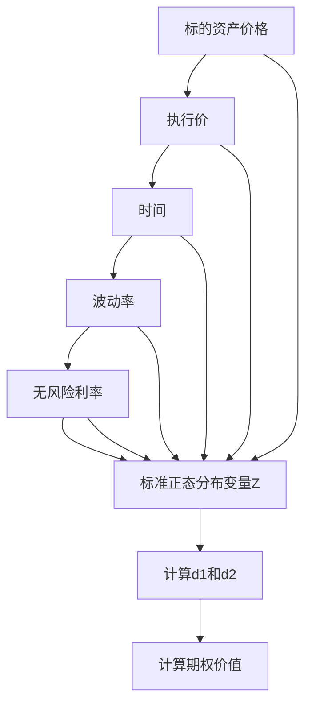
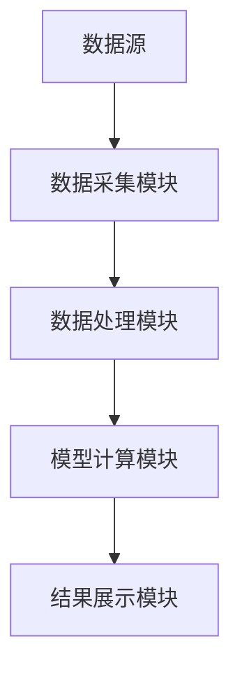
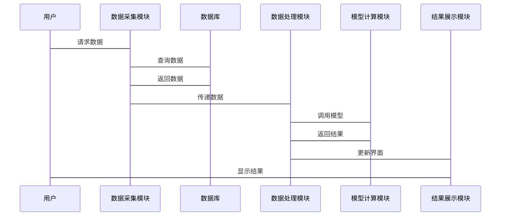

                 


```markdown
# 彼得林奇如何看待公司的或有资产对长期价值创造的潜在贡献

> 关键词：彼得林奇，或有资产，长期价值，期权定价，投资策略，财务分析

> 摘要：本文探讨了彼得林奇对公司的或有资产在长期价值创造中的看法，分析了或有资产的定义、分类、财务影响及价值评估方法，结合数学模型和算法原理，提出了系统架构与数据处理方案，并通过案例分析和实战项目，详细阐述了如何将彼得林奇的投资理念应用于实际投资决策。

---

## 第1章: 彼得林奇投资理念概述

### 1.1 彼得林奇的投资哲学

#### 1.1.1 价值投资的核心理念
- 彼得林奇强调基本面分析和长期投资。
- 价值投资的核心是寻找被市场低估的公司。
- 或有资产是公司潜在价值的重要组成部分。

#### 1.1.2 彼得林奇的投资风格
- 专注于分析公司财务报表。
- 偏好具有强大竞争优势的公司。
- 重视管理层能力和公司治理。

#### 1.1.3 或有资产在投资中的重要性
- 或有资产可能成为公司未来价值的驱动力。
- 通过分析或有资产，可以发现被市场忽视的投资机会。

### 1.2 或有资产的定义与分类

#### 1.2.1 或有资产的基本定义
- 或有资产是指公司可能拥有的潜在资产，未在财务报表中反映。
- 包括期权、认股证、担保等。

#### 1.2.2 或有资产的分类与特点
- 分类：按性质分为金融资产和实物资产；按来源分为内部生成和外部获得。
- 特点：潜在性、不确定性、杠杆效应。

#### 1.2.3 或有资产与公司长期价值的关系
- 或有资产可能成为公司未来收入的来源。
- 通过合理评估或有资产，可以提升公司估值。

---

## 第2章: 或有资产的财务影响与价值评估

### 2.1 或有资产的财务影响分析

#### 2.1.1 或有资产对资产负债表的影响
- 或有资产可能增加公司的潜在资产。
- 影响公司偿债能力的评估。

#### 2.1.2 或有资产对利润表的潜在影响
- 或有资产可能转化为未来收入，影响净利润。
- 需要考虑或有资产的公允价值变动。

#### 2.1.3 或有资产对现金流的潜在贡献
- 或有资产的实现可能带来额外现金流。
- 需要考虑实现或有资产的成本和时间因素。

### 2.2 或有资产的价值评估方法

#### 2.2.1 现金流折现法
- 核心思想：将未来现金流折现，评估现值。
- 公式：$$ PV = \sum_{t=1}^{n} \frac{CF_t}{(1+r)^t} $$
- 案例：假设年现金流为100万，贴现率5%，计算现值。

#### 2.2.2 市场比较法
- 基于市场可比资产的价格进行评估。
- 考虑市场波动和资产流动性。

#### 2.2.3 期权定价模型
- Black-Scholes公式：
$$ C = S_0 e^{rT} N(d_1) - K e^{rT} N(d_2) $$
- 参数：标的资产价格（$S_0$）、执行价（$K$）、时间（$T$）、波动率（$\sigma$）、无风险利率（$r$）。

---

## 第3章: 彼得林奇的分析框架与方法论

### 3.1 彼得林奇的分析框架

#### 3.1.1 公司基本面分析
- 财务报表分析：利润表、资产负债表、现金流量表。
- 竞争优势分析：市场地位、技术壁垒、成本优势。

#### 3.1.2 或有资产的潜在价值挖掘
- 识别公司未记录的潜在资产。
- 评估或有资产的可行性和实现路径。

#### 3.1.3 风险评估与投资决策
- 通过情景分析评估或有资产的风险。
- 结合风险偏好制定投资策略。

### 3.2 彼得林奇的分析方法

#### 3.2.1 基于期权定价的或有资产评估
- 将或有资产视为期权，使用Black-Scholes模型定价。
- 案例：某公司持有看涨期权，评估其公允价值。

#### 3.2.2 套期保值与风险对冲策略
- 使用衍生品对冲或有资产的风险。
- 确保投资组合的稳定性。

#### 3.2.3 财务指标与市场指标的结合分析
- 结合市盈率、市净率等指标评估公司价值。
- 参考行业平均值和市场趋势。

---

## 第4章: 或有资产的数学模型与算法原理

### 4.1 期权定价模型

#### 4.1.1 Black-Scholes公式
- 使用mermaid图展示公式推导过程：


#### 4.1.2 期权定价的数学推导
- 假设资产价格遵循几何布朗运动。
- 使用随机微分方程推导期权定价公式。

#### 4.1.3 期权定价的实战应用
- 编写Python代码实现Black-Scholes模型：
```python
import numpy as np

def black_scholes(S, K, r, T, sigma):
    d1 = (np.log(S/K) + (r + sigma**2/2)*T) / (sigma*np.sqrt(T))
    d2 = d1 - sigma*np.sqrt(T)
    return S * np.cumsum(d1) - K * np.exp(r*T) * np.cumsum(d2)

# 示例
S = 100
K = 105
r = 0.05
T = 1
sigma = 0.2
print(black_scholes(S, K, r, T, sigma))
```

### 4.2 现金流折现模型

#### 4.2.1 现金流折现的基本原理
- 将未来现金流折现，评估现值。

#### 4.2.2 现金流折现的数学公式
$$ PV = \sum_{t=1}^{n} \frac{CF_t}{(1+r)^t} $$

#### 4.2.3 现金流折现的实战应用
- 使用Python计算公司未来现金流的现值：
```python
def npv(cash_flows, discount_rate):
    return sum(cf / (1 + discount_rate)**t for t, cf in enumerate(cash_flows))

cash_flows = [100, 200, 300]
discount_rate = 0.1
print(npv(cash_flows, discount_rate))
```

---

## 第5章: 系统架构与数据处理方案

### 5.1 系统架构设计

#### 5.1.1 系统功能设计
- 数据采集：收集公司财务数据和市场数据。
- 数据处理：清洗和转换数据，提取特征。
- 模型计算：使用期权定价模型和现金流折现模型。
- 结果展示：生成可视化报告和投资建议。

#### 5.1.2 系统架构图


### 5.2 系统接口设计

#### 5.2.1 数据接口
- API接口：从数据库获取数据。
- 数据格式：JSON格式。

#### 5.2.2 模型接口
- API接口：调用期权定价模型。
- 返回结果：期权价值和相关指标。

### 5.3 系统交互序列图



---

## 第6章: 实战项目与案例分析

### 6.1 环境安装

#### 6.1.1 安装Python
```bash
python --version
pip install numpy pandas matplotlib
```

#### 6.1.2 安装其他工具
- 安装Jupyter Notebook用于数据分析。
- 安装Plotly用于数据可视化。

### 6.2 核心实现源代码

#### 6.2.1 数据处理代码
```python
import pandas as pd

# 数据清洗
data = pd.read_csv('data.csv')
data.dropna(inplace=True)
data['date'] = pd.to_datetime(data['date'])
data.set_index('date', inplace=True)
```

#### 6.2.2 模型实现代码
```python
import numpy as np

def calculate_option_value(S, K, r, T, sigma):
    d1 = (np.log(S/K) + (r + sigma**2/2)*T) / (sigma*np.sqrt(T))
    d2 = d1 - sigma*np.sqrt(T)
    return S * np.cumsum(d1) - K * np.exp(r*T) * np.cumsum(d2)

# 示例
S = 100
K = 105
r = 0.05
T = 1
sigma = 0.2
print(calculate_option_value(S, K, r, T, sigma))
```

### 6.3 案例分析

#### 6.3.1 案例背景
- 某公司持有大量看涨期权，可能影响公司价值。

#### 6.3.2 数据分析
- 使用Python分析期权的公允价值。
- 结合财务数据评估公司整体价值。

#### 6.3.3 结果解读
- 计算出期权价值，调整公司估值。
- 提供投资建议，包括买入或卖出信号。

---

## 第7章: 结论与展望

### 7.1 结论

- 彼得林奇的投资理念强调基本面分析和长期投资。
- 或有资产是公司潜在价值的重要来源。
- 通过期权定价模型和现金流折现法，可以合理评估或有资产的价值。

### 7.2 展望

- 进一步研究或有资产的动态变化。
- 开发更复杂的模型，考虑更多因素。
- 探讨或有资产在风险管理中的应用。

---

## 作者：AI天才研究院/AI Genius Institute & 禅与计算机程序设计艺术 /Zen And The Art of Computer Programming
```

