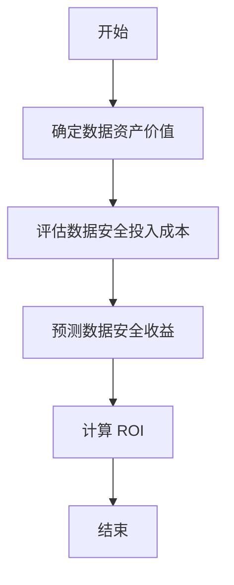
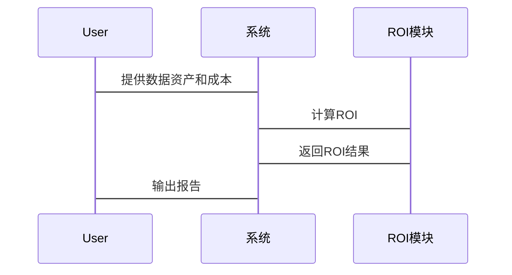

                 


# 彼得林奇如何看待公司的数据安全投资回报率

> 关键词：彼得·林奇，数据安全，投资回报率，ROI，企业安全，风险管理，数据分析

> 摘要：数据安全是现代企业面临的重要挑战，如何衡量数据安全的投资回报率（ROI）是企业决策者关注的焦点。本文从彼得·林奇的投资理念出发，分析数据安全投资的回报机制，探讨企业在数据安全方面的投资策略，帮助企业在保障数据安全的同时实现投资回报的最大化。

---

# 第一部分：数据安全投资回报率的背景与重要性

## 第1章：数据安全与投资回报率的背景介绍

### 1.1 数据安全的重要性

#### 1.1.1 数据安全的定义与范围

数据安全是指保护数据的机密性、完整性和可用性。随着数字化转型的推进，数据已成为企业最重要的资产之一。数据安全的范围包括防止数据泄露、篡改、丢失或未经授权的访问。

#### 1.1.2 数据安全对企业的影响

数据安全直接关系到企业的生存和发展。数据泄露可能导致巨大的经济损失、声誉损害和法律责任。例如，2018年英国航空公司因数据泄露事件，面临高达数百万英镑的罚款和客户信任的丧失。

#### 1.1.3 数据安全的演进与趋势

随着技术的发展，数据安全威胁也在不断演变。从早期的病毒攻击到如今的网络勒索、数据挖矿，数据安全的挑战日益复杂。企业需要采取多层次的安全防护策略。

### 1.2 投资回报率（ROI）的定义与计算

#### 1.2.1 ROI的核心概念

投资回报率（ROI）是衡量投资效率的重要指标，公式为：
$$ ROI = \frac{净收益}{投资成本} \times 100\% $$

#### 1.2.2 ROI的计算公式与方法

ROI的计算需要明确投资成本和净收益。净收益是指投资带来的收益减去相关成本。例如，企业在数据安全上的投入可能包括技术设备、员工培训和安全服务等。

#### 1.2.3 ROI在企业决策中的作用

ROI帮助企业评估不同投资方案的效率。在数据安全领域，ROI可以帮助企业选择最优的安全解决方案，避免过度或不足的投资。

### 1.3 彼得·林奇与投资回报率的关联

#### 1.3.1 彼得·林奇的投资理念

彼得·林奇是著名投资经理，强调基本面分析和长期投资。他认为，投资回报的核心在于企业的基本面和管理层的质量。

#### 1.3.2 数据安全投资回报率的特殊性

数据安全投资的回报具有间接性和长期性的特点。例如，防止数据泄露可能避免巨额损失，但这种回报往往难以直接量化。

#### 1.3.3 彼得·林奇视角下的数据安全投资

林奇可能认为，数据安全是企业的一项重要投资，虽然无法直接产生收益，但能够保护企业的核心资产，从而间接提升整体投资回报。

---

## 第2章：数据安全投资回报率的核心概念

### 2.1 数据安全投资的核心要素

#### 2.1.1 数据资产的分类与价值

数据资产可以分为核心数据（如客户信息、商业机密）和辅助数据（如日志数据）。不同类型的数据资产对企业的价值不同，因此需要采取差异化的安全策略。

#### 2.1.2 数据安全投入的主要形式

数据安全投入包括预防性支出（如防火墙、加密技术）和恢复性支出（如数据备份、灾难恢复）。预防性支出可以降低风险，恢复性支出则是在遭受攻击后弥补损失。

#### 2.1.3 数据安全收益的衡量标准

数据安全收益包括直接收益（如减少的法律罚款）和间接收益（如提升客户信任）。间接收益往往更难量化，但对企业的长期发展更为重要。

### 2.2 投资回报率的构成要素

#### 2.2.1 投资的直接成本

数据安全的投资成本包括技术设备采购、软件许可、员工培训和咨询服务等。

#### 2.2.2 收益的来源与类型

收益来源包括减少的数据泄露损失、提升的客户信任、避免的罚款和诉讼等。

#### 2.2.3 影响ROI的关键因素

影响数据安全ROI的关键因素包括数据资产的价值、安全投入的成本、风险的大小以及企业的风险管理能力。

### 2.3 数据安全与投资回报率的关系

#### 2.3.1 数据安全对 ROI 的正向影响

通过降低数据泄露风险，数据安全可以减少企业的财务损失，从而提升整体投资回报率。

#### 2.3.2 数据安全对 ROI 的反向影响

过度的安全投入可能增加成本，降低其他业务的投资，从而对整体ROI产生负面影响。

#### 2.3.3 数据安全 ROI 的边界与外延

数据安全 ROI 的边界在于投资成本和收益范围的界定。外延则涉及企业的整体风险管理策略。

---

## 第3章：数据安全投资回报率的算法原理

### 3.1 数据安全 ROI 的计算模型

#### 3.1.1 数据安全 ROI 的基本公式

$$ ROI = \frac{收益 - 成本}{成本} \times 100\% $$

其中，收益包括减少的损失和提升的资产价值，成本是企业的安全投入。

#### 3.1.2 数据安全 ROI 的扩展公式

考虑时间因素，ROI的计算可以引入时间价值的概念，使用净现值（NPV）进行评估：
$$ NPV = \sum_{t=0}^{n} \frac{C_t}{(1 + r)^t} $$

其中，\( C_t \) 是第t年的现金流，r是折现率。

### 3.2 数据安全 ROI 的算法流程



### 3.3 数据安全 ROI 的实现代码

```python
def calculate_roi(cost, revenue):
    return (revenue - cost) / cost * 100

# 示例数据
cost = 100000  # 投资成本
revenue = 150000  # 收益
roi = calculate_roi(cost, revenue)
print(f"ROI: {roi}%")
```

---

## 第4章：数据安全投资回报率的系统分析

### 4.1 数据安全 ROI 评估系统的组成部分

#### 4.1.1 问题场景介绍

企业面临数据泄露风险，希望通过投资数据安全技术降低风险，同时实现投资回报的最大化。

#### 4.1.2 系统功能设计

- 数据资产识别与分类
- 风险评估与量化
- 投资方案设计与优化
- 投资回报分析与报告

#### 4.1.3 系统架构设计


#### 4.1.4 系统接口设计

- 数据输入接口：接收数据资产和成本数据
- 模型接口：调用ROI计算模块
- 输出接口：生成ROI报告

#### 4.1.5 系统交互设计



---

## 第5章：数据安全投资回报率的项目实战

### 5.1 项目环境安装

- 安装Python和相关库（如pandas、numpy）
- 配置数据存储和处理环境

### 5.2 核心代码实现

```python
import pandas as pd

def calculate_roi(cost, revenue):
    return (revenue - cost) / cost * 100

# 示例数据
data = {
    '项目': ['项目A', '项目B', '项目C'],
    '成本': [100000, 80000, 120000],
    '收益': [150000, 120000, 180000]
}

df = pd.DataFrame(data)
df['ROI'] = df.apply(lambda x: calculate_roi(x['成本'], x['收益']), axis=1)
print(df)
```

### 5.3 案例分析

假设某企业有两个数据安全项目：

- 项目A：成本10万元，收益15万元，ROI=50%
- 项目B：成本8万元，收益12万元，ROI=50%

企业应选择ROI更高的项目，或根据预算选择多个项目。

---

## 第6章：数据安全投资回报率的最佳实践

### 6.1 最佳实践

- **量化风险**：准确评估数据泄露的潜在损失。
- **分阶段投资**：根据风险级别分阶段投入。
- **持续监控**：定期评估投资回报率，及时调整策略。

### 6.2 小结

数据安全投资回报率是企业在数字化转型中必须关注的重要指标。通过科学的投资策略和持续的评估优化，企业可以在保障数据安全的同时实现投资回报的最大化。

### 6.3 注意事项

- 数据安全 ROI 的计算需要结合企业的实际情况。
- 风险评估是 ROI 评估的基础，必须准确量化。

### 6.4 拓展阅读

- 彼得·林奇的《投资最重要的事情》
- 数据安全相关的技术书籍和文献

---

# 作者

**作者：AI天才研究院/AI Genius Institute & 禅与计算机程序设计艺术 /Zen And The Art of Computer Programming**

---

希望这篇文章能帮助读者更好地理解数据安全投资回报率的概念，并为企业在数据安全领域的决策提供有价值的参考。

