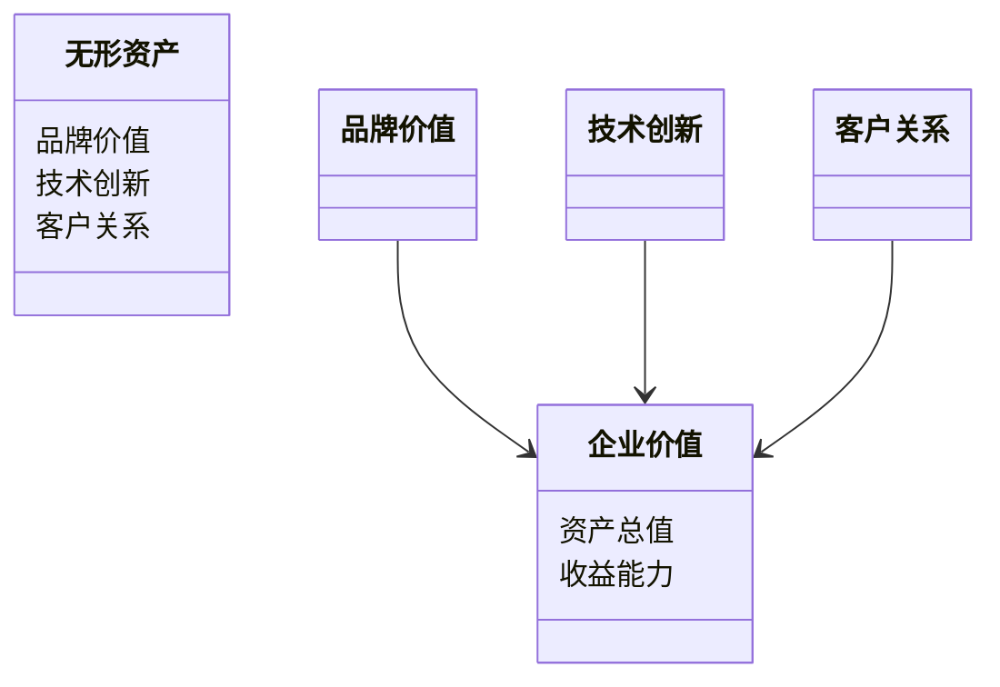

                 


# 彼得·林奇如何看待公司的无形资产价值

> 关键词：彼得·林奇，无形资产，企业价值，投资策略，品牌价值，客户关系，技术创新

> 摘要：本文深入探讨了彼得·林奇对公司的无形资产价值的看法，分析了如何评估和利用这些资产来提升企业价值和投资决策。通过详细解释无形资产的分类、评估方法及其对企业的深远影响，本文为投资者和企业管理者提供了实用的见解和策略。

---

## 第一部分：背景介绍

### 第1章：无形资产的定义与重要性

#### 1.1 无形资产的核心概念
- 无形资产是指没有实体形态，但能够为企业创造价值的资源。常见的无形资产包括品牌价值、客户关系、技术创新、专利、商标和商誉等。
- 无形资产具有长期性、难以量化和依赖性强的特点。它们不仅影响企业的市场地位，还直接关系到企业的盈利能力和发展潜力。

#### 1.2 彼得·林奇的投资理念
- 彼得·林奇以其独特的投资策略闻名，他注重企业基本面分析，尤其是那些具有强大无形资产的企业。
- 林奇认为，无形资产是企业核心竞争力的体现，它们能够为企业带来持续的竞争优势和超额利润。

#### 1.3 无形资产与企业价值的关系
- 无形资产是企业价值的重要组成部分。在企业合并或收购中，无形资产的评估直接关系到交易价格的确定。
- 无形资产的价值不仅体现在财务报表中，更体现在企业的市场竞争力和长期盈利能力上。

---

## 第二部分：核心概念与联系

### 第2章：无形资产的核心要素与评估方法

#### 2.1 无形资产的核心要素
- 品牌价值：品牌是企业的无形资产中最重要的一部分。强大的品牌能够为企业带来溢价能力，提高客户忠诚度。
- 技术创新：技术创新是企业在技术密集型行业中的核心竞争力，能够为企业带来持续的市场优势。
- 客户关系：稳定的客户关系是企业长期发展的基石，能够为企业带来稳定的收入来源。

#### 2.2 无形资产的评估方法
- 收益法：通过预测无形资产带来的未来收益，使用适当的折现率计算其现值。
  $$ V = \frac{R}{r - g} $$
  其中，\( R \) 是年收益，\( r \) 是折现率，\( g \) 是收益增长率。
- 市场法：通过比较类似资产的市场价格，估算无形资产的价值。
  $$ V = P \times \frac{R}{R'} $$
  其中，\( P \) 是可比资产的市场价格，\( R \) 是被评估资产的收益，\( R' \) 是可比资产的收益。
- 成本法：通过估算重建无形资产所需的成本，作为其价值的参考。

#### 2.3 无形资产的属性特征对比表格
| 特性      | 品牌价值 | 技术创新 | 客户关系 |
|-----------|----------|----------|----------|
| 生命周期  | 长期     | 中长期   | 长期     |
| 可衡量性  | 可量化   | 部分可量化 | 部分可量化 |
| 竞争优势 | 竞争性   | 技术性    | 稳定性   |

---

## 第三部分：算法原理讲解

### 第3章：无形资产价值评估的数学模型

#### 3.1 无形资产价值评估的数学模型
- 使用收益法评估品牌价值的案例：
  某品牌预计未来5年的年收益为100万元，折现率为10%，收益增长率为5%。计算其品牌价值：
  $$ V = \frac{100}{0.10 - 0.05} = \frac{100}{0.05} = 2000 \text{万元} $$

#### 3.2 算法原理的详细讲解
- 收益法的应用场景：适用于收益稳定、可预测的无形资产。
- 市场法的优缺点：优点是基于市场数据，结果较为客观；缺点是需要有足够多的可比案例。
- 成本法的适用条件：适用于重建成本较低，且市场没有类似案例的情况。

#### 3.3 举例说明
- 假设某互联网公司拥有一项专利技术，预计未来5年每年带来收益200万元，折现率为8%，收益增长率为3%。使用收益法计算其价值：
  $$ V = \frac{200}{0.08 - 0.03} = \frac{200}{0.05} = 4000 \text{万元} $$

---

## 第四部分：系统分析与架构设计方案

### 第4章：无形资产价值评估的系统架构

#### 4.1 问题场景介绍
- 某科技公司计划收购一家软件开发公司，需要评估其无形资产价值，包括软件著作权、品牌价值和客户关系。

#### 4.2 系统功能设计
- 领域模型：使用mermaid类图展示无形资产相关的实体及其关系。



---

## 第五部分：项目实战

### 第5章：环境安装与系统核心实现源代码

#### 5.1 环境安装
- 需要安装Python和相关数据处理库（如Pandas、NumPy）。

#### 5.2 核心代码实现
```python
import pandas as pd

def calculate_brand_value(revenue, discount_rate, growth_rate):
    return revenue / (discount_rate - growth_rate)

revenue = 1000000
discount_rate = 0.10
growth_rate = 0.05
brand_value = calculate_brand_value(revenue, discount_rate, growth_rate)
print(f"品牌价值为：{brand_value}万元")
```

#### 5.3 代码应用解读与分析
- 该代码使用收益法计算品牌价值，输入年收益、折现率和收益增长率，输出品牌价值。
- 示例中计算的品牌价值为2000万元，说明该品牌为企业带来了显著的市场价值。

---

## 第六部分：总结与最佳实践

### 第6章：小结与建议

#### 6.1 小结
- 无形资产是企业价值的重要组成部分，正确评估无形资产能够帮助投资者做出更明智的决策。
- 彼得·林奇的方法为我们提供了有效的评估工具和策略，值得深入研究和应用。

#### 6.2 投资建议
- 在投资决策中，应优先考虑那些具有强大品牌价值、技术创新和稳定客户关系的企业。
- 定期评估无形资产的价值变化，及时调整投资策略。

#### 6.3 注意事项
- 无形资产的评估具有一定的主观性，需结合企业的实际情况进行调整。
- 在使用数学模型时，确保输入数据的准确性和合理性。

#### 6.4 拓展阅读
- 《彼得·林奇的投资哲学》
- 《企业价值评估：方法与实践》

---

## 作者：AI天才研究院/AI Genius Institute & 禅与计算机程序设计艺术/Zen And The Art of Computer Programming

---

通过本文的详细分析，我们可以看到彼得·林奇对无形资产的重视及其在投资决策中的重要性。希望本文能够为读者提供有价值的见解和实用的评估方法，帮助他们在投资和企业管理中更好地应用无形资产的价值评估。

