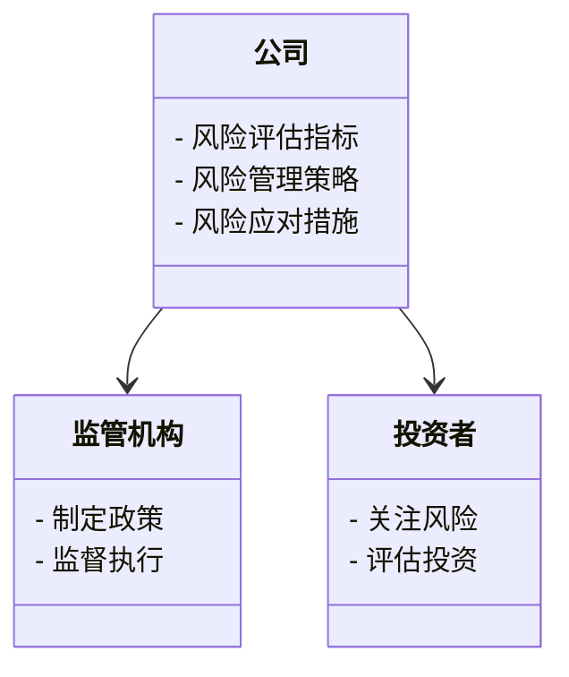

                 


# 彼得·林奇如何看待公司的气候变化风险管理

## 关键词：彼得·林奇、气候变化风险管理、投资策略、企业责任、风险管理框架

## 摘要：本文从彼得·林奇的投资视角出发，探讨气候变化风险管理对公司的重要性，分析其核心概念和算法原理，并结合实际案例，展示如何构建有效的风险管理框架。

---

# 第一部分：背景介绍

## 第1章：气候变化风险管理的背景与重要性

### 1.1 气候变化的定义与影响

- **1.1.1 气候变化的科学定义**
  气候变化是指长期统计学显著的气候变化趋势，主要由人类活动引起的温室气体排放导致。这种变化影响全球气候系统，引发极端天气事件和生态系统变化。

- **1.1.2 气候变化对全球经济和社会的影响**
  气候变化导致自然灾害增多、资源分配不均，影响社会稳定和经济发展。企业面临供应链中断、运营成本增加等风险。

- **1.1.3 气候变化对企业风险管理的挑战**
  企业必须评估气候变化带来的物理风险（如极端天气）和转型风险（如政策变化），并制定应对策略。

### 1.2 公司气候变化风险管理的必要性

- **1.2.1 气候变化对企业运营的风险**
  气候变化可能导致生产中断、原材料价格上涨，影响企业的盈利能力和稳定性。

- **1.2.2 监管政策对气候变化风险管理的要求**
  各国政府和国际组织出台多项政策，要求企业披露碳排放数据，推动向低碳经济转型。

- **1.2.3 企业社会责任与可持续发展的关联**
  企业需将气候变化风险管理纳入企业战略，以履行社会责任，提升品牌形象。

---

## 第2章：彼得·林奇与投资风险管理

### 2.1 彼得·林奇投资理念概述

- **2.1.1 彼得·林奇的投资风格**
  彼得·林奇以价值投资闻名，注重基本面分析和长期投资，强调风险控制和分散投资。

- **2.1.2 彼得·林奇对风险管理的重视**
  他认为风险管理是投资成功的关键，强调识别和规避高风险投资。

- **2.1.3 彼得·林奇的经典投资案例分析**
  如投资高露洁、喜诗糖果，通过深入分析企业基本面，规避市场风险。

### 2.2 彼得·林奇视角下的气候变化风险管理

- **2.2.1 气候变化对投资风险的影响**
  气候变化可能导致企业盈利下降、政策变化，影响投资价值。

- **2.2.2 彼得·林奇对气候变化风险的评估方法**
  他可能通过分析企业碳排放数据、政策依赖度和行业风险，评估气候变化对投资的影响。

- **2.2.3 气候变化对行业和企业的影响分析**
  高碳行业（如化石能源）面临转型风险，低碳行业（如可再生能源）可能受益。

---

# 第二部分：核心概念与联系

## 第3章：气候变化风险管理的核心概念

### 3.1 气候变化风险管理的定义与目标

- **3.1.1 气候变化风险管理的定义**
  通过识别、评估和应对气候变化相关风险，确保企业稳健发展。

- **3.1.2 气候变化风险管理的目标**
  最小化物理和转型风险，抓住可持续发展的机会，提升企业韧性。

- **3.1.3 气候变化风险管理的边界与外延**
  包括企业自身运营、供应链和产品生命周期，涉及内部政策和外部监管。

### 3.2 核心概念的属性特征对比

| 概念       | 属性特征                           |
|------------|------------------------------------|
| 气候变化风险 | 不确定性高、影响范围广、时间跨度长 |
| 企业风险管理能力 | 可量化、可改进、依赖企业资源和文化 |

---

## 第4章：气候变化风险管理的实体关系架构

```mermaid
er
  actor: 公司
  actor: 监管机构
  actor: 投资者
  entity: 气候变化风险
  entity: 企业风险管理策略
  entity: 气候变化影响
  entity: 风险评估指标
  entity: 风险应对措施
  relationship: 公司 - 实施 - 企业风险管理策略
  relationship: 气候变化风险 - 影响 - 气候变化影响
  relationship: 投资者 - 关注 - 风险评估指标
  relationship: 监管机构 - 制定 - 风险应对措施
```

---

## 第5章：气候变化风险管理的算法原理

### 5.1 算法原理概述

- **情景分析法**：评估不同气候变化情景对企业的影响。
- **蒙特卡洛模拟**：量化风险概率和影响程度。

### 5.2 情景分析法的实现

```mermaid
graph TD
    A[开始] -> B[选择情景] -> C[评估影响] -> D[制定策略] -> E[结束]
```

### 5.3 蒙特卡洛模拟的实现

```python
import numpy as np
import matplotlib.pyplot as plt

# 模拟气候变化风险
np.random.seed(42)
n = 10000
data = np.random.normal(0, 1, n)
plt.hist(data, bins=30)
plt.show()
```

---

## 第6章：系统架构设计

### 6.1 系统功能设计



### 6.2 系统架构设计


---

## 第7章：项目实战

### 7.1 环境安装

- 安装Python和相关库（numpy, pandas, matplotlib）。

### 7.2 核心代码实现

```python
import pandas as pd

# 示例：计算企业碳排放强度
data = {'行业': ['能源', '制造', '交通'], '碳排放强度': [1.5, 1.2, 0.8]}
df = pd.DataFrame(data)
print(df)
```

### 7.3 案例分析

- 分析某制造企业的碳排放数据，制定减排策略。

### 7.4 结果解读

- 提供数据可视化和策略建议，帮助企业在气候变化中保持竞争力。

---

## 第8章：总结与展望

### 8.1 总结

- 彼得·林奇的投资理念强调风险管理，气候变化风险管理对企业至关重要。
- 通过科学的方法和工具，企业可以有效应对气候变化带来的挑战。

### 8.2 展望

- 未来，气候变化风险管理将更加重要，企业需持续改进和创新。
- 结合技术进步和政策变化，企业可以在应对气候变化中找到新的发展机遇。

---

## 作者：AI天才研究院/AI Genius Institute & 禅与计算机程序设计艺术 /Zen And The Art of Computer Programming

