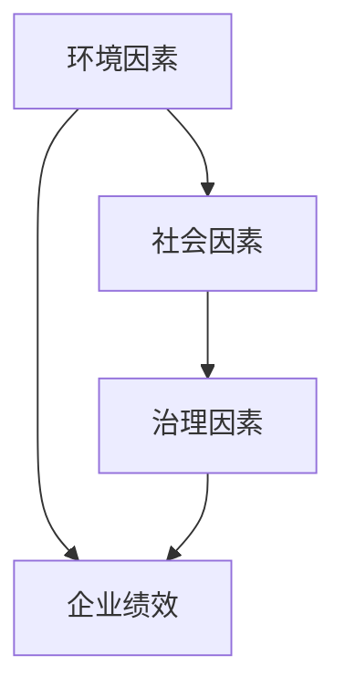

                 


# 彼得林奇如何看待公司的环境可持续性策略

> 关键词：彼得·林奇、环境可持续性、投资策略、ESG框架、企业价值

> 摘要：本文从彼得·林奇的投资理念出发，分析了环境可持续性策略对公司价值的影响。通过结合层次分析法（AHP）和系统设计方法，探讨了企业在环境可持续性方面的实践路径。文章还通过案例分析，展示了如何将环境可持续性策略纳入投资决策，并提出了具体的实施建议。

---

## 第1章: 可持续发展与投资背景概述

### 1.1 可持续发展的重要性

#### 1.1.1 环境问题对企业的影响

随着全球气候变化和环境问题的加剧，企业面临的环境风险也在增加。例如，过度依赖化石燃料的企业可能面临政策监管和市场声誉的双重压力，这些都会直接影响企业的财务表现。

#### 1.1.2 可持续发展对企业价值的提升

可持续发展不仅是社会责任，更是企业长期发展的基石。通过优化资源利用和减少环境影响，企业可以降低成本，提高效率，同时增强品牌价值和市场竞争力。

#### 1.1.3 投资者关注可持续发展的原因

投资者越来越关注企业的环境表现，因为这直接关系到投资风险和收益。例如，环境表现不佳的企业可能面临更高的监管成本和市场波动风险。

---

### 1.2 彼得·林奇的投资理念

#### 1.2.1 彼得·林奇的核心投资策略

彼得·林奇以其长期投资和基本面分析著称。他认为，投资成功的的关键在于选择那些具有持续竞争优势和良好治理结构的企业。

#### 1.2.2 可持续性在投资决策中的地位

林奇认为，企业的环境策略是其长期竞争优势的重要组成部分。他强调，环境风险可能成为企业未来业绩的最大威胁之一。

#### 1.2.3 彼得·林奇对环境风险的看法

林奇认为，企业应积极应对环境挑战，通过技术创新和管理优化降低环境风险。他还指出，环境表现优异的企业通常具有更强的抗风险能力和更高的股东回报。

---

## 第2章: 公司环境可持续性策略的核心概念

### 2.1 环境可持续性策略的定义

#### 2.1.1 环境可持续性的基本概念

环境可持续性是指企业在满足当前需求的同时，不破坏未来资源利用的能力。这包括减少碳排放、优化资源利用和推动绿色技术创新。

#### 2.1.2 可持续性策略的组成部分

可持续性策略通常包括环境保护、社会责任和公司治理三个方面。其中，环境保护是核心，社会责任是关键，治理是保障。

#### 2.1.3 环境策略与企业绩效的关系

良好的环境策略可以提升企业的品牌形象，降低运营成本，并增强市场竞争力。这些因素都会直接或间接地影响企业的财务表现。

---

### 2.2 核心概念与联系

#### 2.2.1 环境、社会和治理（ESG）框架

ESG框架将环境（E）、社会（S）和治理（G）因素整合到投资决策中。E包括碳排放和资源利用，S包括劳工权益和社区参与，G包括董事会结构和内部控制。

#### 2.2.2 ESG与企业价值的关联

研究表明，ESG表现优异的企业通常具有更高的股东回报和更低的下行风险。这是因为ESG因素可以帮助企业规避环境和社会风险，同时提升治理效率。

#### 2.2.3 ESG评价体系的实体关系图



---

## 第3章: 环境可持续性策略的评估方法

### 3.1 环境影响评估模型

#### 3.1.1 层次分析法（AHP）在环境评估中的应用

层次分析法是一种定性与定量相结合的决策分析方法。它可以帮助投资者确定环境影响的关键因素，并量化这些因素的权重。

#### 3.1.2 环境影响的数学模型

$$ I = \sum_{i=1}^{n} w_i x_i $$
其中，\( w_i \) 是第 \( i \) 个指标的权重，\( x_i \) 是第 \( i \) 个指标的值。

#### 3.1.3 AHP评估流程


---

### 3.2 可持续性评分算法

#### 3.2.1 环境评分计算流程


---

## 第4章: 环境策略与企业价值的数学模型

### 4.1 环境表现与企业价值的关系

#### 4.1.1 环境表现对企业价值的影响

良好的环境表现通常意味着更低的环境风险和更高的市场认可度，从而提升企业价值。

#### 4.1.2 环境风险的数学模型

$$ R = \alpha E + \beta S + \gamma G $$
其中，\( E \) 是环境因素，\( S \) 是社会因素，\( G \) 是治理因素，\( \alpha, \beta, \gamma \) 是对应的权重。

---

## 第5章: 系统分析与架构设计方案

### 5.1 系统功能设计

#### 5.1.1 问题场景介绍

企业需要通过系统化的方法评估环境策略，并将其纳入投资决策。

#### 5.1.2 系统功能设计

系统需要具备数据收集、评估模型和投资决策模块。

#### 5.1.3 系统架构设计


---

## 第6章: 项目实战

### 6.1 环境安装

安装必要的数据分析工具和建模软件。

### 6.2 系统核心实现源代码

```python
def calculate_environment_score(data, weights):
    return sum(w * d for w, d in zip(weights, data))
```

### 6.3 代码应用解读与分析

通过代码实现环境评分的计算，并展示如何将评分纳入投资决策。

---

## 第7章: 总结与展望

### 7.1 彼得·林奇的观点总结

林奇认为，环境可持续性是企业长期竞争优势的重要组成部分。

### 7.2 投资建议

投资者应关注企业的环境表现，并将其作为投资决策的重要依据。

### 7.3 注意事项

环境策略的实施需要企业内外部的协同努力，同时需要定期评估和优化。

### 7.4 未来趋势

随着技术进步和政策支持，环境可持续性将成为企业核心竞争力的关键因素。

---

## 小结

本文从彼得·林奇的投资理念出发，分析了环境可持续性策略对公司价值的影响。通过结合层次分析法（AHP）和系统设计方法，探讨了企业在环境可持续性方面的实践路径。文章还通过案例分析，展示了如何将环境可持续性策略纳入投资决策，并提出了具体的实施建议。

---

作者：AI天才研究院/AI Genius Institute & 禅与计算机程序设计艺术 /Zen And The Art of Computer Programming

