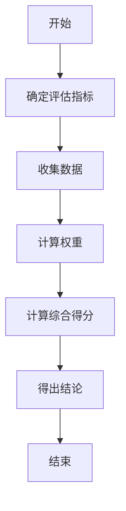
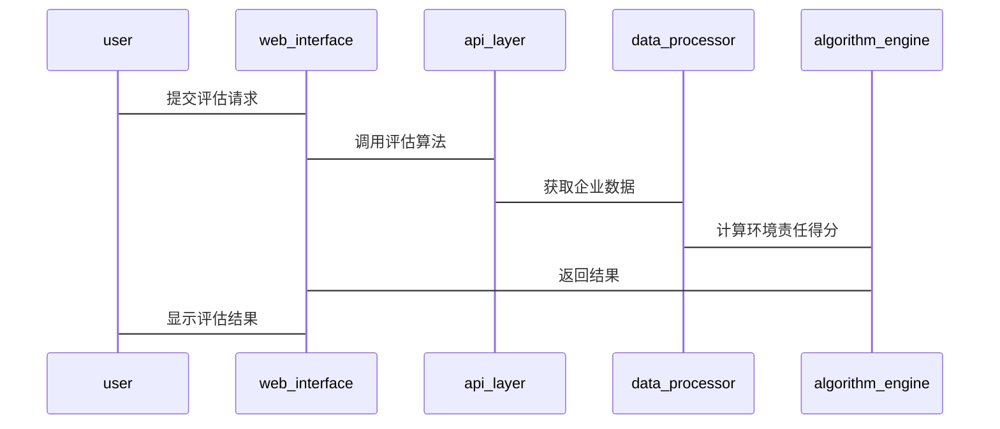

                 


# 彼得林奇如何看待公司的环境责任

## 关键词：公司环境责任，彼得·林奇，投资理念，可持续发展，企业社会责任

## 摘要：  
本文深入探讨了彼得·林奇对公司在环境责任方面的看法，结合其独特的投资哲学，分析了环境责任对企业可持续发展的重要性。通过系统的方法，文章详细阐述了环境责任的核心概念、评估模型、系统设计和实际案例，为投资者和企业管理者提供了实用的见解和策略。

---

# 目录

## 第1章: 公司环境责任的背景与重要性

### 1.1 环境责任的定义与内涵  
- **环境责任的定义**：企业在经营活动中对环境造成的影响所应承担的责任。  
- **核心内涵**：减少污染、节约资源、推动可持续发展。  
- **边界与外延**：环境责任不仅包括企业直接排放的污染物，还涉及供应链和产品生命周期的环境影响。

### 1.2 彼得·林奇的投资理念与环境责任  
- **彼得·林奇的投资哲学**：注重企业基本面分析，寻找具有长期增长潜力的企业。  
- **环境责任在投资决策中的重要性**：企业对环境的责任体现了其长期发展的稳定性。  
- **彼得·林奇的独特见解**：环境责任是企业核心竞争力的一部分，忽视环境责任可能导致长期风险。

### 1.3 环境责任与企业可持续发展的关系  
- **环境责任对企业可持续发展的促进作用**：通过减少环境影响，企业降低运营成本，增强社会声誉。  
- **环境责任与企业长期价值的关系**：环境责任良好的企业更可能获得长期投资回报。  
- **环境责任对企业社会责任的影响**：环境责任是企业社会责任的重要组成部分，提升企业道德形象。

---

## 第2章: 环境责任的核心概念与联系

### 2.1 环境责任的核心概念原理  
- **构成要素**：包括排放、资源消耗、环境管理、信息披露。  
- **关键属性**：可测量性、可操作性、可监督性。  
- **实现机制**：通过内部政策、技术改进和外部合作。

### 2.2 环境责任与企业其他责任的对比分析  
- **环境责任与经济责任的对比**：环境责任强调外部性，经济责任强调内部收益。  
- **环境责任与法律责任的对比**：环境责任是道德责任，法律责任是法律约束。  
- **环境责任与道德责任的对比**：环境责任更具体，道德责任更广泛。

### 2.3 环境责任的ER实体关系图  
```mermaid
erDiagram
    company {
        id
        name
        industry
        location
    }
    environment {
        id
        issue
        impact
    }
    responsibility {
        id
        type
        level
    }
    company --> responsibility : 承担
    environment --> responsibility : 影响
```

---

## 第3章: 环境责任评估的算法原理

### 3.1 环境责任评估的数学模型  
- **环境影响评估的指标体系**：包括碳排放、能源消耗、废弃物处理等。  
- **层次分析法（AHP）**：用于评估环境影响的关键因素权重。  
  $$ AHP模型：W = (w_1, w_2, ..., w_n) $$
- **模糊综合评价法**：考虑因素的模糊性，综合评估企业环境责任。  
  $$ 模糊综合评价：R = \sum_{i=1}^{n} w_i \cdot r_i $$

### 3.2 环境责任评估的流程  


---

## 第4章: 环境责任系统分析与架构设计

### 4.1 系统分析  
- **问题场景**：企业需要评估自身环境责任，优化资源配置。  
- **系统功能设计**：功能模块包括数据采集、评估计算、结果展示。  
- **系统架构设计**：采用分层架构，前端展示结果，后端处理数据。

### 4.2 系统架构设计  


### 4.3 接口设计  
- **数据接口**：提供API用于数据采集和传输。  
- **用户接口**：直观的仪表盘展示评估结果。

### 4.4 交互流程  


---

## 第5章: 项目实战——环境责任评估案例

### 5.1 项目背景  
- **行业选择**：制造业，碳排放问题突出。  
- **公司选择**：某汽车制造公司，评估其生产过程的环境责任。

### 5.2 项目实施  
- **数据收集**：收集过去三年的能源消耗、碳排放数据。  
- **模型应用**：使用层次分析法计算各因素权重。  
- **结果分析**：发现能源消耗是主要影响因素。

### 5.3 案例总结  
- **优化建议**：引入清洁能源，优化生产流程。  
- **投资建议**：优先投资环境责任表现良好的企业。

---

## 第6章: 环境责任的最佳实践与总结

### 6.1 彼得·林奇的观点总结  
- 环境责任是企业长期价值的重要组成部分。  
- 投资者应关注企业环境责任的表现，作为投资决策的重要依据。

### 6.2 最佳实践 tips  
- **数据驱动**：使用定量方法评估环境责任。  
- **长期视角**：关注企业的可持续发展能力。  
- **透明化**：推动企业公开环境责任信息。

### 6.3 未来展望  
- **技术进步**：AI和大数据将提升环境责任评估的准确性。  
- **政策引导**：政府政策将推动企业加强环境责任。  
- **全球合作**：环境责任需要全球企业共同承担。

---

## 结语  
公司环境责任不仅是企业道德的要求，更是企业长期发展的关键因素。彼得·林奇的投资理念提醒我们，环境责任良好的企业更可能在长期竞争中胜出。通过系统的方法和最佳实践，企业可以在履行环境责任的同时实现可持续发展。

---

## 作者：AI天才研究院 & 禅与计算机程序设计艺术

