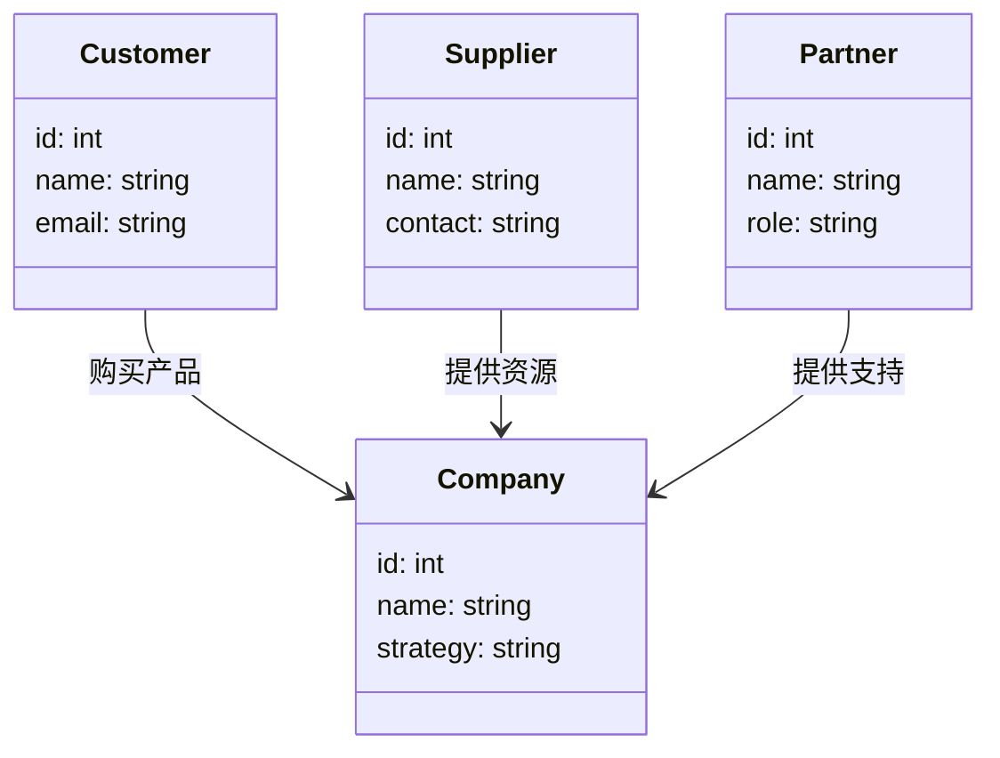
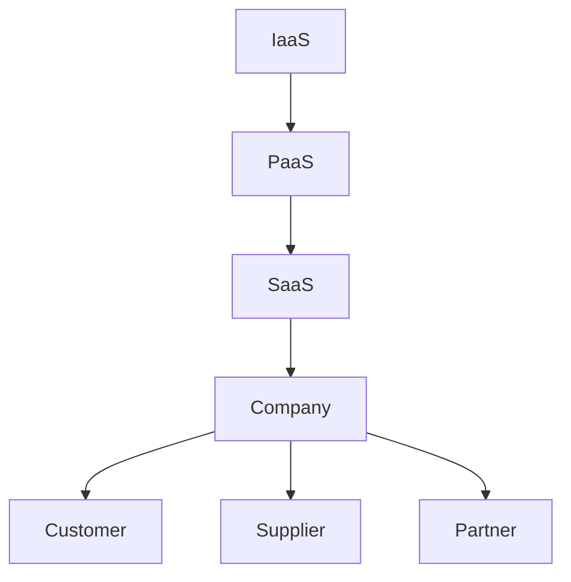

                 


# 彼得林奇如何看待公司的生态系统构建能力

> **关键词**：彼得·林奇，公司生态系统，构建能力，投资策略，风险管理，系统架构  
> **摘要**：本文深入探讨了彼得·林奇在公司生态系统构建能力方面的见解，从战略规划、组织架构到技术实现，结合实际案例和数学模型，分析其核心原理和方法论，最后总结其对现代企业的启示与应用。

---

## 第一部分：引言

### 1.1 彼得·林奇与公司生态系统构建能力

#### 1.1.1 彼得·林奇的背景与投资理念
彼得·林奇（Peter Lynch）是美国著名的投资经理人，被誉为“最伟大的股票投资人之一”。他在管理麦哲伦基金期间，创造了年均29%的复合回报率，其投资理念以“价值发现”为核心，注重基本面分析和长期投资。林奇的成功不仅在于他的投资策略，更在于他对公司生态系统构建能力的深刻理解。

#### 1.1.2 什么是公司生态系统构建能力
公司生态系统构建能力是指企业在市场中整合内外部资源、建立协同效应、创造持续价值的能力。它不仅包括企业的内部管理，还包括与供应商、客户、合作伙伴等外部利益相关者的互动关系。林奇认为，一个强大的生态系统能够为企业提供竞争优势，增强抗风险能力。

#### 1.1.3 本书的目的与意义
本文旨在通过分析彼得·林奇的投资策略和管理实践，揭示其在公司生态系统构建能力方面的独特见解。通过对林奇的成功案例的深入剖析，总结其方法论，并为企业提供可操作的指导。

---

## 第二部分：公司生态系统构建的背景与概念

### 2.1 公司生态系统构建的背景

#### 2.1.1 当前商业环境的变化
随着全球化和数字化的推进，企业的生存环境变得复杂多变。传统的企业边界逐渐模糊，企业需要与外部生态系统进行深度互动，才能在竞争中立于不败之地。

#### 2.1.2 数字化转型与生态系统的重要性
数字化转型要求企业不仅仅是优化内部流程，还需要构建一个开放、灵活的生态系统，以快速响应市场变化和客户需求。

#### 2.1.3 生态系统构建的必要性
在数字经济时代，单靠企业自身的能力难以满足市场需求，构建生态系统能够整合外部资源，形成协同效应，提高企业的竞争力。

### 2.2 公司生态系统的核心概念

#### 2.2.1 生态系统的定义与特征
生态系统是由多个主体（企业、客户、供应商、合作伙伴等）组成的复杂网络，通过协同合作实现价值共创。其特征包括开放性、动态性和互惠性。

#### 2.2.2 生态系统构建的核心要素
- **战略规划**：明确生态系统的定位和目标。
- **组织架构**：建立支持生态系统构建的组织结构。
- **技术能力**：提供技术平台支持生态系统运行。
- **数据与信息**：实现数据共享与价值挖掘。
- **文化与价值观**：建立共同的价值观和信任机制。

#### 2.2.3 生态系统与公司战略的关系
生态系统是公司战略的重要组成部分，通过生态系统构建，企业能够实现战略目标，增强核心竞争力。

### 2.3 生态系统构建的边界与外延

#### 2.3.1 生态系统的边界
生态系统的边界并非固定，它可以根据市场需求和企业发展阶段进行调整。

#### 2.3.2 生态系统构建的外延
生态系统构建不仅包括企业内部的资源整合，还包括与外部合作伙伴的协同创新。

#### 2.3.3 生态系统与外部环境的互动
企业生态系统与外部环境的互动是双向的，企业通过与外部资源的合作，不断优化自身的生态系统，同时外部环境的变化也会影响生态系统的构建。

---

## 第三部分：公司生态系统构建的核心要素

### 3.1 核心要素分析

#### 3.1.1 战略规划
战略规划是生态系统构建的起点，明确企业的长期目标和实现路径。

#### 3.1.2 组织架构
组织架构是生态系统构建的组织保障，需要建立跨部门的协作机制。

#### 3.1.3 技术能力
技术能力是生态系统构建的技术支撑，包括平台开发、数据处理等。

#### 3.1.4 数据与信息
数据与信息是生态系统构建的核心资源，通过数据共享实现价值共创。

#### 3.1.5 文化与价值观
文化与价值观是生态系统构建的精神内核，建立信任机制和共赢文化。

### 3.2 核心要素的对比分析

#### 3.2.1 核心要素的属性特征对比（表格形式）

| 核心要素 | 战略规划 | 组织架构 | 技术能力 | 数据与信息 | 文化与价值观 |
|----------|----------|----------|----------|------------|-------------|
| 属性     | 战略性   | 组织性   | 技术性   | 资源性     | 文化性       |
| 特征     | 长期性   | 结构性   | 可扩展性 | 共享性     | 信任性       |

#### 3.2.2 核心要素的ER实体关系图（Mermaid流程图）

```mermaid
erDiagram
    customer[客户] {
        +id: int
        +name: string
        +email: string
    }
    supplier[供应商] {
        +id: int
        +name: string
        +contact: string
    }
    partner[合作伙伴] {
        +id: int
        +name: string
        +role: string
    }
    company[公司] {
        +id: int
        +name: string
        +strategy: string
    }
    customer -- supplier: 购买产品
    customer -- partner: 获取服务
    supplier -- company: 提供资源
    partner -- company: 提供支持
```

---

## 第四部分：公司生态系统构建的算法原理

### 4.1 生态系统构建的算法概述

#### 4.1.1 生态系统构建的算法分类
常见的生态系统构建算法包括基于协同过滤的推荐算法、基于图论的网络分析算法等。

#### 4.1.2 算法的核心思想
通过算法对生态系统中的主体关系进行建模和优化，实现资源的最优配置和协同效应的最大化。

### 4.2 生态系统构建的数学模型

#### 4.2.1 数学模型的定义
数学模型是对生态系统构建过程的数学描述，用于分析主体之间的关系和互动。

#### 4.2.2 数学模型的公式推导
$$ R = \sum_{i=1}^{n} w_i x_i $$
其中，$R$ 表示生态系统中的协同效应，$w_i$ 表示主体 $i$ 的权重，$x_i$ 表示主体 $i$ 的贡献。

#### 4.2.3 数学模型的举例说明
例如，假设一个生态系统由两个主体 $A$ 和 $B$ 组成，$A$ 的贡献为 $x_1$，权重为 $w_1$，$B$ 的贡献为 $x_2$，权重为 $w_2$，则协同效应 $R$ 为：
$$ R = w_1 x_1 + w_2 x_2 $$

### 4.3 算法实现与代码分析

#### 4.3.1 算法实现的步骤
1. 数据采集与预处理
2. 模型训练与优化
3. 算法实现与测试

#### 4.3.2 Python源代码实现

```python
import numpy as np

def ecosystem_model(weights, contributions):
    return np.dot(weights, contributions)

weights = np.array([0.5, 0.5])
contributions = np.array([1, 1])
result = ecosystem_model(weights, contributions)
print(result)
```

---

## 第五部分：公司生态系统构建的系统分析与架构设计

### 5.1 系统功能设计

#### 5.1.1 领域模型（Mermaid类图）



### 5.2 系统架构设计

#### 5.2.1 系统架构图（Mermaid架构图）



---

## 第六部分：项目实战

### 6.1 环境安装

#### 6.1.1 环境要求
- Python 3.8+
- NumPy库

#### 6.1.2 安装步骤
```bash
pip install numpy
```

### 6.2 系统核心实现源代码

#### 6.2.1 核心代码实现

```python
import numpy as np

def calculate_synergy(weights, contributions):
    return np.dot(weights, contributions)

weights = np.array([0.3, 0.4, 0.3])
contributions = np.array([2, 3, 1])
synergy = calculate_synergy(weights, contributions)
print(f"Synergy Score: {synergy}")
```

---

## 第七部分：总结与展望

### 7.1 最佳实践 tips

#### 7.1.1 系统架构设计
- 确保系统的可扩展性和灵活性
- 建立清晰的接口规范

#### 7.1.2 项目管理
- 定期评估项目进展
- 及时调整策略

### 7.2 项目小结
通过本文的分析和实践，我们深入探讨了彼得·林奇在公司生态系统构建能力方面的独特见解，并结合实际案例和数学模型，总结了其方法论和实现路径。

### 7.3 未来展望
随着技术的不断发展，公司生态系统构建能力将更加重要，未来的研究可以进一步探索人工智能和大数据在生态系统构建中的应用。

---

## 作者：AI天才研究院/AI Genius Institute & 禅与计算机程序设计艺术 /Zen And The Art of Computer Programming

