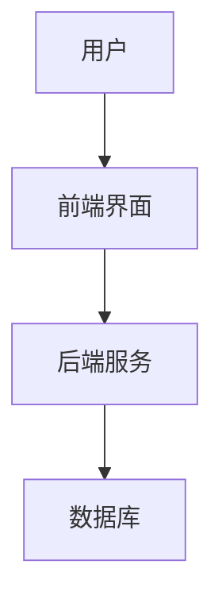
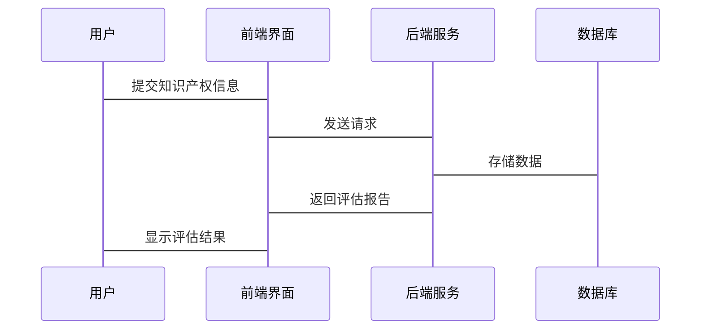

                 


# 彼得林奇如何看待公司的知识产权战略

> 关键词：彼得·林奇，知识产权，公司战略，专利分析，技术评估

> 摘要：本文探讨了彼得·林奇在分析公司知识产权战略时的独特视角，包括知识产权的基本概念、核心要素、评估方法和实际应用。通过详细分析，揭示了知识产权在企业价值中的重要性，以及如何通过战略规划和风险控制来提升企业竞争力。

---

# 第一部分：知识产权的基本概念与重要性

## 第1章：知识产权的基本概念

### 1.1 知识产权的定义与分类

#### 1.1.1 什么是知识产权

知识产权（Intellectual Property，简称IP）是指人们通过智力活动创造的成果所享有的权利。它包括专利权、商标权、版权、商业秘密等多种形式，是企业在创新过程中形成的无形资产。

**关键属性：**
- **独占性**：知识产权具有排他性，未经授权他人不得使用。
- **期限性**：大多数知识产权有时间限制，如专利权通常为20年，版权则为作者 lifetime 加上50年。
- **可转让性**：知识产权可以通过许可、转让等方式进行商业利用。

#### 1.1.2 知识产权的主要分类

| 类型 | 描述 | 保护范围 |
|------|------|----------|
| 专利权 | 保护发明的实用新型和外观设计 | 发明的具体实施方式 |
| 商标权 | 保护商品或服务的标识 | 商标名称、符号、标志 |
| 版权 | 保护文学、艺术和科学作品 | 文字、音乐、图像等作品 |
| 商业秘密 | 保护未公开的商业信息 | 技术诀窍、客户名单 |

#### 1.1.3 知识产权的核心要素

- **创新性**：知识产权的核心在于创新，必须具备新颖性和实用性。
- **法律保护**：通过法律手段确保知识产权的安全性和可执行性。
- **商业价值**：知识产权不仅是技术成果的体现，更是企业市场竞争的核心武器。

### 1.2 知识产权在现代商业中的作用

#### 1.2.1 知识产权对企业价值的影响

- 知识产权是企业的核心资产，直接影响企业的市场地位和盈利能力。
- 通过知识产权保护，企业可以有效防止竞争对手的模仿，保持技术领先。
- 知识产权的经济价值体现在其市场售价、许可收入和法律维权等方面。

#### 1.2.2 知识产权在市场竞争中的地位

- 知识产权是企业参与全球竞争的重要手段。
- 在高科技行业，知识产权的数量和质量直接决定了企业的竞争力。
- 通过知识产权布局，企业可以有效应对国际市场的反垄断和专利纠纷。

#### 1.2.3 知识产权与企业创新的关系

- 创新是知识产权的源泉，而知识产权则是创新的保护伞。
- 知识产权激励企业不断投入研发，推动技术进步和产品升级。
- 通过知识产权战略，企业可以将创新成果转化为实际收益。

### 1.3 彼得·林奇对知识产权战略的重视

#### 1.3.1 彼得·林奇的背景与投资理念

彼得·林奇是美国著名的投资经理人，以其独特的投资策略和对基本面的深入分析而闻名。他认为，企业的核心竞争力是其能否持续创新，而知识产权正是这种能力的直接体现。

**彼得·林奇的投资理念：**
- 专注于企业的基本面分析，特别是其商业模式和竞争优势。
- 知识产权是企业长期竞争力的重要组成部分，必须纳入投资分析的核心。

#### 1.3.2 知识产权战略在彼得·林奇投资中的重要性

- 彼得·林奇认为，知识产权是企业抵御竞争的核心武器。
- 通过分析企业的知识产权布局，可以评估其未来的市场潜力和盈利能力。
- 知识产权的数量和质量是企业创新能力和市场地位的重要指标。

#### 1.3.3 彼得·林奇如何评估知识产权的价值

彼得·林奇在评估知识产权价值时，主要关注以下几个方面：

1. **技术创新性**：知识产权是否具有显著的技术创新，是否能够带来显著的成本优势或性能提升。
2. **市场应用性**：知识产权是否具有广泛的市场应用前景，能否在实际生产中创造价值。
3. **法律保护力度**：知识产权的法律保护是否完善，是否存在被侵权的风险。
4. **商业可行性**：知识产权是否具备商业可行性，能否在短期内转化为实际收益。

---

## 第2章：知识产权战略的核心要素

### 2.1 知识产权的法律保护

#### 2.1.1 专利权的保护范围

专利权主要保护发明的实用性，包括发明专利、实用新型专利和外观设计专利三种类型。发明专利是最强的保护形式，通常涉及技术方案的核心创新。

**专利权的保护范围：**
- 发明专利：保护技术方案的核心创新。
- 实用新型专利：保护产品的形状、构造或其结合所作出的实用改进。
- 外观设计专利：保护产品的装饰性设计。

#### 2.1.2 商标权的注册与保护

商标权是企业区分商品或服务来源的重要标志。通过注册商标，企业可以有效防止他人仿冒，提升品牌知名度。

**商标权的保护范围：**
- 注册商标的所有者可以禁止他人在相同或类似商品上使用相同或近似的商标。
- 商标权的保护期限为10年，可无限续展。

#### 2.1.3 版权的保护与应用

版权主要保护文学、艺术和科学作品的原创性。在商业应用中，版权常用于保护软件代码、文学作品、音乐作品等。

**版权的保护范围：**
- 保护作品的原创性，禁止他人未经授权的复制、分发和使用。
- 版权的保护期限为作者 lifetime 加上50年。

### 2.2 知识产权的商业价值评估

#### 2.2.1 知识产权的经济价值分析

- 知识产权的经济价值通常体现在其市场售价、许可收入和侵权赔偿等方面。
- 评估知识产权的经济价值需要考虑其技术创新性、市场应用前景和法律保护力度。

#### 2.2.2 知识产权的市场竞争力评估

- 通过分析市场上类似知识产权的数量和质量，评估企业的竞争优势。
- 竞争对手的专利布局、商标注册和版权登记情况也是重要的评估指标。

#### 2.2.3 知识产权的未来收益预测

- 基于当前的市场环境和企业战略，预测知识产权在未来可能带来的收益。
- 结合行业发展趋势和技术创新周期，评估知识产权的生命周期和潜在价值。

### 2.3 知识产权的战略管理

#### 2.3.1 知识产权的战略规划

- 制定明确的知识产权战略目标，如技术创新、市场扩张和法律保护。
- 结合企业的长期发展规划，制定知识产权的申请、维护和运营计划。

#### 2.3.2 知识产权的风险管理

- 评估知识产权可能面临的风险，如侵权风险、法律纠纷和市场变化。
- 建立完善的知识产权风险管理机制，制定应急预案和应对策略。

#### 2.3.3 知识产权的全球化布局

- 根据企业的国际化战略，制定全球范围内的知识产权布局。
- 在不同国家和地区申请专利、注册商标，确保全球市场中的法律保护。

---

## 第3章：彼得·林奇的知识产权分析框架

### 3.1 彼得·林奇的公司分析方法

#### 3.1.1 彼得·林奇的基本分析框架

彼得·林奇在分析公司时，通常关注以下几个方面：

1. **财务状况**：包括收入、利润、现金流等财务指标。
2. **行业地位**：公司在行业中的市场份额和竞争地位。
3. **管理团队**：管理团队的创新能力、战略眼光和执行能力。
4. **技术创新**：公司是否有持续的技术创新能力和知识产权布局。

#### 3.1.2 彼得·林奇的财务指标分析

- **市盈率**：评估公司的估值是否合理。
- **市净率**：评估公司的资产价值是否被市场合理反映。
- **ROE**：评估公司的盈利能力。

#### 3.1.3 彼得·林奇的行业分析方法

- 分析行业的发展趋势和周期性。
- 评估公司在行业中的竞争优势和潜在风险。

### 3.2 彼得·林奇的知识产权分析框架

#### 3.2.1 知识产权的数量与质量

- 分析公司拥有的知识产权数量和质量，评估其技术创新能力。
- 对比竞争对手的知识产权布局，判断公司的市场竞争优势。

#### 3.2.2 知识产权的市场应用前景

- 评估知识产权的市场应用前景，判断其商业价值。
- 分析知识产权是否具备实际的市场需求和技术可行性。

#### 3.2.3 知识产权的法律保护力度

- 检查知识产权的法律保护是否完善，评估其在市场中的法律安全性。
- 分析知识产权的保护范围和期限，判断其长期价值。

### 3.3 彼得·林奇的知识产权投资策略

#### 3.3.1 投资具有强大技术创新能力的公司

彼得·林奇倾向于投资那些能够持续创新并拥有强大知识产权布局的公司，这些公司在市场上具备更强的竞争力和抗风险能力。

#### 3.3.2 避免投资知识产权薄弱的公司

对于那些知识产权数量少、质量低或保护不力的公司，彼得·林奇认为其缺乏长期的市场竞争力，投资风险较大。

#### 3.3.3 关注知识产权的市场前景

彼得·林奇特别关注知识产权的市场应用前景，认为只有具备良好市场前景的知识产权才能为企业带来长期收益。

---

## 第4章：知识产权的核心要素与联系

### 4.1 知识产权的核心要素

#### 4.1.1 技术创新性

技术创新性是知识产权的核心要素，决定其价值和市场竞争力。

#### 4.1.2 市场需求

知识产权必须具备明确的市场需求，才能实现其商业价值。

#### 4.1.3 法律保护

完善的法律保护是知识产权价值实现的重要保障。

### 4.2 知识产权之间的联系

#### 4.2.1 专利与商标的关系

- 专利保护技术方案，商标保护商品标识。
- 两者相辅相成，共同维护企业的市场竞争优势。

#### 4.2.2 商标与版权的关系

- 商标保护商品标识，版权保护作品的原创性。
- 在企业品牌建设和文化传播中，两者各有其独特的作用。

#### 4.2.3 专利与版权的关系

- 专利保护技术方案，版权保护软件代码和文学作品。
- 在软件行业，专利和版权的保护对象不同，但都对企业创新至关重要。

---

## 第5章：算法原理讲解

### 5.1 知识产权评估的数学模型

#### 5.1.1 知识产权价值评估模型

$$
\text{知识产权价值} = f(\text{技术创新性, 市场需求, 法律保护})
$$

#### 5.1.2 专利价值评估公式

$$
V = \sum_{i=1}^{n} w_i \cdot f_i
$$

其中：
- \( w_i \) 是第 \( i \) 个因素的权重。
- \( f_i \) 是第 \( i \) 个因素的评估值。

### 5.2 算法实现

#### 5.2.1 环境安装

- 需要安装Python和相关数据分析库（如Pandas、NumPy）。
- 安装Mermaid图生成工具。

#### 5.2.2 核心代码实现

```python
import pandas as pd
import numpy as np

def evaluate IntellectualProperty(技术创新性, 市场需求, 法律保护):
    权重 = [0.4, 0.3, 0.3]
    评估值 = [技术创新性, 市场需求, 法律保护]
    总价值 = np.dot(权重, 评估值)
    return 总价值

技术创新性 = 0.8
市场需求 = 0.7
法律保护 = 0.6

知识产权价值 = evaluate IntellectualProperty(技术创新性, 市场需求, 法律保护)
print("知识产权价值 =", 知识产权价值)
```

#### 5.2.3 算法原理分析

- 通过加权评分系统，综合评估知识产权的三个核心要素。
- 权重反映了各要素对知识产权价值的影响程度。

---

## 第6章：系统分析与架构设计方案

### 6.1 系统分析

#### 6.1.1 知识产权管理系统的需求分析

- 系统需要实现知识产权的申请、登记、管理和保护。
- 系统需要具备数据录入、查询、统计和报告功能。

#### 6.1.2 系统功能设计

- 用户界面设计：包括知识产权信息录入、查询和管理功能。
- 数据库设计：存储知识产权的基本信息、法律状态和评估结果。

### 6.2 系统架构设计

#### 6.2.1 系统架构图



#### 6.2.2 系统接口设计

- 用户通过前端界面提交知识产权信息。
- 系统将信息存储到数据库，并生成评估报告。

#### 6.2.3 系统交互流程



---

## 第7章：项目实战

### 7.1 项目环境安装

- 安装Python、Pandas、NumPy和Mermaid工具。

### 7.2 核心代码实现

#### 7.2.1 知识产权评估代码

```python
import pandas as pd
import numpy as np

def evaluate IntellectualProperty(技术创新性, 市场需求, 法律保护):
    权重 = [0.4, 0.3, 0.3]
    评估值 = [技术创新性, 市场需求, 法律保护]
    总价值 = np.dot(权重, 评估值)
    return 总价值

技术创新性 = 0.8
市场需求 = 0.7
法律保护 = 0.6

知识产权价值 = evaluate IntellectualProperty(技术创新性, 市场需求, 法律保护)
print("知识产权价值 =", 知识产权价值)
```

#### 7.2.2 系统架构代码


### 7.3 案例分析

#### 7.3.1 案例背景介绍

某科技公司拥有多项专利和技术秘密，但市场竞争中经常面临侵权问题。

#### 7.3.2 知识产权评估

通过评估模型，发现公司的知识产权保护力度不足，市场竞争力较弱。

#### 7.3.3 解决方案

- 加强专利布局，特别是在核心技术领域申请更多专利。
- 建立完善的知识产权保护机制，包括定期监测和侵权维权。

### 7.4 项目小结

- 通过项目实战，验证了知识产权评估模型的有效性。
- 系统架构设计为企业的知识产权管理提供了可行的解决方案。

---

## 第8章：最佳实践与小结

### 8.1 最佳实践

#### 8.1.1 知识产权保护

- 定期审查和更新知识产权，确保其法律有效性和市场适应性。
- 建立知识产权预警机制，及时发现和应对潜在风险。

#### 8.1.2 知识产权管理

- 建立专门的知识产权管理部门，负责知识产权的申请、维护和运营。
- 制定知识产权战略，将其融入企业的整体发展规划。

#### 8.1.3 知识产权评估

- 定期评估知识产权的商业价值和市场前景，及时调整战略。
- 结合市场变化和技术发展，优化知识产权布局。

### 8.2 小结

- 知识产权是企业创新的核心成果，也是市场竞争的重要武器。
- 彼得·林奇的知识产权分析框架为我们提供了独特的视角和方法。
- 通过系统的知识产权管理和战略规划，企业可以有效提升其市场竞争力和长期价值。

### 8.3 注意事项

- 知识产权的保护和管理需要结合企业的实际情况，制定个性化的策略。
- 在评估知识产权价值时，应充分考虑市场环境和技术发展趋势。
- 知识产权的保护是一个长期的过程，需要持续投入和维护。

### 8.4 拓展阅读

- 《专利分析方法论》
- 《商标法与品牌保护》
- 《版权保护与数字时代》
- 《彼得·林奇的投资策略》
- 《企业知识产权管理》

---

# 作者：AI天才研究院/AI Genius Institute & 禅与计算机程序设计艺术/Zen And The Art of Computer Programming

