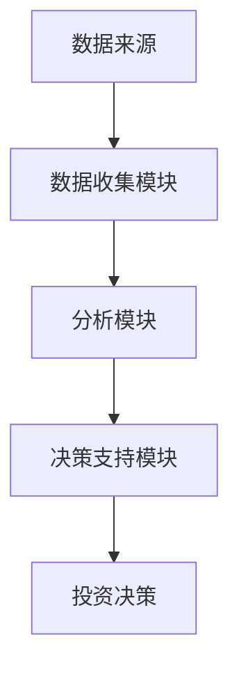

                 

# 彼得·林奇如何看待公司的股东回报

## 关键词
彼得·林奇, 股东回报, 投资策略, 财务分析, 管理层能力, 企业价值, 投资哲学

## 摘要
彼得·林奇是全球著名的投资专家，他的投资哲学和股东回报分析方法深刻影响了现代投资领域。本文从股东回报的基本概念出发，详细解读彼得·林奇的投资理念、选股标准和财务分析方法，结合实际案例，深入分析如何通过基本面分析和管理层评估来实现股东回报最大化。文章还探讨了彼得·林奇的投资系统架构，并提供实战项目分析，帮助读者掌握其投资策略的精髓。

---

# 第一部分：股东回报的核心概念与背景

## 第1章：股东回报的基本概念

### 1.1 股东回报的定义与重要性

#### 1.1.1 股东回报的定义
股东回报（Shareholder Return）是指股东通过投资某公司所获得的收益，通常以资本增值和分红的形式表现。资本增值是指股价上涨带来的收益，而分红则是公司直接向股东分配的利润。

$$\text{股东回报} = \text{资本增值} + \text{分红}$$

股东回报是衡量公司投资价值的重要指标，反映了公司的经营状况和市场表现。

#### 1.1.2 股东回报的重要性
股东回报不仅是股东投资的直接收益，也是公司经营成果的体现。高股东回报的公司通常具有较强的盈利能力、良好的市场地位和健康的财务状况。投资者通过关注股东回报，可以评估公司的投资价值和管理能力。

#### 1.1.3 股东回报与企业价值的关系
股东回报与企业价值密切相关。企业的长期价值增长会带动股价上涨，从而提高资本增值部分的回报。同时，企业的盈利能力也影响分红的多少。因此，股东回报是企业价值的直接体现。

---

### 1.2 彼得·林奇的投资理念

#### 1.2.1 彼得·林奇的生平简介
彼得·林奇（Peter Lynch）是美国著名的投资经理和作家，以其在富达投资（Fidelity Investments）的卓越表现而闻名。他在任职期间管理的麦哲伦基金（Magellan Fund）取得了惊人的回报，年平均回报率超过29%，为投资者创造了巨大价值。

#### 1.2.2 林奇的投资哲学
林奇的投资哲学以基本面分析为核心，强调深入研究公司的财务状况、行业地位和管理层能力。他认为，投资成功的关键在于选择具有强大竞争优势和良好管理的公司，并长期持有。

#### 1.2.3 林奇对股东回报的独特见解
林奇认为，股东回报的持续增长依赖于公司的长期盈利能力。他主张通过分析财务报表和行业趋势，找到那些具有增长潜力和竞争优势的公司，并长期持有这些股票，避免频繁交易。

---

## 第2章：股东回报的驱动因素

### 2.1 财务表现对股东回报的影响

#### 2.1.1 净利润与股东回报的关系
净利润是公司盈利能力的核心指标，直接影响股东回报。高净利润率的公司通常能够为股东创造更多的价值。

$$\text{净利润率} = \frac{\text{净利润}}{\text{营业收入}}$$

#### 2.1.2 资产回报率（ROA）的计算与分析
资产回报率（ROA）衡量了公司每单位资产的盈利能力，是评估公司资产使用效率的重要指标。

$$\text{ROA} = \frac{\text{净利润}}{\text{平均总资产}}$$

#### 2.1.3 股东权益回报率（ROE）的计算与分析
股东权益回报率（ROE）是衡量公司股东投资回报的重要指标，反映了公司每单位股东权益的盈利能力。

$$\text{ROE} = \frac{\text{净利润}}{\text{股东权益}}$$

---

### 2.2 行业地位对股东回报的影响

#### 2.2.1 行业生命周期与股东回报的关系
行业生命周期的不同阶段会影响公司的盈利能力。例如，在成长期行业，公司具有较高的增长潜力，可能为股东带来更高的回报；而在衰退期行业，公司盈利能力下降，股东回报可能受到限制。

#### 2.2.2 企业竞争优势的分析
竞争优势是公司长期盈利能力的关键。林奇特别关注那些在行业中具有成本优势、技术优势或品牌优势的公司。

#### 2.2.3 市场份额与股东回报的关联
市场份额是衡量公司市场地位的重要指标。较大的市场份额通常意味着更高的市场影响力和盈利能力，从而为股东带来更高的回报。

---

### 2.3 管理层能力对股东回报的影响

#### 2.3.1 管理层决策对股东回报的影响
管理层的决策直接关系到公司的经营成果。例如，高效的资本分配、合理的研发投入和有效的成本控制都对股东回报产生重要影响。

#### 2.3.2 管理层素质与企业长期发展的关系
管理层的素质和能力是公司长期发展的关键。林奇特别注重考察管理层的诚信和能力，认为这是实现股东回报最大化的基础。

#### 2.3.3 管理层激励机制对股东回报的作用
合理的激励机制可以激发管理层的积极性，使其更加关注股东利益。例如，股票期权等激励工具可以将管理层的收益与公司股价挂钩，从而提高股东回报。

---

# 第二部分：彼得·林奇的股东回报分析框架

## 第3章：彼得·林奇的选股标准

### 3.1 林奇选股的核心原则

#### 3.1.1 企业基本面分析的重要性
林奇强调基本面分析，认为只有通过深入分析公司的财务状况和行业地位，才能找到具有长期增长潜力的公司。

#### 3.1.2 财务报表分析的关键指标
林奇关注的主要财务指标包括净利润率、ROA、ROE等，这些指标反映了公司的盈利能力和发展潜力。

#### 3.1.3 行业趋势与企业竞争优势的结合
林奇不仅关注公司的财务状况，还注重行业趋势和竞争优势。他认为，选择那些在行业中具有竞争优势的公司是实现股东回报最大化的关键。

---

### 3.2 林奇选股的量化指标

#### 3.2.1 市盈率（P/E）的计算与应用
市盈率（P/E）是衡量股票估值的重要指标，反映了市场对公司盈利能力的预期。

$$\text{P/E} = \frac{\text{股价}}{\text{每股净利润}}$$

#### 3.2.2 市净率（P/B）的计算与应用
市净率（P/B）是衡量股票估值的另一个重要指标，反映了市场对公司资产价值的评估。

$$\text{P/B} = \frac{\text{股价}}{\text{每股净资产}}$$

#### 3.2.3 股息率与股东回报的关系
股息率是衡量股票收益的重要指标，反映了公司分红能力。

$$\text{股息率} = \frac{\text{每股股息}}{\text{股价}}$$

---

### 3.3 林奇选股的非量化标准

#### 3.3.1 管理层的诚信与能力
林奇认为，管理层的诚信和能力是选择公司的重要因素。他特别注重考察管理层的决策能力和职业道德。

#### 3.3.2 企业文化的考察
企业文化是公司长期发展的关键。林奇认为，积极向上的企业文化有助于公司实现长期目标，从而为股东创造更多价值。

#### 3.3.3 企业治理结构的评估
良好的公司治理结构是实现股东回报最大化的基础。林奇关注董事会的独立性和治理机制的有效性。

---

## 第4章：彼得·林奇的财务分析方法

### 4.1 财务报表分析的核心内容

#### 4.1.1 利润表分析
利润表反映了公司的收入和利润情况，是评估公司盈利能力的重要工具。

#### 4.1.2 资产负债表分析
资产负债表反映了公司的资产、负债和股东权益，是评估公司财务健康状况的重要依据。

#### 4.1.3 现金流量表分析
现金流量表反映了公司现金流入和流出的情况，是评估公司财务状况的重要指标。

---

### 4.2 财务指标的计算与解读

#### 4.2.1 净利润增长率的计算与应用
净利润增长率反映了公司盈利能力的增长情况。

$$\text{净利润增长率} = \frac{\text{本期净利润} - \text{上期净利润}}{\text{上期净利润}}$$

#### 4.2.2 营业利润率的计算与应用
营业利润率反映了公司主营业务的盈利能力。

$$\text{营业利润率} = \frac{\text{主营业务利润}}{\text{营业收入}}$$

#### 4.2.3 负债率的计算与应用
负债率反映了公司的财务杠杆和偿债能力。

$$\text{负债率} = \frac{\text{总负债}}{\text{总资产}}$$

---

# 第三部分：彼得·林奇的投资系统与实战分析

## 第5章：彼得·林奇的投资系统架构

### 5.1 投资系统的核心模块

#### 5.1.1 数据收集模块
数据收集模块负责收集公司的财务数据、行业信息和市场数据。

#### 5.1.2 分析模块
分析模块包括财务指标分析、行业趋势分析和竞争优势分析。

#### 5.1.3 决策支持模块
决策支持模块基于分析结果，提供投资建议和风险评估。

---

### 5.2 系统架构图

---

## 第6章：项目实战分析

### 6.1 项目背景与目标

#### 6.1.1 项目背景
选择一家具有长期增长潜力的公司，分析其股东回报。

#### 6.1.2 项目目标
通过分析公司的财务状况和行业地位，评估其股东回报潜力。

---

### 6.2 数据收集与处理

#### 6.2.1 数据来源
从财务报表、行业报告和市场数据中收集相关数据。

#### 6.2.2 数据处理
对收集的数据进行清洗和整理，确保数据的准确性和完整性。

---

### 6.3 分析与评估

#### 6.3.1 财务指标分析
计算公司的重要财务指标，如ROE、ROA和净利润增长率。

#### 6.3.2 行业地位分析
评估公司在行业中的竞争地位和市场份额。

#### 6.3.3 管理层能力评估
考察公司管理层的素质和能力。

---

### 6.4 投资决策

#### 6.4.1 投资建议
基于分析结果，提出投资建议，包括买入、持有或卖出。

#### 6.4.2 风险评估
评估投资的风险，制定风险管理策略。

---

# 第四部分：总结与展望

## 第7章：总结与最佳实践

### 7.1 总结
彼得·林奇的投资哲学和股东回报分析方法为我们提供了宝贵的启示。通过基本面分析和管理层评估，我们可以找到具有长期增长潜力的公司，实现股东回报最大化。

### 7.2 最佳实践
- **深入研究公司基本面**：关注财务指标和行业趋势。
- **评估管理层能力**：选择具有诚信和能力的管理层。
- **长期持有优质股票**：避免频繁交易，专注于优质公司。

---

## 第8章：注意事项与拓展阅读

### 8.1 注意事项
- **风险提示**：投资有风险，需谨慎决策。
- **数据可靠性**：确保数据的准确性和完整性。

### 8.2 拓展阅读
- **经典书籍**：《彼得·林奇的成功投资》
- **相关文章**：深入探讨林奇的投资策略和选股标准。

---

## 小结

通过本文的分析，我们全面了解了彼得·林奇如何看待公司的股东回报。从核心概念到分析框架，再到实战分析，我们掌握了林奇的投资哲学和具体方法。希望本文能为读者提供有益的指导，帮助他们在投资领域实现更高的股东回报。

---

## 作者信息

作者：AI天才研究院/AI Genius Institute & 禅与计算机程序设计艺术/Zen And The Art of Computer Programming

