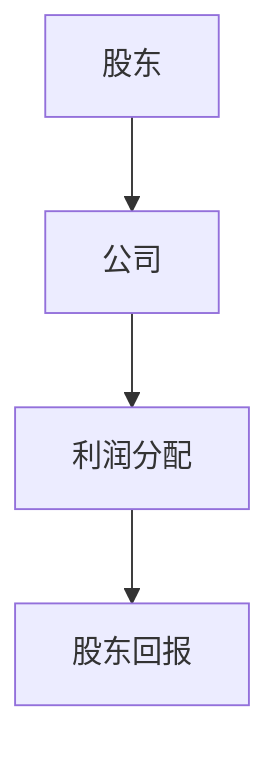
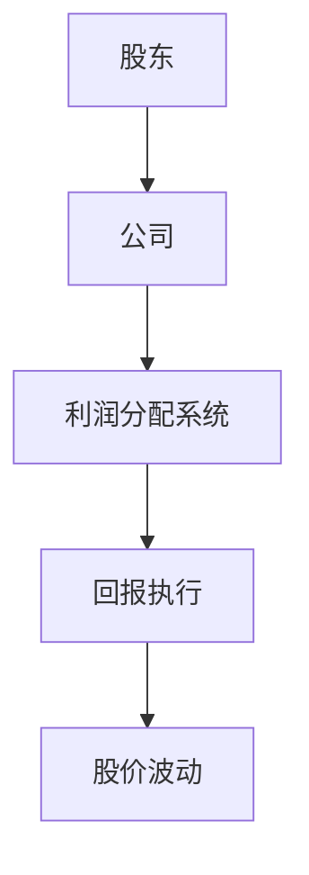

                 


# 彼得·林奇如何看待公司的股东回报政策

## 关键词：
- 股东回报政策
- 彼得·林奇
- 投资策略
- 股息
- 股票回购
- 公司治理

## 摘要：
本文深入探讨了彼得·林奇对公司的股东回报政策的看法，分析了股东回报政策的核心概念、算法原理、系统架构以及实际案例。通过结合理论与实践，帮助读者理解如何制定有效的股东回报政策，以实现公司与股东的双赢。

---

# 第一部分: 股东回报政策的背景与核心概念

## 第1章: 股东回报政策的背景介绍

### 1.1 股东回报政策的核心概念

#### 1.1.1 什么是股东回报政策
股东回报政策是指公司将其利润以股息、股票回购或其他形式返还给股东的策略。这种政策旨在平衡公司再投资需求与股东利益，确保股东获得合理的回报。

#### 1.1.2 股东回报政策的定义与范围
股东回报政策通常包括现金股息、股票回购、特殊股息等多种形式。其范围涉及公司利润分配、资本结构调整等方面。

#### 1.1.3 股东回报政策的边界与外延
公司需在自身发展与股东回报之间找到平衡点，避免过度回报影响公司扩张，或过低回报导致股东不满。

### 1.2 股东回报政策的重要性

#### 1.2.1 股东回报政策对企业价值的影响
合理的回报政策能提升公司股价，增强投资者信心，进而吸引更多投资，促进公司成长。

#### 1.2.2 股东回报政策对投资者决策的作用
股东回报政策影响投资者的决策，尤其是长期投资者，他们更关注持续的回报。

#### 1.2.3 股东回报政策与公司治理的关系
良好的回报政策体现了公司对股东的责任，是公司治理的重要组成部分。

---

## 第2章: 股东回报政策的核心要素与联系

### 2.1 核心概念的原理分析

#### 2.1.1 股东回报政策的理论基础
基于有效市场假说，股东回报政策应反映公司的真实价值，同时考虑市场环境和公司战略。

#### 2.1.2 股东回报政策的实现机制
公司通过利润分配、回购等方式，将利润返还给股东，实现股东价值。

#### 2.1.3 股东回报政策的关键属性
包括稳定性、可持续性、透明度等，确保回报政策的公平性和可执行性。

### 2.2 核心概念的对比分析

#### 2.2.1 股东回报政策与公司利润分配的关系
利润分配是回报政策的核心，合理的分配能平衡再投资需求与股东回报。

#### 2.2.2 股东回报政策与股价波动的对比
回报政策直接影响股价，稳定的回报通常带来股价的稳定性。

#### 2.2.3 股东回报政策与公司成长性的关联
成长性好的公司可能选择再投资而非分红，而成熟公司则倾向于回报股东。

### 2.3 核心概念的ER实体关系图


---

## 第3章: 股东回报政策的算法原理

### 3.1 股东回报政策的实现算法

#### 3.1.1 股东回报政策的决策流程
1. **评估公司利润**：确定可分配利润。
2. **考虑再投资需求**：评估公司未来投资机会。
3. **选择回报形式**：决定现金股息、股票回购等。
4. **制定回报计划**：确定分配比例和时间表。
5. **实施与调整**：执行政策并根据市场变化调整。

#### 3.1.2 股东回报政策的计算方法
以现金股息为例，计算公式为：
$$ \text{每股股息} = \frac{\text{净利润} - \text{再投资需求}}{\text{总股数}} $$

#### 3.1.3 股东回报政策的优化策略
结合公司成长阶段和市场环境，动态调整回报政策，确保股东利益最大化。

### 3.2 股东回报政策的数学模型

#### 3.2.1 股东回报率的计算公式
$$ \text{股东回报率} = \frac{\text{股息} + \text{股票回购}}{\text{股价}} $$

#### 3.2.2 股息率
$$ \text{股息率} = \frac{\text{每股股息}}{\text{股价}} $$

---

## 第4章: 股东回报政策的系统分析与架构设计

### 4.1 系统分析

#### 4.1.1 股东回报政策的系统功能需求
- 利润分配计算
- 回报形式选择
- 政策执行监控

#### 4.1.2 股东回报政策的系统性能指标
- 准确性：计算结果的准确性。
- 可扩展性：适应公司规模变化的能力。
- 可调整性：根据市场变化调整政策的能力。

### 4.2 系统架构设计

#### 4.2.1 股东回报政策的系统架构图


---

# 第二部分: 股东回报政策的项目实战

## 第5章: 项目实战：以苹果公司为例

### 5.1 项目介绍
分析苹果公司近年来的股东回报政策，包括现金股息和股票回购，评估其对公司价值和股价的影响。

### 5.2 系统核心实现

#### 5.2.1 环境安装
使用Python和Pandas库进行数据分析。

#### 5.2.2 核心代码实现
```python
import pandas as pd

def calculate_dividend_yield(price, dividend):
    return dividend / price

def calculate_share_repurchase Impact(price, repurchase):
    return repurchase / price

# 示例数据
price = 150  # 假设股价为150美元
dividend = 0.87  # 每股股息
repurchase = 1000000  # 假设回购金额为100万美元

# 计算股息率
dividend_yield = calculate_dividend_yield(price, dividend)
repurchase_impact = calculate_share_repurchase_Impact(price, repurchase)

print(f"股息率: {dividend_yield:.2f}%")
print(f"回购对股价的影响: {repurchase_impact:.2f}%")
```

### 5.3 代码应用解读与分析
通过代码分析苹果公司的股息率和回购对股价的影响，展示回报政策的实际应用。

### 5.4 实际案例分析和详细讲解剖析
分析苹果公司近年来的回报政策，解释其对公司股价和投资者信心的影响。

### 5.5 项目小结
总结苹果公司的经验，强调合理回报政策的重要性。

---

## 第6章: 最佳实践与小结

### 6.1 最佳实践 tips
- **动态调整**：根据公司情况和市场环境调整回报政策。
- **透明沟通**：向股东清晰传达回报政策的决策理由。
- **平衡短期与长期**：兼顾股东的短期回报和公司的长期发展。

### 6.2 小结
彼得·林奇认为，有效的股东回报政策能增强股东信心，促进公司价值。制定政策时需综合考虑公司发展和股东利益。

### 6.3 注意事项
- 避免过度分红导致公司资金链紧张。
- 考虑市场环境变化，灵活调整政策。

### 6.4 拓展阅读
- 《彼得·林奇的投资哲学》
- 《股息率分析与投资策略》

---

# 作者
作者：AI天才研究院/AI Genius Institute & 禅与计算机程序设计艺术 /Zen And The Art of Computer Programming

---

以上是《彼得·林奇如何看待公司的股东回报政策》的技术博客文章的完整目录和内容概览。文章系统地分析了股东回报政策的各个方面，并结合实际案例进行了深入探讨，旨在帮助读者全面理解彼得·林奇的视角及其对投资决策的启示。

