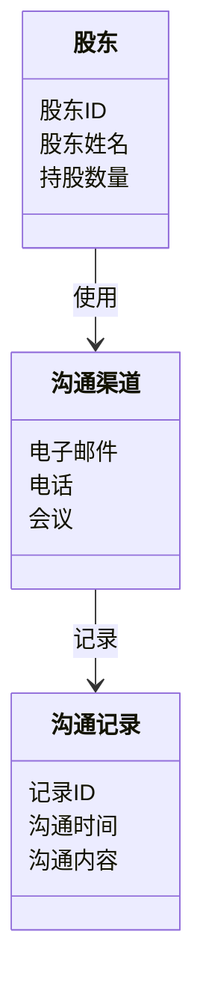
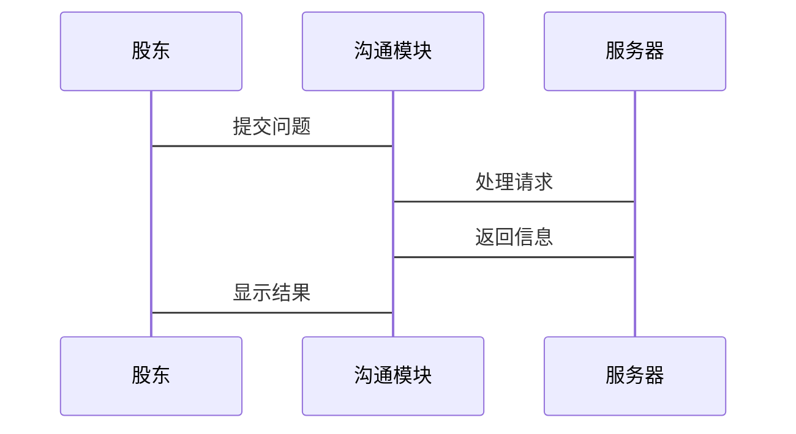

                 


# 彼得林奇如何看待公司的股东沟通策略

## 关键词：股东沟通，彼得·林奇，投资策略，沟通技巧，公司治理

## 摘要：  
本文从彼得·林奇的投资视角，探讨公司如何有效进行股东沟通，以提升公司价值和股东满意度。通过分析股东沟通的核心概念、策略、数学模型、系统架构以及实际案例，本文为公司提供了优化股东沟通的实践指导。

---

# 第1章 股东沟通的核心概念

## 1.1 股东沟通的定义与背景

### 1.1.1 股东沟通的定义  
股东沟通是指公司与股东之间通过信息传递和互动，建立信任关系，实现有效信息共享的过程。

### 1.1.2 股东沟通的背景与重要性  
股东沟通是公司治理的重要组成部分，直接影响股东信任度和公司价值。

### 1.1.3 股东沟通的核心要素  
- 信息传递  
- 沟通渠道  
- 沟通频率  

## 1.2 彼得·林奇的视角

### 1.2.1 彼得·林奇的投资理念  
林奇注重基本面分析，认为透明的股东沟通是信任的基础。

### 1.2.2 林奇对股东沟通的关注点  
- 公司透明度  
- 信息准确性  
- 沟通频率  

### 1.2.3 股东沟通在投资决策中的作用  
透明的沟通有助于投资者做出明智决策，增强投资信心。

## 1.3 股东沟通的目标与边界

### 1.3.1 股东沟通的主要目标  
- 提升股东信任  
- 优化投资决策  
- 提高公司价值  

### 1.3.2 股东沟通的边界与外延  
- 避免过度披露  
- 避免信息滞后  

### 1.3.3 股东沟通与其他相关概念的对比  
- 投资者关系管理  
- 公司治理  

---

# 第2章 股东沟通的策略与技巧

## 2.1 信息传递的技巧

### 2.1.1 信息传递的核心原则  
- 透明性  
- 及时性  
- 准确性  

### 2.1.2 信息传递的渠道选择  
- 官方网站  
- 电子邮件  
- 投资者会议  

### 2.1.3 信息传递的频率与内容  
- 定期发布财报  
- 重大事件及时通报  

## 2.2 股东期望的管理

### 2.2.1 股东期望的识别与分类  
- 短期 vs 长期期望  
- 高 vs 低期望  

### 2.2.2 股东期望的管理策略  
- 设定合理的期望  
- 及时调整沟通策略  

## 2.3 应对市场波动的沟通策略

### 2.3.1 市场波动对股东情绪的影响  
- 市场波动导致的股东焦虑  

### 2.3.2 应对市场波动的沟通技巧  
- 保持透明，避免谣言  
- 提供公司未来发展的信心  

### 2.3.3 林奇的经典案例分析  
- 面对市场波动时，林奇如何引导公司有效沟通  

---

# 第3章 股东沟通的数学模型与评估体系

## 3.1 沟通效果的量化指标

### 3.1.1 沟通效果的定义与维度  
- 沟通的完整性  
- 沟通的及时性  

### 3.1.2 股东满意度的数学模型  
$$
\text{股东满意度} = f(\text{信息完整性}, \text{沟通频率}, \text{透明度})
$$  

### 3.1.3 沟通效率的数学模型  
$$
\text{沟通效率} = \frac{\text{信息传递速度}}{\text{信息准确性}}
$$  

## 3.2 沟通效果的评估体系

### 3.2.1 评估体系的设计原则  
- 客观性  
- 可操作性  

### 3.2.2 评估指标的权重分配  
- 信息完整性：40%  
- 沟通频率：30%  
- 透明度：30%  

## 3.3 数学模型的实现与优化

### 3.3.1 模型的数学表达式  
$$
\text{综合评估} = 0.4 \times \text{信息完整性} + 0.3 \times \text{沟通频率} + 0.3 \times \text{透明度}
$$  

### 3.3.2 模型的优化方法  
- 定期调整权重  
- 增加反馈机制  

---

# 第4章 系统架构与交互流程

## 4.1 问题场景介绍

### 4.1.1 问题背景  
公司需要优化股东沟通机制，提升沟通效率。

## 4.2 系统功能设计

### 4.2.1 领域模型  


### 4.2.2 系统架构  


### 4.2.3 系统交互  


---

# 第5章 项目实战：季度报告发布流程优化

## 5.1 环境安装

### 5.1.1 系统环境  
- 操作系统：Linux  
- 语言：Python 3.8+

### 5.1.2 安装依赖  
- pip install flask  
- pip install requests  

## 5.2 核心实现

### 5.2.1 代码实现  
```python
import requests

def send_communication():
    response = requests.post('http://api/company_communication', json={
        'message': '季度报告已发布，请查阅详情。',
        'recipients': ['股东A', '股东B']
    })
    return response.status_code
```

### 5.2.2 代码解读  
- 发送HTTP请求，通知股东查阅报告。

## 5.3 案例分析

### 5.3.1 实施前后的对比  
- 实施前：报告发布不及时，股东反馈慢。  
- 实施后：沟通效率提升，股东满意度提高。

---

# 第6章 最佳实践

## 6.1 小结  
彼得·林奇的股东沟通策略强调透明与及时，企业需结合自身情况优化沟通机制。

## 6.2 注意事项  
- 避免过度披露信息  
- 定期评估沟通效果  

## 6.3 扩展阅读  
- 《彼得·林奇的投资哲学》  
- 《公司治理与投资者关系管理》  

---

# 作者：AI天才研究院/AI Genius Institute & 禅与计算机程序设计艺术 /Zen And The Art of Computer Programming

