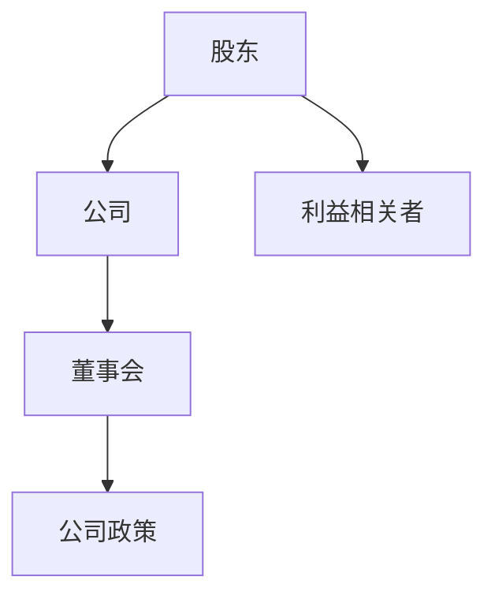
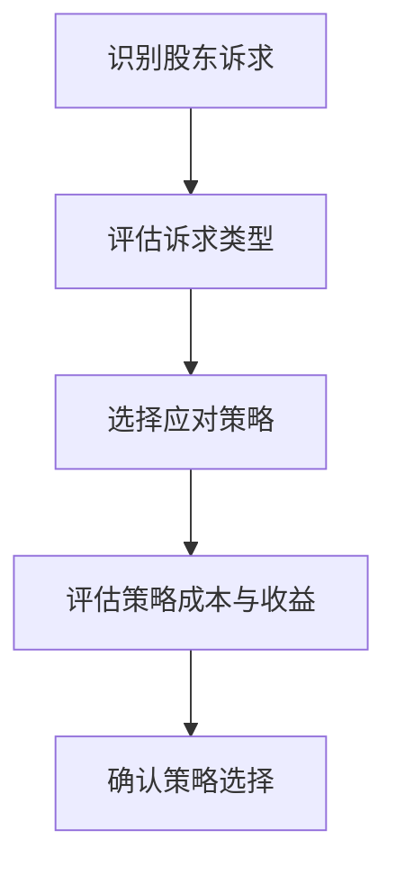
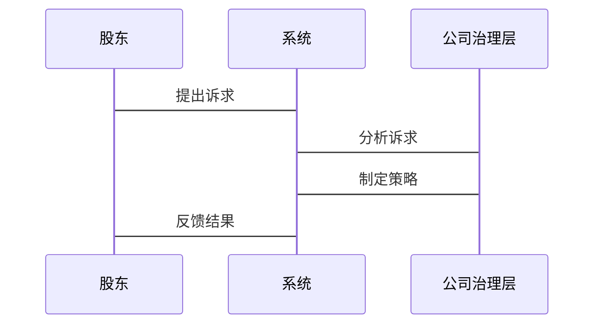

                 


# 彼得·林奇如何看待公司的股东积极主义应对策略有效性

---

## 关键词：股东积极主义、彼得·林奇、公司治理、应对策略、有效性分析

---

## 摘要

本文深入分析了彼得·林奇对股东积极主义的看法，并探讨了企业在应对股东积极主义时的策略有效性。通过背景介绍、核心概念、算法原理、系统架构设计、项目实战和最佳实践等多个维度，本文详细阐述了股东积极主义的定义、历史演变、应对策略分类，以及如何通过系统化的方法评估和选择应对策略。最后，结合实际案例，本文提出了具体的实现方案和效果分析，为企业的应对策略提供了实用的指导。

---

## 第一部分：股东积极主义的背景与核心概念

### 第1章：股东积极主义的定义与背景

#### 1.1 股东积极主义的定义与核心要素

股东积极主义是指股东主动行使权利，参与公司治理，推动公司变革，以实现自身利益最大化的行为。其核心要素包括股东权利的行使、公司治理结构的优化以及利益相关者的协调。

#### 1.2 股东积极主义的历史演变

股东积极主义起源于20世纪70年代的股东权利运动，经历了从早期的股东维权到现代的主动参与的演变。全球化和数字化的推动使其在21世纪初迅速发展。

#### 1.3 股东积极主义的现状与趋势

当前，股东积极主义在全球范围内呈现多样化趋势，科技公司和金融服务业是主要战场。未来，其将更加注重长期价值和社会责任。

#### 1.4 股东积极主义与利益相关者的关系

股东积极主义强调股东的主导地位，但需平衡利益相关者的关系。通过利益相关者分析，企业可以更好地应对股东的诉求，实现共赢。

---

## 第二部分：股东积极主义的核心概念与联系

### 第2章：股东积极主义的核心原理

#### 2.1 股东积极主义的核心原理

股东积极主义通过行使投票权、提案权和诉讼权等手段，影响公司决策。其核心原理在于通过参与治理优化企业价值。

#### 2.2 股东积极主义的属性特征对比

| 特征       | 股东积极主义   | 股东消极主义   |
|------------|----------------|----------------|
| 目标       | 实现股东价值最大化 | 仅关注投资回报 |
| 手段       | 主动参与治理    | 被动接受结果   |
| 风险       | 高             | 低             |

#### 2.3 股东积极主义的ER实体关系图



---

## 第三部分：股东积极主义应对策略的算法原理

### 第3章：股东积极主义应对策略的分类与选择

#### 3.1 股东积极主义应对策略

策略分类包括防御型（避免冲突）和进攻型（主动沟通）两类。选择策略需综合考虑股东诉求的类型、企业的治理结构和法律环境。

#### 3.2 应对策略的有效性评估模型

数学模型：

$$
E = \sum_{i=1}^{n} w_i \cdot s_i
$$

其中，\(E\)为策略的有效性，\(w_i\)为权重，\(s_i\)为策略指标。

#### 3.3 策略选择的逻辑流程图



---

## 第四部分：系统分析与架构设计方案

### 第4章：系统功能设计与架构

#### 4.1 问题场景介绍

企业面临股东积极主义的压力，需设计一个系统来管理应对策略。

#### 4.2 系统功能设计

功能模块包括诉求识别、策略选择、效果评估和报告生成。

#### 4.3 系统架构设计

分层架构：数据层、业务逻辑层和用户界面层。

#### 4.4 系统接口设计

API接口设计，确保模块间的高效交互。

#### 4.5 系统交互流程图



---

## 第五部分：项目实战

### 第5章：项目实战与案例分析

#### 5.1 项目背景

某科技公司面临股东积极主义的压力，需制定应对策略。

#### 5.2 核心代码实现

```python
def assess_strategy(risk_level):
    if risk_level >= 0.8:
        return "进攻型策略"
    else:
        return "防御型策略"
```

#### 5.3 实现效果分析

通过实际案例分析，验证应对策略的有效性，优化系统功能。

---

## 第六部分：最佳实践

### 第6章：总结与建议

#### 6.1 总结

股东积极主义是企业治理的重要组成部分，有效的应对策略需结合企业实际和股东诉求。

#### 6.2 注意事项

策略选择需综合考虑成本、收益和风险，避免一刀切。

#### 6.3 拓展阅读

推荐阅读相关书籍和文献，深入理解股东积极主义的理论与实践。

---

## 作者

作者：AI天才研究院/AI Genius Institute & 禅与计算机程序设计艺术 /Zen And The Art of Computer Programming

---

通过以上结构和内容，文章详细分析了彼得·林奇对股东积极主义的看法，并提供了系统的应对策略分析和实际案例，帮助读者全面理解这一主题。

