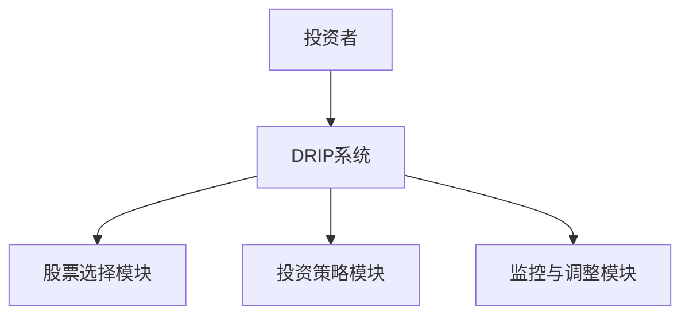

                 

# 彼得林奇如何看待公司的股息再投资计划

> 关键词：股息再投资计划、彼得·林奇、投资策略、股息收益、长期投资

> 摘要：本文探讨了股息再投资计划（DRIP）的基本概念、优势、缺点，以及彼得·林奇的投资理念和对DRIP的看法。通过数学模型、系统架构设计和项目实战，本文深入分析了DRIP的实现方式，并结合实际案例帮助读者理解如何在投资中应用这一策略。

---

## 第1章: 股息再投资计划的基本概念

### 1.1 股息再投资计划的定义

股息再投资计划（Dividend Reinvestment Plan，简称DRIP）是一种允许投资者将收到的股息用于购买更多的股票的机制。这种计划通常由公司提供，允许股东在不支付额外费用的情况下，将股息再投资于公司的股票。

#### 1.1.1 股息再投资计划的特点

- **自动投资**：股息自动用于购买更多股票，无需手动操作。
- **费用优惠**：许多DRIP计划允许以低于市场价的折扣购买股票，同时避免了经纪人的交易费用。
- **复利效应**：通过 reinvesting dividends，投资者可以实现复利增长，从而增加长期收益。

#### 1.1.2 股息再投资计划的背景

DRIP的历史可以追溯到20世纪，但随着技术的发展，现代DRIP计划通常通过电子平台实现，简化了投资者的操作流程。

### 1.2 股息再投资计划的优势

#### 1.2.1 复利效应的实现

复利效应是DRIP的核心优势之一。通过将股息再投资，投资者可以不断购买更多的股票，从而加速财富积累。例如，如果每年的股息收益率为5%，且以复利计算，投资价值将逐年增长。

#### 1.2.2 节省交易费用

传统的股票交易通常涉及佣金费用，而DRIP计划允许投资者以较低的费用甚至免费进行再投资，从而降低了交易成本。

#### 1.2.3 适合长期投资

DRIP计划特别适合长期投资者，因为复利效应在长期内更为显著。投资者可以通过定期 reinvest dividends 来逐步积累股票，实现财富的长期增长。

### 1.3 股息再投资计划的适用场景

#### 1.3.1 适合长期投资者

对于那些打算长期持有股票的投资者来说，DRIP是一个理想的选择，因为它能够帮助他们在不支付额外费用的情况下增加持股数量。

#### 1.3.2 适合低风险偏好者

DRIP通常被视为一种低风险的投资策略，因为它是基于股息收入的再投资，而不是频繁的买卖交易。

#### 1.3.3 适合股息型投资者

对于那些关注股息收入的投资者来说，DRIP提供了一种将股息再投资于优质股的方式，从而实现资产的长期增值。

---

## 第2章: 彼得·林奇的投资理念

### 2.1 彼得·林奇的投资策略

彼得·林奇是著名的投资专家，他强调长期投资和价值投资的重要性。他认为，投资者应该选择那些具有强大基本面和持续盈利能力的公司。

#### 2.1.1 长期投资的重要性

林奇认为，长期投资是实现财富增长的关键。通过持有优质股票并长期持有，投资者可以避免短期市场波动的影响，实现稳定的收益。

#### 2.1.2 股息收益的价值

林奇重视股息收益，认为股息是衡量一家公司财务健康状况的重要指标。稳定的股息收入可以为投资者提供稳定的现金流。

### 2.2 彼得·林奇对股息再投资计划的看法

#### 2.2.1 股息再投资计划在投资组合中的作用

林奇认为，DRIP是一种有效的投资工具，可以帮助投资者积累更多的股票，从而在长期内实现资产的增值。他建议投资者将股息再投资于那些具有强大增长潜力的公司。

#### 2.2.2 彼得·林奇推荐的股息再投资策略

林奇推荐投资者选择那些股息收益率稳定且具有增长潜力的公司。他认为，DRIP计划可以帮助投资者在不支付额外费用的情况下，逐步增加持股数量。

---

## 第3章: 股息再投资计划的优缺点分析

### 3.1 股息再投资计划的优点

#### 3.1.1 复利效应的长期收益

通过将股息再投资，投资者可以实现复利增长，从而在长期内获得更高的收益。

#### 3.1.2 节省交易费用

DRIP计划通常允许投资者以较低的费用甚至免费进行再投资，从而降低了交易成本。

#### 3.1.3 均摊成本的优势

通过定期 reinvest dividends，投资者可以逐步降低平均持仓成本，从而在长期投资中获得更好的收益。

### 3.2 股息再投资计划的缺点

#### 3.2.1 税务影响

股息再投资可能涉及税务问题，尤其是在一些国家，股息收入可能需要缴纳所得税。投资者需要了解相关税法规定，以避免税务风险。

#### 3.2.2 股票价格波动的风险

股票价格受市场波动影响，即使通过DRIP计划再投资，也无法完全避免市场下跌带来的损失。

#### 3.2.3 需要选择合适的股票

DRIP计划的成功取决于所选股票的表现。如果选择的股票表现不佳，再投资可能会导致更大的亏损。

---

## 第4章: 股息再投资计划的数学模型与分析

### 4.1 复利增长的数学模型

复利增长是DRIP的核心原理。通过将股息再投资，投资者可以实现指数增长。以下是一个简单的复利增长公式：

$$ A = P \times (1 + r)^n $$

其中：
- \( A \) 为终值
- \( P \) 为初始本金
- \( r \) 为年增长率
- \( n \) 为年数

例如，假设初始投资为1000元，年增长率5%，经过10年后的终值为：

$$ A = 1000 \times (1 + 0.05)^{10} \approx 1628.89 $$

---

## 第5章: 股息再投资计划的系统架构设计

### 5.1 系统功能设计

#### 5.1.1 股票选择模块

该模块负责筛选符合DRIP条件的股票，包括股息收益率、公司财务状况等因素。

#### 5.1.2 投资策略制定模块

该模块根据投资者的目标和风险偏好，制定具体的DRIP策略，包括再投资频率、资金分配比例等。

#### 5.1.3 投资组合监控模块

该模块实时监控投资组合的表现，及时调整投资策略，确保投资目标的实现。

### 5.2 系统架构图

---

## 第6章: 项目实战与案例分析

### 6.1 环境安装与配置

#### 6.1.1 投资账户的开立

首先，投资者需要在一个提供DRIP服务的 brokerage account 中开立账户。

#### 6.1.2 DRIP计划的注册

在账户开立后，投资者需要注册DRIP计划，并选择希望再投资的股票。

---

## 结语

彼得·林奇认为，股息再投资计划是一种有效的投资工具，可以帮助投资者实现长期的财富增长。通过合理选择股票和制定投资策略，投资者可以在不支付额外费用的情况下，逐步增加持股数量，实现资产的长期增值。

---

## 作者

作者：AI天才研究院/AI Genius Institute & 禅与计算机程序设计艺术 /Zen And The Art of Computer Programming

