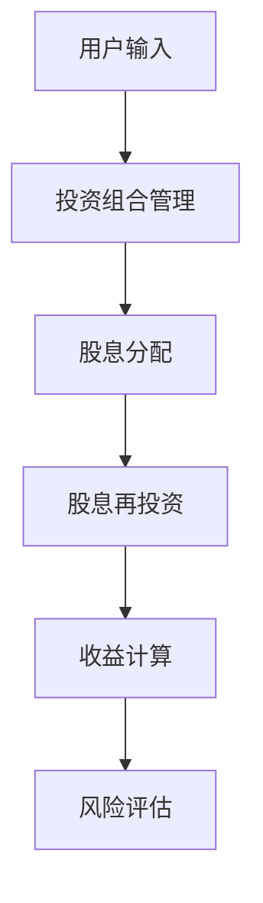
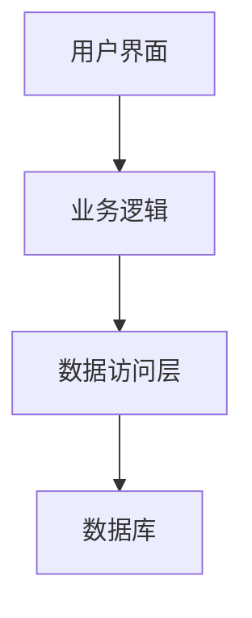

                 


# 彼得林奇如何看待公司的股息再投资计划对长期回报的影响

> 关键词：股息再投资计划、彼得·林奇、长期回报、投资策略、股息再投资、投资收益、股息增长模型

> 摘要：本文将深入探讨彼得·林奇对股息再投资计划的看法，分析其对长期回报的影响。通过数学模型和系统架构设计，详细阐述股息再投资的原理、优势和潜在风险。结合实际案例，展示如何通过系统化的方法实现股息再投资的最优配置。

---

## 第一部分: 股息再投资计划的背景与概念

### 第1章: 股息再投资计划概述

#### 1.1 股息再投资计划的定义与特点
##### 1.1.1 股息再投资计划的定义
股息再投资计划（Dividend Reinvestment Plan，简称DRIP）是一种允许投资者将收到的股息用于购买更多公司股票的投资机制。通过这种方式，投资者可以避免支付股息的现金分红，同时利用复利效应增加投资组合的价值。

##### 1.1.2 股息再投资计划的核心特点
- **复利效应**：通过不断再投资，股息再投资可以产生复利效应，从而加速资产增值。
- **无需支付额外费用**：许多公司提供股息再投资计划时，不会收取额外的管理费用或交易费用。
- **灵活性**：投资者可以根据市场情况和个人需求，灵活调整再投资的频率和金额。

##### 1.1.3 股息再投资计划与传统投资的区别
- **传统投资**：投资者需要手动将现金用于购买股票，需要支付交易费用。
- **股息再投资**：股息自动用于购买更多股票，简化了操作流程。

#### 1.2 股息再投资计划的背景与意义
##### 1.2.1 股票投资的基本概念
股票是企业的一部分所有权，投资者通过持有股票分享企业的利润和增长。

##### 1.2.2 股息再投资的历史发展
股息再投资计划起源于20世纪80年代，随着公司逐渐意识到通过股息再投资吸引长期投资者的重要性，这种机制逐渐普及。

##### 1.2.3 股息再投资计划的经济意义
股息再投资计划不仅为投资者提供了复利增长的机会，还能帮助企业吸引长期稳定的投资者，促进企业长期发展。

### 第2章: 彼得·林奇的投资理念与股息再投资

#### 2.1 彼得·林奇的个人投资哲学
##### 2.1.1 林奇的投资风格概述
彼得·林奇是美国著名投资经理人，他强调长期投资、价值投资和分散投资。他认为，投资的核心是选择优秀的公司，而不是关注短期市场波动。

##### 2.1.2 林奇对长期投资的重视
林奇认为，长期投资是实现财富增长的关键。通过持有优质股票并长期持有，投资者可以最大化复利效应。

##### 2.1.3 林奇对价值投资的坚持
林奇强调寻找具有合理估值、良好基本面和竞争优势的公司。他认为，长期持有优质股票是实现财富增长的最佳方式。

#### 2.2 林奇对股息再投资的看法
##### 2.2.1 林奇对股息再投资的评价
林奇认为，股息再投资是一种有效的投资策略，尤其是对于那些股息收益率较高且具有持续增长潜力的公司。

##### 2.2.2 林奇认为股息再投资的优势
- **复利效应**：通过再投资，投资者可以利用股息的再投资实现复利增长，从而加速资产增值。
- **降低交易成本**：股息再投资通常不需要支付额外的交易费用，降低了投资成本。

##### 2.2.3 林奇对股息再投资的潜在风险
- **市场波动风险**：股息再投资的回报与市场表现密切相关，市场波动可能影响投资回报。
- **公司股息政策变化**：公司可能根据经营状况调整股息分配政策，影响再投资的效果。

---

## 第二部分: 股息再投资计划的数学模型与算法原理

### 第3章: 股息再投资的数学模型

#### 3.1 股息再投资的基本数学公式
##### 3.1.1 股息再投资的复利计算公式
股息再投资的回报可以通过复利公式计算：
$$
\text{最终价值} = \text{初始投资} \times (1 + r)^n
$$
其中，\( r \) 是年化收益率，\( n \) 是投资年数。

##### 3.1.2 股票增长对投资回报的影响
股票增长可以通过以下公式计算：
$$
\text{股票增长} = \text{股息收益率} + \text{股价增长率}
$$

##### 3.1.3 股息再投资的总回报计算公式
股息再投资的总回报可以表示为：
$$
\text{总回报} = \text{资本增值} + \text{股息收入}
$$

#### 3.2 股息再投资的收益与风险模型
##### 3.2.1 收益预测模型
股息再投资的收益预测可以通过以下公式进行：
$$
\text{预测收益} = \text{初始投资} \times (1 + r)^n
$$

##### 3.2.2 风险评估模型
股息再投资的风险可以通过波动率和相关性分析进行评估：
$$
\text{波动率} = \sqrt{\text{方差}}
$$

##### 3.2.3 收益与风险的平衡分析
通过夏普比率（Sharpe Ratio）可以衡量股息再投资的风险调整后收益：
$$
\text{夏普比率} = \frac{\text{超额收益}}{\text{波动率}}
$$

### 第4章: 股息再投资的算法实现

#### 4.1 股息再投资的算法流程
##### 4.1.1 投资组合初始化
- 初始化投资组合，确定初始投资金额和目标收益率。

##### 4.1.2 股息分配与再投资
- 根据公司股息分配政策，将股息用于购买更多股票。

##### 4.1.3 投资回报的计算与分析
- 计算投资组合的总回报、资本增值和股息收入。

#### 4.2 股息再投资的优化算法
##### 4.2.1 投资组合优化算法
- 使用现代投资组合理论（MPT）优化投资组合。

##### 4.2.2 风险最小化算法
- 通过调整投资组合的资产配置，降低整体风险。

##### 4.2.3 收益最大化算法
- 通过选择高股息收益率和高增长潜力的股票，实现收益最大化。

---

## 第三部分: 股息再投资计划的系统分析与架构设计

### 第5章: 股息再投资系统的功能设计

#### 5.1 系统功能模块划分
##### 5.1.1 用户输入模块
- 提供用户输入初始投资金额、目标收益率和投资期限。

##### 5.1.2 投资组合管理模块
- 管理投资组合，包括股票选择和股息再投资。

##### 5.1.3 收益计算模块
- 计算投资组合的总回报和资本增值。

##### 5.1.4 风险评估模块
- 评估投资组合的风险，包括波动率和相关性分析。

#### 5.2 系统功能流程图
##### 5.2.1 系统功能流程图（使用 Mermaid）


### 第6章: 股息再投资系统的架构设计

#### 6.1 系统架构设计
##### 6.1.1 分层架构设计
- 采用分层架构，包括用户界面层、业务逻辑层和数据访问层。

##### 6.1.2 模块化设计
- 每个功能模块独立开发，便于维护和升级。

##### 6.1.3 组件间交互设计
- 组件间通过接口进行交互，确保系统的灵活性和扩展性。

#### 6.2 系统架构图
##### 6.2.1 系统架构图（使用 Mermaid）


### 第7章: 股息再投资系统的实现

#### 7.1 系统环境安装
##### 7.1.1 开发环境要求
- 需要安装Python、Jupyter Notebook和相关库（如numpy、pandas、matplotlib）。

##### 7.1.2 代码实现
```python
import numpy as np
import pandas as pd
import matplotlib.pyplot as plt

# 初始化投资组合
initial_investment = 1000
target_return = 0.1  # 10%的年化收益率
years = 10

# 计算复利
def compound_interest(principal, rate, time):
    return principal * (1 + rate) ** time

# 计算股息再投资的总回报
total_return = compound_interest(initial_investment, target_return, years)

# 绘制收益曲线
time = np.linspace(0, years, years)
returns = [initial_investment * (1 + target_return) ** t for t in range(years+1)]
plt.plot(time, returns)
plt.xlabel('年数')
plt.ylabel('金额')
plt.title('股息再投资的复利增长')
plt.show()
```

---

## 第四部分: 股息再投资计划的项目实战

### 第8章: 股息再投资的项目实现

#### 8.1 项目背景
- 选择一家具有稳定股息收益率和良好增长前景的公司，模拟股息再投资的过程。

#### 8.2 项目实现
##### 8.2.1 选择股票
- 以苹果公司（AAPL）为例，假设股息收益率为2%，股价年增长率为5%。

##### 8.2.2 计算股息再投资的回报
- 初始投资金额为1000美元，投资期限为10年。
- 年化收益率为股息收益率加上股价增长率：
$$
r = 0.02 + 0.05 = 0.07
$$
- 最终价值：
$$
\text{最终价值} = 1000 \times (1 + 0.07)^{10} \approx 1967.14
$$

##### 8.2.3 绘制回报曲线
```python
import numpy as np
import matplotlib.pyplot as plt

initial_investment = 1000
rate = 0.07
years = 10

time = np.linspace(0, years, years + 1)
values = [initial_investment * (1 + rate) ** t for t in range(years + 1)]
plt.plot(time, values)
plt.xlabel('年数')
plt.ylabel('金额')
plt.title('股息再投资的回报曲线')
plt.show()
```

---

## 第五部分: 总结与最佳实践

### 第9章: 总结与注意事项

#### 9.1 总结
- 股息再投资是一种有效的长期投资策略，通过复利效应实现资产增值。
- 彼得·林奇认为，股息再投资可以帮助投资者长期持有优质股票，实现财富增长。

#### 9.2 注意事项
- 投资者需要选择具有稳定股息收益率和良好增长前景的公司。
- 需要关注市场波动和公司股息政策的变化，及时调整投资策略。

### 第10章: 小结与展望

#### 10.1 小结
- 股息再投资计划通过复利效应实现资产增值，是长期投资的重要策略。
- 本文通过数学模型和系统设计，详细分析了股息再投资的原理和实现方法。

#### 10.2 展望
- 未来可以进一步研究股息再投资与其他投资策略的结合，优化投资组合。
- 进一步探索人工智能在股息再投资中的应用，提升投资效率和收益。

---

## 作者信息

作者：AI天才研究院/AI Genius Institute & 禅与计算机程序设计艺术/Zen And The Art of Computer Programming

---

通过以上结构和内容，您可以根据实际需求逐步补充各章节的具体内容，确保文章完整、逻辑清晰、技术深入。

