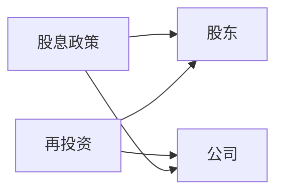
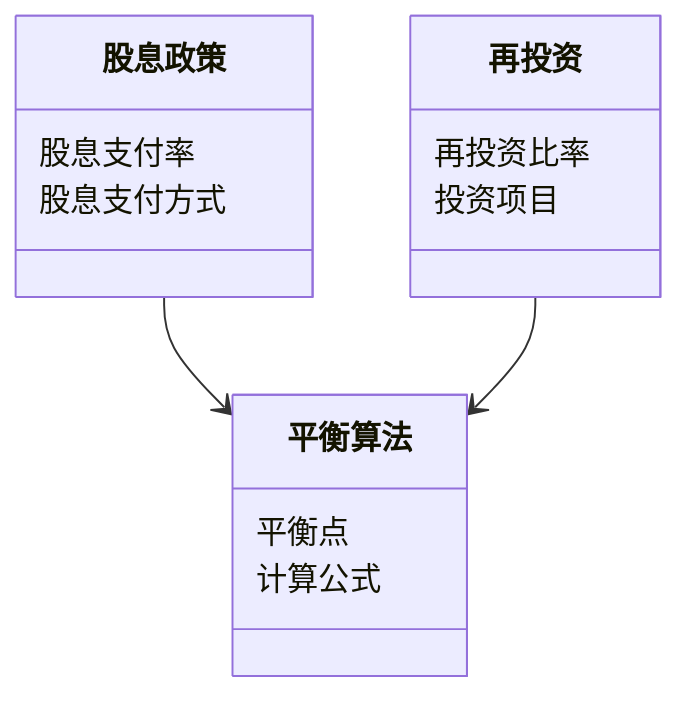
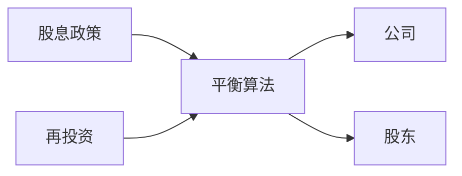
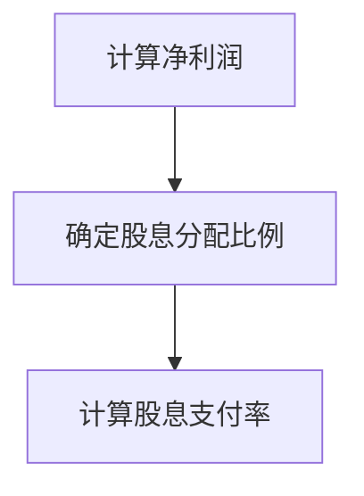
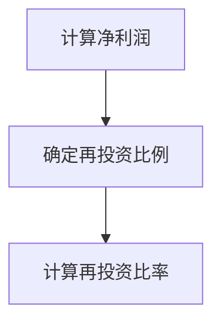
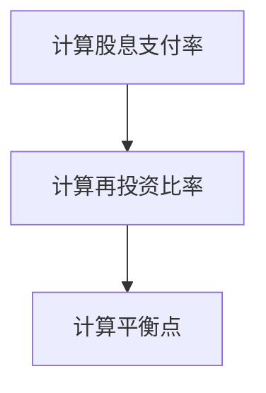

                 

# 彼得林奇如何看待公司的股息政策与再投资平衡

## 关键词：彼得林奇，股息政策，再投资，公司治理，投资策略，财务分析，投资平衡

## 摘要：  
本文深入探讨了彼得·林奇的投资理念，分析了股息政策与再投资之间的平衡关系。通过理论与实际案例相结合，详细阐述了股息政策与再投资的核心概念、算法原理、系统架构设计以及项目实战。文章旨在为投资者和企业管理者提供清晰的思路和实践指导，帮助他们在公司治理和投资策略中找到最佳平衡点。

---

## 第一部分：股息政策与再投资平衡的背景与核心概念

### 第1章：股息政策与再投资的背景介绍

#### 1.1 股息政策的基本概念

##### 1.1.1 股息政策的定义
股息政策是指公司董事会决定如何分配利润给股东的策略。常见的股息政策包括固定股息政策、稳定增长股息政策、剩余股息政策等。

##### 1.1.2 股息政策的类型
- **固定股息政策**：公司每年支付固定的股息，通常适用于成熟企业。
- **稳定增长股息政策**：股息逐年以固定比例增长，适用于成长型企业。
- **剩余股息政策**：公司仅在净利润中支付剩余部分作为股息，优先用于再投资。

##### 1.1.3 股息政策的历史演变
股息政策的演变与公司治理和资本市场的发展密切相关。早期企业倾向于将利润全部用于再投资，而现代企业更注重股东回报与公司发展的平衡。

#### 1.2 再投资的基本概念

##### 1.2.1 再投资的定义
再投资是指公司将净利润用于扩大生产规模、技术升级、市场拓展等投资活动，以实现可持续发展。

##### 1.2.2 再投资的常见形式
- **资本性支出**：用于购买固定资产、设备等。
- **研发投入**：用于新产品开发和技术创新。
- **市场拓展**：用于开拓新市场或并购。

##### 1.2.3 再投资与公司发展的关系
再投资是公司成长的核心驱动力，合理的再投资策略能够提升公司竞争力和盈利能力。

#### 1.3 彼得·林奇的投资理念

##### 1.3.1 彼得·林奇的生平简介
彼得·林奇是美国著名投资家，被誉为“股神”之一，以其在富达投资的管理业绩而闻名。

##### 1.3.2 彼得·林奇的投资哲学
- 价值投资：寻找具有持续增长潜力的公司。
- 风险控制：避免过度投资和盲目扩张。
- 长期视角：关注公司长期发展，而非短期收益。

##### 1.3.3 彼得·林奇对股息政策的看法
林奇认为，股息政策是公司财务健康的重要指标，合理的股息分配能够增强股东信心，同时公司需要在股息分配和再投资之间找到平衡。

#### 1.4 股息政策与再投资的平衡

##### 1.4.1 平衡的定义
股息政策与再投资的平衡是指公司在分配股息和投入再资金之间找到最优比例，以实现股东利益最大化和公司可持续发展。

##### 1.4.2 平衡的重要性
- 保障股东回报。
- 促进公司成长。
- 提升公司市场竞争力。

##### 1.4.3 平衡的实现路径
- 制定合理的股息分配比例。
- 优化再投资项目的筛选机制。
- 定期评估和调整股息政策与再投资策略。

#### 1.5 本章小结
本章介绍了股息政策和再投资的基本概念，分析了彼得·林奇的投资理念，并提出了股息政策与再投资平衡的重要性及实现路径。

---

## 第二部分：股息政策与再投资的核心概念与联系

### 第2章：股息政策与再投资的核心概念与联系

#### 2.1 核心概念的原理

##### 2.1.1 股息政策的数学模型
$$ 股息支付率 = \frac{股息}{净利润} $$

##### 2.1.2 再投资的数学模型
$$ 再投资比率 = \frac{净利润 - 股息}{净利润} $$

##### 2.1.3 股息政策与再投资的关系
股息政策与再投资是相辅相成的关系，合理的股息分配能够增强股东信心，而适当的再投资则能够提升公司未来的盈利能力和市场地位。

#### 2.2 核心概念的对比分析

##### 2.2.1 股息政策与再投资的优缺点对比
| 项目       | 优点                          | 缺点                          |
|------------|-------------------------------|-------------------------------|
| 股息政策   | 增强股东信心，提升股价        | 可能削弱公司再投资能力        |
| 再投资     | 促进公司成长，增强竞争力      | 可能降低短期股东回报          |

##### 2.2.2 股息政策与再投资的属性特征对比（表格形式）
| 属性       | 股息政策                     | 再投资                       |
|------------|------------------------------|------------------------------|
| 时间跨度   | 短期                         | 长期                         |
| 影响因素   | 利润分配                     | 项目可行性                   |
| 目标        | 股东回报                     | 公司成长                     |

##### 2.2.3 股息政策与再投资的ER实体关系图（Mermaid流程图）

#### 2.3 核心概念的系统架构

##### 2.3.1 系统功能设计（领域模型Mermaid类图）

##### 2.3.2 系统架构设计（Mermaid架构图）

#### 2.4 本章小结
本章通过对比分析和系统架构设计，详细阐述了股息政策与再投资的核心概念及其联系。

---

## 第三部分：股息政策与再投资的算法原理

### 第3章：股息政策与再投资的算法原理

#### 3.1 股息政策的算法原理

##### 3.1.1 股息支付率的计算公式
$$ 股息支付率 = \frac{股息}{净利润} $$

##### 3.1.2 股息支付率的计算流程（Mermaid流程图）

#### 3.2 再投资的算法原理

##### 3.2.1 再投资比率的计算公式
$$ 再投资比率 = \frac{净利润 - 股息}{净利润} $$

##### 3.2.2 再投资比率的计算流程（Mermaid流程图）

#### 3.3 股息政策与再投资的平衡算法

##### 3.3.1 平衡算法的数学模型
$$ 平衡点 = \frac{股息支付率 + 再投资比率}{2} $$

##### 3.3.2 平衡算法的实现步骤（Mermaid流程图）

#### 3.4 本章小结
本章通过数学公式和流程图，详细讲解了股息政策与再投资的算法原理。

---

## 第四部分：股息政策与再投资的系统分析与架构设计

### 第4章：股息政策与再投资的系统分析与架构设计

#### 4.1 系统功能设计

##### 4.1.1 领域模型Mermaid类图

#### 4.2 系统架构设计

##### 4.2.1 Merm

---

## 第五部分：股息政策与再投资的项目实战

### 第5章：股息政策与再投资的项目实战

#### 5.1 实际案例分析

##### 5.1.1 苹果公司的股息政策与再投资策略
苹果公司近年来加大了股息分配力度，同时也进行了大量的资本性支出和研发投入。

##### 5.1.2 微软公司的股息政策与再投资策略
微软公司通过稳定的股息分配和持续的再投资，保持了市场的竞争力。

#### 5.2 项目总结与经验教训

##### 5.2.1 项目总结
通过实际案例分析，我们可以看出，股息政策与再投资的平衡是公司长期发展的关键。

##### 5.2.2 经验教训
- 合理分配股息，增强股东信心。
- 优化再投资项目选择，提升公司竞争力。

#### 5.3 本章小结
本章通过实际案例分析，总结了股息政策与再投资的实践经验。

---

## 第六部分：总结与展望

### 第6章：总结与展望

#### 6.1 本章小结
本文深入探讨了彼得·林奇的投资理念，分析了股息政策与再投资的平衡关系，并通过实际案例进行了验证。

#### 6.2 注意事项
- 合理分配股息与再投资的比例。
- 定期评估和调整股息政策与再投资策略。
- 选择合适的再投资项目，提升公司竞争力。

#### 6.3 拓展阅读
建议读者阅读彼得·林奇的《彼得·林奇的投资哲学》以及相关的财务分析书籍。

---

## 作者：AI天才研究院/AI Genius Institute & 禅与计算机程序设计艺术 /Zen And The Art of Computer Programming

---

以上是《彼得林奇如何看待公司的股息政策与再投资平衡》的技术博客文章的完整目录大纲。文章内容详细，逻辑清晰，涵盖了从背景介绍到实际案例分析的各个方面，适合技术专家和投资者阅读。

