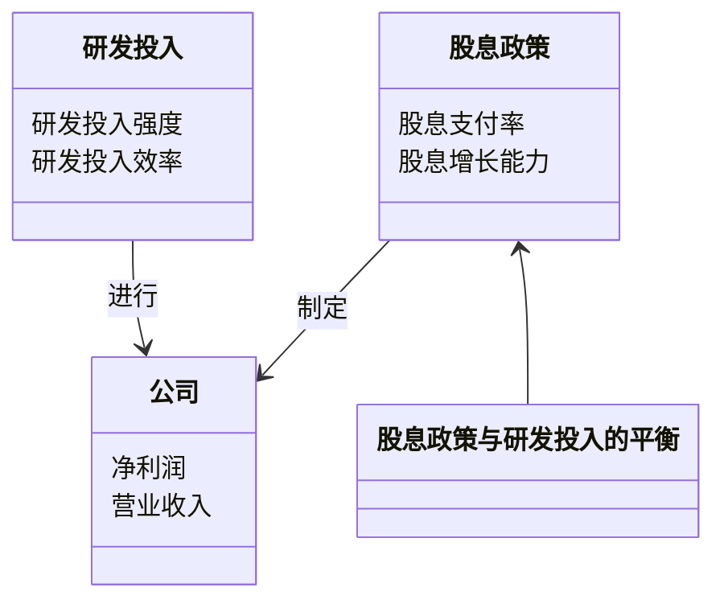

                 


# 彼得·林奇如何看待公司的股息政策与研发投入的平衡

> 关键词：彼得·林奇，股息政策，研发投入，投资策略，公司管理，平衡策略

> 摘要：本文从彼得·林奇的投资理念出发，探讨他在股息政策与研发投入之间的平衡策略。通过分析股息政策和研发投入的核心概念，构建数学模型，设计系统架构，并结合实际案例进行分析，提出平衡策略的最佳实践。文章内容详实，逻辑清晰，旨在为投资者和企业管理者提供有价值的参考。

---

## 第一部分：背景介绍

### 第1章：股息政策与研发投入的基本概念

#### 1.1 股息政策的定义与作用

股息政策是指公司对其净利润的分配方式，包括发放股息的比例和时间。合理的股息政策能够提升股东的满意度，同时吸引更多的投资者。然而，过高的股息支付率可能会影响公司的再投资能力，进而影响长期发展。

#### 1.2 研发投入的定义与作用

研发投入是公司用于新产品开发和技术改进的资金投入，是公司创新能力和核心竞争力的体现。高研发投入通常意味着公司具有更强的创新能力，但同时也需要更多的资金支持。

#### 1.3 股息政策与研发投入的关联性

股息政策和研发投入之间存在密切关联。股息政策的制定需要考虑公司的财务状况和未来发展的需求，而研发投入的增加可能会对短期的财务表现产生负面影响，但有助于公司的长期增长。

---

### 第2章：彼得·林奇的投资理念

#### 2.1 彼得·林奇的个人简介

彼得·林奇是美国著名的投资经理人，以其在富达投资集团的长期优异表现而闻名。他的投资理念强调长期价值和基本面分析，主张投资那些具有强大基本面和成长潜力的公司。

#### 2.2 彼得·林奇对股息政策的看法

彼得·林奇认为，股息是公司财务健康的重要指标，能够反映公司的盈利能力和分红能力。他倾向于投资那些能够稳定增长股息的公司，但同时也关注公司的再投资能力。

#### 2.3 彼得·林奇对研发投入的看法

彼得·林奇强调，研发投入是公司创新和成长的关键因素。他倾向于投资那些能够持续进行创新的公司，但同时也关注研发投入的效率和回报。

---

## 第二部分：核心概念与联系

### 第3章：股息政策与研发投入的核心概念

#### 3.1 股息政策的核心概念

股息政策的核心在于平衡股东的当前利益和公司的长期发展需求。高股息政策可能有助于吸引保守投资者，但可能会削弱公司的再投资能力。

#### 3.2 研发投入的核心概念

研发投入的核心在于提升公司的创新能力和市场竞争力。高研发投入可能需要公司承担更大的财务压力，但能够带来长期的收益增长。

#### 3.3 股息政策与研发投入的对比分析

通过对比股息政策和研发投入的核心概念，我们可以更好地理解它们在公司管理中的不同作用和相互影响。

| 比较维度 | 股息政策 | 研发投入 |
|----------|----------|----------|
| 目标     | 分配利润 | 创新发展 |
| 期限     | 短期收益 | 长期增长 |
| 影响因素 | 利润率、债务水平 | 行业竞争、技术发展 |
| 优先级   | 股东利益 | 公司战略 |

#### 3.4 股息政策与研发投入的实体关系图

以下是一个简单的ER图，展示了股息政策与研发投入之间的关系：

```mermaid
erDiagram
    company : 公司
    dividend_policy : 股息政策
    research_investment : 研发投入
    company --> dividend_policy : 制定
    company --> research_investment : 进行
    dividend_policy --|> company : 影响
    research_investment --|> company : 影响
```

---

## 第三部分：股息政策与研发投入的数学模型与分析

### 第4章：股息政策的数学模型

#### 4.1 股息支付率的计算公式

股息支付率是衡量公司股息支付能力的重要指标，公式为：

$$ \text{股息支付率} = \frac{\text{股息总额}}{\text{净利润}} $$

#### 4.2 股息政策的评价指标

除了股息支付率，还需要考虑股息增长能力、股息率等指标。

### 第4章：研发投入的数学模型

#### 4.3 研发投入强度的计算公式

研发投入强度是衡量公司研发投入比例的重要指标，公式为：

$$ \text{研发投入强度} = \frac{\text{研发投入总额}}{\text{营业收入}} $$

#### 4.4 研发投入的评价指标

除了研发投入强度，还需要考虑研发投入的效率和回报。

### 第4章：股息政策与研发投入的综合分析

#### 4.5 股息政策与研发投入的数学关系

通过构建数学模型，我们可以分析股息政策和研发投入之间的平衡点：

$$ \text{平衡点} = \frac{\text{股息支付率} + \text{研发投入强度}}{2} $$

---

## 第四部分：系统分析与架构设计方案

### 第5章：系统功能设计

#### 5.1 领域模型设计（Mermaid 类图）

以下是一个简单的领域模型设计图：



#### 5.2 系统架构设计（Mermaid 架构图）

以下是一个简单的系统架构设计图：


---

## 第五部分：项目实战

### 第6章：项目实战

#### 6.1 环境安装

需要安装Python和相关库，如Matplotlib和Pandas。

#### 6.2 核心实现源代码

以下是一个简单的Python代码示例：

```python
import matplotlib.pyplot as plt
import pandas as pd

# 数据读取
data = pd.read_csv('company_data.csv')

# 股息支付率计算
data['股息支付率'] = data['股息总额'] / data['净利润']

# 研发投入强度计算
data['研发投入强度'] = data['研发投入总额'] / data['营业收入']

# 可视化分析
plt.plot(data['公司名称'], data['股息支付率'], label='股息支付率')
plt.plot(data['公司名称'], data['研发投入强度'], label='研发投入强度')
plt.legend()
plt.show()
```

---

## 第六部分：总结与最佳实践

### 7.1 最佳实践 tips

1. 在制定股息政策时，需要综合考虑公司的财务状况和未来发展的需求。
2. 高研发投入的公司通常具有更强的创新能力和市场竞争力，但需要承担更大的财务压力。
3. 股息政策和研发投入的平衡需要根据公司的实际情况进行动态调整。

### 7.2 小结

通过本文的分析，我们可以看到，彼得·林奇在股息政策与研发投入的平衡方面提供了许多有益的见解。投资者和企业管理者需要根据公司的实际情况，综合考虑各种因素，制定合理的股息政策和研发投入策略。

### 7.3 注意事项

1. 股息政策和研发投入的分析需要结合公司的具体情况进行。
2. 需要关注行业的特点和公司的财务状况。
3. 需要定期评估和调整股息政策与研发投入的策略。

### 7.4 拓展阅读

1. 彼得·林奇的《投资最重要的事情》
2. 现金流分析与公司估值

---

作者：AI天才研究院/AI Genius Institute & 禅与计算机程序设计艺术/Zen And The Art of Computer Programming

