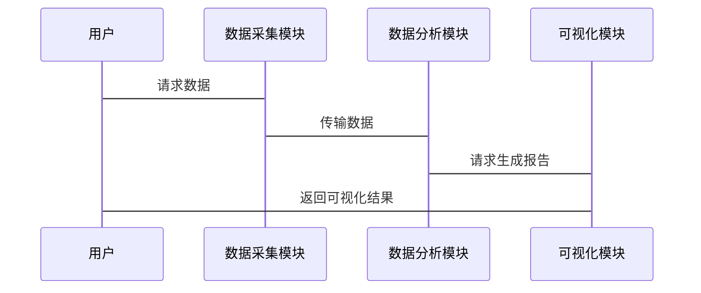

                 


# 彼得林奇如何看待公司的股息政策可持续性

## 关键词：股息政策、可持续性、彼得林奇、投资分析、财务指标、股息支付率、自由现金流

## 摘要：彼得·林奇作为著名投资专家，强调股息政策的可持续性对评估公司长期投资价值的重要性。本文从股息政策的基本概念出发，分析影响其可持续性的关键因素，探讨彼得·林奇的分析方法，建立数学模型评估可持续性，并设计系统架构支持分析。通过项目实战展示应用，并总结最佳实践和未来趋势。

---

## 第一部分：股息政策可持续性分析的背景与基础

### 第1章：股息政策的基本概念

#### 1.1 股息政策的定义
- **股息政策**是指公司董事会决定如何分配利润给股东的策略，包括股息的支付率和形式。
- 股息支付是股东回报的重要方式，直接影响股东价值。
- 股息政策类型包括稳定支付、增长支付、固定支付和特殊支付等，每种类型有其优缺点。

#### 1.2 可持续性股息政策的定义
- **可持续性**意味着公司能够长期维持股息支付，不因短期波动影响股东收益。
- 可持续股息与企业财务健康密切相关，反映公司盈利能力、现金流和债务水平。
- 彼得·林奇认为，持续稳定的股息支付是公司财务稳健和管理能力的体现。

#### 1.3 彼得·林奇的投资理念
- 彼得·林奇是价值投资的代表人物，注重基本面分析和长期投资。
- 他认为股息政策是评估公司财务健康的重要指标，稳定的股息支付反映公司盈利能力和财务稳定性。
- 林奇强调深入分析公司的财务报表，关注净利润、现金流和负债情况，以判断股息支付的可持续性。

---

## 第二部分：股息政策可持续性的影响因素

### 第2章：股息政策可持续性的影响因素分析

#### 2.1 财务状况分析
- **净利润**：公司盈利是股息支付的基础，净利润越高，支付能力越强。
- **自由现金流**：现金流反映公司实际的支付能力，充足的现金流确保股息的稳定性。
- **负债水平**：高负债可能限制股息支付，影响财务健康。

#### 2.2 行业特点与股息政策
- 不同行业盈利能力差异影响股息政策，如公用事业公司通常高股息支付。
- 行业周期性影响现金流稳定性，周期性波动大的行业股息政策可能不稳定。
- 行业竞争格局影响企业利润分配，垄断行业可能更倾向于稳定股息支付。

#### 2.3 市场环境与股息政策
- 宏观经济环境影响企业盈利能力和股息支付能力，经济下行可能降低股息支付。
- 利率水平影响股息吸引力，低利率环境可能增加股息支付的吸引力。
- 市场预期影响股息决策，市场预期乐观时，公司可能增加股息支付。

---

## 第三部分：彼得·林奇的股息政策分析方法

### 第3章：彼得·林奇的分析框架

#### 3.1 股息支付率分析
- **股息支付率**计算公式：$$股息支付率 = \frac{股息}{净利润} \times 100\%$$
- 合理股息支付率通常在30%-60%，过高可能影响再投资，过低可能影响股东回报。
- 林奇认为，股息支付率应与行业平均水平和企业盈利能力相匹配，避免过高或过低。

#### 3.2 自由现金流分析
- 自由现金流是衡量公司股息支付能力的关键指标，公式：$$FCF = 净利润 - 非现金支出$$
- 自由现金流充足表明公司有能力支付股息并进行再投资，保持增长。
- 林奇注重自由现金流的质量，确保现金流来自核心业务而非债务融资。

#### 3.3 负债与股息政策
- 负债水平影响股息支付能力，高负债公司可能优先偿还债务而非支付股息。
- 林奇分析公司的偿债能力，确保股息支付不会影响偿债能力。
- 优化负债结构，保持合理的资本结构，增强股息支付的可持续性。

---

## 第四部分：股息政策可持续性评估的数学模型

### 第4章：数学模型与分析工具

#### 4.1 股息支付率模型
- 使用$$股息支付率 = \frac{股息}{净利润} \times 100\%$$评估股息支付能力。
- 结合行业平均股息支付率，判断公司支付水平是否合理。
- 示例：某公司净利润为1000万元，支付股息300万元，股息支付率为30%，低于行业平均，具有增长潜力。

#### 4.2 自由现金流模型
- 通过$$FCF = 净利润 - 非现金支出$$计算自由现金流。
- 高FCF公司能稳定支付股息并进行投资。
- 示例：公司净利润500万元，非现金支出200万元，FCF为300万元，可用于股息支付。

#### 4.3 综合评估模型
- 综合考虑股息支付率、自由现金流、负债水平和行业特点。
- 使用加权评分法，给予各因素不同权重，计算综合得分。
- 示例：股息支付率30%（权重30%）、自由现金流充足（权重40%）、负债合理（权重20%）、行业稳定（权重10%），综合得分85分，股息政策可持续性强。

---

## 第五部分：系统分析与架构设计

### 第5章：系统架构设计

#### 5.1 系统功能设计
- 数据采集模块：获取公司财务数据，包括净利润、现金流、负债等。
- 数据分析模块：计算股息支付率、自由现金流，评估可持续性。
- 可视化模块：生成图表和报告，帮助用户直观理解分析结果。

#### 5.2 系统架构图


#### 5.3 系统接口设计
- 数据接口：与财务数据库对接，获取实时数据。
- API接口：提供分析结果，供其他系统调用。

#### 5.4 系统交互图


---

## 第六部分：项目实战

### 第6章：项目实战与案例分析

#### 6.1 环境安装
- 安装Python、Pandas、Matplotlib等工具。
- 配置数据库连接，获取财务数据。

#### 6.2 核心代码实现
```python
import pandas as pd
import matplotlib.pyplot as plt

# 示例数据
data = {
    '公司': ['公司A', '公司B', '公司C'],
    '净利润': [1000, 800, 1200],
    '股息': [300, 200, 360]
}

df = pd.DataFrame(data)
df['股息支付率'] = (df['股息'] / df['净利润']) * 100

print(df)
# 可视化
plt.bar(df['公司'], df['股息支付率'])
plt.title('股息支付率分析')
plt.xlabel('公司名称')
plt.ylabel('股息支付率(%)')
plt.show()
```

#### 6.3 案例分析
- 选取三家公司，计算股息支付率，评估可持续性。
- 使用图表展示结果，分析各公司的股息政策。

---

## 第七部分：总结与展望

### 第7章：总结与最佳实践

#### 7.1 小结
- 彼得·林奇的股息政策分析方法提供了系统的评估框架。
- 通过财务指标和数学模型，可以量化评估股息政策的可持续性。
- 结合系统分析和项目实战，能够有效应用于实际投资决策。

#### 7.2 注意事项
- 股息政策分析需结合公司整体财务状况，避免单一指标判断。
- 宏观经济和行业环境影响分析结果，需动态调整评估策略。
- 数据质量和准确性直接影响分析结果，需确保数据来源可靠。

#### 7.3 未来展望
- 结合人工智能技术，提升分析效率和准确性。
- 开发自动化分析工具，帮助投资者快速评估股息政策可持续性。

---

## 作者：AI天才研究院/AI Genius Institute & 禅与计算机程序设计艺术 /Zen And The Art of Computer Programming

---

这篇文章通过详细分析彼得·林奇的股息政策分析方法，结合数学模型和系统设计，提供了全面的分析框架。通过实际案例和项目实战，帮助读者掌握如何评估股息政策的可持续性，应用于投资决策。

