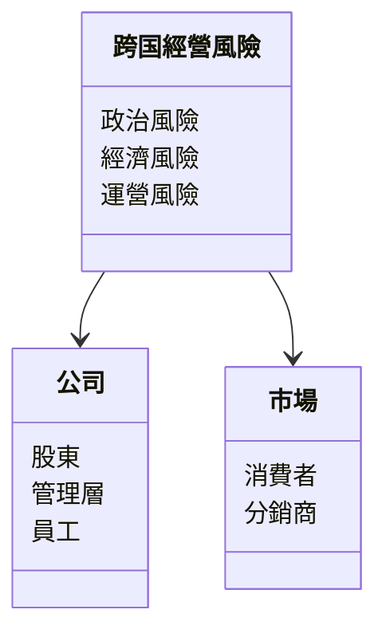
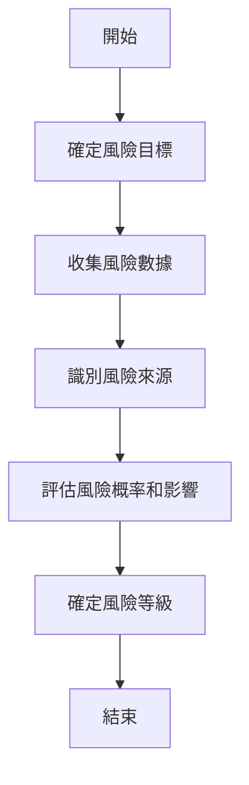

                 

# 彼得林奇如何看待公司的跨国经营风险

## 关键词：跨国经营风险、彼得·林奇、价值投资、风险管理、企业国际化

## 摘要：本文探讨了彼得·林奇对跨国公司经营风险的看法，分析了跨国经营的主要风险类型，并提出了风险管理策略。通过案例分析，展示了如何将价值投资理念应用于跨国经营风险的评估和管理。

---

## 第一章：引言

跨国经营已成为现代企业发展的必然趋势，但随之而来的是复杂的风险。本文将从彼得·林奇的投资视角，分析跨国经营风险，并提供风险管理的策略。

---

## 第二章：跨国经营风险的背景分析

### 2.1 全球经济一体化

跨国经营是企业扩张的必然选择，但涉及多国市场，面临政策、经济和文化差异等挑战。

### 2.2 跨国經營的動機與挑戰

企业跨国经营的动机包括资源获取、市场扩展和成本降低，但同时也面临法律、税务和物流等挑战。

### 2.3 主要風險類型

- **政治风险**：政策变化、贸易壁垒等。
- **经济风险**：汇率波动、通货膨胀。
- **运营风险**：供应链中断、文化差异。

---

## 第三章：跨国经营风险的核心概念

### 3.1 领域模型MERMAID类图

### 3.2 系统架构设计MERMAID架构图

---

## 第四章：跨国经营风险的评估方法

### 4.1 定性评估方法

- 风险矩阵：将风险按影响和概率分类。
- 风险评分系统：综合评分评估风险等级。

### 4.2 定量评估方法

- 使用统计模型预测风险概率。
- 风险矩阵公式：
  $$ \text{风险评分} = \text{影响} \times \text{概率} $$

### 4.3 评估流程

---

## 第五章：风险管理策略

### 5.1 风险控制

- 建立风险管理团队。
- 制定应急预案。

### 5.2 分散投资

- 多国市场布局，降低单一市场风险。

### 5.3 套期保值

- 使用金融工具对冲汇率和利率风险。

### 5.4 保险工具

- 购买适当的保险产品，转移风险。

---

## 第六章：彼得·林奇的投资策略

### 6.1 价值投资理念

- 选择具有持续竞争优势的公司。
- 评估公司的内在价值，确保安全边际。

### 6.2 风险管理

- 分散投资组合，降低特定风险。
- 定期评估投资组合，及时调整。

### 6.3 案例分析

- **可口可乐**：全球品牌，具备强大的市场地位。
- **强生公司**：稳定的现金流，良好的分红政策。

---

## 第七章：结论

跨国经营风险是企业国际化过程中必须面对的挑战。通过彼得·林奇的价值投资理念，企业可以更好地识别和管理风险，实现稳健增长。

---

## 附录

### A.1 术语表

- 跨国經營風險：企业在跨国经营中可能遇到的各类风险。

### A.2 案例分析

- 案例1：可口可乐的国际化策略。
- 案例2：强生公司的风险管理。

### A.3 工具列表

- 风险矩阵
- 风险评分系统
- 套期保值工具

---

## 作者：AI天才研究院/Zen And The Art of Computer Programming

