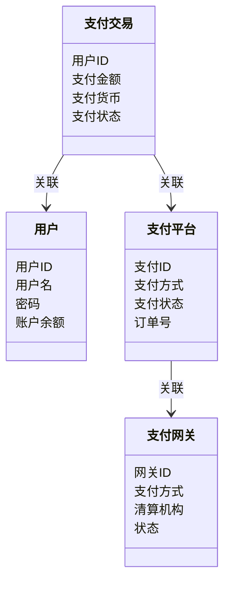
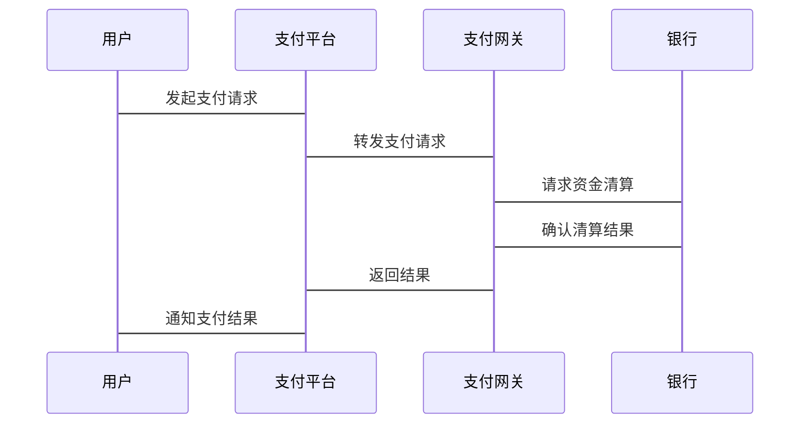

                 


# 彼得林奇如何看待公司的跨境支付策略对增长的影响

**关键词**: 跨境支付，彼得林奇，支付策略，经济增长，投资策略

**摘要**: 本文从彼得林奇的投资视角，分析了跨境支付策略对经济增长的影响。通过详细的技术背景分析、支付策略的核心要素、系统架构设计以及实际案例的探讨，揭示了如何通过优化支付策略来推动企业增长。文章结合了支付技术、投资策略和系统架构的深入分析，为读者提供了全面的视角和实用的见解。

---

## 第一部分: 背景与现状

### 第1章: 跨境支付的背景与现状

#### 1.1 跨境支付的基本概念

##### 1.1.1 跨境支付的定义
跨境支付是指在不同国家或地区之间进行的款项划转，涉及货币兑换、汇率波动、支付清算等多个环节。跨境支付的主体包括个人、企业、金融机构等，主要通过银行、支付平台或其他金融服务机构完成。

##### 1.1.2 跨境支付的主要参与者
- **个人用户**: 通过电商平台或移动支付应用进行跨国购物或转账。
- **企业用户**: 进行国际贸易结算、跨境收款或支付。
- **金融机构**: 包括银行、支付平台（如支付宝、PayPal）、清算机构等，负责处理支付交易和资金清算。

##### 1.1.3 跨境支付的流程与特点
跨境支付的流程通常包括以下几个步骤：
1. 用户发起支付请求。
2. 支付平台接收请求并进行验证。
3. 货币兑换（如需要）。
4. 资金清算。
5. 交易确认。

特点：
- **复杂性**: 涉及不同国家的法律法规、汇率波动等。
- **高效性**: 需要快速完成交易以满足客户需求。
- **安全性**: 对抗欺诈、数据泄露等安全风险。

#### 1.2 跨境支付的现状分析

##### 1.2.1 当前跨境支付的主要模式
- **传统银行模式**: 通过银行进行跨境汇款，费用较高，速度较慢。
- **第三方支付平台**: 如支付宝、PayPal，提供便捷的支付服务，覆盖范围广。
- **区块链支付**: 利用区块链技术实现快速、透明的跨境支付。

##### 1.2.2 跨境支付的主要技术手段
- **API集成**: 支付平台通过API接口与企业系统对接。
- **智能合约**: 利用区块链技术实现自动化的支付流程。
- **身份验证技术**: 如OAuth、2FA（双因素认证）等，确保交易安全。

##### 1.2.3 跨境支付面临的挑战与痛点
- **高昂的手续费**: 银行和支付平台收取的费用较高。
- **汇率风险**: 汇率波动可能导致交易成本增加或收益减少。
- **合规性问题**: 不同国家的法律法规差异大，容易出现合规问题。

#### 1.3 跨境支付对经济增长的影响

##### 1.3.1 跨境支付对国际贸易的促进作用
跨境支付的便利化促进了国际贸易的发展，降低了交易成本，提高了交易效率。

##### 1.3.2 跨境支付对企业的资金流动效率提升
通过优化支付流程，企业能够更快地完成资金收付，提高资金周转率。

##### 1.3.3 跨境支付对个人消费者的影响
个人消费者可以更方便地进行跨国购物和转账，提升消费体验。

---

### 第2章: 彼得林奇的投资策略与视角

#### 2.1 彼得林奇的投资理念

##### 2.1.1 长期投资与价值投资
彼得林奇强调长期投资，注重企业的基本面分析，寻找具有持续增长潜力的企业。

##### 2.1.2 宏观经济分析的重要性
彼得林奇认为，宏观经济环境对企业的发展至关重要，投资者需要关注整体经济趋势。

##### 2.1.3 企业基本面分析的核心作用
彼得林奇强调对企业财务状况、盈利能力、管理团队等基本面因素的深入分析。

#### 2.2 彼得林奇对支付行业的关注点

##### 2.2.1 支付行业的发展趋势
支付行业正朝着便捷化、智能化和全球化方向发展，技术进步和法规变化是关键因素。

##### 2.2.2 支付行业的竞争格局
支付行业竞争激烈，传统银行与新兴支付平台并存，技术创新是核心竞争力。

##### 2.2.3 支付行业的风险与机遇
- **风险**: 法律合规风险、技术安全风险、汇率波动风险。
- **机遇**: 全球化趋势、技术创新、市场扩张。

#### 2.3 彼得林奇对跨境支付策略的评价标准

##### 2.3.1 企业的市场定位与竞争优势
彼得林奇关注企业的市场定位是否清晰，是否具备独特的竞争优势。

##### 2.3.2 企业的财务健康状况
企业的财务状况是否稳健，是否有足够的资金支持支付策略的实施。

##### 2.3.3 企业的管理团队与战略规划
管理团队的能力和战略规划是否合理，是否能够应对跨境支付中的挑战。

---

## 第二部分: 跨境支付策略的分析与优化

### 第3章: 跨境支付策略的核心要素

#### 3.1 跨境支付策略的定义与分类

##### 3.1.1 跨境支付策略的定义
跨境支付策略是指企业在进行跨境支付时所采用的一系列方法和措施，旨在优化支付效率、降低成本并确保交易安全。

##### 3.1.2 跨境支付策略的分类
- **基于技术的策略**: 如使用区块链技术、API集成等。
- **基于成本的策略**: 如选择低手续费的支付平台。
- **基于风险的策略**: 如加强身份验证、防范欺诈。

#### 3.2 跨境支付策略的关键影响因素

##### 3.2.1 支付技术的先进性
先进的支付技术能够提高支付效率、降低成本并增强安全性。

##### 3.2.2 服务成本的经济性
支付策略需要在成本和效率之间找到平衡点，选择经济可行的方案。

##### 3.2.3 法律法规的合规性
遵守不同国家的法律法规是跨境支付策略实施的重要前提。

#### 3.3 跨境支付策略的实施步骤

##### 3.3.1 确定支付目标与范围
明确支付的目标市场和支付范围，制定清晰的支付策略。

##### 3.3.2 选择支付渠道与合作伙伴
根据目标市场选择合适的支付渠道，并与可靠的支付平台建立合作关系。

##### 3.3.3 制定风险管理与应急预案
识别潜在风险，制定应对措施，建立应急预案。

### 第4章: 跨境支付策略对增长的影响

#### 4.1 跨境支付策略对企业增长的推动作用

##### 4.1.1 提升企业的全球市场覆盖能力
通过优化跨境支付策略，企业能够更好地拓展国际市场，提高市场覆盖率。

##### 4.1.2 优化企业的资金流动效率
高效的支付策略能够缩短资金周转周期，提高资金利用效率。

##### 4.1.3 增强企业的客户满意度与忠诚度
便捷的支付方式和高效的支付流程能够提升客户满意度，增强客户忠诚度。

#### 4.2 跨境支付策略对客户增长的影响

##### 4.2.1 提供更便捷的支付方式
多样化的支付方式能够满足不同客户的需求，提升客户体验。

##### 4.2.2 降低支付成本与风险
通过优化支付策略，降低支付成本和风险，增强客户信任。

##### 4.2.3 增强客户信任与粘性
安全、可靠的支付系统能够增强客户对企业的信任，提高客户粘性。

#### 4.3 跨境支付策略对整体经济增长的贡献

##### 4.3.1 促进国际贸易的便利化
高效的跨境支付策略能够降低国际贸易的门槛，促进贸易自由化。

##### 4.3.2 推动金融科技的创新发展
跨境支付技术的进步推动了金融科技的发展，促进了金融创新。

##### 4.3.3 优化全球支付体系的效率
通过优化跨境支付流程，全球支付体系的效率得到提升，促进全球经济一体化。

---

## 第三部分: 系统分析与架构设计方案

### 第5章: 系统功能设计

#### 5.1 问题场景介绍
跨境支付系统需要满足以下需求：
- 支持多种支付方式。
- 实现跨货币支付。
- 提供实时交易确认。
- 具备风险管理功能。

#### 5.2 领域模型设计
以下是领域模型的类图（使用Mermaid）：



#### 5.3 系统架构设计
以下是系统架构图（使用Mermaid）：

```mermaid
client
    右 side
    user --> 支付平台
    支付平台 --> 支付网关
    支付网关 --> 银行
    银行 --> 支付平台
    支付平台 --> 用户
```

#### 5.4 系统接口设计
主要接口包括：
- 用户发起支付请求接口。
- 支付平台处理支付请求接口。
- 支付网关进行资金清算接口。
- 系统状态查询接口。

#### 5.5 系统交互设计
以下是系统交互图（使用Mermaid）：



---

## 第四部分: 项目实战

### 第6章: 环境安装与代码实现

#### 6.1 环境安装
需要安装以下工具：
- Python 3.8+
- pip
- Flask框架
- MongoDB或MySQL数据库

#### 6.2 核心实现源代码
以下是支付系统的核心代码示例：

```python
from flask import Flask, jsonify
from pymongo import MongoClient

app = Flask(__name__)
client = MongoClient('mongodb://localhost:27017/')

db = client['cross_payment']
collection = db['transactions']

@app.route('/initiate_payment', methods=['POST'])
def initiate_payment():
    data = request.json
    # 验证用户身份
    user = db.users.find_one({'user_id': data['user_id']})
    if not user:
        return jsonify({'status': 'error', 'message': '用户不存在'})
    
    # 计算支付金额和货币转换
    amount = data['amount']
    from_currency = data['from_currency']
    to_currency = data['to_currency']
    
    # 简单的汇率计算（实际应使用实时汇率）
    exchange_rate = get_exchange_rate(from_currency, to_currency)
    total_amount = amount * exchange_rate
    
    # 记录交易
    transaction = {
        'user_id': user['user_id'],
        'amount': amount,
        'from_currency': from_currency,
        'to_currency': to_currency,
        'total_amount': total_amount,
        'status': 'pending'
    }
    collection.insert_one(transaction)
    
    return jsonify({'status': 'success', 'message': '支付请求已发起'})

def get_exchange_rate(from_currency, to_currency):
    # 这里简单返回固定汇率，实际应调用实时汇率API
    rates = {
        'USD': {'EUR': 0.85, 'GBP': 0.75},
        'EUR': {'USD': 1.18, 'GBP': 0.85},
        'GBP': {'USD': 1.34, 'EUR': 1.18}
    }
    return rates.get(from_currency, {}).get(to_currency, 1.0)
```

---

## 第五部分: 总结与展望

### 第7章: 总结与展望

#### 7.1 项目小结
本文从彼得林奇的投资视角，详细分析了跨境支付策略对经济增长的影响。通过技术背景分析、系统架构设计和实际案例探讨，揭示了如何优化支付策略以推动企业增长。

#### 7.2 最佳实践 tips
- **选择合适的支付平台**: 根据目标市场和业务需求选择支付方式。
- **关注法律法规**: 确保支付策略符合目标国家的法律法规。
- **注重风险管理**: 建立完善的风险管理体系，防范支付风险。

#### 7.3 展望
未来，随着区块链、人工智能等技术的发展，跨境支付将更加高效、安全和便捷。彼得林奇的投资理念也将继续影响支付行业的发展，为企业增长提供新的动力。

---

**作者：AI天才研究院/AI Genius Institute & 禅与计算机程序设计艺术 /Zen And The Art of Computer Programming**

