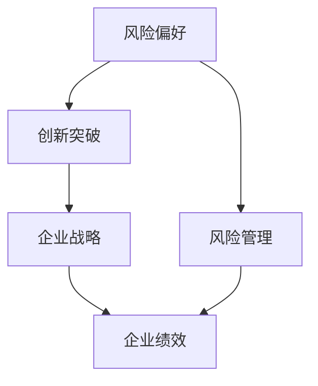
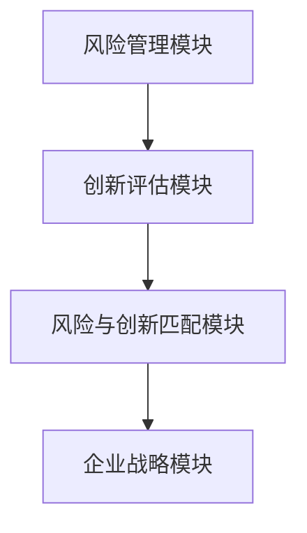

                 


# 彼得林奇如何看待公司的风险偏好与创新突破的相关性

> 关键词：彼得·林奇, 风险偏好, 创新突破, 投资理念, 风险管理

> 摘要：本文深入分析了彼得·林奇的投资理念和他对公司风险偏好与创新突破之间关系的独特见解。通过详细阐述他的风险管理策略、对创新的支持与限制，以及如何在企业战略中平衡风险与创新，本文为读者提供了深刻的见解和实用的指导。

---

## 第1章: 风险偏好与创新突破的背景介绍

### 1.1 风险偏好的定义与特征

#### 1.1.1 风险偏好的核心概念
风险偏好是指企业在面对不确定性时所愿意承担的风险程度。它反映了企业在追求目标过程中对风险的接受程度，通常与企业的战略目标、市场环境和管理层决策密切相关。

#### 1.1.2 风险偏好的分类与特点
- **保守型**：倾向于避免高风险投资，注重稳健和安全。
- **平衡型**：在风险和回报之间寻求平衡，注重控制风险。
- **激进型**：愿意承担高风险以追求高回报。

#### 1.1.3 风险偏好与企业战略的关系
企业的风险偏好直接影响其战略选择，例如市场进入策略、产品开发决策和资本分配。

### 1.2 创新突破的定义与特征

#### 1.2.1 创新突破的核心概念
创新突破是指企业通过引入新产品、服务、技术或商业模式，打破现有市场格局，创造新的增长点。

#### 1.2.2 创新突破的分类与特点
- **技术创新**：通过新技术实现突破。
- **商业模式创新**：通过新的商业模式实现突破。
- **市场创新**：通过开拓新市场实现突破。

#### 1.2.3 创新突破与企业发展的关系
创新突破是企业持续发展的关键，能够帮助企业在竞争中占据优势，但也伴随着较高的风险。

### 1.3 风险偏好与创新突破的相互作用

#### 1.3.1 风险偏好对创新突破的影响
- **保守型**：限制创新，注重稳定。
- **平衡型**：适度创新，注重风险控制。
- **激进型**：鼓励高风险创新，追求高回报。

#### 1.3.2 创新突破对风险偏好的反作用
创新突破可能增加企业的风险，促使企业调整其风险偏好。

#### 1.3.3 两者的相互关系与平衡
企业在追求创新的同时，需要平衡风险，以确保创新的可持续性。

---

## 第2章: 彼得·林奇的投资理念与风险管理

### 2.1 彼得·林奇的投资哲学

#### 2.1.1 林奇的投资理念
林奇强调基本面分析，注重企业的财务健康和管理层能力，认为长期投资是成功的基石。

#### 2.1.2 林奇对风险的理解
他认为风险在于企业本身，而非市场波动，强调分散投资以降低风险。

#### 2.1.3 林奇对创新的看法
林奇支持创新，但强调创新必须基于稳健的财务基础和市场需求。

### 2.2 林奇的风险管理策略

#### 2.2.1 林奇的风险评估方法
- 评估企业的财务状况。
- 分析管理层的能力和决策。
- 研究行业前景和竞争环境。

#### 2.2.2 林奇的风险控制措施
- 分散投资，避免过度集中。
- 定期评估投资组合，及时调整。
- 保持足够的流动性，应对市场变化。

#### 2.2.3 林奇的风险分散策略
通过投资多样化企业，降低特定风险，同时抓住创新带来的机会。

### 2.3 林奇对创新突破的支持与限制

#### 2.3.1 林奇支持创新的条件
- 创新必须符合市场需求。
- 创新必须有稳健的财务支持。
- 创新必须有明确的商业计划。

#### 2.3.2 林奇对过度创新的警示
- 过度创新可能导致资源浪费。
- 过度创新可能忽略市场需求。
- 创新必须与企业能力相匹配。

#### 2.3.3 林奇对创新与风险的平衡观点
创新是必要的，但必须在可控风险范围内进行，避免盲目追求创新而忽视企业的财务健康。

---

## 第3章: 风险偏好与创新突破的核心概念与联系

### 3.1 核心概念的原理分析

#### 3.1.1 风险偏好的核心要素
- **风险容忍度**：企业愿意承担的风险水平。
- **风险评估**：企业对风险的识别和评估过程。
- **风险控制**：企业对风险的管理和应对策略。

#### 3.1.2 创新突破的核心要素
- **创新动机**：企业进行创新的原因和目标。
- **创新能力**：企业实施创新的能力和资源。
- **创新成果**：创新带来的成果和影响。

#### 3.1.3 两者的核心联系
风险偏好影响企业的创新决策，创新突破可能改变企业的风险偏好。

### 3.2 风险偏好与创新突破的对比分析

#### 3.2.1 风险偏好的属性特征
- 稳定性：长期稳定的财务状况。
- 灵活性：根据环境变化调整风险偏好。
- 系统性：全面的评估和管理过程。

#### 3.2.2 创新突破的属性特征
- 前瞻性：预测未来趋势和机会。
- 突破性：打破常规，创造新价值。
- 风险性：创新可能带来不确定的结果。

#### 3.2.3 两者属性的对比与总结
风险偏好注重稳健和控制，创新突破注重前瞻性和突破性。两者在企业战略中相辅相成，共同推动企业成长。

### 3.3 实体关系图



---

## 第4章: 风险偏好与创新突破的系统分析与架构设计

### 4.1 系统分析

#### 4.1.1 问题场景介绍
企业在制定战略时，需要在风险偏好和创新突破之间找到平衡，以实现可持续增长。

#### 4.1.2 项目介绍
通过分析彼得·林奇的观点，构建一个系统模型，帮助企业平衡风险偏好与创新突破。

#### 4.1.3 系统功能设计
- 风险评估模块：评估企业的风险偏好。
- 创新评估模块：评估企业的创新能力。
- 风险与创新匹配模块：分析两者的关系，提出优化建议。

#### 4.1.4 系统架构设计



---

## 第5章: 风险偏好与创新突破的系统实现

### 5.1 系统核心实现源代码

#### 5.1.1 风险评估函数
```python
def assess_risk(preferred_risk, financial_health):
    if financial_health < 0.5:
        return "High Risk"
    else:
        if preferred_risk == "Conservative":
            return "Low Risk"
        elif preferred_risk == "Balanced":
            return "Moderate Risk"
        else:
            return "High Risk"
```

#### 5.1.2 创新评估函数
```python
def assess_innovation(innovation_score, market_trend):
    if market_trend > 0.7:
        return "High Innovation Potential"
    else:
        if innovation_score > 0.6:
            return "Moderate Innovation Potential"
        else:
            return "Low Innovation Potential"
```

---

## 第6章: 风险偏好与创新突破的案例分析

### 6.1 案例介绍
分析一家科技公司在风险偏好和创新突破方面的实践，展示如何平衡两者。

---

## 第7章: 总结与展望

### 7.1 总结
彼得·林奇的观点强调了在创新与风险之间找到平衡的重要性，企业需要根据自身情况制定合适的战略。

### 7.2 展望
未来，随着市场环境的变化，企业需要更加灵活地调整风险偏好，以支持持续的创新突破。

---

## 作者：AI天才研究院/AI Genius Institute & 禅与计算机程序设计艺术 /Zen And The Art of Computer Programming

