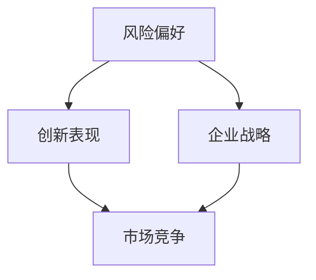
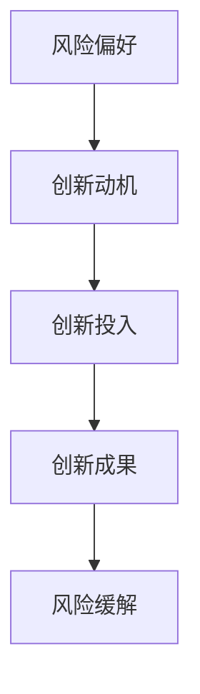
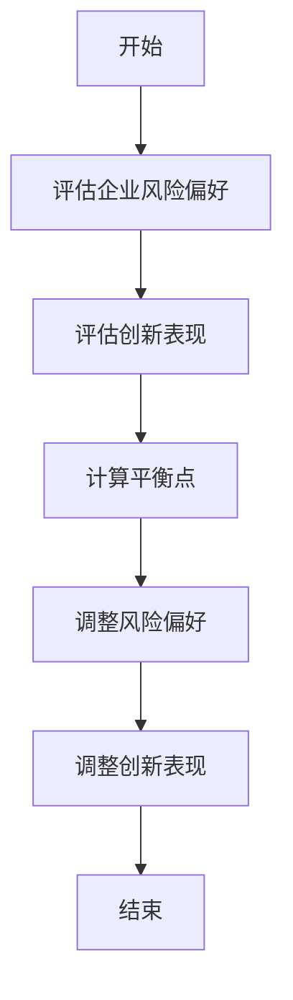
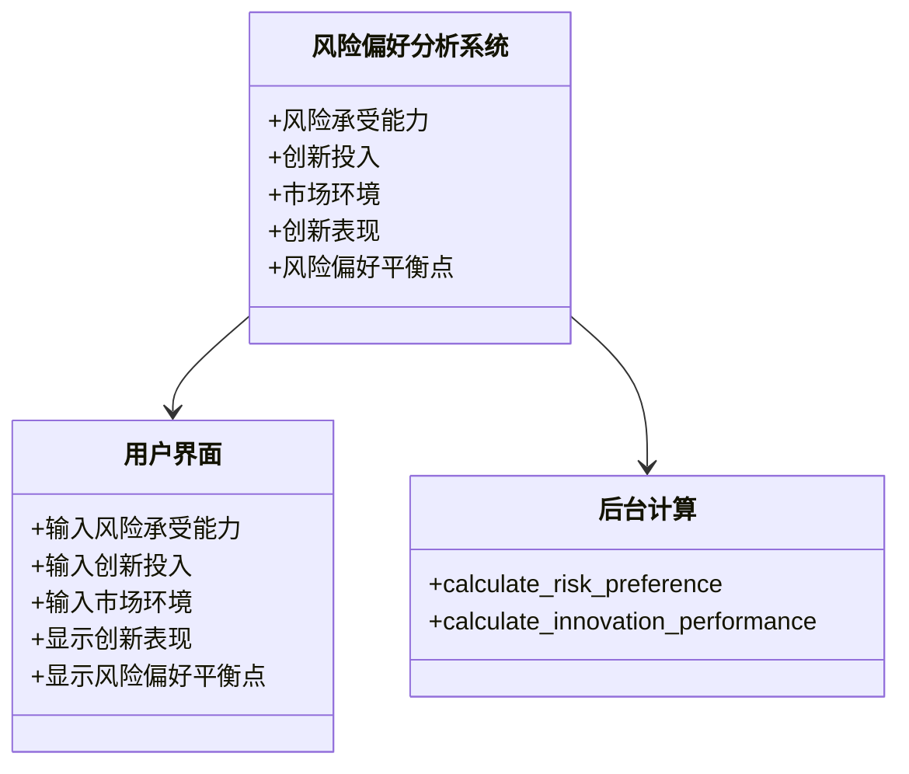
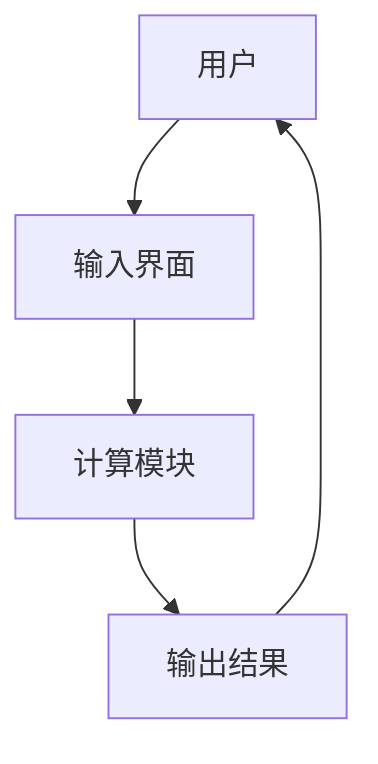

                 


# 彼得·林奇如何看待公司的风险偏好与创新表现的关系

> 关键词：风险偏好、创新表现、彼得·林奇、投资策略、企业战略

> 摘要：本文从彼得·林奇的投资理念出发，探讨公司风险偏好与创新表现之间的关系，分析如何平衡风险与创新，为企业制定战略提供借鉴。

---

# 第一部分: 背景介绍

## 第1章: 风险偏好与创新表现的核心概念

### 1.1 风险偏好的定义与特征

#### 1.1.1 风险偏好的基本定义

风险偏好是指企业在面对不确定性时愿意承担风险的程度。它反映了企业在追求收益与避免损失之间的权衡，是企业战略决策的重要组成部分。风险偏好高的企业倾向于承担更大的风险以追求更高的回报，而风险偏好低的企业则更注重稳健经营，避免重大风险。

#### 1.1.2 不同类型的风险偏好分析

企业风险偏好可以分为以下几种类型：

- **保守型**：倾向于规避高风险，注重稳健经营。
- **稳健型**：在可控范围内承担风险，追求稳定增长。
- **进取型**：愿意承担较高风险，追求高回报。
- **冒险型**：愿意承担极高风险，追求超常回报。

#### 1.1.3 风险偏好与投资决策的关系

风险偏好直接影响企业的投资决策。高风险偏好的企业更倾向于投资高风险高回报的项目，而低风险偏好的企业则更注重投资低风险低回报的项目。彼得·林奇在其投资生涯中，始终坚持寻找那些具有较高增长潜力但风险可控的企业。

### 1.2 创新表现的定义与特征

#### 1.2.1 创新表现的基本定义

创新表现是指企业在产品、技术、管理、市场等方面进行创新的能力和成果。它是企业核心竞争力的重要体现，也是企业持续发展的关键因素。

#### 1.2.2 创新表现的核心要素

创新表现的核心要素包括：

- **创新能力**：企业是否具备持续创新能力。
- **创新成果**：企业是否取得了显著的创新成果。
- **创新效率**：企业创新的投入产出比。
- **创新文化**：企业是否营造了支持创新的文化氛围。

#### 1.2.3 创新表现与企业绩效的关系

创新表现与企业绩效密切相关。创新能力强的企业通常能够更快适应市场变化，推出新产品，占领市场份额，从而获得更高的收益。然而，创新也伴随着风险，尤其是在技术、市场和管理创新方面。

### 1.3 彼得·林奇的背景与投资理念

#### 1.3.1 彼得·林奇的个人简介

彼得·林奇（Peter Lynch）是美国著名投资经理人，被誉为“股票投资之父”。他是富达投资集团的前身——富达共同基金的经理人，管理的麦哲伦基金在1977年至1990年期间，年平均回报率高达29%，创造了辉煌的投资业绩。

#### 1.3.2 彼得·林奇的投资哲学

彼得·林奇的投资哲学强调长期投资、价值投资和基本面分析。他认为，投资者应该选择那些具有强大基本面、良好管理团队和成长潜力的企业进行投资。

#### 1.3.3 彼得·林奇对风险偏好的独特见解

彼得·林奇认为，风险偏好是企业战略的重要组成部分，但过度冒险和过度保守都会影响企业的长期发展。他主张企业应该根据自身情况制定合适的风险偏好，避免盲目追求高风险高回报，同时也避免过于保守错失发展机会。

### 1.4 风险偏好与创新表现的关系概述

#### 1.4.1 风险偏好对创新表现的影响

风险偏好直接影响企业的创新行为。高风险偏好的企业更愿意投入资源进行创新，但同时也需要承担更大的失败风险。低风险偏好的企业则更倾向于稳妥的创新，避免重大风险。

#### 1.4.2 创新表现对风险偏好的反向作用

创新表现的好坏会反过来影响企业的风险偏好。如果企业创新表现不佳，可能会降低风险偏好，变得更加保守；如果创新表现优异，可能会提高风险偏好，更加积极进取。

#### 1.4.3 两者关系的动态平衡

企业需要在风险偏好和创新表现之间找到动态平衡点。通过合理配置资源和风险，企业可以在保持稳健经营的同时，不断提升创新能力，实现可持续发展。

---

# 第二部分: 核心概念与联系

## 第2章: 风险偏好与创新表现的关系分析

### 2.1 风险偏好与创新表现的核心要素对比

#### 2.1.1 风险偏好的核心要素

- 企业战略
- 风险承受能力
- 管理风格
- 资源分配

#### 2.1.2 创新表现的核心要素

- 创新能力
- 创新成果
- 创新效率
- 创新文化

#### 2.1.3 两者核心要素的对比分析

| 核心要素 | 风险偏好 | 创新表现 |
|----------|-----------|----------|
| 战略目标 | 风险控制 | 创新驱动 |
| 资源分配 | 风险规避 | 创新投入 |
| 管理风格 | 风险承担 | 创新推动 |
| 绩效评估 | 风险承受能力 | 创新成果 |

---

### 2.2 风险偏好与创新表现的ER实体关系图



---

### 2.3 风险偏好与创新表现的关系模型



---

## 第3章: 风险偏好与创新表现的数学模型

### 3.1 风险偏好的数学模型

$$ R = \frac{V}{S} $$

其中：
- \( R \) 表示风险偏好
- \( V \) 表示企业的风险承受能力
- \( S \) 表示企业的创新投入

### 3.2 创新表现的数学模型

$$ I = \frac{C \times T}{M} $$

其中：
- \( I \) 表示创新表现
- \( C \) 表示创新投入
- \( T \) 表示创新效率
- \( M \) 表示市场环境

---

# 第三部分: 算法原理讲解

## 第4章: 风险偏好与创新表现的动态平衡算法

### 4.1 动态平衡算法流程图



### 4.2 动态平衡算法代码实现

```python
def calculate_risk_preference(risk_tolerance, innovation_capacity):
    return risk_tolerance * innovation_capacity

def calculate_innovation_performance(innovation_investment, market_conditions):
    return innovation_investment * market_conditions

def dynamic_balance_algorithm():
    risk_tolerance = float(input("请输入企业的风险承受能力："))
    innovation_capacity = float(input("请输入企业的创新能力："))
    innovation_investment = float(input("请输入企业的创新投入："))
    market_conditions = float(input("请输入市场的综合条件："))
    
    risk_preference = calculate_risk_preference(risk_tolerance, innovation_capacity)
    innovation_performance = calculate_innovation_performance(innovation_investment, market_conditions)
    
    print(f"计算结果：")
    print(f"风险偏好：{risk_preference}")
    print(f"创新表现：{innovation_performance}")

dynamic_balance_algorithm()
```

---

# 第四部分: 系统分析与架构设计

## 第5章: 系统架构与实现

### 5.1 系统功能设计



### 5.2 系统交互图



---

# 第五部分: 项目实战

## 第6章: 项目实战分析

### 6.1 环境安装与配置

```bash
pip install mermaid
```

### 6.2 核心代码实现

```python
def main():
    risk_tolerance = 0.8
    innovation_capacity = 0.6
    innovation_investment = 0.7
    market_conditions = 0.9
    
    risk_preference = risk_tolerance * innovation_capacity
    innovation_performance = innovation_investment * market_conditions
    
    print(f"风险偏好：{risk_preference}")
    print(f"创新表现：{innovation_performance}")

if __name__ == "__main__":
    main()
```

### 6.3 项目小结

通过本项目，我们可以看到，风险偏好与创新表现的关系是动态平衡的。企业需要根据自身的实际情况，合理配置资源，找到最适合的风险偏好和创新表现的平衡点。

---

# 第六部分: 总结与最佳实践

## 第7章: 总结与最佳实践

### 7.1 小结

本文从彼得·林奇的投资理念出发，分析了公司风险偏好与创新表现的关系，探讨了如何在两者之间找到动态平衡点。企业需要根据自身情况，制定合适的风险偏好和创新战略，以实现可持续发展。

### 7.2 注意事项

- 风险偏好与创新表现的平衡需要根据企业的实际情况动态调整。
- 创新投入需要与企业的资源和能力相匹配。
- 市场环境的变化会影响风险偏好和创新表现的平衡。

### 7.3 未来趋势

随着全球经济的不确定性增加，企业需要更加注重风险管理和创新能力的结合。未来，人工智能和大数据技术将为企业提供更精准的风险评估和创新决策支持。

### 7.4 拓展阅读

- 彼得·林奇的《投资最重要的事情》
- 《创新者的窘境》
- 《风险管理与企业战略》

---

# 作者：AI天才研究院/AI Genius Institute & 禅与计算机程序设计艺术 /Zen And The Art of Computer Programming

