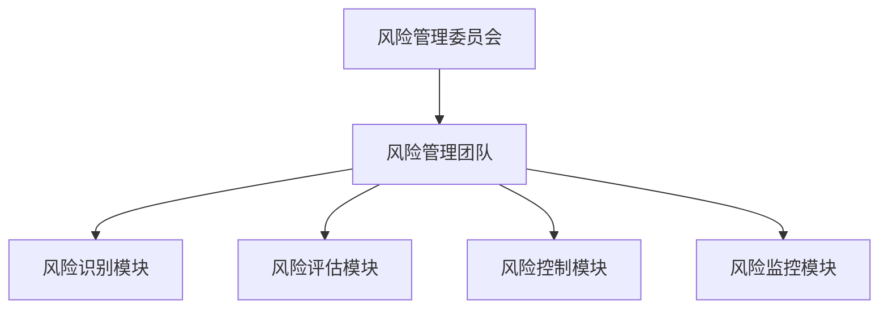
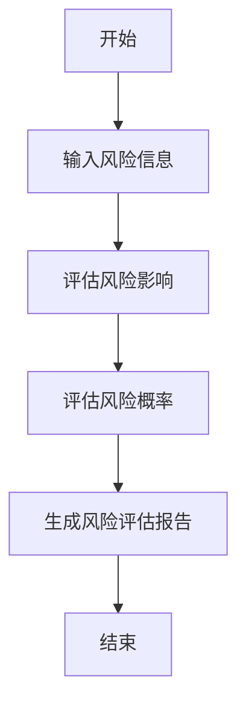

                 


# 彼得林奇如何看待公司的风险管理文化

---

## 关键词：
风险管理、彼得林奇、风险管理文化、投资哲学、风险评估、风险管理策略、风险管理系统

---

## 摘要：
本文从彼得·林奇的投资哲学出发，深入探讨他对公司风险管理文化的独特见解。通过分析风险管理的核心概念、策略和实施方法，结合实际案例，详细阐述如何构建有效的风险管理文化。文章还提供了风险管理系统的架构设计、数学模型和算法实现，为公司风险管理提供理论支持和实践指导。

---

## 第1章: 风险管理的基本概念与重要性

### 1.1 风险管理的定义与核心要素
#### 1.1.1 风险的定义与分类
风险是指在特定条件下，某一事件可能发生的概率及其影响程度的组合。根据来源和性质，风险可以分为市场风险、信用风险、操作风险、流动性风险和声誉风险。

| 风险类型 | 定义 | 示例 |
|----------|------|------|
| 市场风险 | 由于市场波动引起的资产价格变化风险 | 股票市场下跌导致投资损失 |
| 信用风险 | 债务人或交易对手无法履行合同义务的风险 | 客户违约导致应收账款无法收回 |
| 操作风险 | 由于内部操作失误或外部事件引起的损失风险 | 系统故障导致交易失败 |
| 流动性风险 | 资产无法快速变现而不影响其市场价值的风险 | 资金链断裂导致项目延期 |

#### 1.1.2 风险管理的核心要素
风险管理的核心要素包括风险识别、风险评估、风险控制和风险监控。

- **风险识别**：通过分析和监测潜在风险源，识别可能影响公司运营的风险。
- **风险评估**：量化风险的影响程度和发生概率，确定风险的优先级。
- **风险控制**：采取措施降低风险发生的概率或影响程度。
- **风险监控**：持续监测风险状态，及时调整风险管理策略。

#### 1.1.3 风险管理的重要性
风险管理是企业稳健经营的基础，能够帮助企业避免重大损失，确保战略目标的实现。通过有效的风险管理，企业可以增强投资者信心，提升市场竞争力。

### 1.2 彼得·林奇与风险管理文化
#### 1.2.1 彼得·林奇的背景与投资理念
彼得·林奇是美国著名投资家，曾管理富达麦哲伦基金，创造了辉煌的投资业绩。他的投资哲学强调长期投资、价值投资和风险控制。

#### 1.2.2 风险管理在投资中的地位
在彼得·林奇看来，风险管理是投资成功的关键。他强调通过分散投资、严格选股和风险评估来降低投资风险。

#### 1.2.3 彼得·林奇的风险管理方法论
彼得·林奇的风险管理方法包括：
- **分散投资**：通过投资不同行业和资产类别降低风险。
- **严格选股**：选择基本面良好、估值合理的公司。
- **风险预警**：定期评估投资组合的风险敞口，及时调整持仓。

### 1.3 风险管理文化的核心要素
#### 1.3.1 风险管理文化的定义
风险管理文化是指企业在经营活动中对风险的认知、态度和管理方式的总和。

#### 1.3.2 风险管理文化的核心要素
- **风险管理意识**：全体员工对风险的敏感性和责任感。
- **风险管理机制**：完善的制度和流程确保风险得到有效管理。
- **风险管理能力**：企业具备识别、评估和应对风险的能力。

#### 1.3.3 风险管理文化的构建与传播
- **领导层推动**：公司高管应以身作则，重视风险管理。
- **全员参与**：通过培训和宣传，提升员工的风险管理意识。
- **持续改进**：定期评估风险管理效果，不断优化管理策略。

---

## 第2章: 彼得·林奇的风险管理策略

### 2.1 彼得·林奇的投资哲学
#### 2.1.1 长期投资与价值投资
彼得·林奇主张长期投资，注重公司基本面分析，寻找具有竞争优势和成长潜力的公司。

#### 2.1.2 风险控制与收益平衡
在投资决策中，彼得·林奇注重风险与收益的平衡，避免过度冒险。

#### 2.1.3 风险管理在投资决策中的作用
风险管理是投资决策的核心，通过合理的风险控制，彼得·林奇实现了长期稳定的收益。

### 2.2 彼得·林奇的风险评估方法
#### 2.2.1 风险评估的核心步骤
- **风险识别**：分析可能影响投资的风险因素。
- **风险量化**：评估风险的影响程度和发生概率。
- **风险排序**：根据风险的优先级制定应对策略。

#### 2.2.2 彼得·林奇的风险评估指标
- **波动率**：衡量资产价格的波动程度。
- **beta系数**：衡量资产相对于市场的波动性。
- **VaR（在险价值）**：估算可能的最大损失。

#### 2.2.3 风险评估的数学模型
以下是彼得·林奇常用的风险评估模型：

$$ \text{VaR} = \mu + z \cdot \sigma $$

其中：
- $\mu$ 是资产的平均回报率
- $z$ 是标准正态分布的分位数
- $\sigma$ 是资产的收益率标准差

### 2.3 彼得·林奇的风险应对策略
#### 2.3.1 风险分散与资产配置
通过分散投资不同资产类别和行业，降低组合风险。

#### 2.3.2 风险对冲与保险机制
利用衍生工具（如期货和期权）对冲风险，或购买保险产品转移风险。

#### 2.3.3 风险预警与应急计划
建立风险预警机制，及时发现潜在风险；制定应急预案，降低风险影响。

---

## 第3章: 风险管理文化的核心要素与实施方法

### 3.1 风险管理文化的构建
#### 3.1.1 风险管理文化的内涵
风险管理文化是企业在经营活动中对风险的系统化管理方式，体现了企业的经营哲学和价值观。

#### 3.1.2 风险管理文化的构建步骤
- **明确风险管理目标**：确定风险管理的范围和优先级。
- **制定风险管理政策**：建立风险管理的组织架构和制度。
- **培养风险管理意识**：通过培训和宣传，提升员工的风险管理意识。
- **建立风险管理机制**：制定风险识别、评估、控制和监控的具体流程。

#### 3.1.3 风险管理文化的传播与培训
- **内部培训**：定期组织风险管理培训，提升员工的专业能力。
- **文化建设**：通过内部沟通和活动，强化风险管理文化。
- **外部交流**：参加行业会议和论坛，借鉴优秀风险管理实践。

### 3.2 风险管理的组织架构
#### 3.2.1 风险管理组织的结构设计
- **风险管理委员会**：负责制定风险管理战略和政策。
- **风险管理团队**：具体执行风险管理任务。
- **相关部门协作**：财务、法务、合规等部门协同合作。

#### 3.2.2 风险管理团队的职责划分
- **风险识别与评估**：负责识别潜在风险，并进行量化评估。
- **风险控制**：制定和实施风险控制措施。
- **风险监控**：持续监测风险状态，及时调整管理策略。

#### 3.2.3 风险管理委员会的作用
- **战略制定**：制定风险管理战略和政策。
- **风险审批**：对重大风险事项进行审批。
- **风险报告**：定期向董事会和管理层报告风险管理情况。

### 3.3 风险管理的具体实施方法
#### 3.3.1 风险识别与评估
- **风险识别**：通过头脑风暴、问卷调查等方法识别潜在风险。
- **风险评估**：使用概率-影响矩阵量化风险优先级。

#### 3.3.2 风险分析与量化
- **定量分析**：通过数学模型和数据模拟评估风险影响。
- **定性分析**：结合专家意见和行业经验评估风险。

#### 3.3.3 风险应对与监控
- **风险应对策略**：制定具体的应对措施，如规避、减轻、转移和接受。
- **风险监控**：建立监控机制，定期评估风险管理效果。

---

## 第4章: 风险管理系统的架构与设计

### 4.1 风险管理系统概述
#### 4.1.1 风险管理系统的定义
风险管理系统是指用于识别、评估、监控和应对风险的信息化工具和平台。

#### 4.1.2 风险管理系统的功能模块
- **风险识别模块**：自动识别潜在风险。
- **风险评估模块**：量化风险的影响和概率。
- **风险控制模块**：制定和实施风险应对措施。
- **风险监控模块**：实时监控风险状态。

#### 4.1.3 风险管理系统的架构设计
以下是一个典型的风险管理系统架构图：



### 4.2 风险管理系统的核心模块
#### 4.2.1 风险识别与评估模块
- **功能设计**：用户输入风险信息，系统自动生成风险清单和评估报告。
- **架构图**：展示模块之间的关系和数据流。

#### 4.2.2 风险控制与监控模块
- **功能设计**：用户制定风险应对措施，并实时监控风险状态。
- **交互图**：展示用户与系统之间的交互流程。

### 4.3 风险管理算法与实现
#### 4.3.1 风险评估算法
以下是风险评估算法的流程图：



#### 4.3.2 风险量化公式
风险量化公式如下：

$$ \text{风险值} = \text{影响程度} \times \text{发生概率} $$

---

## 第5章: 项目实战与案例分析

### 5.1 项目背景
某公司面临市场风险、信用风险和操作风险，希望通过引入风险管理文化提升整体风险管理能力。

### 5.2 系统实现
以下是风险管理系统的部分代码示例：

```python
def risk_assessment(risk_factors):
    # 输入风险因素
    # 输出风险评估结果
    pass

def risk_management(risk_factors):
    # 输入风险因素
    # 输出风险应对措施
    pass
```

### 5.3 案例分析
通过分析某公司风险管理实践，总结经验教训，提出改进建议。

### 5.4 实施效果
通过实施风险管理文化，该公司显著降低了风险暴露程度，提升了整体经营稳定性。

---

## 第6章: 最佳实践与小结

### 6.1 风险管理文化的建设要点
- **领导重视**：公司高管应积极参与风险管理。
- **全员参与**：通过培训和宣传，提升员工风险管理意识。
- **持续改进**：定期评估风险管理效果，优化管理策略。

### 6.2 风险管理系统的优化建议
- **数据驱动**：利用大数据和人工智能技术提升风险管理效率。
- **动态调整**：根据市场变化及时优化风险管理策略。
- **国际合作**：借鉴国际先进风险管理经验，提升管理水平。

### 6.3 风险管理的注意事项
- **避免过度保守**：在控制风险的同时，保持适度的冒险精神。
- **注重成本效益**：合理配置资源，确保风险管理投入的回报。

---

## 第7章: 展望与未来趋势

### 7.1 风险管理的未来趋势
随着科技的发展，风险管理将更加依赖大数据和人工智能技术。未来的风险管理将更加智能化、自动化和全球化。

### 7.2 彼得·林奇思想的现代应用
彼得·林奇的风险管理思想仍然具有重要的现实意义。结合现代科技，可以进一步提升风险管理的效率和效果。

### 7.3 风险管理文化的重要性
在全球化和数字化的背景下，风险管理文化的重要性将更加凸显。企业需要通过建立和优化风险管理文化，应对日益复杂的经营环境。

---

## 结论

彼得·林奇的风险管理文化为公司提供了重要的启示。通过建立风险管理文化，企业可以有效降低风险暴露程度，提升整体经营稳定性。未来，随着科技的发展，风险管理将更加智能化和数据化。企业需要结合彼得·林奇的哲学，借鉴现代科技，构建更加完善的风险管理体系。

---

## 参考文献
1. 彼得·林奇. 《彼得·林奇的成功投资哲学》
2. 风险管理相关学术论文
3. 公司风险管理实践案例

---

## 作者：AI天才研究院/AI Genius Institute & 禅与计算机程序设计艺术/Zen And The Art of Computer Programming

