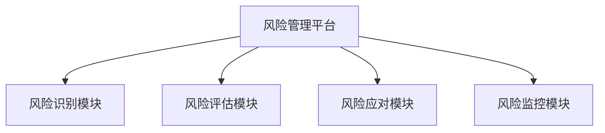
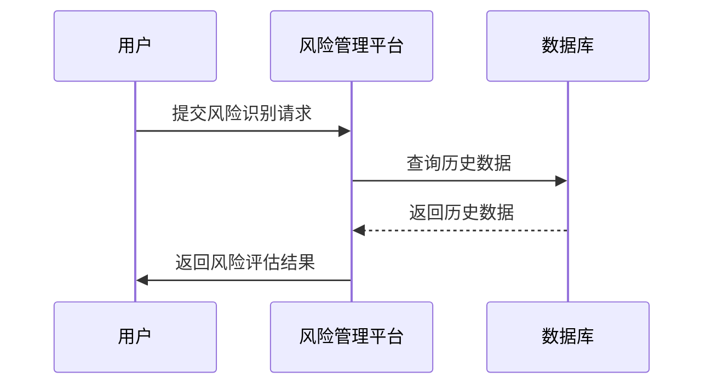

                 


# 彼得·林奇如何看待公司的风险管理文化演变

---

## 关键词

- 风险管理文化
- 彼得·林奇
- 风险管理演变
- 企业治理
- 风险应对策略

---

## 摘要

彼得·林奇，这位投资大师，如何看待公司风险管理文化的演变？在当今复杂多变的商业环境中，风险管理文化不仅是企业稳健发展的基石，更是企业治理的重要组成部分。本文将从风险管理文化的定义、演变背景、核心要素、与企业治理的联系，以及如何构建有效的风险管理文化等方面展开分析，结合实际案例和系统架构设计，全面解读彼得·林奇的风险管理理念及其对现代企业的影响。

---

# 第一部分：风险管理文化演变的背景与核心概念

## 第1章：风险管理文化的基本概念

### 1.1 风险管理文化概述

#### 1.1.1 风险管理的定义与内涵

风险管理是指通过识别、评估、应对和监控风险，以降低潜在损失、抓住机会的过程。其内涵包括：

- **风险识别**：识别可能对企业产生影响的各种风险来源。
- **风险评估**：量化风险的可能性和影响程度。
- **风险应对**：制定策略以降低风险或最大化机会。
- **风险监控**：持续跟踪风险状态并调整应对措施。

#### 1.1.2 风险管理文化的核心要素

- **风险意识**：全体员工对企业风险的敏感性和关注度。
- **风险评估机制**：系统化的风险识别和评估流程。
- **风险管理策略**：根据企业战略制定的风险应对方案。
- **监控与改进**：持续监控风险并不断优化管理措施。

#### 1.1.3 风险管理文化的重要性

风险管理文化是企业稳健发展的基础，直接关系到企业的生存与成长。良好的风险管理文化能够：

- 提高企业抗风险能力。
- 优化决策过程，抓住发展机遇。
- 提升企业透明度和信誉。
- 保护利益相关者的权益。

---

### 1.2 风险管理文化演变的背景

#### 1.2.1 全球化背景下的风险管理挑战

全球化使得企业面临更多复杂的外部风险，如市场波动、政策变化、供应链中断等。企业需要更加灵活和系统化的风险管理策略。

#### 1.2.2 数字化对企业风险管理的影响

数字化转型带来了新的风险，如数据泄露、系统故障等。同时，数字化也为风险管理提供了新的工具和方法，如大数据分析、人工智能等。

#### 1.2.3 金融危机与风险管理文化的反思

2008年的金融危机暴露了金融机构在风险管理上的缺陷，促使企业重新审视和优化风险管理文化。

---

## 第2章：风险管理文化演变的驱动因素

### 2.1 内部驱动因素

#### 2.1.1 企业战略调整

企业战略的变化需要风险管理文化的相应调整，以确保新战略的顺利实施。

#### 2.1.2 内部治理结构优化

优化企业治理结构是提升风险管理文化的重要途径，包括董事会结构、管理层职责等。

#### 2.1.3 企业文化的影响

企业文化直接影响员工的风险意识和行为，良好的企业文化能够促进风险管理文化的形成。

### 2.2 外部驱动因素

#### 2.2.1 监管环境的变化

监管政策的变化对企业风险管理提出新的要求，企业需要及时调整风险管理策略。

#### 2.2.2 市场竞争的压力

激烈的市场竞争要求企业更加注重风险管理，以保持竞争优势。

#### 2.2.3 社会责任与可持续发展要求

社会责任和可持续发展理念推动企业更加注重长期风险管理，以实现可持续发展。

---

## 第3章：风险管理文化的核心要素与结构

### 3.1 核心要素分析

#### 3.1.1 风险识别与评估

- **风险识别**：通过系统化的流程识别潜在风险。
- **风险评估**：量化风险的可能性和影响程度。

#### 3.1.2 风险应对策略

- **风险规避**：通过调整策略避免风险。
- **风险降低**：通过改进措施降低风险影响。
- **风险转移**：通过保险、外包等方式转移风险。
- **风险接受**：在可控范围内接受风险。

#### 3.1.3 风险沟通与透明度

- **内部沟通**：确保管理层和员工之间的信息畅通。
- **外部透明度**：向利益相关者公开风险信息。

### 3.2 风险管理文化的层次结构

#### 3.2.1 行为层

- 员工的具体行为和操作规范。
- 风险管理的具体实践。

#### 3.2.2 制度层

- 企业的规章制度。
- 风险管理的具体流程和标准。

#### 3.2.3 意识层

- 员工的风险意识。
- 企业文化中的风险管理理念。

---

# 第二部分：风险管理文化演变的核心概念与联系

## 第4章：风险管理文化的核心原理

### 4.1 风险管理的基本原理

#### 4.1.1 风险的系统性分析

风险管理需要从系统性角度出发，考虑各因素之间的相互作用。

#### 4.1.2 风险与收益的平衡

在追求收益的同时，必须考虑潜在的风险。

#### 4.1.3 风险管理的动态性

风险是动态变化的，风险管理需要持续调整和优化。

### 4.2 风险管理文化与企业治理的联系

#### 4.2.1 治理结构对风险管理文化的影响

- 董事会结构和职责。
- 高层管理者对风险管理的态度和投入。

#### 4.2.2 风险管理文化对企业治理的反作用

- 风险管理文化的形成依赖于企业治理结构。
- 风险管理文化反过来影响企业治理的效率和效果。

---

## 第5章：核心概念对比与ER实体关系图

### 5.1 核心概念对比

#### 5.1.1 风险管理与内部控制的对比

| 对比维度 | 风险管理 | 内部控制 |
|----------|----------|----------|
| 目标     | 控制风险 | 防止舞弊 |
| 范围     | 全面     | 侧重内部 |
| 方法     | 定性与定量 | 定性     |

#### 5.1.2 风险文化与企业文化的对比

| 对比维度 | 风险文化 | 企业文化 |
|----------|----------|----------|
| 核心内容 | 风险管理 | 企业价值观 |
| 影响范围 | 风险管理行为 | 企业整体行为 |
| 形成基础 | 风险意识 | 企业战略和价值观 |

---

### 5.2 ER实体关系图

```mermaid
erd
  项目 <--- 人员
  风险 <--- 项目
  人员 --> 风险
```

---

## 第6章：算法原理讲解与数学模型

### 6.1 算法原理

#### 6.1.1 风险评估算法

使用概率和统计方法对风险进行量化评估。例如，风险值可以通过以下公式计算：

$$
\text{风险值} = \text{概率} \times \text{影响程度}
$$

---

### 6.2 系统分析与架构设计

#### 6.2.1 系统功能设计

- **风险识别模块**：识别潜在风险。
- **风险评估模块**：量化风险。
- **风险应对模块**：制定应对策略。
- **风险监控模块**：持续跟踪风险。

#### 6.2.2 系统架构设计



---

### 6.3 项目实战

#### 6.3.1 环境安装

安装必要的软件和工具，如Python、Jupyter Notebook、数据库等。

#### 6.3.2 核心代码实现

```python
def risk_assessment(probability, impact):
    return probability * impact

# 示例
probability = 0.3
impact = 5
risk_value = risk_assessment(probability, impact)
print(f"风险值为：{risk_value}")
```

---

## 第7章：数学公式与代码示例

### 7.1 数学公式

#### 7.1.1 风险评估公式

$$
\text{风险值} = \text{概率} \times \text{影响程度}
$$

---

## 第8章：系统架构与交互设计

### 8.1 系统交互设计



---

## 第9章：项目小结与总结

### 9.1 项目小结

通过构建企业风险管理系统的实战，我们掌握了风险管理文化的核心要素，理解了系统设计与实现的关键步骤。

---

## 第10章：最佳实践与注意事项

### 10.1 最佳实践

- **持续优化**：定期评估和优化风险管理策略。
- **全员参与**：将风险管理文化融入企业文化，全员参与。
- **技术驱动**：利用技术手段提高风险管理的效率和准确性。

### 10.2 注意事项

- 风险管理文化需要长期培育，不能急于求成。
- 风险管理文化需要与企业实际相结合，不能生搬硬套。
- 风险管理文化需要动态调整，适应外部环境的变化。

---

## 第11章：小结与拓展阅读

### 11.1 小结

彼得·林奇的风险管理理念强调稳健、系统化和长期性。风险管理文化是企业稳健发展的基石，需要从战略高度进行规划和实施。

### 11.2 拓展阅读

- 《风险管理：理论与实践》
- 《企业治理与风险管理》
- 彼得·林奇的其他著作

---

## 作者：AI天才研究院/AI Genius Institute & 禅与计算机程序设计艺术/Zen And The Art of Computer Programming

