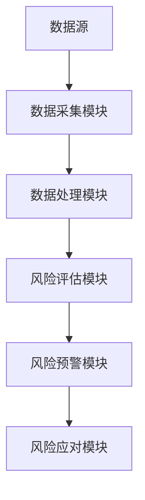
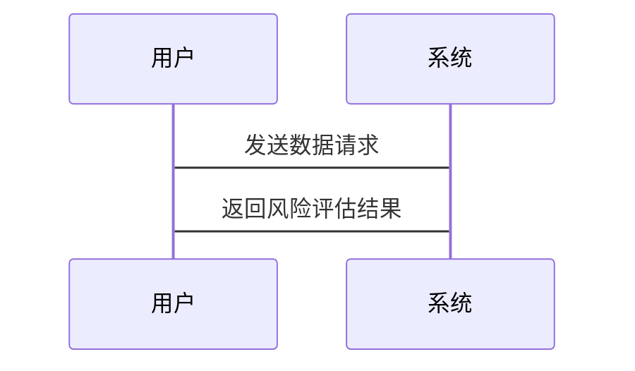

                 


# 彼得·林奇如何看待公司的风险管理策略

> **关键词**：风险管理、彼得·林奇、投资策略、安全边际、价值投资、风险管理框架、风险评估模型

> **摘要**：本文深入探讨了彼得·林奇的公司风险管理策略，从其核心理念、数学模型到系统架构，结合技术角度进行详细分析。通过背景介绍、核心概念、算法原理、系统设计、项目实战等多维度展开，展示了彼得·林奇如何通过风险管理实现稳健投资。

---

## 第一部分：风险管理的核心概念与背景

### 第1章：风险管理的背景与重要性

#### 1.1 风险管理的核心概念

##### 1.1.1 风险的定义与特征

- **风险的定义**：风险是指在特定条件下，某事件可能发生的不确定性，通常与损失或收益的波动相关。
- **风险的特征**：普遍性、客观性、可测性、可控性、双重性（潜在收益与损失并存）。

##### 1.1.2 风险管理的基本原则

- **全面性原则**：覆盖所有业务、部门和流程。
- **分散性原则**：通过多样化投资降低特定风险。
- **匹配性原则**：风险承受能力与投资目标相匹配。
- **动态性原则**：根据市场变化持续调整风险管理策略。

##### 1.1.3 风险管理与企业价值的关系

- 风险管理直接影响企业的资本成本、投资决策和股东价值。
- 通过有效风险管理，企业可以在高风险环境下实现稳定增长。

#### 1.2 彼得·林奇与风险管理的关联

##### 1.2.1 彼得·林奇的个人背景与投资理念

- 彼得·林奇是富达投资的传奇基金经理，以其卓越的风险管理能力著称。
- 他的投资理念强调“安全边际”，即买入价格低于内在价值的股票。

##### 1.2.2 风险管理在投资中的地位

- 风险管理是投资决策的核心，决定了投资组合的稳定性和收益性。
- 林奇通过严格的风险评估和分散投资来降低风险。

##### 1.2.3 彼得·林奇风险管理策略的独特性

- 强调长期投资和价值发现。
- 通过深入分析公司基本面，选择具有持续竞争优势的企业。

---

### 第2章：风险管理的核心要素与框架

#### 2.1 风险管理的核心要素

##### 2.1.1 风险来源的分类

| 风险来源 | 描述 | 示例 |
|----------|------|------|
| 市场风险 | 市场波动导致的资产价格变化 | 股票市场的波动 |
| 信用风险 | 债务人违约风险 | 企业债券违约 |
| 操作风险 | 操作失误或内部欺诈 | 交易错误 |
| 流动性风险 | 资产难以快速变现 | 房地产市场的流动性不足 |

##### 2.1.2 风险评估的维度

- **时间维度**：短期、中期、长期风险。
- **空间维度**：局部风险与整体风险。
- **影响维度**：财务风险、声誉风险等。

##### 2.1.3 风险应对的策略

- **风险规避**：通过分散投资降低特定风险。
- **风险转移**：利用保险或衍生工具转移风险。
- **风险缓解**：通过改进流程或技术降低风险敞口。

#### 2.2 风险管理的框架体系

##### 2.2.1 风险识别与量化

- **风险识别**：通过数据分析和情景分析识别潜在风险。
- **风险量化**：使用VaR等模型量化潜在损失。

##### 2.2.2 风险评估与优先级排序

- **风险评估**：评估每个风险的概率和影响。
- **优先级排序**：根据风险等级（高、中、低）制定应对策略。

##### 2.2.3 风险应对与监控

- **风险应对**：制定应对计划，分配资源。
- **风险监控**：持续监控风险状态，及时调整策略。

---

### 第3章：彼得·林奇的风险管理理念

#### 3.1 彼得·林奇的投资哲学

##### 3.1.1 价值投资的核心思想

- 买入低于内在价值的股票，长期持有。
- 重视企业的基本面，包括盈利能力、财务状况和管理团队。

##### 3.1.2 安全边际的概念与应用

- 安全边际是指买入价格与内在价值的差距，提供缓冲空间。
- 通过安全边际降低投资风险，确保投资的稳健性。

##### 3.1.3 风险控制在投资决策中的作用

- 林奇通过严格的风险控制，避免重大损失。
- 风险控制是实现长期投资收益的关键。

#### 3.2 彼得·林奇的风险管理方法

##### 3.2.1 分散投资策略

- 通过投资不同类型资产降低风险。
- 选择不同行业的股票分散行业风险。

##### 3.2.2 个股风险评估与筛选

- 通过分析财务报表识别高风险股票。
- 选择具有持续竞争优势的企业。

##### 3.2.3 行业风险与宏观经济分析

- 关注宏观经济指标，如GDP增长率、利率变化。
- 通过行业分析识别周期性风险。

---

## 第二部分：风险管理的系统架构与策略

### 第4章：风险管理的系统架构设计

#### 4.1 系统架构概述

- **风险管理系统的组成模块**：数据采集模块、风险评估模块、风险预警模块、风险应对模块。
- **数据流与信息交互**：数据从各个来源收集，经过处理后生成风险评估结果，并通过预警模块通知相关人员。
- **系统功能模块的划分**：前端用户界面、后端处理逻辑、数据库。

#### 4.2 系统功能设计

##### 4.2.1 风险评估模块

- **功能描述**：接收输入数据，计算VaR等风险指标。
- **数据接口**：与财务系统、市场数据源对接。

##### 4.2.2 风险预警模块

- **功能描述**：根据风险评估结果生成预警信息。
- **预警规则**：设定阈值，超过阈值触发预警。

##### 4.2.3 风险应对模块

- **功能描述**：制定应对策略，分配资源。
- **策略执行**：生成行动计划，分配任务。

### 第5章：风险管理的算法与数学模型

#### 5.1 风险评估的数学模型

##### 5.1.1 风险值（VaR）的计算公式

$$ VaR = \mu + z \cdot \sigma $$

- $\mu$：资产收益的均值
- $z$：标准正态分布的分位数
- $\sigma$：资产收益的标准差

##### 5.1.2 风险调整后的收益（RAROC）的计算公式

$$ RAROC = \frac{ROE}{\text{风险资本}} $$

- ROE：风险调整后的收益
- 风险资本：根据VaR计算得出的资本要求

#### 5.2 风险管理的算法流程

##### 5.2.1 数据采集与预处理

```python
import pandas as pd
data = pd.read_csv('market_data.csv')
data = data.dropna()
```

##### 5.2.2 风险因子的识别与权重分配

```python
import numpy as np
factors = ['volatility', 'beta', 'size']
weights = np.array([0.4, 0.3, 0.3])
```

##### 5.2.3 风险评估与预警生成

```python
from sklearn.ensemble import RandomForestRegressor
model = RandomForestRegressor()
model.fit(X_train, y_train)
 predictions = model.predict(X_test)
```

---

## 第三部分：风险管理的实战与案例分析

### 第6章：风险管理的实战应用

#### 6.1 风险管理的系统实现

##### 6.1.1 环境配置与工具安装

- **工具安装**：安装Python、Pandas、Scikit-learn等库。
- **环境配置**：配置Jupyter Notebook和数据库连接。

##### 6.1.2 核心算法的代码实现

```python
def calculate VaR(data, confidence_level):
    data_sorted = sorted(data)
    percentile = (1 - confidence_level) * 100
    var_value = data_sorted[int(percentile)]
    return var_value
```

##### 6.1.3 系统功能的测试与优化

- **测试步骤**：输入数据，运行算法，验证输出结果。
- **优化建议**：根据测试结果调整模型参数，提高准确性。

#### 6.2 风险管理的案例分析

##### 6.2.1 彼得·林奇的经典投资案例

- **案例分析**：在互联网泡沫期间，林奇通过严格的风险管理避免了重大损失。
- **具体分析**：他选择基本面稳健的企业，避免高风险股票。

##### 6.2.2 风险管理在实际投资中的应用

- **应用实例**：通过VaR模型评估投资组合的风险，调整投资策略。
- **具体操作**：根据VaR结果，增加低风险资产配置，降低整体风险。

##### 6.2.3 案例总结

- 彼得·林奇的成功证明了科学的风险管理策略的重要性。
- 通过系统化的风险管理，投资者可以在不确定的市场中实现稳健收益。

---

## 第四部分：系统架构与算法实现

### 第7章：风险管理系统的架构与实现

#### 7.1 系统功能设计

##### 7.1.1 风险评估模块的实现

- **功能描述**：接收输入数据，计算VaR等风险指标。
- **技术实现**：使用Python和Pandas进行数据处理。

#### 7.2 系统架构设计

##### 7.2.1 系统架构图



#### 7.3 系统接口设计

- **接口定义**： RESTful API接口，支持POST请求发送数据。
- **接口实现**：使用Flask框架，定义API端点。

#### 7.4 系统交互序列图



---

## 第四部分：总结与展望

### 第8章：风险管理的总结与展望

#### 8.1 总结

- 彼得·林奇的风险管理策略强调安全边际和长期投资。
- 通过系统化的风险管理，投资者可以在不确定的市场中实现稳健收益。

#### 8.2 展望

- 风险管理在数字化转型中将发挥越来越重要的作用。
- 结合人工智能和大数据技术，未来风险管理将更加精准和高效。

---

**作者**：AI天才研究院/AI Genius Institute & 禅与计算机程序设计艺术 /Zen And The Art of Computer Programming

