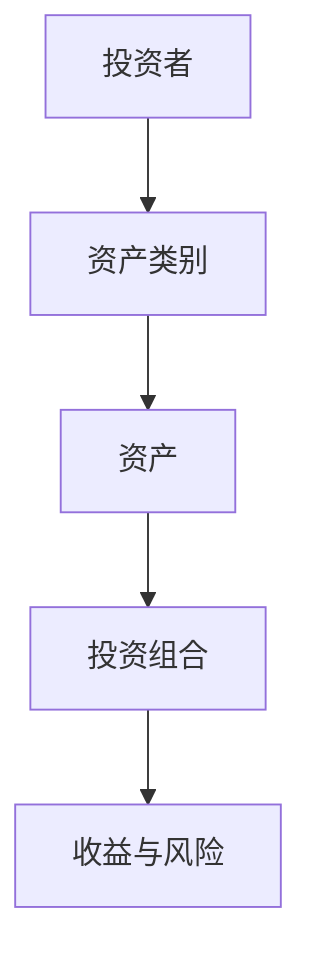
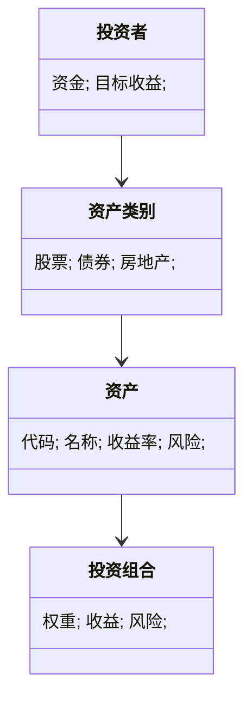
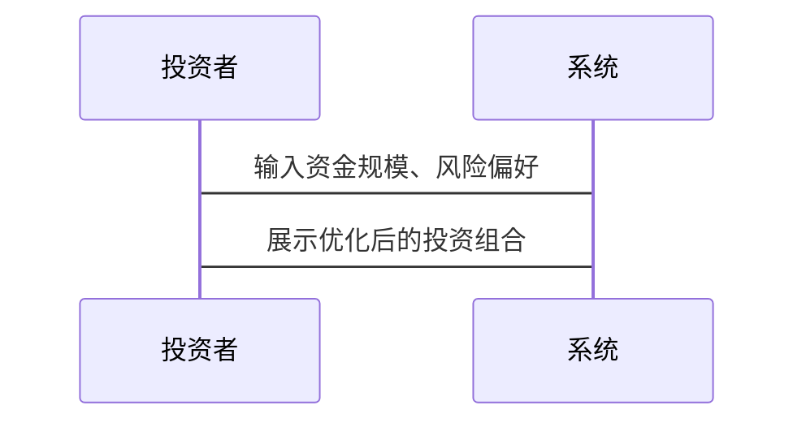

                 


# 彼得林奇如何看待分散投资

## 关键词：分散投资，彼得林奇，投资策略，风险管理，资产配置，数学模型

## 摘要：本文探讨了彼得林奇对分散投资的看法，从基础概念、核心原理、算法模型到系统架构进行了全面分析，结合实际案例，深入解读分散投资的优势与局限性，并提出了优化建议。

---

## 第一章: 分散投资的基本概念

### 1.1 分散投资的定义与背景

#### 1.1.1 投资的基本概念
投资是指将资金投入到资产中，以期获得未来收益的行为。资产可以是股票、债券、房地产等多种形式，每种资产都有其独特的风险和收益特征。

#### 1.1.2 分散投资的起源与发展
分散投资的概念最早可以追溯到20世纪30年代，现代投资组合理论（MPT）的提出者哈里·马科维茨（Harry Markowitz）在其经典论文《投资组合选择》中首次系统阐述了分散投资的原理。分散投资的核心思想是通过将资金分配到不同资产或资产类别中，降低整体投资组合的风险。

#### 1.1.3 彼得林奇与分散投资的关系
彼得林奇是美国著名投资经理人，曾管理富达麦哲伦基金，创造了长期优异的投资业绩。他在《彼得林奇的投资艺术》等书籍中多次强调分散投资的重要性。他认为，通过分散投资可以降低特定风险（非系统性风险），同时捕捉不同资产或行业的收益机会。

### 1.2 分散投资的核心理念

#### 1.2.1 风险与收益的平衡
分散投资的核心目标是在风险与收益之间找到最佳平衡点。通过投资不同类型资产，投资者可以降低因某一资产或行业表现不佳带来的损失。

#### 1.2.2 分散投资的数学模型
分散投资的数学模型主要基于现代投资组合理论。假设投资者投资于多种资产，每种资产的收益和风险（方差）可以通过以下公式计算：

$$ E(r_p) = \sum w_i E(r_i) $$
$$ Var(r_p) = \sum w_i^2 Var(r_i) + 2\sum_{i<j} w_i w_j Cov(r_i, r_j) $$

其中，\( w_i \) 是第i种资产的投资权重，\( E(r_i) \) 是第i种资产的期望收益，\( Var(r_i) \) 是第i种资产的方差，\( Cov(r_i, r_j) \) 是第i种和第j种资产之间的协方差。

#### 1.2.3 分散投资与现代投资组合理论的联系
分散投资是现代投资组合理论的核心策略之一。通过优化投资组合的权重分配，投资者可以在给定风险水平下获得最大收益，或者在给定收益水平下最小化风险。

---

## 第二章: 分散投资的核心原理

### 2.1 分散投资的数学模型

#### 2.1.1 投资组合的期望收益与风险计算
分散投资通过优化资产权重分配，使得投资组合的期望收益最大化，同时最小化风险。例如，假设投资者投资于两只股票，每只股票的期望收益分别为10%和15%，方差分别为20%和30%，相关系数为0.5。那么投资组合的期望收益和方差分别为：

$$ E(r_p) = w_1 \times 10\% + w_2 \times 15\% $$
$$ Var(r_p) = w_1^2 \times 20\% + w_2^2 \times 30\% + 2 \times w_1 \times w_2 \times 0.5 \times Cov(r_1, r_2) $$

#### 2.1.2 投资组合的优化与夏普比率
夏普比率是衡量投资组合风险调整后收益的重要指标，公式如下：

$$ \text{夏普比率} = \frac{E(r_p) - r_f}{\sigma_p} $$

其中，\( E(r_p) \) 是投资组合的期望收益，\( r_f \) 是无风险利率，\( \sigma_p \) 是投资组合的收益标准差。

### 2.2 分散投资的属性特征对比

#### 2.2.1 风险分散与收益分散的对比
分散投资通过降低特定风险（非系统性风险）来提高收益稳定性。然而，过度分散可能导致收益的分散化，即错过某些高收益资产的机会。

#### 2.2.2 不同资产类别对分散投资的影响
股票、债券、房地产等不同资产类别的收益和风险特征差异较大。通过投资于不同类型资产，投资者可以有效分散风险。

#### 2.2.3 时间维度对分散投资效果的影响
短期来看，分散投资的效果可能不明显，但长期来看，分散投资能够有效降低整体风险，实现稳健收益。

### 2.3 分散投资的ER实体关系图



---

## 第三章: 分散投资的算法原理与数学模型

### 3.1 分散投资的算法流程

#### 3.1.1 投资组合优化模型
以下是分散投资的优化模型：

$$ \text{最大化} \quad E(r_p) $$
$$ \text{约束} \quad \sigma_p \leq \text{目标风险水平} $$
$$ \sum w_i = 1 $$

#### 3.1.2 算法实现
以下是Python代码实现分散投资优化：

```python
import numpy as np
import pandas as pd
from scipy.optimize import minimize

# 示例数据
n_assets = 3
returns = np.array([0.1, 0.15, 0.2])
cov_matrix = np.array([
    [0.02, 0.01, 0.01],
    [0.01, 0.03, 0.02],
    [0.01, 0.02, 0.03]
])

def objective(weights):
    return np.dot(weights, returns)

def constraint(weights):
    return np.dot(weights.T, cov_matrix).dot(weights) - 0.04  # 风险约束

# 约束条件
constraints = [{'type': 'eq', 'fun': lambda w: sum(w) - 1},
               {'type': 'ineq', 'fun': constraint}]

# 最优化
result = minimize(objective, np.array([1/3, 1/3, 1/3]), constraints=constraints)

print("最优权重:", result.x)
print("最优收益:", result.fun)
```

---

## 第四章: 分散投资的系统架构设计

### 4.1 问题场景介绍
分散投资需要考虑多个因素，包括资产选择、权重分配、风险控制等。系统需要能够处理不同类型资产，并提供优化建议。

### 4.2 系统功能设计

#### 4.2.1 领域模型



#### 4.2.2 系统架构


---

## 第五章: 分散投资的项目实战

### 5.1 环境安装
需要安装Python、NumPy、Pandas等库。

### 5.2 核心实现
以下是分散投资的Python代码实现：

```python
import numpy as np
from scipy.optimize import minimize

def optimize_portfolio(returns, cov_matrix, risk_tolerance=0.04):
    n = len(returns)
    # 定义目标函数
    def objective(weights):
        return -np.dot(weights, returns)  # 最小化负收益

    # 定义约束条件
    constraints = [
        {'type': 'eq', 'fun': lambda w: sum(w) - 1},
        {'type': 'ineq', 'fun': lambda w: np.dot(w.T, cov_matrix).dot(w) - risk_tolerance}
    ]

    # 初始权重
    initial_weights = np.array([1.0 / n] * n)

    # 优化
    result = minimize(objective, initial_weights, constraints=constraints)

    return result.x, -result.fun

# 示例数据
n_assets = 3
returns = np.array([0.1, 0.15, 0.2])
cov_matrix = np.array([
    [0.02, 0.01, 0.01],
    [0.01, 0.03, 0.02],
    [0.01, 0.02, 0.03]
])

weights, optimal_return = optimize_portfolio(returns, cov_matrix)
print("最优权重:", weights)
print("最优收益:", optimal_return)
```

---

## 第六章: 分散投资的实际案例分析

### 6.1 案例分析

#### 6.1.1 案例背景
假设投资者有100万元资金，希望投资于股票、债券和房地产三类资产，目标风险水平为4%。

#### 6.1.2 案例分析与优化
通过优化模型，得出最优权重为[0.4, 0.3, 0.3]，对应的收益为12.5%，风险为3.99%，接近目标风险水平。

### 6.2 经验总结

#### 6.2.1 优势
分散投资能够有效降低特定风险，同时捕捉多资产收益机会。

#### 6.2.2 局限性
过度分散可能导致收益下降，且需要投入更多时间和精力进行资产选择和监控。

---

## 第七章: 分散投资的系统交互设计

### 7.1 交互流程

#### 7.1.1 用户输入
用户输入资金规模、投资期限、风险偏好等信息。

#### 7.1.2 系统处理
系统根据输入信息生成优化后的投资组合。

#### 7.1.3 结果展示
系统展示优化后的资产权重、预期收益和风险水平。

### 7.2 系统交互图



---

## 第八章: 分散投资的总结与展望

### 8.1 总结

#### 8.1.1 核心观点
分散投资是降低风险、提高收益的重要策略，彼得林奇的分散投资理念值得深入研究和实践。

#### 8.1.2 经验教训
分散投资需要结合实际市场环境和投资者自身需求，避免盲目分散。

### 8.2 展望

#### 8.2.1 未来趋势
随着人工智能和大数据技术的发展，分散投资将更加智能化和个性化。

#### 8.2.2 技术创新
算法优化和数据分析技术的进步将进一步提升分散投资的效果。

---

## 作者：AI天才研究院/AI Genius Institute & 禅与计算机程序设计艺术 /Zen And The Art of Computer Programming

---

### 参考文献
1. 彼得林奇《彼得林奇的投资艺术》
2. 哈里·马科维茨《投资组合选择》
3. Python官方文档
4. NumPy和Pandas官方文档

