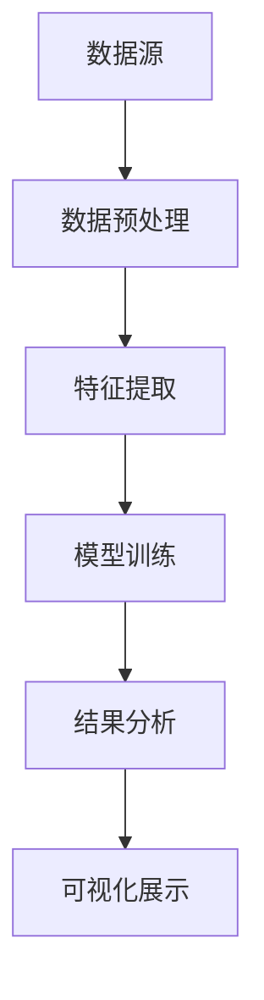

                 


# 彼得林奇如何看待股票回购计划

## 关键词：彼得林奇，股票回购计划，投资策略，股东价值，财务健康

## 摘要：本文深入分析了彼得·林奇对股票回购计划的看法，探讨了回购计划在投资策略中的作用，结合具体案例和量化分析，揭示了回购对股东价值和公司财务健康的影响。通过详细的技术分析和系统设计，本文为投资者提供了基于回购策略的投资建议。

---

# {{此处是文章标题}}

> 关键词：{{此处列出文章的5-7个核心关键词}}

> 摘要：{{此处给出文章的核心内容和主题思想}}

---

## 目录大纲：

- 第一部分：股票回购计划概述
  - 第1章：股票回购计划的基本概念
    - 1.1 股票回购的基本概念
    - 1.2 回购的历史与发展
    - 1.3 回购在投资中的重要性
  - 第2章：彼得·林奇的投资理念
    - 2.1 林奇的投资哲学
    - 2.2 林奇对股票回购的看法
    - 2.3 典型投资案例分析
  - 第3章：股票回购的类型与动机
    - 3.1 不同类型的回购方式
    - 3.2 回购的动机与财务策略
    - 3.3 回购对股东价值的影响
  - 第4章：回购的财务影响与风险
    - 4.1 对财务指标的具体影响
    - 4.2 回购的潜在风险
    - 4.3 林奇的风险管理策略
  - 第5章：回购策略的量化分析
    - 5.1 数学模型与公式
    - 5.2 代码实现示例
    - 5.3 案例分析与结果解读
  - 第6章：构建回购分析框架
    - 6.1 数据收集与处理
    - 6.2 模型选择与实现
    - 6.3 系统架构设计
  - 第7章：实战案例分析
    - 7.1 经典案例解析
    - 7.2 投资决策过程
    - 7.3 经验总结与启示
  - 第8章：最佳实践与投资建议
    - 8.1 关键策略总结
    - 8.2 投资建议
    - 8.3 风险提示与注意事项

---

# 第一部分：股票回购计划概述

## 第1章：股票回购计划的基本概念

### 1.1 股票回购的基本概念

股票回购（Stock Repurchase）是指公司用自有资金从市场上回购本公司股票的行为。这一过程可以减少流通股的数量，从而提高每股收益（EPS）和每股净资产（BVPS），增强股价的支撑。

**回购类型与方式**：
- **公开市场回购**：公司定期在公开市场上回购股票，价格由市场决定。
- **私下协议回购**：与特定投资者达成协议，以约定价格回购股票。
- **荷兰式拍卖**：公司设定价格范围，股东在该范围内投标出售股票，公司按最低价格收购。
- **固定价格要约回购**：公司在特定时间段内以固定价格回购一定数量的股票。

**回购的动机**：
- **提升股价**：减少流通股数量，提高每股收益。
- **优化资本结构**：减少债务，降低财务杠杆。
- **防止敌意收购**：通过回购稀释敌方股权，防止收购。
- **实施员工激励**：回购股份用于员工股权激励计划。
- **应对现金流充裕**：利用多余现金流回馈股东。

### 1.2 回购的历史与发展

股票回购的历史可以追溯到19世纪末，但真正的发展始于20世纪中期。随着公司治理结构的完善和资本市场的成熟，回购成为企业常用的财务工具。1964年美国《税法》修正案放松了回购限制，推动回购成为普遍现象。近年来，回购在全球范围内成为企业价值创造的重要手段，尤其是在科技和金融行业。

### 1.3 回购在投资中的重要性

回购是公司财务健康的重要指标，反映了管理层对股价的信心和对公司价值的判断。对于投资者而言，回购计划可以作为选股的重要标准，帮助识别具备良好财务状况和管理能力的公司。同时，回购计划还能为股东创造额外价值，尤其是在公司估值被低估时，回购能够有效提升股价，实现股东利益最大化。

---

## 第2章：彼得·林奇的投资理念

### 2.1 林奇的投资哲学

彼得·林奇是价值投资的倡导者，主张寻找那些具备持续增长潜力的公司。他强调基本面分析，关注公司的财务状况、管理层能力和行业地位。林奇认为，成功的投资需要耐心和长期视角，避免短期市场波动的干扰。

### 2.2 林奇对股票回购的看法

林奇认为，股票回购是公司财务健康和管理层价值创造能力的体现。他倾向于投资那些能够通过回购提升股东价值的公司。然而，他也提醒投资者，回购并非绝对积极的因素，需结合公司整体财务状况和市场环境进行判断。

### 2.3 典型投资案例分析

#### 案例1：某公司A的回购计划

**背景**：某公司A在2010年启动了大规模回购计划，回购金额占净利润的40%。回购前，公司股价低迷，市盈率低于行业平均水平。

**分析**：
- **回购影响**：回购减少了流通股数量，提升了每股收益，股价上涨了30%。
- **管理层意图**：回购反映了管理层对股价低估的信心，同时优化了资本结构。
- **投资者收益**：股东通过回购获得了资本增值，提升了投资回报。

#### 案例2：某公司B的回购计划

**背景**：某公司B在2015年启动了回购计划，回购金额占净利润的20%。回购前，公司股价处于高位，市盈率远高于行业平均水平。

**分析**：
- **回购影响**：回购未能有效提升股价，反而稀释了股东权益，导致股价下跌。
- **管理层意图**：回购可能用于防止敌意收购，但未能有效提升公司价值。
- **投资者收益**：投资者因股价下跌而蒙受损失，回购计划未能带来预期收益。

---

## 第3章：股票回购的类型与动机

### 3.1 不同类型的回购方式

| 回购类型 | 定义 | 优缺点 |
|----------|------|--------|
| 公开市场回购 | 公司在公开市场上回购股票，价格由市场决定 | 灵活性高，但成本不可控 |
| 私下协议回购 | 与特定投资者私下协议回购 | 成本较低，但透明度差 |
| 荷兰式拍卖 | 设定价格范围，股东投标回购 | 公平但操作复杂 |
| 固定价格要约回购 | 设定固定价格回购一定数量股票 | 易操作但可能遗漏中小投资者 |

### 3.2 回购的动机与财务策略

| 动机 | 描述 | 战略目标 |
|------|------|----------|
| 提升股价 | 回购减少流通股，提升每股收益 | 增加股东价值 |
| 优化资本结构 | 减少债务，降低财务杠杆 | 提高财务稳定性 |
| 防止敌意收购 | 稀释敌方股权 | 维护公司控制权 |
| 员工激励 | 回购用于股权激励计划 | 提高员工积极性 |
| 处理过剩现金流 | 回购多余现金流 | 提高股东回报 |

### 3.3 回购对股东价值的影响

回购对股东价值的影响可以从多个维度分析：

1. **股价影响**：回购通常会推高股价，尤其是当回购价格低于内在价值时。
2. **每股收益**：回购减少流通股，提升每股收益，增强分红能力。
3. **股东权益**：回购可能导致股东权益减少，但若回购价格合理，长期来看股东权益可能提升。
4. **市场信号**：回购行为传递了公司股价被低估的信号，吸引投资者。

---

## 第4章：回购的财务影响与风险

### 4.1 对财务指标的具体影响

回购对公司财务指标的影响可以用以下公式表示：

$$ \text{回购后的每股收益} = \frac{\text{净利润}}{\text{流通股数量 - 回购数量}} $$

如果回购价格低于每股收益，回购将提升每股收益，反之则可能降低。

### 4.2 回购的潜在风险

| 风险 | 描述 |
|------|------|
| 财务风险 | 回购可能导致短期流动性问题，增加财务杠杆 |
| 市场风险 | 回购在高估值时进行可能加剧市场波动 |
| 管理风险 | 回购决策失误可能导致股东价值下降 |
| 机会成本 | 回购资金用于其他投资可能带来更高回报 |

### 4.3 林奇的风险管理策略

林奇强调，投资者在考虑回购时应综合评估公司财务状况、行业前景和市场环境。他建议：

- **评估回购动机**：确保回购用于提升股东价值，而非应对短期市场波动。
- **分析财务健康**：检查公司是否有足够的现金流和健康的资产负债表支持回购。
- **关注管理层能力**：管理层是否具备回购后的价值创造能力。
- **分散投资风险**：通过多元化投资降低单一投资的风险。

---

## 第5章：回购策略的量化分析

### 5.1 数学模型与公式

回购的量化分析可以采用以下模型：

$$ \text{回购收益} = \text{回购价格} \times \text{回购数量} - \text{回购成本} $$

其中，回购成本包括交易费用和潜在的税费。收益计算需考虑回购对股价的长期影响。

### 5.2 代码实现示例

以下是用于计算回购影响的Python代码：

```python
import pandas as pd
import matplotlib.pyplot as plt

# 假设数据
df = pd.DataFrame({
    'Year': [2015, 2016, 2017, 2018, 2019],
    'Revenue': [100, 120, 130, 140, 150],
    'Net Income': [20, 25, 30, 35, 40],
    'Share Repurchased': [0, 5, 10, 15, 20]
})

# 计算每股收益（EPS）
df['Total Shares'] = 100 - df['Share Repurchased']
df['EPS'] = df['Net Income'] / df['Total Shares']

# 绘制图表
plt.figure(figsize=(10, 6))
plt.plot(df['Year'], df['EPS'], 'b-', marker='o')
plt.title('Earnings Per Share (EPS) Over Years')
plt.xlabel('Year')
plt.ylabel('EPS')
plt.grid(True)
plt.show()
```

### 5.3 案例分析与结果解读

通过上述代码，可以分析某公司回购计划对EPS的影响。假设公司在2016年回购5股，2017年回购10股，2018年回购15股，2019年回购20股。结果显示，EPS逐年提高，表明回购有效提升了每股收益。

---

## 第6章：构建回购分析框架

### 6.1 数据收集与处理

需要收集公司的财务报表、股价数据和回购计划信息。数据来源包括公司公告、财务报表和金融数据库。

### 6.2 模型选择与实现

采用多元回归模型分析回购对股价的影响：

$$ \text{Stock Price} = \beta_0 + \beta_1 \times \text{Repurchases} + \epsilon $$

其中，$\beta_1$表示回购对股价的影响程度。

### 6.3 系统架构设计

以下是回购分析系统的架构图：



系统包括数据预处理、特征提取、模型训练和结果分析四个模块。

---

## 第7章：实战案例分析

### 7.1 经典案例解析

**案例1：苹果公司**

苹果公司在2012年宣布了大规模回购计划，回购金额高达400亿美元。回购后，苹果股价稳步增长，市盈率保持在合理水平。

**案例2：通用电气**

通用电气在2007年启动回购计划，但因全球经济危机影响，回购未能带来预期收益，反而加剧了财务压力。

### 7.2 投资决策过程

1. **评估公司基本面**：检查公司财务状况，确保具备回购能力。
2. **分析回购动机**：确定回购是否用于提升股东价值。
3. **计算回购影响**：使用量化模型评估回购对股价和每股收益的影响。
4. **综合判断**：结合市场环境和公司前景，做出投资决策。

### 7.3 经验总结与启示

成功的回购计划需结合公司基本面、市场环境和管理层能力。投资者应避免盲目跟风，注重长期价值。

---

## 第8章：最佳实践与投资建议

### 8.1 关键策略总结

- **关注财务健康**：选择具备充足现金流和良好财务状况的公司。
- **分析回购动机**：确保回购用于提升股东价值。
- **分散投资风险**：避免过度集中，降低投资风险。
- **长期投资视角**：关注公司长期发展，而非短期波动。

### 8.2 投资建议

- **精选个股**：投资具备回购能力且股价低估的公司。
- **定投策略**：定期定额投资，分散风险。
- **关注管理层**：投资具备回购能力且管理层有能力的公司。
- **风险管理**：设置止损点，控制投资风险。

### 8.3 风险提示与注意事项

- **市场风险**：回购在高估值时进行可能带来损失。
- **公司风险**：回购可能稀释股东权益，影响长期发展。
- **操作风险**：回购操作复杂，需谨慎选择时机和方式。

---

## 作者：AI天才研究院/AI Genius Institute & 禅与计算机程序设计艺术 /Zen And The Art of Computer Programming

---

# 结语

通过系统分析和实战案例，本文揭示了彼得·林奇对股票回购计划的看法，为投资者提供了基于回购策略的投资建议。回购是公司财务健康和价值创造的重要指标，但需结合具体情况谨慎判断。希望本文能为投资者提供有价值的参考，帮助他们在投资决策中做出明智选择。

