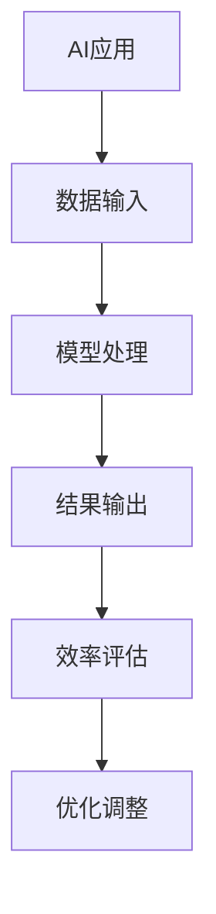
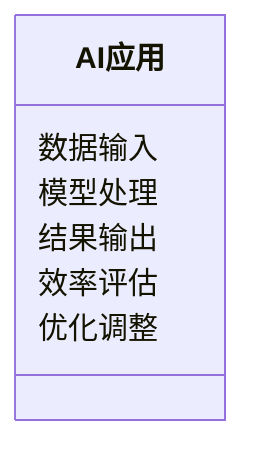
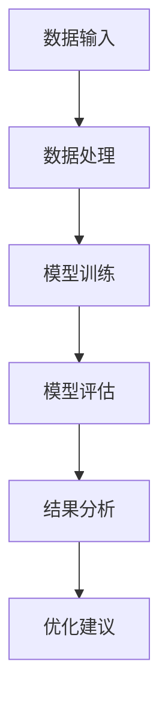
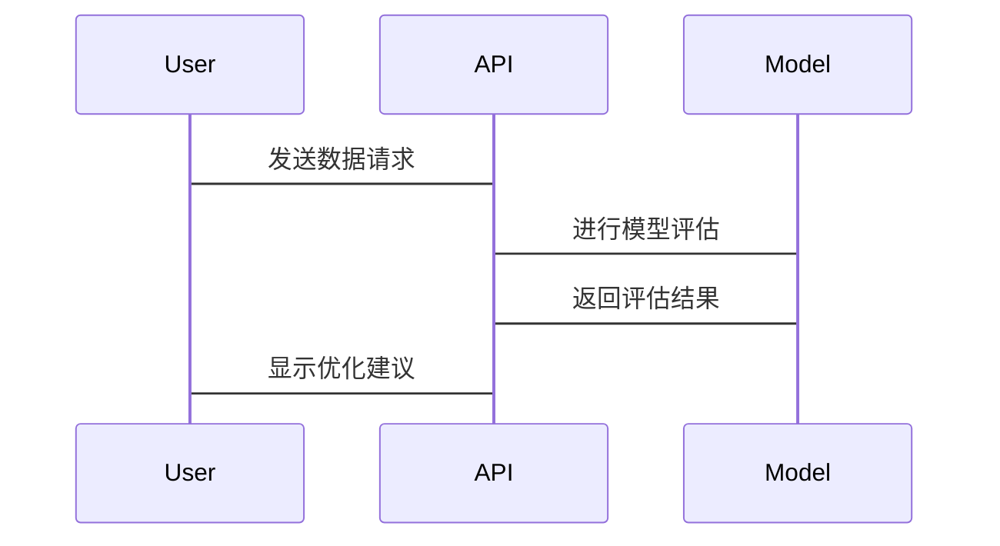

                 


# 彼得林奇如何评估公司的人工智能应用效率

> 关键词：人工智能, 应用效率, 彼得·林奇, 评估方法, 投资理念, 算法原理

> 摘要：本文将详细介绍如何结合彼得·林奇的投资理念，系统性地评估公司的人工智能应用效率。从核心概念到算法原理，从系统架构到实际案例，全面解析AI应用效率评估的关键点。

---

## 第一部分：AI应用效率评估的背景与核心概念

### 第1章：AI应用效率评估的背景介绍

#### 1.1 人工智能的发展历程

##### 1.1.1 从传统AI到深度学习的演进
- 传统AI的局限性：基于规则的AI难以应对复杂场景。
- 深度学习的崛起：神经网络和大数据推动AI技术的突破。
- 当前AI的应用趋势：从学术研究走向商业落地。

##### 1.1.2 人工智能在企业中的应用现状
- AI在企业中的主要应用领域：自然语言处理、图像识别、数据分析等。
- 企业AI应用的痛点：数据质量差、模型泛化能力不足、计算资源消耗大。
- 彼得·林奇与AI的关联：投资理念中的价值发现与AI的效率优化。

##### 1.1.3 彼得·林奇的评估方法简介
- 彼得·林奇的投资哲学：寻找具有长期竞争优势的企业。
- AI应用效率评估的核心目标：优化企业AI应用的投入产出比。

#### 1.2 AI应用效率评估的核心目标
- 提升AI模型的准确率与召回率。
- 降低AI系统的计算成本。
- 优化AI应用的实际场景表现。

### 第2章：AI应用效率评估的核心概念与联系

#### 2.1 核心概念原理

##### 2.1.1 AI应用效率的定义与属性
- 定义：AI应用效率是指AI系统在完成特定任务时的性能与资源消耗的比值。
- 属性：高效性、可扩展性、可解释性。

##### 2.1.2 评估指标的分类与特征对比
| 评估指标 | 特性 | 示例 |
|----------|------|------|
| 准确率 | 衡量模型预测的正确性 | 分类任务中的正确预测比例 |
| 召回率 | 衡量模型发现所有相关样本的能力 | 正例中被正确预测的比例 |
| F1分数 | 准确率和召回率的调和平均值 | $F1 = 2 \times \frac{准确率 \times 召回率}{准确率 + 召回率}$ |

##### 2.1.3 ER实体关系图架构


---

## 第二部分：AI应用效率评估的算法原理

### 第3章：AI应用效率评估的算法原理

#### 3.1 算法原理讲解

##### 3.1.1 评估指标的计算公式
- 准确率：$准确率 = \frac{\text{正确预测数}}{\text{总预测数}}$
- 召回率：$召回率 = \frac{\text{正确预测的正例数}}{\text{实际正例总数}}$
- F1分数：$F1 = 2 \times \frac{准确率 \times 召回率}{准确率 + 召回率}$

##### 3.1.2 混淆矩阵与ROC曲线
- 混淆矩阵：
| 指标 | 预测正 | 预测负 |
|------|--------|--------|
| 实际正 | TP     | FN     |
| 实际负 | FP     | TN     |

- ROC曲线：通过TPR（真正率）与FPR（假正率）的对比，评估模型的区分能力。

#### 3.2 通俗易懂的举例说明
- 例如，一个AI客服系统，准确率和召回率的计算可以帮助我们评估其效率。

---

## 第三部分：AI应用效率评估的系统分析与架构设计

### 第4章：AI应用效率评估的系统分析

#### 4.1 问题场景介绍

##### 4.1.1 企业AI应用的常见问题
- 数据质量差：噪声数据影响模型性能。
- 模型泛化能力不足：AI系统在新场景中表现不佳。
- 计算资源消耗大：AI应用的运行成本过高。

##### 4.1.2 评估系统的建设目标
- 提供高效的评估工具，帮助企业优化AI应用。
- 实现AI应用效率的量化评估与优化。

#### 4.2 系统功能设计

##### 4.2.1 领域模型设计


#### 4.3 系统架构设计

##### 4.3.1 系统架构设计


#### 4.4 系统接口设计

##### 4.4.1 API接口设计
```http
POST /api/evaluate
Content-Type: application/json

{
    "data": {
        "inputs": [...],
        "labels": [...]
    },
    "model": "model_name"
}
```

##### 4.4.2 返回结果示例
```json
{
    "accuracy": 0.92,
    "recall": 0.88,
    "f1_score": 0.85
}
```

#### 4.5 系统交互设计

##### 4.5.1 序列图


---

## 第四部分：AI应用效率评估的项目实战

### 第5章：AI应用效率评估的项目实战

#### 5.1 环境安装

##### 5.1.1 安装Python环境
```bash
python --version
pip install numpy scikit-learn matplotlib
```

#### 5.2 系统核心实现源代码

##### 5.2.1 评估函数实现
```python
def calculate_accuracy(true_labels, predicted_labels):
    return sum(true_labels == predicted_labels) / len(true_labels)

def calculate_recall(true_labels, predicted_labels):
    tp = sum((true_labels == 1) & (predicted_labels == 1))
    fn = sum((true_labels == 1) & (predicted_labels == 0))
    return tp / (tp + fn) if (tp + fn) != 0 else 0

def calculate_f1_score(true_labels, predicted_labels):
    accuracy = calculate_accuracy(true_labels, predicted_labels)
    recall = calculate_recall(true_labels, predicted_labels)
    f1 = 2 * (accuracy * recall) / (accuracy + recall)
    return f1
```

##### 5.2.2 应用示例
```python
true_labels = [1, 0, 1, 1, 0]
predicted_labels = [1, 1, 1, 0, 0]

accuracy = calculate_accuracy(true_labels, predicted_labels)
recall = calculate_recall(true_labels, predicted_labels)
f1_score = calculate_f1_score(true_labels, predicted_labels)

print(f"Accuracy: {accuracy}")
print(f"Recall: {recall}")
print(f"F1 Score: {f1_score}")
```

#### 5.3 实际案例分析

##### 5.3.1 案例背景介绍
- 某电商企业的AI推荐系统，面临推荐准确率低的问题。

##### 5.3.2 案例分析与解决
- 数据预处理：清洗噪声数据，提升数据质量。
- 模型优化：调整模型参数，提升推荐准确率。
- 效果验证：通过A/B测试，验证优化效果。

---

## 第五部分：AI应用效率评估的最佳实践

### 第6章：AI应用效率评估的最佳实践

#### 6.1 最佳实践 tips

##### 6.1.1 数据质量的重要性
- 数据是AI模型的基石，数据质量直接影响模型性能。

##### 6.1.2 模型选择的策略
- 根据具体场景选择合适的模型，而不是一味追求复杂度。

##### 6.1.3 持续优化的必要性
- AI系统需要持续优化，以应对变化的业务需求。

#### 6.2 小结

##### 6.2.1 评估方法的总结
- 从数据准备到模型优化，AI应用效率评估是一个系统性工程。

##### 6.2.2 未来趋势展望
- AI应用效率评估将更加注重可解释性和实时性。

#### 6.3 注意事项

##### 6.3.1 数据隐私保护
- 在评估过程中，必须注意数据隐私和合规性。

##### 6.3.2 模型的可解释性
- 选择可解释的模型，便于分析和优化。

#### 6.4 拓展阅读

##### 6.4.1 推荐书籍
- 《深度学习》—— Ian Goodfellow
- 《机器学习实战》—— 周志华

##### 6.4.2 推荐博客与文章
- [Towards Data Science](https://towardsdatascience.com)
- [Medium - AI & Machine Learning](https://medium.com/ai-and-machine-learning)

---

## 作者信息

作者：AI天才研究院/AI Genius Institute & 禅与计算机程序设计艺术 /Zen And The Art of Computer Programming

---

以上是《彼得林奇如何评估公司的人工智能应用效率》的完整目录大纲，涵盖从理论到实践的各个方面，帮助读者全面理解和掌握AI应用效率评估的核心方法。

