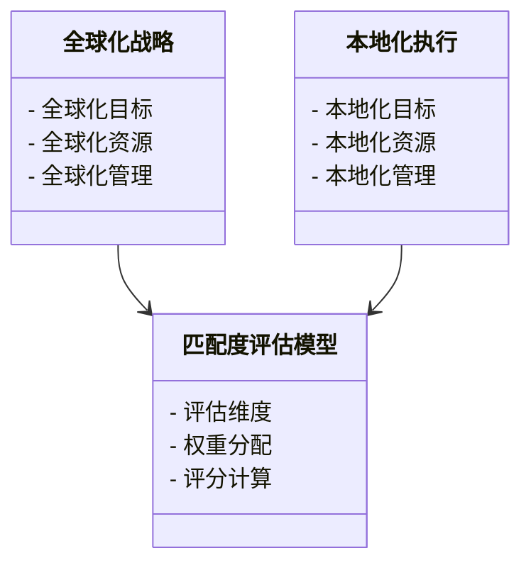
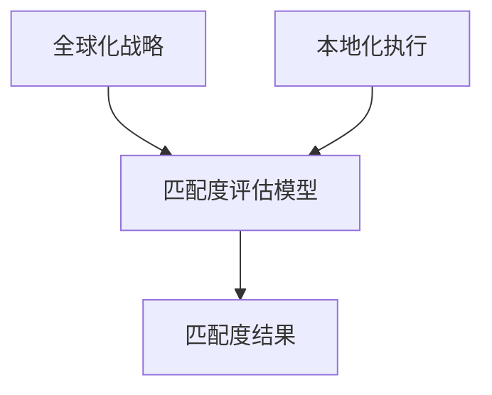
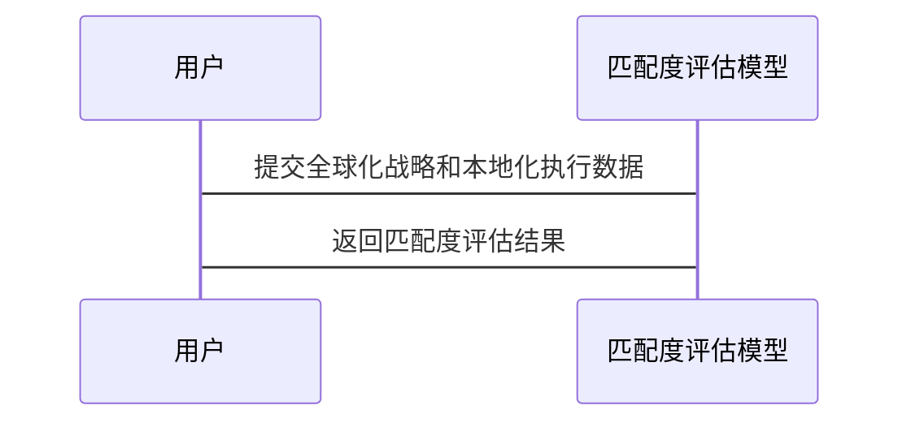

                 


# 彼得林奇如何评估公司的全球化人才战略与本地化执行的匹配度

**关键词**：彼得林奇，全球化人才战略，本地化执行，匹配度评估，人才管理，战略执行，企业全球化

**摘要**：本文深入分析了彼得·林奇在全球化人才战略与本地化执行匹配度评估方面的独特见解和方法。通过详细阐述全球化人才战略的核心概念、本地化执行的关键要素以及两者之间的匹配度评估模型，本文为读者提供了如何在全球化背景下实现人才战略与本地化执行高效协同的实践指南。文章结合理论分析、数学模型和实际案例，帮助企业在复杂的全球化环境中优化人才管理策略，提升战略执行效率。

---

## 第1章 全球化人才战略与本地化执行的背景与概念

### 1.1 全球化人才战略的核心概念

#### 1.1.1 全球化人才战略的定义
全球化人才战略是指企业在跨国经营过程中，通过在全球范围内吸引、培养和管理人才，以支持企业全球化业务目标的实现。其核心在于充分利用全球人才资源，优化企业在全球市场中的竞争力。

#### 1.1.2 全球化人才战略的核心要素
- **全球视野**：从全球范围内配置人才资源，打破地域限制。
- **文化多样性**：尊重并利用不同文化背景员工的特点，增强团队协作能力。
- **战略一致性**：确保人才战略与企业全球化战略目标保持一致。

#### 1.1.3 全球化人才战略的实施背景
随着企业全球化扩张，人才需求呈现多样化和本地化特点。全球化人才战略的实施背景包括：
1. 全球市场的复杂性要求企业具备跨文化管理能力。
2. 人才资源分布不均，需要在全球范围内优化配置。
3. 本地化人才需求与全球化战略目标之间的平衡。

---

### 1.2 本地化执行的基本概念

#### 1.2.1 本地化执行的定义
本地化执行是指企业在特定国家或地区，根据当地市场、文化、法律法规等因素，调整企业战略、产品、服务和管理方式的过程。其核心在于适应当地环境，增强企业竞争力。

#### 1.2.2 本地化执行的关键特征
- **文化适应性**：员工需要具备对当地文化的理解能力和适应能力。
- **法律合规性**：遵守当地法律法规，确保业务合法合规。
- **本地资源利用**：充分利用当地人才、供应商和合作伙伴资源。

#### 1.2.3 本地化执行的实施挑战
1. **文化冲突**：跨国文化背景下，员工之间的沟通与协作可能存在障碍。
2. **法律法规差异**：不同国家的劳动法、税收政策等差异增加了管理复杂性。
3. **本地化与全球化战略的平衡**：如何在全球化战略框架下实现本地化目标是一个关键挑战。

---

### 1.3 全球化与本地化的联系与区别

#### 1.3.1 全球化与本地化的核心联系
- **战略协同**：全球化战略为本地化执行提供方向，本地化执行为全球化战略提供落地支持。
- **资源互补**：全球化战略提供全球视野和资源，本地化执行提供具体实施能力。

#### 1.3.2 全球化与本地化的关键区别
- **目标层次**：全球化战略注重企业整体目标的实现，本地化执行注重具体市场的适应性。
- **实施范围**：全球化战略涉及多个市场，本地化执行聚焦于单一市场。

#### 1.3.3 全球化与本地化在企业战略中的作用
- **全球化战略**：为企业提供长期发展方向和资源优化配置。
- **本地化执行**：为企业在全球市场中实现具体目标提供保障。

---

## 第2章 彼得·林奇的人才战略评估方法

### 2.1 彼得·林奇的全球化人才战略框架

#### 2.1.1 全球化人才战略的四维度模型
彼得·林奇提出了全球化人才战略的四维度模型，包括：
1. **人才多样性**：员工来自不同文化背景，具备多样化的技能和经验。
2. **跨文化协作能力**：员工能够在全球团队中有效协作。
3. **本地化适应能力**：员工能够快速适应不同市场的文化、法律和商业环境。
4. **全球视野**：员工具备全球化的思维方式，能够从全球角度解决问题。

#### 2.1.2 全球化人才战略的评估标准
- **人才多样性指数**：衡量员工背景的多样性。
- **跨文化协作效率**：衡量团队在全球化项目中的协作效率。
- **本地化适应能力**：衡量员工对特定市场的适应能力。

#### 2.1.3 全球化人才战略的实施步骤
1. **明确全球化目标**：确定企业在全球市场中的定位和目标。
2. **制定人才多样性策略**：吸引来自不同文化背景的人才。
3. **培养跨文化协作能力**：通过培训和项目实践提升员工的协作能力。
4. **优化本地化适应能力**：通过本地化培训和文化融入活动，增强员工的适应能力。

---

### 2.2 本地化执行的评估维度

#### 2.2.1 本地化执行的核心指标
- **本地员工比例**：衡量企业对本地人才的依赖程度。
- **本地化管理效率**：衡量企业在本地市场的管理效率。
- **本地化业务表现**：衡量企业在本地市场的业绩表现。

#### 2.2.2 本地化执行的关键绩效指标（KPI）
- **市场份额增长率**：本地市场中企业市场份额的年增长率。
- **本地员工满意度**：员工对本地化管理的满意度。
- **本地化项目成功率**：本地化项目按时完成并达到预期目标的比例。

#### 2.2.3 本地化执行的评估工具与方法
- **文化适应性评估工具**：用于评估员工对本地文化的适应能力。
- **本地化管理效率评估方法**：通过数据分析和实地调研，评估本地化管理效率。

---

### 2.3 全球化与本地化的匹配度评估模型

#### 2.3.1 匹配度评估模型的构建逻辑
彼得·林奇提出的匹配度评估模型基于以下逻辑：
1. 全球化战略为企业提供整体方向，本地化执行为企业提供具体实施路径。
2. 两者的匹配度取决于全球化战略与本地化执行的重叠部分。

#### 2.3.2 匹配度评估模型的数学公式
$$匹配度 = \frac{全球化战略与本地化执行的重叠部分}{全球化战略的总范围} \times 100\%$$

其中，$全球化战略与本地化执行的重叠部分$ 表示全球化战略中可以在本地化执行中落地的部分。

#### 2.3.3 匹配度评估模型的适用场景
- **跨国公司**：需要在全球范围内配置资源，实现全球化战略。
- **新兴市场**：需要通过本地化执行快速适应市场环境。
- **全球化扩张阶段**：企业在进入新市场时，需要评估全球化战略与本地化执行的匹配度。

---

### 2.4 本章小结
彼得·林奇的全球化人才战略评估方法为我们提供了一个系统化的框架，通过全球化战略的四维度模型和本地化执行的评估维度，我们可以更好地理解全球化与本地化的匹配度。匹配度评估模型的提出为企业的全球化人才战略与本地化执行的协同提供了理论依据和实践指导。

---

## 第3章 全球化人才战略与本地化执行的核心概念与联系

### 3.1 全球化人才战略的核心要素

#### 3.1.1 全球化人才战略的目标设定
- **全球化视野**：从全球角度制定人才战略。
- **本地化目标**：根据不同市场特点制定具体目标。

#### 3.1.2 全球化人才战略的实施路径
- **吸引全球人才**：通过全球化招聘策略吸引优秀人才。
- **培养本地化人才**：通过本地化培训提升员工的适应能力。

#### 3.1.3 全球化人才战略的风险管理
- **文化冲突风险**：制定跨文化管理策略，减少文化冲突。
- **法律合规风险**：遵守不同国家的劳动法和税收政策。

---

### 3.2 本地化执行的核心要素

#### 3.2.1 本地化执行的组织结构
- **本地化管理团队**：负责本地市场的具体执行。
- **全球化支持团队**：提供全球化战略的支持和指导。

#### 3.2.2 本地化执行的文化适应
- **文化培训**：通过文化培训提升员工的文化敏感性。
- **本地化沟通**：采用本地语言进行沟通和协作。

#### 3.2.3 本地化执行的资源分配
- **本地化预算分配**：根据市场特点分配资源。
- **本地化人力资源配置**：根据市场需求配置本地化人力资源。

---

### 3.3 全球化与本地化的匹配度核心概念

#### 3.3.1 匹配度的核心定义
匹配度是指全球化战略与本地化执行在目标、资源、文化、管理等方面的契合程度。

#### 3.3.2 匹配度的关键影响因素
- **全球化战略的清晰度**：全球化战略是否清晰明确。
- **本地化执行的能力**：本地化执行团队的能力和资源。
- **跨文化协作能力**：员工是否具备跨文化协作能力。

#### 3.3.3 匹配度的评估维度
- **战略一致性**：全球化战略与本地化执行的目标是否一致。
- **资源匹配度**：全球化战略与本地化执行的资源是否匹配。
- **文化适应性**：员工是否具备文化适应能力。

---

### 3.4 全球化与本地化的联系与协同

#### 3.4.1 全球化战略对本地化执行的指导作用
- **提供战略方向**：全球化战略为企业本地化执行提供方向。
- **优化资源配置**：全球化战略帮助企业在全球范围内优化资源配置。

#### 3.4.2 本地化执行对全球化战略的反馈作用
- **提供市场反馈**：本地化执行为全球化战略提供市场反馈。
- **提升全球竞争力**：本地化执行增强企业在特定市场的竞争力。

#### 3.4.3 全球化与本地化的协同实现路径
- **建立协同机制**：通过协同机制实现全球化与本地化的有效协同。
- **加强跨文化管理**：通过跨文化管理提升全球化与本地化的协同效果。

---

## 第4章 全球化人才战略与本地化执行的匹配度评估模型

### 4.1 匹配度评估模型的构建逻辑

#### 4.1.1 模型构建的理论基础
- **全球化战略理论**：全球化战略的核心要素和实施路径。
- **本地化执行理论**：本地化执行的核心要素和实施方法。

#### 4.1.2 模型构建的方法论
- **系统分析法**：从系统角度分析全球化与本地化的匹配度。
- **层次分析法（AHP）**：通过层次分析法确定各个评估维度的权重。

#### 4.1.3 模型构建的关键假设
- 假设1：全球化战略与本地化执行之间存在一定的关联性。
- 假设2：匹配度可以通过量化指标进行评估。

---

### 4.2 匹配度评估模型的数学公式

#### 4.2.1 全球化战略与本地化执行的匹配度计算公式
$$匹配度 = \sum_{i=1}^{n} w_i \times s_i$$
其中，$w_i$ 是第i个评估维度的权重，$s_i$ 是第i个评估维度的评分。

#### 4.2.2 评估维度权重分配
- 全球化战略一致性：权重40%
- 本地化执行能力：权重30%
- 跨文化协作能力：权重20%
- 文化适应能力：权重10%

---

### 4.3 匹配度评估模型的属性特征对比

#### 4.3.1 全球化战略与本地化执行的属性对比表格
| 属性 | 全球化战略 | 本地化执行 |
|------|-----------|-----------|
| 目标 | 全球范围   | 特定市场   |
| 资源 | 全球配置   | 本地配置   |
| 文化 | 多元化      | 地方化      |
| 管理 | 集中式      | 分散式      |

---

### 4.4 匹配度评估模型的实施步骤

#### 4.4.1 确定评估维度
- 根据企业实际情况，确定全球化战略与本地化执行的评估维度。

#### 4.4.2 确定权重分配
- 根据评估维度的重要性，确定各个维度的权重。

#### 4.4.3 评分与计算
- 对每个评估维度进行评分，根据权重计算匹配度。

#### 4.4.4 分析结果
- 根据匹配度结果，分析全球化与本地化的匹配程度，并提出改进建议。

---

## 第5章 全球化人才战略与本地化执行的匹配度评估模型

### 5.1 问题场景介绍

#### 5.1.1 问题背景
- 企业在全球化扩张过程中，常常面临全球化战略与本地化执行不匹配的问题。
- 这种不匹配可能导致资源浪费、管理混乱和业务失败。

#### 5.1.2 问题描述
- 全球化战略与本地化执行之间缺乏协同。
- 本地化执行团队的能力不足，导致全球化战略难以落地。

#### 5.1.3 问题解决
- 通过匹配度评估模型，帮助企业识别全球化与本地化的匹配程度。
- 根据匹配度结果，优化全球化与本地化的协同。

---

### 5.2 系统功能设计

#### 5.2.1 领域模型图


---

### 5.3 系统架构设计

#### 5.3.1 系统架构图


---

### 5.4 系统接口设计

#### 5.4.1 输入接口
- 全球化战略数据接口
- 本地化执行数据接口

#### 5.4.2 输出接口
- 匹配度评估结果接口

---

### 5.5 系统交互流程

#### 5.5.1 序列图


---

## 第6章 项目实战：全球化人才战略与本地化执行的匹配度评估

### 6.1 环境安装

#### 6.1.1 系统需求
- 操作系统：Windows/Mac/Linux
- Python版本：3.6以上
- 依赖库：Mermaid、Python-Markdown等

#### 6.1.2 安装步骤
```bash
pip install mermaid
pip install python-markdown
```

---

### 6.2 核心代码实现

#### 6.2.1 匹配度评估模型代码
```python
def calculate_match_degree(global_strategy, local_execution, weights):
    match_degree = 0
    for i in range(len(weights)):
        match_degree += weights[i] * (global_strategy[i] + local_execution[i]) / 2
    return match_degree

# 示例数据
global_strategy = [80, 70, 60, 50]  # 全球化战略各维度评分
local_execution = [70, 80, 60, 70]   # 本地化执行各维度评分
weights = [0.4, 0.3, 0.2, 0.1]       # 各维度权重

match_degree = calculate_match_degree(global_strategy, local_execution, weights)
print(f"匹配度 = {match_degree}%")
```

---

### 6.3 代码应用解读与分析

#### 6.3.1 代码功能
- 通过函数 `calculate_match_degree` 计算全球化战略与本地化执行的匹配度。
- 示例数据展示如何使用代码计算匹配度。

#### 6.3.2 代码实现细节
- 输入参数：全球化战略评分、本地化执行评分、各维度权重。
- 输出结果：匹配度百分比。

---

### 6.4 实际案例分析

#### 6.4.1 案例背景
某跨国企业在进入新兴市场时，需要评估全球化战略与本地化执行的匹配度。

#### 6.4.2 数据输入
- 全球化战略评分：[85, 80, 70, 65]
- 本地化执行评分：[75, 85, 70, 75]
- 权重：[0.4, 0.3, 0.2, 0.1]

#### 6.4.3 计算过程
$$匹配度 = 0.4 \times (85+75)/2 + 0.3 \times (80+85)/2 + 0.2 \times (70+70)/2 + 0.1 \times (65+75)/2$$
$$匹配度 = 0.4 \times 80 + 0.3 \times 82.5 + 0.2 \times 70 + 0.1 \times 70$$
$$匹配度 = 32 + 24.75 + 14 + 7 = 77.75\%$$

#### 6.4.4 结果分析
匹配度为77.75%，说明全球化战略与本地化执行的匹配度较高，但仍有优化空间。

---

### 6.5 项目小结

---

## 第7章 最佳实践与注意事项

### 7.1 最佳实践

#### 7.1.1 小贴士
- 定期评估全球化战略与本地化执行的匹配度，及时调整。
- 加强跨文化管理能力，提升全球化与本地化的协同效果。

#### 7.1.2 注意事项
- 匹配度评估模型的权重分配需要根据企业实际情况调整。
- 本地化执行团队的能力直接影响匹配度结果。

---

## 作者

**作者：AI天才研究院/AI Genius Institute & 禅与计算机程序设计艺术 /Zen And The Art of Computer Programming**

---

本文通过详细阐述彼得·林奇的全球化人才战略与本地化执行的匹配度评估方法，结合理论分析、数学模型和实际案例，为读者提供了在全球化背景下优化人才管理策略的实践指南。

