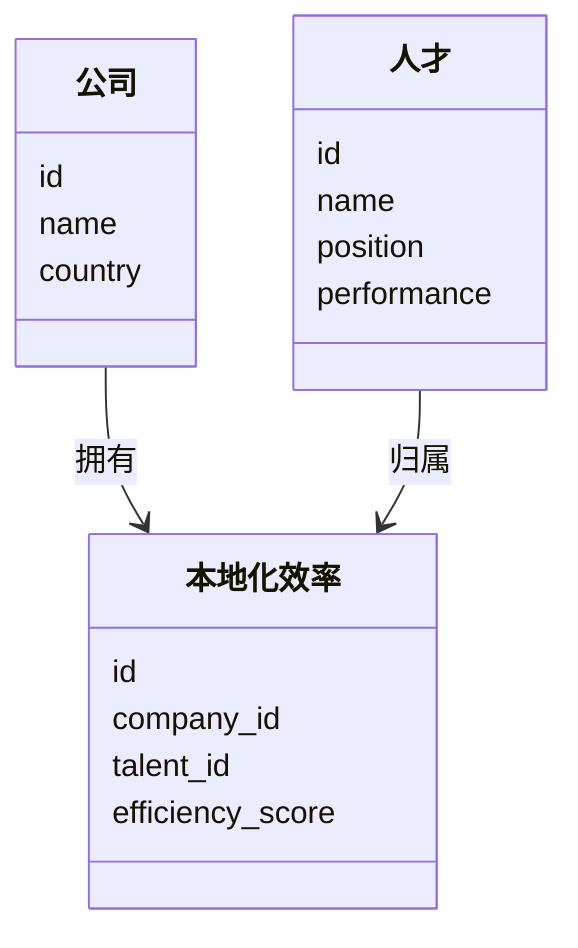

                 


# 彼得林奇如何评估公司的全球化人才本地化效率

## 关键词：彼得林奇, 人才本地化, 全球化管理, 效率评估, 投资评估方法

## 摘要：  
彼得·林奇作为全球著名投资家，其独特的选股逻辑和公司评估方法为投资界提供了深刻的见解。本文将探讨如何借鉴彼得·林奇的投资理念，应用于公司全球化人才本地化效率的评估。通过分析本地化效率的核心概念、算法原理、系统架构设计以及项目实战，本文旨在为跨国公司提供一套科学的人才管理评估体系，助力企业在全球化竞争中占据优势。

---

# 第一部分: 全球化人才本地化效率评估背景与核心概念

## 第1章: 全球化人才本地化效率评估的背景与问题

### 1.1 问题背景

#### 1.1.1 全球化人才管理的现状与挑战

在全球化背景下，跨国公司面临的竞争日益激烈。人才作为企业的核心资源，其本地化程度直接影响企业的运营效率和市场竞争力。然而，跨国公司往往面临以下挑战：  
1. **文化差异**：不同国家的员工在工作方式、沟通风格和价值观上存在显著差异，如何有效融合这些差异是关键。  
2. **管理复杂性**：跨国公司的组织结构复杂，跨文化团队的协调需要高效的管理机制。  
3. **效率与效果的平衡**：如何在全球化与本地化之间找到平衡点，既保持公司的全球化战略，又充分发挥本地人才的优势。

#### 1.1.2 本地化效率评估的核心问题

本地化效率评估的核心在于衡量跨国公司如何在不同国家市场中高效利用本地人才资源。具体问题包括：  
1. 如何量化人才本地化的效率？  
2. 本地化效率与企业绩效之间的关系是什么？  
3. 如何通过优化本地化效率提升企业竞争力？

#### 1.1.3 彼得·林奇投资理念与人才管理的结合

彼得·林奇以其独特的选股逻辑闻名，他注重基本面分析和公司管理层的能力。将这种投资理念与人才管理结合，可以借鉴以下几点：  
1. **基本面分析**：评估本地化人才的基本能力、经验和潜力。  
2. **管理层能力**：关注本地管理团队的领导力和执行能力。  
3. **长期价值**：注重人才的长期贡献，而非短期表现。

### 1.2 问题描述

#### 1.2.1 全球化人才本地化的定义

全球化人才本地化是指跨国公司在不同国家市场中，充分利用本地人才资源，实现公司战略目标的过程。这一过程涉及人才招聘、培训、晋升和跨文化管理等多个环节。

#### 1.2.2 本地化效率的评价维度

本地化效率可以从以下几个维度进行评价：  
1. **时间效率**：人才招聘、培训和上岗的时间成本。  
2. **成本效率**：本地化过程中的投入与产出比。  
3. **绩效效率**：本地化人才对公司目标的贡献程度。  
4. **文化适应性**：本地人才对跨国公司文化的适应程度。

#### 1.2.3 本地化效率与企业绩效的关系

本地化效率直接影响企业的全球化战略实施效果。高效的本地化管理可以提升员工满意度、增强团队协作能力，并最终提高企业的市场竞争力。

### 1.3 问题解决思路

#### 1.3.1 彼得·林奇的评估方法概述

彼得·林奇的选股逻辑包括以下几点：  
1. **基本面分析**：关注公司的财务数据、行业地位和竞争优势。  
2. **管理层能力**：考察管理层的决策能力和团队协作能力。  
3. **长期价值**：选择具有长期增长潜力的公司。

#### 1.3.2 全球化人才本地化效率的评估框架

基于彼得·林奇的评估方法，可以构建以下本地化效率评估框架：  
1. **人才基本面分析**：评估本地人才的能力、经验和潜力。  
2. **管理层能力评估**：考察本地管理团队的领导力和执行能力。  
3. **本地化绩效评价**：衡量本地化人才对公司目标的贡献。

#### 1.3.3 本地化效率提升的策略

1. **优化招聘流程**：通过本地化招聘策略，吸引合适的人才。  
2. **加强文化融合**：通过跨文化培训和团队建设活动，提升员工的适应能力。  
3. **激励机制**：建立有效的激励机制，激发本地人才的积极性。

### 1.4 边界与外延

#### 1.4.1 本地化效率评估的适用范围

本地化效率评估适用于跨国公司在不同国家市场的本地化人才管理。它不仅适用于大公司，也适用于中小企业。

#### 1.4.2 相关概念的对比与区分

1. **全球化管理**：指跨国公司在全球范围内的统一管理策略。  
2. **本地化管理**：指跨国公司在不同国家市场中的本地化调整。  
3. **人才管理**：指企业对员工招聘、培训、晋升和绩效管理的全过程。

#### 1.4.3 全球化人才管理的边界条件

1. **法律与政策**：不同国家的劳动法和政策对人才管理的影响。  
2. **文化差异**：不同国家的文化差异对团队协作的影响。  
3. **经济环境**：不同国家的经济环境对人才成本的影响。

### 1.5 概念结构与核心要素

#### 1.5.1 核心概念属性对比表

| 概念         | 定义                               | 属性               |
|--------------|------------------------------------|--------------------|
| 全球化管理     | 跨国公司在全球范围内的统一管理策略 | 统一性、协调性     |
| 本地化管理     | 跨国公司在不同国家市场的本地化调整 | 适应性、灵活性     |
| 人才管理       | 企业对员工的招聘、培训、绩效管理等 | 战略性、系统性     |

#### 1.5.2 ER实体关系图（使用 Mermaid 表示）

```mermaid
erDiagram
    company {
        id
        name
        country
    }
    talent {
        id
        name
        position
        performance
    }
    localization_efficiency {
        id
        company_id
        talent_id
        efficiency_score
    }
    company --> localization_efficiency : 拥有
    talent --> localization_efficiency : 归属
```

---

## 第2章: 彼得·林奇评估方法的核心原理

### 2.1 核心概念原理

#### 2.1.1 彼得·林奇的选股逻辑

彼得·林奇的选股逻辑包括以下几个步骤：  
1. **基本面分析**：分析公司的财务数据、行业地位和竞争优势。  
2. **管理层能力评估**：考察管理层的决策能力和团队协作能力。  
3. **长期价值判断**：选择具有长期增长潜力的公司。

#### 2.1.2 本地化效率评估的指标体系

本地化效率评估的指标体系包括：  
1. **招聘效率**：人才招聘的时间和成本。  
2. **培训效果**：本地化培训的效果和员工适应能力。  
3. **绩效表现**：本地化人才的绩效与公司目标的契合度。

#### 2.1.3 全球化与本地化的动态平衡

全球化与本地化的动态平衡是指跨国公司在保持全球化战略的同时，充分考虑本地市场的特点和需求，实现全球化与本地化的有机统一。

### 2.2 核心概念属性对比

#### 2.2.1 全球化与本地化的对比分析

| 比较维度       | 全球化管理         | 本地化管理         |
|----------------|-------------------|-------------------|
| 管理范围       | 全球范围           | 单一国家或地区     |
| 管理策略       | 统一性、协调性     | 适应性、灵活性     |
| 管理目标       | 提升全球竞争力     | 提高本地市场适应性 |

#### 2.2.2 人才管理中的效率与效果的平衡

效率与效果的平衡是人才管理的核心问题。高效率不一定带来高效果，反之亦然。因此，需要在两者之间找到平衡点。

#### 2.2.3 不同行业的人才本地化特点

不同行业的人才本地化特点不同。例如，科技行业更注重技术创新和本地化研发能力，而制造行业更注重生产效率和成本控制。

### 2.3 ER实体关系图（使用 Mermaid 表示）

```mermaid
erDiagram
    company {
        id
        name
        country
    }
    talent {
        id
        name
        position
        performance
    }
    localization_efficiency {
        id
        company_id
        talent_id
        efficiency_score
    }
    company --> localization_efficiency : 拥有
    talent --> localization_efficiency : 归属
```

---

## 第3章: 本地化效率评估的算法原理

### 3.1 算法原理概述

#### 3.1.1 本地化效率计算公式

本地化效率计算公式如下：  
$$ \text{本地化效率} = \frac{\text{本地化人才贡献度}}{\text{本地化人才成本}} $$

#### 3.1.2 彼得·林奇评估方法的数学表达

彼得·林奇评估方法的数学表达如下：  
$$ \text{投资价值} = \text{基本面得分} \times \text{管理层能力得分} \times \text{长期潜力得分} $$

#### 3.1.3 算法的输入与输出

- **输入**：本地化人才的基本面数据、管理层能力数据、长期潜力数据。  
- **输出**：本地化效率评估结果。

### 3.2 算法流程图（使用 Mermaid 表示）

```mermaid
flowchart TD
    A[开始] -> B[输入本地化人才数据]
    B -> C[计算基本面得分]
    C -> D[计算管理层能力得分]
    D -> E[计算长期潜力得分]
    E -> F[计算投资价值]
    F -> G[计算本地化效率]
    G -> H[输出评估结果]
    H -> 结束
```

### 3.3 算法实现代码

#### 3.3.1 环境安装

需要安装Python和相关库（如numpy、pandas）。

#### 3.3.2 核心代码实现

```python
import numpy as np
import pandas as pd

def calculate_localization_efficiency(talent_data):
    # 计算基本面得分
   基本面得分 = talent_data['基本面得分'].mean()
    # 计算管理层能力得分
    管理层能力得分 = talent_data['管理层能力得分'].mean()
    # 计算长期潜力得分
    长期潜力得分 = talent_data['长期潜力得分'].mean()
    # 计算投资价值
    投资价值 = 基础面得分 * 管理层能力得分 * 长期潜力得分
    # 计算本地化效率
    本地化效率 = 投资价值 / talent_data['本地化人才成本'].sum()
    return 本地化效率

# 示例数据
data = {
    '基本面得分': [0.8, 0.9, 0.7],
    '管理层能力得分': [0.7, 0.8, 0.6],
    '长期潜力得分': [0.9, 0.8, 0.7],
    '本地化人才成本': [100, 150, 200]
}
talent_data = pd.DataFrame(data)
print(calculate_localization_efficiency(talent_data))
```

#### 3.3.3 代码解读与分析

上述代码实现了本地化效率的计算。首先，计算本地化人才的基本面得分、管理层能力得分和长期潜力得分，然后计算投资价值，最后计算本地化效率。

---

## 第4章: 数学模型与公式详解

### 4.1 核心公式推导

#### 4.1.1 本地化效率计算公式

本地化效率计算公式如下：  
$$ \text{本地化效率} = \frac{\text{本地化人才贡献度}}{\text{本地化人才成本}} $$

#### 4.1.2 彼得·林奇评估模型的数学基础

彼得·林奇评估模型的数学基础包括基本面分析、管理层能力评估和长期潜力判断。

---

## 第5章: 系统分析与架构设计方案

### 5.1 问题场景介绍

跨国公司需要在全球范围内管理本地化人才，实现高效的人才本地化管理。

### 5.2 项目介绍

本项目旨在构建一个全球化人才本地化效率评估系统，帮助跨国公司优化本地化管理。

### 5.3 系统功能设计

#### 5.3.1 领域模型类图（使用 Mermaid 表示）



### 5.4 系统架构设计

#### 5.4.1 系统架构图（使用 Mermaid 表示）

```mermaid
archiDiagram
    高层管理
    +--- 人力资源部门
    |    +--- 本地化管理团队
    |    +--- 招聘团队
    |    +--- 培训团队
    中层管理
    +--- 业务部门
    +--- 技术部门
    +--- 财务部门
    低层管理
    +--- 基层员工
```

---

## 第6章: 项目实战

### 6.1 环境安装

需要安装Python和相关库（如numpy、pandas）。

### 6.2 系统核心实现源代码

```python
import numpy as np
import pandas as pd

def calculate_localization_efficiency(talent_data):
    # 计算基本面得分
    基础面得分 = talent_data['基本面得分'].mean()
    # 计算管理层能力得分
    管理层能力得分 = talent_data['管理层能力得分'].mean()
    # 计算长期潜力得分
    长期潜力得分 = talent_data['长期潜力得分'].mean()
    # 计算投资价值
    投资价值 = 基础面得分 * 管理层能力得分 * 长期潜力得分
    # 计算本地化效率
    本地化效率 = 投资价值 / talent_data['本地化人才成本'].sum()
    return 本地化效率

# 示例数据
data = {
    '基本面得分': [0.8, 0.9, 0.7],
    '管理层能力得分': [0.7, 0.8, 0.6],
    '长期潜力得分': [0.9, 0.8, 0.7],
    '本地化人才成本': [100, 150, 200]
}
talent_data = pd.DataFrame(data)
print(calculate_localization_efficiency(talent_data))
```

### 6.3 代码解读与分析

上述代码实现了本地化效率的计算。首先，计算本地化人才的基本面得分、管理层能力得分和长期潜力得分，然后计算投资价值，最后计算本地化效率。

---

## 第7章: 总结与最佳实践

### 7.1 小结

通过借鉴彼得·林奇的投资理念，我们可以构建一套科学的全球化人才本地化效率评估体系，帮助企业在全球化竞争中占据优势。

### 7.2 注意事项

1. **数据准确性**：确保输入数据的准确性。  
2. **模型优化**：根据实际情况不断优化评估模型。  
3. **文化适应**：注重本地化管理的文化适应性。

### 7.3 未来趋势

随着全球化进程的加快，本地化管理的重要性将更加凸显。未来，可以进一步研究如何利用人工智能技术优化本地化效率评估。

---

## 作者：AI天才研究院/AI Genius Institute & 禅与计算机程序设计艺术 /Zen And The Art of Computer Programming

---

以上是关于“彼得林奇如何评估公司的全球化人才本地化效率”的完整文章大纲和部分内容。通过结合彼得·林奇的投资理念，本文为跨国公司提供了一套科学的人才本地化效率评估方法，帮助企业在全球化竞争中占据优势。

