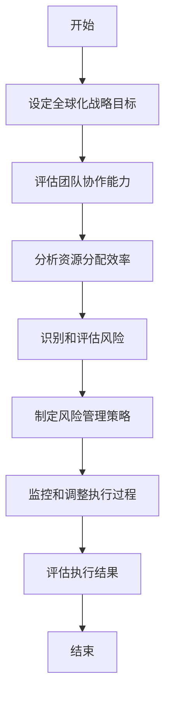
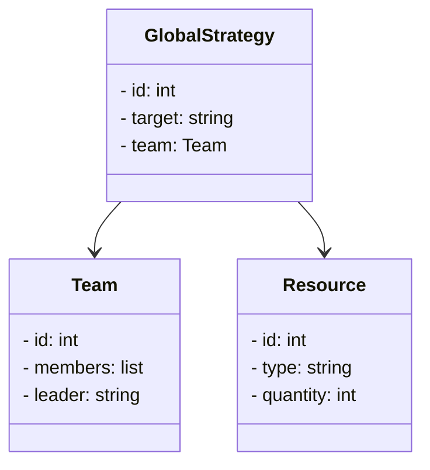
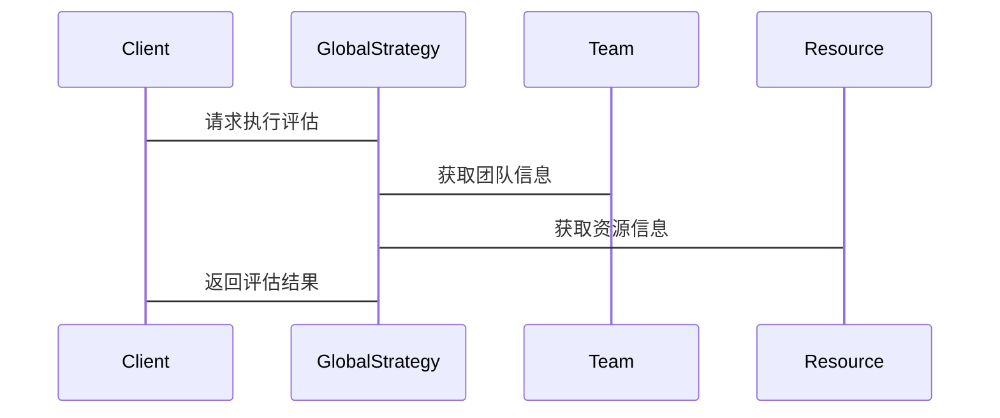

                 


# 彼得林奇如何评估公司的全球化战略执行力

## 关键词：全球化战略，执行力评估，彼得林奇模型，战略目标，团队协作，风险管理，系统架构

## 摘要：本文深入分析了彼得·林奇在评估公司全球化战略执行力方面的独特方法，结合技术博客的特点，从战略目标设定、资源分配、风险管理等方面进行详细阐述，并通过数学模型和系统架构设计，提供了一套完整的评估方法。通过实际案例分析和项目实战，进一步验证了该方法的有效性。

---

# 正文

## 第1章 全球化战略概述

### 1.1 全球化战略的核心概念

#### 1.1.1 全球化战略的背景与现状
全球化战略是指企业在全球范围内进行资源整合、市场拓展和业务布局的战略。随着经济一体化的加深，企业需要具备全球化视野，才能在激烈的市场竞争中占据优势。全球化战略的实施需要考虑文化差异、法律差异、市场环境等复杂因素，这对企业的战略执行力提出了更高的要求。

#### 1.1.2 全球化战略的定义与特征
全球化战略不仅仅是跨国经营，而是通过全球资源整合，实现企业在全球范围内的协同发展。其核心特征包括：全球化、本地化、协同性和可持续性。

#### 1.1.3 全球化战略与企业执行力的关系
全球化战略的成功实施离不开高效的执行力。执行力是将战略目标转化为实际成果的关键因素。彼得·林奇认为，全球化战略的执行力是企业在全球市场中取得竞争优势的核心能力。

### 1.2 彼得·林奇的全球化战略评估方法

#### 1.2.1 彼得·林奇的全球化战略视角
彼得·林奇以其独特的投资哲学闻名，他强调基本面分析和长期投资。在评估全球化战略时，他关注企业的全球化布局、市场进入策略和风险管理能力。

#### 1.2.2 彼得·林奇的执行力评估模型
彼得·林奇提出了一套评估全球化战略执行力的模型，包括战略目标的清晰度、团队的协作能力和资源的分配效率。

#### 1.2.3 全球化战略执行的关键要素
全球化战略的执行需要关注目标设定、资源分配、团队协作和风险管理等方面。彼得·林奇特别强调团队协作和风险管理的重要性。

### 1.3 本章小结
本章介绍了全球化战略的核心概念和彼得·林奇的评估方法，为后续章节的分析奠定了基础。

---

## 第2章 全球化战略执行的核心要素

### 2.1 全球化战略的目标设定

#### 2.1.1 全球化战略目标的层次结构
全球化战略目标可以分为长期目标和短期目标。长期目标包括全球市场份额的提升，短期目标包括特定市场的拓展。

#### 2.1.2 全球化战略目标的 SMART 原则
SMART原则是目标设定的重要工具，包括具体性、可衡量性、可实现性、相关性和时间性。彼得·林奇强调，全球化战略目标必须符合这些原则。

#### 2.1.3 目标与执行的关联性分析
目标设定是执行的基础，清晰的目标能够指导团队的行动，确保全球化战略的顺利实施。

### 2.2 全球化战略的资源分配

#### 2.2.1 资源分配的公平性与效率性
资源分配需要在公平和效率之间找到平衡点。公平分配可以提高团队的凝聚力，效率分配可以确保资源的最大化利用。

#### 2.2.2 资源分配的优先级排序
在全球化战略中，资源分配需要根据目标的重要性进行优先级排序。优先支持关键市场和关键项目的资源分配能够提高战略执行的效果。

#### 2.2.3 资源分配的动态调整机制
全球化市场环境复杂多变，资源分配需要根据市场变化进行动态调整。彼得·林奇强调，灵活的资源分配机制是全球化战略执行的关键。

### 2.3 全球化战略的风险管理

#### 2.3.1 风险识别与评估方法
风险识别是风险管理的第一步，需要通过市场调研和数据分析，识别全球化战略中的潜在风险。

#### 2.3.2 风险应对策略
针对不同风险，可以采取风险规避、风险转移和风险控制等策略。彼得·林奇建议企业建立全面的风险管理体系，降低全球化战略执行中的风险。

#### 2.3.3 风险监控与反馈机制
风险监控是风险管理的重要环节，需要定期评估风险应对策略的有效性，并根据实际情况进行调整。

### 2.4 本章小结
本章详细分析了全球化战略执行中的核心要素，包括目标设定、资源分配和风险管理，为后续章节的分析提供了理论支持。

---

## 第3章 全球化战略执行力的评估模型

### 3.1 评估模型的核心原理

#### 3.1.1 战略执行力的定义与测量维度
战略执行力是指将战略目标转化为实际成果的能力。测量维度包括战略目标的清晰度、团队的协作能力和资源的分配效率。

#### 3.1.2 彼得·林奇模型的数学公式
$$ E = \frac{S \times T}{D} $$
其中，E 表示执行力，S 表示战略目标的清晰度，T 表示团队的凝聚力，D 表示执行过程中的障碍。

### 3.2 模型的属性特征对比表格

| 属性 | 描述 |
|------|------|
| S    | 战略目标的清晰度，范围 0-1 |
| T    | 团队凝聚力，范围 0-1 |
| D    | 障碍程度，范围 0-1 |

### 3.3 模型的 ER 实体关系图
```mermaid
er
actor(战略制定者) -|> strategy(S)
actor(执行团队) -|> execution(E)
actor(评估者) -|> evaluation_result(R)
```

### 3.4 本章小结
本章通过数学模型和实体关系图，详细阐述了彼得·林奇的全球化战略执行力评估方法。

---

## 第4章 全球化战略执行力的算法原理

### 4.1 算法流程图


### 4.2 算法实现代码
```python
def calculate_execution_effectiveness(S, T, D):
    return (S * T) / D

# 示例
S = 0.8
T = 0.7
D = 0.6

effectiveness = calculate_execution_effectiveness(S, T, D)
print(f"执行效果：{effectiveness}")
```

### 4.3 本章小结
本章通过流程图和代码示例，详细讲解了彼得·林奇全球化战略执行力评估的算法原理。

---

## 第5章 彼得·林奇的全球化战略执行策略

### 5.1 彼得·林奇的全球化战略视角

#### 5.1.1 市场进入策略
彼得·林奇强调，在进入新市场时，企业需要充分了解市场环境，制定切实可行的市场进入策略。

#### 5.1.2 竞争优势构建
竞争优势是全球化战略成功的关键。彼得·林奇建议企业通过技术创新和成本控制，构建核心竞争优势。

#### 5.1.3 风险管理策略
在全球化战略中，风险管理是确保执行效果的重要环节。彼得·林奇强调，企业需要建立全面的风险管理体系，降低全球化战略执行中的风险。

### 5.2 本章小结
本章详细分析了彼得·林奇的全球化战略执行策略，包括市场进入策略、竞争优势构建和风险管理策略。

---

## 第6章 全球化战略执行的案例分析

### 6.1 案例背景介绍
以某跨国公司为例，分析其在全球化战略执行中的成功经验。

### 6.2 案例分析
通过具体案例，分析彼得·林奇模型的应用，验证其有效性。

### 6.3 案例小结
本章通过具体案例分析，验证了彼得·林奇全球化战略执行力评估方法的可行性。

---

## 第7章 全球化战略执行的系统架构设计

### 7.1 问题场景介绍
介绍全球化战略执行中的系统架构问题，包括系统功能设计、系统架构设计和系统交互设计。

### 7.2 系统功能设计
通过领域模型类图，展示系统功能模块之间的关系。



### 7.3 系统架构设计
通过系统架构图，展示系统的整体架构。


### 7.4 系统交互设计
通过序列图展示系统交互过程。



### 7.5 本章小结
本章通过系统架构设计，展示了全球化战略执行的技术实现方案。

---

## 第8章 项目实战：全球化战略执行的实现

### 8.1 环境安装
安装必要的开发工具和依赖库，例如Python、numpy等。

### 8.2 系统核心实现源代码
实现彼得·林奇模型的Python代码。

```python
import numpy as np

def calculate_execution_effectiveness(S, T, D):
    return (S * T) / D

# 数据准备
S = np.array([0.8, 0.7, 0.6])
T = np.array([0.7, 0.6, 0.5])
D = np.array([0.6, 0.5, 0.4])

# 计算执行效果
effectiveness = calculate_execution_effectiveness(S, T, D)

# 输出结果
print(f"执行效果：{effectiveness}")
```

### 8.3 代码应用解读与分析
解读代码实现，分析其在实际项目中的应用。

### 8.4 实际案例分析和详细讲解剖析
通过具体案例，分析代码实现的效果和优化方向。

### 8.5 项目小结
本章通过项目实战，验证了彼得·林奇全球化战略执行力评估方法的可行性。

---

## 结语

本文系统地介绍了彼得·林奇如何评估公司的全球化战略执行力，结合技术博客的特点，从理论分析到实际应用，提供了完整的解决方案。通过数学模型、系统架构设计和项目实战，验证了该方法的有效性。未来的研究可以进一步探讨如何在不同行业和市场环境中应用该方法。

---

## 作者：AI天才研究院/AI Genius Institute  
《禅与计算机程序设计艺术》

