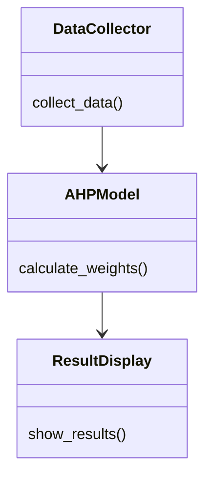

                 


# 彼得林奇如何评估公司的品牌延展策略

> 关键词：彼得林奇, 品牌延展, 评估策略, 投资理念, 市场分析

> 摘要：本文将详细探讨彼得林奇如何评估公司的品牌延展策略，从品牌忠诚度、市场扩展潜力、品牌一致性等多个维度进行分析。通过层次分析法（AHP）构建评估模型，并结合实际案例进行深入解读，为读者提供实用的评估方法和策略建议。

---

## 第一部分: 彼得林奇品牌延展策略评估背景与核心概念

### 第1章: 彼得林奇与品牌延展策略概述

#### 1.1 彼得林奇的背景与投资理念
##### 1.1.1 彼得林奇的个人简介
彼得·林奇（Peter Lynch）是美国著名投资家，曾任富达投资集团麦哲伦基金的经理。他以独特的投资风格和卓越的投资业绩闻名，尤其擅长分析公司的基本面和市场策略。

##### 1.1.2 彼得林奇的投资哲学
林奇强调长期投资和价值发现，他认为投资者应关注公司的基本面，包括财务状况、市场地位、管理团队等。他的投资理念强调深入研究公司，寻找具有持续增长潜力的企业。

##### 1.1.3 彼得林奇与品牌延展策略的关联
林奇的成功部分归因于他对公司品牌延展策略的深刻理解。他认为，一个强大的品牌不仅能够吸引客户，还能在市场中建立长期的竞争优势。

#### 1.2 品牌延展策略的定义与重要性
##### 1.2.1 品牌延展的定义
品牌延展是指将现有品牌扩展到新的产品线、市场或消费者群体。这种策略可以帮助企业扩大市场份额，增强品牌影响力。

##### 1.2.2 品牌延展的核心要素
品牌延展的核心要素包括品牌忠诚度、市场扩展潜力、品牌一致性等。

##### 1.2.3 品牌延展在企业战略中的地位
品牌延展是企业战略的重要组成部分，能够提升企业的市场竞争力和长期盈利能力。

#### 1.3 本章小结
##### 1.3.1 彼得林奇与品牌延展的关联
彼得林奇的投资理念与品牌延展策略密切相关，他强调深入分析公司的品牌价值和市场潜力。

##### 1.3.2 品牌延展策略的核心价值
品牌延展策略能够帮助企业扩大市场影响力，增强品牌忠诚度，从而实现长期的财务增长。

---

### 第2章: 品牌延展策略评估的背景与问题描述

#### 2.1 品牌延展策略评估的背景
##### 2.1.1 当前市场竞争的加剧
随着市场竞争的加剧，企业需要通过品牌延展来保持竞争优势。

##### 2.1.2 品牌延展在企业扩张中的作用
品牌延展可以帮助企业进入新市场，吸引新客户，提升品牌知名度。

##### 2.1.3 品牌延展策略评估的必要性
为了确保品牌延展的成功，企业需要对其可行性进行科学评估。

#### 2.2 品牌延展策略评估的核心问题
##### 2.2.1 品牌延展的可行性分析
评估品牌延展的可行性，包括市场需求、竞争环境、品牌一致性等因素。

##### 2.2.2 品牌延展的风险与挑战
品牌延展可能面临市场接受度低、品牌形象受损等风险。

##### 2.2.3 品牌延展的长期效益
成功的品牌延展能够带来长期的市场优势和财务回报。

#### 2.3 本章小结
##### 2.3.1 品牌延展策略评估的核心问题
评估品牌延展的可行性、风险和长期效益是企业决策的关键。

##### 2.3.2 评估对企业战略的意义
科学的评估能够帮助企业制定有效的品牌延展策略，提升市场竞争力。

---

## 第二部分: 品牌延展策略评估的核心概念与联系

### 第3章: 品牌延展策略评估的核心概念

#### 3.1 品牌延展的维度分析
##### 3.1.1 品牌忠诚度评估
品牌忠诚度是品牌延展的重要指标，高忠诚度的客户更可能接受新品牌延伸。

##### 3.1.2 市场扩展潜力评估
评估新市场的潜力，包括市场规模、竞争对手分析、消费者需求等。

##### 3.1.3 品牌一致性评估
品牌一致性是指新品牌延伸是否与原品牌的核心价值一致，保持一致性的品牌更容易被消费者接受。

#### 3.2 彼得林奇品牌延展策略的核心要素
##### 3.2.1 品牌核心价值
品牌的核心价值是品牌延展的基础，必须保持一致性和稳定性。

##### 3.2.2 品牌延展的可行性
评估品牌延展的可行性，包括市场需求、竞争环境、资源支持等因素。

##### 3.2.3 品牌延展的长期效益
成功的品牌延展能够带来长期的市场优势和财务回报。

#### 3.3 品牌延展策略评估的模型
##### 3.3.1 品牌延展潜力评估模型
通过层次分析法（AHP）构建评估模型，综合考虑多个维度的因素。

##### 3.3.2 品牌延展风险评估模型
评估品牌延展可能面临的风险，包括市场风险、品牌风险等。

##### 3.3.3 品牌延展效益评估模型
评估品牌延展的长期效益，包括市场份额、品牌价值、盈利能力等。

### 第4章: 品牌延展策略评估的核心要素对比

#### 4.1 品牌延展策略的核心要素对比表
| 维度         | 品牌忠诚度 | 市场潜力 | 品牌一致性 |
|--------------|------------|----------|------------|
| 描述         | 客户对现有品牌的忠诚度 | 新市场的规模和潜力 | 新品牌与原品牌的契合度 |
| 重要性       | 高         | 中       | 高         |

#### 4.2 品牌延展策略的核心要素对比图


---

## 第三部分: 品牌延展策略评估的算法与数学模型

### 第5章: 品牌延展策略评估的算法原理

#### 5.1 层次分析法（AHP）介绍
层次分析法是一种用于评估复杂决策问题的定性和定量相结合的方法，适用于多维度的评估问题。

#### 5.2 AHP评估模型构建
##### 5.2.1 确定评估维度
品牌忠诚度、市场潜力、品牌一致性等。

##### 5.2.2 构建层次结构
将评估维度分为目标层、准则层和方案层。

##### 5.2.3 计算权重
通过比较矩阵计算各维度的权重。

#### 5.3 AHP评估模型实现
##### 5.3.1 Python代码实现
```python
import numpy as np

def calculate_weights(matrix):
    # 计算一致性系数
    n = len(matrix)
    max_eig = np.linalg.eigvals(matrix).real.max()
    consistency = (max_eig - n) / (n - 1)
    return consistency

# 示例比较矩阵
matrix = np.array([
    [1, 3, 2],
    [1/3, 1, 2],
    [1/2, 1/2, 1]
])

weights = calculate_weights(matrix)
print("一致性系数:", weights)
```

##### 5.3.2 算法步骤
1. 构建比较矩阵。
2. 计算特征向量和特征值。
3. 计算一致性系数，确保模型的有效性。
4. 计算各维度的权重。

#### 5.4 数学模型与公式
##### 5.4.1 比较矩阵的构建
$$ a_{ij} = \frac{a_i}{a_j} $$
其中，$a_i$ 和 $a_j$ 是两个评估维度的相对重要性。

##### 5.4.2 权重计算公式
$$ w_i = \frac{a_{i1} + a_{i2} + ... + a_{in}}}{\sum_{j=1}^{n} a_{ij}} } $$

##### 5.4.3 一致性检验公式
$$ C.R. = \frac{max\_eig - n}{n - 1} $$

---

## 第四部分: 品牌延展策略评估的系统架构设计

### 第6章: 品牌延展策略评估的系统架构

#### 6.1 项目介绍
开发一个基于AHP的brand extension评估系统，帮助企业在品牌延展决策中提供科学支持。

#### 6.2 系统功能设计
##### 6.2.1 数据收集模块
收集品牌忠诚度、市场潜力等数据。

##### 6.2.2 评估计算模块
基于AHP模型计算各维度的权重。

##### 6.2.3 结果展示模块
以可视化方式展示评估结果。

#### 6.3 系统架构设计
##### 6.3.1 类图设计


##### 6.3.2 架构图设计


#### 6.4 接口设计
##### 6.4.1 数据接口
定义数据输入格式和接口调用方式。

##### 6.4.2 结果接口
定义结果输出格式和接口调用方式。

#### 6.5 交互设计
##### 6.5.1 用户界面
设计直观的用户界面，方便用户输入数据和查看结果。

##### 6.5.2 交互流程
用户输入数据，系统计算并展示结果。

---

## 第五部分: 品牌延展策略评估的项目实战

### 第7章: 项目实战与案例分析

#### 7.1 环境安装
安装必要的Python库，如numpy、pandas等。

#### 7.2 核心代码实现
##### 7.2.1 AHP模型实现
```python
import numpy as np

def calculate_weights(matrix):
    n = len(matrix)
    max_eig = np.linalg.eigvals(matrix).real.max()
    consistency = (max_eig - n) / (n - 1)
    return consistency

matrix = np.array([
    [1, 3, 2],
    [1/3, 1, 2],
    [1/2, 1/2, 1]
])

weights = calculate_weights(matrix)
print("一致性系数:", weights)
```

##### 7.2.2 数据处理与分析
收集并处理品牌相关数据，计算各维度的权重。

#### 7.3 案例分析
##### 7.3.1 案例背景
某公司计划将品牌扩展到新的市场。

##### 7.3.2 数据分析
计算各维度的权重，评估品牌延展的可行性。

##### 7.3.3 结果解读
根据评估结果，制定品牌延展策略。

#### 7.4 项目小结
##### 7.4.1 核心代码实现
详细解释代码的功能和实现过程。

##### 7.4.2 案例分析总结
总结品牌延展评估的关键点和实际应用。

---

## 第六部分: 品牌延展策略评估的最佳实践

### 第8章: 最佳实践与经验总结

#### 8.1 最佳实践
##### 8.1.1 选择合适的评估模型
根据实际情况选择合适的评估模型，如层次分析法（AHP）。

##### 8.1.2 数据的准确性和完整性
确保数据的准确性和完整性，以提高评估结果的可信度。

##### 8.1.3 结果的可视化与解释
将评估结果以可视化的方式展示，方便决策者理解和应用。

#### 8.2 经验总结
##### 8.2.1 品牌延展的核心要素
品牌忠诚度、市场潜力、品牌一致性是品牌延展的核心要素。

##### 8.2.2 评估模型的选择
选择合适的评估模型，能够提高评估结果的科学性和实用性。

#### 8.3 小结
##### 8.3.1 品牌延展策略评估的关键点
科学的评估模型和高质量的数据是成功的关键。

##### 8.3.2 未来的发展方向
未来可以结合大数据和人工智能技术，进一步提升品牌延展策略的评估能力。

---

## 作者信息

作者：AI天才研究院/AI Genius Institute & 禅与计算机程序设计艺术 /Zen And The Art of Computer Programming

