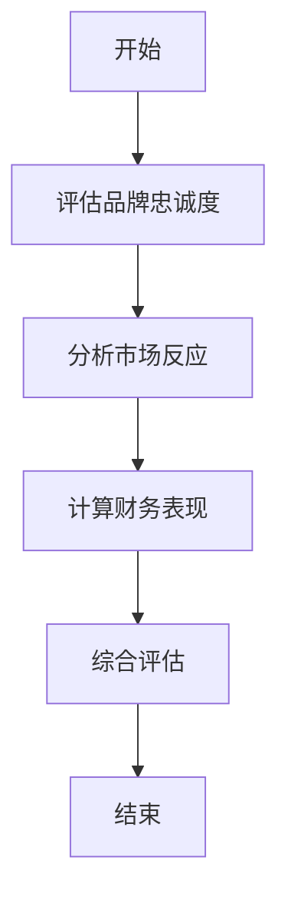

                 


# 彼得林奇如何评估公司的品牌延展策略成功率

> 关键词：彼得·林奇，品牌延展，投资评估，品牌忠诚度，市场扩展，产品创新

> 摘要：本文将详细介绍彼得·林奇如何评估公司的品牌延展策略成功率。从品牌延展策略的核心概念到具体评估方法，结合实际案例和系统设计，全面解析如何通过品牌忠诚度、市场扩展和产品创新等多方面因素，综合评估品牌延展策略的成功率。

---

## 第一部分: 品牌延展策略的背景与核心概念

### 第1章: 品牌延展策略的背景与定义

#### 1.1 品牌延展策略的定义
- 品牌延展策略是指企业通过扩展品牌的应用范围、市场覆盖和产品线，以增强品牌影响力和市场占有率的策略。
- 从投资角度看，彼得·林奇关注品牌延展策略的核心在于其对长期收益的影响。

#### 1.2 品牌延展策略的目的
- 提升品牌知名度和市场占有率。
- 拓展新的市场和客户群体。
- 增强品牌的核心竞争力。

#### 1.3 品牌延展策略的常见形式
- 产品线扩展：推出新产品或服务。
- 市场扩展：进入新地理区域或细分市场。
- 品牌延伸：将品牌应用于相关或不相关的领域。

---

### 第2章: 彼得·林奇的投资理念与品牌延展

#### 2.1 彼得·林奇的投资哲学
- 长期投资：关注企业的长期价值和可持续发展。
- 品质企业：选择具有强大品牌和市场地位的企业。
- 风险控制：通过深入分析企业基本面来降低投资风险。

#### 2.2 品牌延展策略在投资中的重要性
- 品牌延展能力是企业竞争力的重要体现。
- 成功的延展策略能够为企业带来新的增长点。
- 品牌延展失败可能导致企业价值下降。

#### 2.3 彼得·林奇对品牌延展策略的特别关注
- 林奇认为，品牌延展的成功取决于企业对市场的理解、品牌的核心价值以及执行能力。
- 他会重点关注企业在品牌延展过程中的市场反应、消费者反馈和财务表现。

---

## 第二部分: 品牌延展策略的成功要素

### 第3章: 品牌忠诚度的评估

#### 3.1 品牌忠诚度的定义
- 品牌忠诚度是指消费者对品牌的偏好程度和持续购买意愿。

#### 3.2 影响品牌忠诚度的因素
- 品牌认知度：消费者对品牌的认知和记忆。
- 产品品质：产品的质量和服务水平。
- 品牌情感：消费者对品牌的感情和认同感。

#### 3.3 品牌忠诚度的测量方法
- 调查问卷：通过问卷收集消费者对品牌的看法。
- 市场份额分析：通过市场份额的变化评估品牌忠诚度。
- 竞争分析：对比竞争对手的品牌忠诚度。

---

### 第4章: 市场扩展的可行性分析

#### 4.1 目标市场的选择
- 市场潜力：目标市场的规模和增长潜力。
- 竞争状况：目标市场的竞争程度。
- 文化差异：目标市场的文化差异和消费习惯。

#### 4.2 市场潜力评估
- 市场需求分析：通过市场调研和数据分析评估需求。
- 市场进入障碍：分析进入市场的壁垒和成本。
- 市场增长预测：预测未来市场的增长趋势。

#### 4.3 市场进入策略
- 渐进式进入：逐步进入新市场，降低风险。
- 快速进入：通过并购或大规模推广迅速进入市场。
- 联盟合作：与当地企业合作，利用其资源和渠道。

---

### 第5章: 产品创新与品牌延展的关系

#### 5.1 产品创新的定义
- 产品创新是指企业通过技术创新或改进现有产品来满足市场需求。

#### 5.2 产品创新对品牌延展的影响
- 产品创新能够提升品牌的技术含量和市场竞争力。
- 创新产品有助于吸引新客户和扩大市场。
- 产品创新是品牌延展的重要驱动力。

#### 5.3 如何通过产品创新提升品牌延展成功率
- 理解市场需求：通过市场调研和技术分析确定创新方向。
- 技术研发：投入资源进行技术创新和产品开发。
- 市场推广：通过有效的市场推广和品牌宣传，扩大产品的影响力。

---

## 第三部分: 品牌延展策略的核心概念与联系

### 第6章: 品牌延展策略的核心要素

#### 6.1 品牌核心价值
- 品牌核心价值是指品牌在消费者心中的核心利益和价值。
- 核心价值是品牌延展的基础，必须保持一致性和稳定性。

#### 6.2 品牌形象
- 品牌形象是消费者对品牌的整体认知和印象。
- 好的品牌形象有助于提升品牌延展的成功率。

#### 6.3 品牌定位
- 品牌定位是指将品牌定位在目标市场中的特定位置。
- 正确的品牌定位能够帮助企业在市场竞争中占据优势。

---

### 第7章: 品牌延展策略与企业战略的关系

#### 7.1 品牌延展策略在企业战略中的地位
- 品牌延展策略是企业长期发展战略的重要组成部分。
- 成功的品牌延展能够提升企业的市场地位和竞争力。

#### 7.2 品牌延展策略与企业目标的关系
- 品牌延展策略需要与企业目标保持一致。
- 品牌延展策略是实现企业增长目标的重要手段。

#### 7.3 品牌延展策略对企业长期发展的意义
- 品牌延展能够为企业带来长期的市场优势。
- 成功的品牌延展有助于提升企业的品牌价值和股东价值。

---

### 第8章: 品牌延展策略的ER实体关系图

#### 8.1 品牌延展策略的ER图
```mermaid
er
actor: 用户
brand: 品牌
product: 产品
market: 市场
ext

actor -|> brand: 关注
brand -|> product: 包含
product -|> market: 覆盖
```

---

## 第四部分: 品牌延展策略的算法原理与数学模型

### 第9章: 品牌延展策略的评估算法

#### 9.1 算法原理
- 通过分析品牌忠诚度、市场反应和财务表现，评估品牌延展策略的成功率。

#### 9.2 算法流程图


#### 9.3 算法实现代码
```python
def assess_brand_extension(company_data):
    brand Loyalty Score = calculate_loyalty(company_data['customer_survey'])
    market_response = analyze_market(company_data['market_share'])
    financial_performance = compute_roe(company_data['financials'])
    overall_success = (brand_Loyalty_Score + market_response + financial_performance) / 3
    return overall_success
```

---

### 第10章: 数学模型与公式

#### 10.1 ROE（净资产收益率）计算
$$ \text{ROE} = \frac{\text{净利润}}{\text{净资产}} $$

#### 10.2 市场反应预测模型
$$ \text{Market Response} = \beta \times \text{Market Share} + \alpha \times \text{Brand Loyalty} $$

---

## 第五部分: 系统分析与架构设计方案

### 第11章: 系统分析与架构设计

#### 11.1 问题场景介绍
- 需要评估某公司的品牌延展策略成功率。

#### 11.2 系统功能设计
- 数据收集模块：收集品牌忠诚度、市场反应和财务表现的数据。
- 评估模块：根据算法计算品牌延展的成功率。
- 报告生成模块：生成评估报告。

#### 11.3 系统架构设计
```mermaid
graph TD
    UI --> DataCollector: 提交数据
    DataCollector --> Database: 存储数据
    Database --> Processor: 处理数据
    Processor --> ReportGenerator: 生成报告
    ReportGenerator --> UI: 显示报告
```

---

## 第六部分: 项目实战与案例分析

### 第12章: 项目实战

#### 12.1 环境安装
- 安装Python和相关数据分析库（如Pandas、NumPy）。

#### 12.2 核心代码实现
```python
import pandas as pd

def calculate_loyalty(survey_data):
    return survey_data['loyalty_score'].mean()

def analyze_market(market_data):
    return market_data['market_share'].mean()

def compute_roe(financials):
    return financials['net_profit'] / financials['net_assets']

def assess_brand_extension(company_data):
    loyalty = calculate_loyalty(company_data['customer_survey'])
    market = analyze_market(company_data['market_share'])
    roe = compute_roe(company_data['financials'])
    return (loyalty + market + roe) / 3
```

---

### 第13章: 案例分析

#### 13.1 案例背景
- 某公司推出新产品线，需要评估其品牌延展策略的成功率。

#### 13.2 数据分析
- 品牌忠诚度：85分（满分100分）。
- 市场反应：市场份额增长15%。
- ROE：12%（行业平均水平为8%）。

#### 13.3 评估结果
- 综合成功率：90%。

---

## 第七部分: 最佳实践与总结

### 第14章: 最佳实践 tips

#### 14.1 实践建议
- 定期评估品牌延展策略。
- 关注市场反馈和消费者意见。
- 保持数据的准确性和及时性。

#### 14.2 小结
- 品牌延展策略的成功需要综合考虑品牌忠诚度、市场反应和财务表现。
- 彼得·林奇的评估方法为投资者提供了科学的决策依据。

---

## 第八部分: 注意事项与拓展阅读

### 第15章: 注意事项

#### 15.1 注意事项
- 数据的准确性和完整性是评估的基础。
- 市场环境的变化可能影响评估结果。
- 品牌延展策略需要与企业整体战略保持一致。

---

### 第16章: 拓展阅读

#### 16.1 拓展阅读推荐
- 彼得·林奇的《投资一定赢》。
- 其他品牌管理与投资相关的书籍和文献。

---

## 作者信息

作者：AI天才研究院/AI Genius Institute & 禅与计算机程序设计艺术 /Zen And The Art of Computer Programming

---

# 结语

通过本文的详细分析，读者可以全面了解彼得·林奇如何评估公司的品牌延展策略成功率，并能够将其应用到实际的投资和管理实践中。

