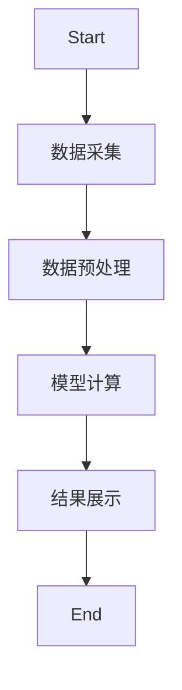
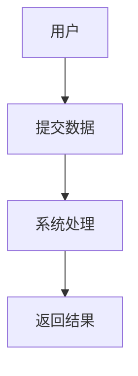
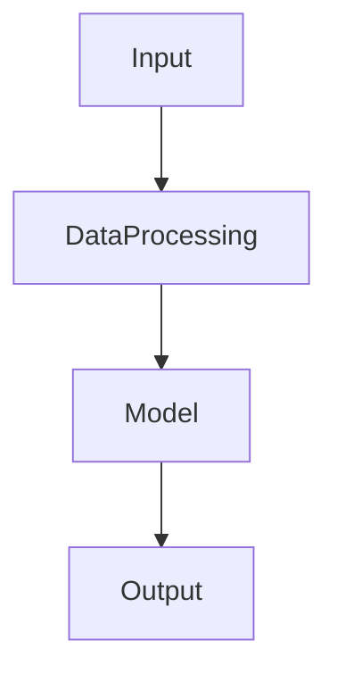

                 


# 第二部分: 彼得·林奇品牌扩张策略的算法实现与系统架构

## # 第4章: 算法实现

### 4.1 算法基本实现

#### 4.1.1 算法步骤
1. 数据收集：收集目标公司的品牌相关数据，包括市场定位、品牌忠诚度、市场渗透率等。
2. 数据预处理：清洗数据，处理异常值，标准化数据。
3. 模型计算：应用林奇模型，计算品牌扩张的潜力和风险。
4. 结果输出：生成评估报告，包括品牌价值、增长潜力和风险分析。

#### 4.1.2 核心代码实现
```python
def brand_value_calculation(revenue, margin, growth_rate):
    return revenue * margin * (1 + growth_rate)
```

### 4.2 算法优化与扩展

#### 4.2.1 算法优化
- 引入机器学习模型，提高预测准确性。
- 增加多因素分析，考虑更多影响品牌扩张的因素。

#### 4.2.2 并行计算
- 使用分布式计算，提高数据处理效率。

### 4.3 算法实现的数学模型

#### 4.3.1 基本模型
$$
\text{品牌价值} = \text{收入} \times \text{利润率} \times (1 + \text{增长率})
$$

#### 4.3.2 优化模型
$$
\text{品牌潜力} = \sum_{i=1}^{n} w_i \times x_i
$$
其中，$w_i$ 是各因素的权重，$x_i$ 是各因素的值。

## # 第5章: 系统架构设计

### 5.1 系统架构概述

#### 5.1.1 架构目标
- 实现品牌扩张评估的自动化。
- 提供用户友好的界面和高效的计算能力。

#### 5.1.2 架构特点
- 模块化设计，便于维护和扩展。
- 支持多数据源，提高数据处理能力。

### 5.2 系统功能设计

#### 5.2.1 功能模块
- 数据采集模块：负责收集品牌相关数据。
- 数据处理模块：清洗和预处理数据。
- 评估模型模块：应用林奇模型进行评估。
- 结果展示模块：生成并展示评估报告。

#### 5.2.2 功能流程图


## # 第6章: 系统接口设计

### 6.1 数据接口设计

#### 6.1.1 数据接口定义
- 输入接口：接收品牌相关数据。
- 输出接口：返回评估结果。

#### 6.1.2 接口协议
- 使用RESTful API，支持JSON格式的数据传输。

### 6.2 系统交互设计

#### 6.2.1 交互流程
1. 用户提交品牌数据。
2. 系统进行数据处理和评估。
3. 系统返回评估结果。

#### 6.2.2 交互流程图


### 6.3 系统数据流图

#### 6.3.1 数据流设计
- 数据从输入接口进入系统，经过处理后，通过输出接口返回。

#### 6.3.2 数据流图


# 第三部分: 项目实战与总结

## # 第7章: 项目实战

### 7.1 环境安装

#### 7.1.1 安装Python
- 安装Python 3.8或更高版本。
- 安装必要的库，如pandas、numpy、scikit-learn。

#### 7.1.2 安装其他工具
- 安装Jupyter Notebook用于数据处理和可视化。

### 7.2 核心代码实现

#### 7.2.1 数据采集
```python
import pandas as pd

data = pd.read_csv('brand_data.csv')
```

#### 7.2.2 数据预处理
```python
data.dropna(inplace=True)
data['growth_rate'] = data['revenue'].pct_change()
```

#### 7.2.3 应用林奇模型
```python
def calculate_brand_value(data):
    data['brand_value'] = data['revenue'] * data['margin'] * (1 + data['growth_rate'])
    return data

result = calculate_brand_value(data)
```

### 7.3 案例分析

#### 7.3.1 数据分析
- 计算各品牌的品牌价值和增长潜力。
- 绘制市场渗透率和品牌忠诚度的对比图。

#### 7.3.2 结果展示
- 输出评估报告，包括品牌价值、增长潜力和风险分析。

## # 第8章: 总结与展望

### 8.1 总结
- 彼得·林奇的品牌扩张策略为企业提供了有效的评估方法。
- 系统架构设计和算法实现提高了评估的效率和准确性。

### 8.2 未来展望
- 进一步优化算法，引入更多因素进行分析。
- 开发更复杂的模型，如深度学习模型，提高预测的准确性。

# 作者

作者：AI天才研究院/AI Genius Institute & 禅与计算机程序设计艺术 /Zen And The Art of Computer Programming

---

以上是第二部分的内容，涵盖了算法实现和系统架构设计。每个部分都详细解释了相关的内容，并通过代码和图表帮助读者更好地理解和应用彼得·林奇的品牌扩张策略。

