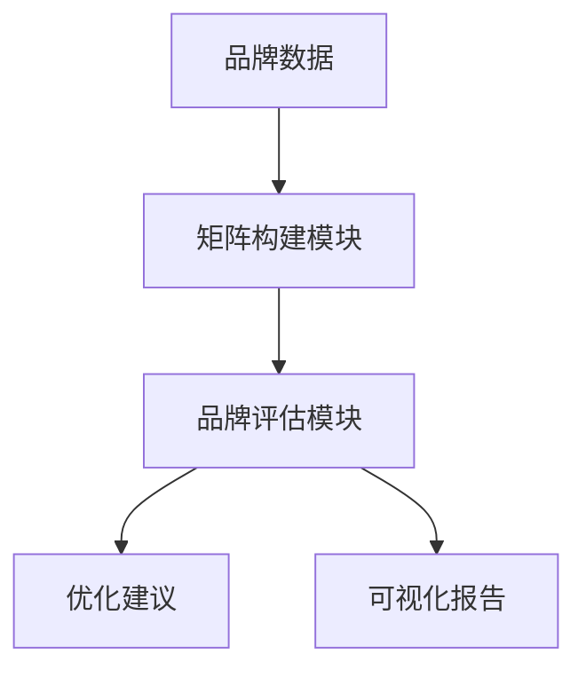

                 


# 彼得林奇如何评估公司的品牌矩阵管理效果

> 关键词：品牌矩阵管理, 彼得·林奇, 投资评估, 品牌管理策略, 矩阵优化, 企业战略

> 摘要：本文详细探讨了彼得·林奇如何通过品牌矩阵管理来评估公司的品牌组合效果。从品牌矩阵管理的核心概念到具体评估方法，再到实际应用案例，文章全面解析了彼得·林奇的品牌管理策略，帮助企业更好地优化品牌组合，提升市场竞争力。

---

## 第一部分：品牌矩阵管理概述

### 第1章：品牌矩阵管理的背景与意义

#### 1.1 品牌矩阵管理的概念
- 品牌矩阵的定义：通过矩阵形式展示品牌组合，分析品牌之间的关系及其市场表现。
- 矩阵管理的核心目标：优化品牌组合，提升整体市场竞争力。
- 品牌矩阵管理的重要性：帮助企业清晰识别品牌优势与劣势，制定科学的品牌战略。

#### 1.2 彼得·林奇的管理风格
- 彼得·林奇的投资哲学：注重基本面分析，寻找具有持续竞争优势的企业。
- 林奇品牌矩阵管理的独特性：通过矩阵分析品牌组合的健康状况，识别高潜力品牌。
- 林奇方法的适用性：不仅适用于投资评估，也可用于企业内部品牌管理。

---

## 第二部分：品牌矩阵管理的核心概念

### 第2章：品牌矩阵管理的核心要素

#### 2.1 品牌矩阵的构建逻辑
- 品牌分类：根据市场表现、品牌生命周期、目标客户等维度对品牌进行分类。
- 矩阵维度选择：常见的维度包括市场份额、增长率、品牌忠诚度等。
- 矩阵坐标设计：横轴为市场表现，纵轴为品牌潜力，构建二维或三维矩阵。

#### 2.2 品牌矩阵的动态调整机制
- 品牌矩阵的定期评估：根据市场变化和品牌表现进行动态调整。
- 品牌矩阵的优化策略：通过数据驱动的方法，识别需要重点发展的品牌。
- 矩阵调整的实施步骤：数据收集、分析、决策、执行。

#### 2.3 品牌矩阵的评估标准
- 品牌健康指数：衡量品牌在市场中的表现。
- 品牌潜力指数：预测品牌未来的发展潜力。
- 品牌组合的优化目标：最大化品牌组合的整体价值。

---

### 第3章：品牌矩阵管理的算法原理

#### 3.1 品牌矩阵的量化评估方法
- 数据收集：通过市场调研、销售数据、客户反馈等方式获取品牌表现数据。
- 数据分析：使用统计方法对品牌数据进行分析，计算品牌指数。
- 品牌评分：根据分析结果，为每个品牌打分，构建品牌矩阵。

#### 3.2 品牌矩阵的动态调整算法
- 算法流程：
  1. 收集品牌数据。
  2. 计算品牌指数。
  3. 构建品牌矩阵。
  4. 评估矩阵效果。
  5. 根据评估结果调整品牌组合。

#### 3.3 品牌矩阵的优化策略
- 数据驱动的优化：通过数据分析确定哪些品牌需要重点发展或调整。
- 品牌组合优化：根据矩阵分析结果，优化品牌组合，提升整体市场表现。

---

### 第4章：品牌矩阵管理的系统架构设计

#### 4.1 问题场景介绍
- 品牌矩阵管理的核心问题：如何通过矩阵分析品牌组合，优化品牌管理策略。
- 林奇方法在品牌管理中的应用：通过矩阵分析品牌潜力，识别高增长品牌。
- 系统设计的目标：构建一个能够动态调整品牌矩阵的系统，支持企业品牌管理决策。

#### 4.2 系统功能设计
- 领域模型设计：
  - 品牌信息管理：包括品牌的基本信息、市场数据等。
  - 品牌矩阵构建：根据品牌数据构建矩阵，并进行动态调整。
  - 品牌评估报告：生成品牌矩阵分析报告，提供优化建议。

- 系统架构图：


---

### 第5章：品牌矩阵管理的项目实战

#### 5.1 环境安装与数据准备
- 环境要求：安装Python、Pandas、Matplotlib等工具。
- 数据准备：收集品牌市场数据，包括市场份额、增长率、品牌忠诚度等。

#### 5.2 品牌矩阵管理的代码实现
```python
import pandas as pd
import numpy as np
import matplotlib.pyplot as plt

# 数据准备
brand_data = pd.DataFrame({
    '品牌': ['A', 'B', 'C', 'D'],
    '市场份额': [25, 35, 20, 15],
    '增长率': [10, 5, 15, 7],
    '品牌忠诚度': [85, 70, 60, 90]
})

# 品牌指数计算
brand_index = brand_data[['市场份额', '增长率', '品牌忠诚度']].apply(lambda x: (x.rank().mean()), axis=1)
brand_data['品牌指数'] = brand_index

# 品牌矩阵构建
plt.scatter(brand_data['增长率'], brand_data['市场份额'], c=brand_data['品牌指数'])
plt.xlabel('增长率')
plt.ylabel('市场份额')
plt.title('品牌矩阵')
plt.colorbar(label='品牌指数')
plt.show()
```

#### 5.3 代码解读与分析
- 数据准备：收集品牌的相关数据，包括市场份额、增长率和品牌忠诚度。
- 品牌指数计算：使用排名法计算品牌指数，反映品牌在各个维度上的表现。
- 品牌矩阵构建：通过散点图展示品牌在增长率和市场份额上的分布，颜色反映品牌指数。

#### 5.4 实际案例分析
- 案例背景：某公司旗下多个品牌在市场中的表现不同。
- 案例分析：通过矩阵分析，识别哪些品牌需要重点发展，哪些品牌需要调整。
- 案例结论：优化品牌组合，提升整体市场表现。

---

## 第三部分：品牌矩阵管理的总结与展望

### 第6章：总结与注意事项

#### 6.1 核心内容回顾
- 品牌矩阵管理的核心概念：构建矩阵、评估品牌、优化组合。
- 林奇方法的优势：通过矩阵分析品牌潜力，动态调整品牌组合。

#### 6.2 实践中的注意事项
- 数据准确性：确保数据来源可靠，避免分析偏差。
- 矩阵动态调整：根据市场变化定期评估矩阵，及时调整品牌组合。
- 品牌管理策略：结合企业战略，制定科学的品牌管理计划。

### 第7章：未来研究与扩展阅读

#### 7.1 未来研究方向
- 品牌矩阵管理的智能化：利用AI技术优化品牌矩阵分析。
- 多维度矩阵分析：引入更多维度，如品牌创新力、市场反应速度等。
- 品牌矩阵与企业战略的结合：研究矩阵管理如何支持企业长期发展目标。

#### 7.2 推荐阅读
- 彼得·林奇的《彼得·林奇的成功投资策略》。
- 品牌管理经典书籍：《管理学原理》。

---

## 作者：AI天才研究院 & 禅与计算机程序设计艺术

---

通过本文的系统分析与实战案例，读者可以全面了解彼得·林奇如何通过品牌矩阵管理评估公司的品牌组合效果，并将其应用到实际的品牌管理中，帮助企业优化品牌组合，提升市场竞争力。

