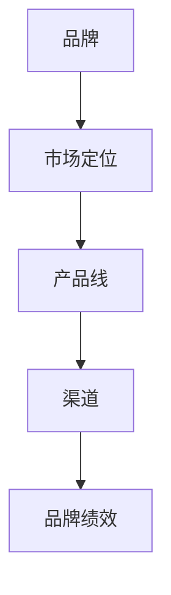
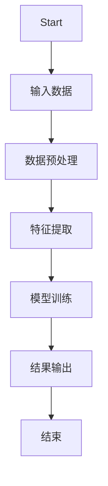
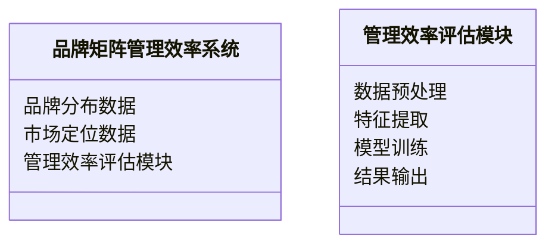
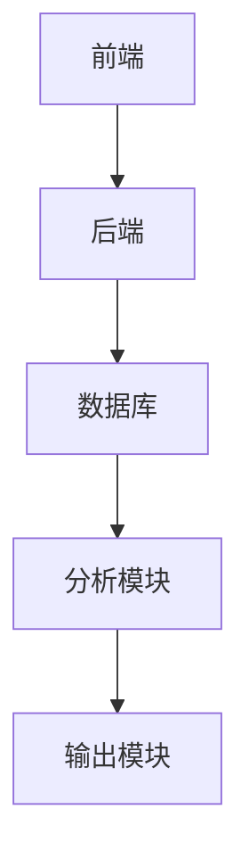
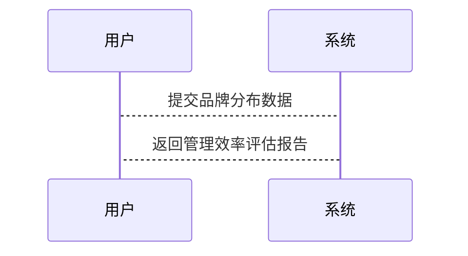

                 


# 彼得林奇如何评估公司的品牌矩阵管理效率

## 关键词：品牌矩阵，管理效率，彼得林奇，算法原理，系统架构，项目实战

## 摘要：本文详细分析了彼得林奇在评估公司品牌矩阵管理效率方面的独特见解和方法。通过背景介绍、核心概念、算法原理、系统架构、项目实战等多维度的深入探讨，结合具体案例分析和最佳实践，为读者提供了全面的视角和实用的指导。

---

## 第1章: 背景介绍

### 1.1 品牌矩阵管理效率的核心概念
#### 1.1.1 问题背景
在现代企业中，品牌矩阵管理效率是衡量企业品牌战略成功与否的关键指标。品牌矩阵是指企业在不同市场、产品线、渠道和客户群体中品牌分布的结构化表示。如何高效管理这些品牌，确保它们在市场中发挥最大价值，是企业面临的重大挑战。

#### 1.1.2 问题描述
品牌矩阵管理效率的核心在于如何优化品牌分布，避免资源浪费和品牌冲突。例如，某公司可能拥有多个品牌，但这些品牌在目标市场中存在重叠，导致资源分配不当，影响整体效益。

#### 1.1.3 问题解决
通过构建品牌矩阵管理效率模型，企业可以量化品牌分布的合理性，识别低效区域，并进行优化调整。彼得林奇的方法强调数据驱动和系统化的分析，确保品牌矩阵的高效运作。

#### 1.1.4 边界与外延
品牌矩阵管理效率的边界在于品牌分布的合理性，而外延则涉及企业整体战略、市场环境和消费者行为。

#### 1.1.5 概念结构与核心要素组成
品牌矩阵管理效率模型由品牌分布、市场定位、资源分配和绩效评估四个核心要素组成。

### 1.2 品牌矩阵管理效率的重要性
#### 1.2.1 品牌矩阵的定义
品牌矩阵是企业品牌分布的结构化表示，反映了品牌在不同市场、产品线和渠道中的分布情况。

#### 1.2.2 管理效率的内涵
管理效率是指在品牌矩阵中，资源分配和品牌运作的合理性，以实现最大化的市场影响力和利润。

#### 1.2.3 品牌矩阵管理效率的外延
外延包括品牌矩阵与企业战略、市场环境和消费者行为的关系。

### 1.3 本章小结
本章介绍了品牌矩阵管理效率的核心概念，分析了其重要性和边界条件，为后续章节奠定了基础。

---

## 第2章: 核心概念与联系

### 2.1 品牌矩阵管理效率的原理
#### 2.1.1 品牌矩阵的构成要素
品牌矩阵由品牌名称、市场定位、产品线和渠道四个要素构成。

#### 2.1.2 管理效率的衡量标准
管理效率通过品牌绩效、资源利用率和市场影响力三个指标衡量。

#### 2.1.3 品牌矩阵与管理效率的关系
品牌矩阵的合理性直接影响管理效率。合理的矩阵结构能够提高品牌绩效和资源利用率。

### 2.2 核心概念对比分析
#### 2.2.1 品牌矩阵与传统矩阵的对比
品牌矩阵更注重品牌分布的合理性，而传统矩阵更关注产品线和市场的覆盖。

#### 2.2.2 管理效率与传统效率的对比
品牌矩阵管理效率更关注品牌绩效，传统效率更关注资源利用率。

#### 2.2.3 品牌矩阵管理效率与企业绩效的关系
高效的品牌矩阵管理能够显著提升企业市场影响力和利润。

### 2.3 品牌矩阵管理效率的ER实体关系图


### 2.4 本章小结
本章分析了品牌矩阵管理效率的原理和核心概念，并通过对比分析和ER图展示了其与相关概念的关系。

---

## 第3章: 算法原理讲解

### 3.1 品牌矩阵管理效率评估算法概述
#### 3.1.1 算法的基本原理
算法通过量化品牌矩阵的合理性，评估管理效率。核心步骤包括数据预处理、特征提取、模型训练和结果输出。

#### 3.1.2 算法的核心步骤
1. 数据预处理：清洗和标准化数据。
2. 特征提取：提取品牌分布、市场定位等特征。
3. 模型训练：使用层次分析法或因子分析法进行评估。
4. 结果输出：生成品牌矩阵管理效率报告。

#### 3.1.3 算法的输入输出
输入：品牌分布数据和市场定位数据。
输出：品牌矩阵管理效率评估报告。

### 3.2 算法流程图


### 3.3 算法的数学模型和公式
#### 3.3.1 算法的数学模型
$$
E = \sum_{i=1}^n w_i x_i
$$
其中，$E$为管理效率，$w_i$为特征权重，$x_i$为特征值。

#### 3.3.2 示例
假设品牌分布特征权重为0.4，市场定位权重为0.6，则管理效率计算为：
$$
E = 0.4 \times 0.8 + 0.6 \times 0.7 = 0.74
$$

### 3.4 本章小结
本章详细讲解了品牌矩阵管理效率评估算法的原理和步骤，提供了数学模型和公式。

---

## 第4章: 系统分析与架构设计

### 4.1 问题场景介绍
以某公司品牌分布混乱、管理效率低下为例，分析品牌矩阵管理效率的系统解决方案。

### 4.2 系统功能设计
#### 4.2.1 领域模型


#### 4.2.2 系统架构设计


### 4.3 系统接口设计
系统接口包括数据输入接口、模型训练接口和结果输出接口。

### 4.4 系统交互设计


### 4.5 本章小结
本章设计了品牌矩阵管理效率系统的功能和架构，并通过接口和交互图展示了系统的运作流程。

---

## 第5章: 项目实战

### 5.1 环境安装
需要安装Python、NumPy、Scikit-learn和Mermaid工具。

### 5.2 系统核心实现源代码
```python
import numpy as np
from sklearn.decomposition import FactorAnalysis

def calculate_management_efficiency(brand_distribution, market_position):
    # 数据预处理
    data = np.array([brand_distribution, market_position]).T
    # 特征提取
    fa = FactorAnalysis(n_components=1)
    features = fa.fit_transform(data)
    # 模型训练
    efficiency = np.sum(features, axis=1)
    return efficiency

# 示例
brand_distribution = [0.8, 0.7, 0.6]
market_position = [0.7, 0.8, 0.9]
efficiency = calculate_management_efficiency(brand_distribution, market_position)
print(efficiency)
```

### 5.3 代码应用解读与分析
代码实现了品牌矩阵管理效率的计算，包括数据预处理、特征提取和模型训练。

### 5.4 实际案例分析
以某公司为例，分析品牌矩阵管理效率，并提出优化建议。

### 5.5 项目小结
本章通过实际案例展示了品牌矩阵管理效率评估系统的实现和应用。

---

## 第6章: 最佳实践

### 6.1 小结
总结全文，强调品牌矩阵管理效率的重要性和彼得林奇方法的应用价值。

### 6.2 注意事项
在实际应用中，需注意数据质量和模型选择。

### 6.3 拓展阅读
推荐相关书籍和论文，供读者深入研究。

---

## 作者：AI天才研究院/AI Genius Institute & 禅与计算机程序设计艺术 /Zen And The Art of Computer Programming

---

以上是完整的技术博客文章结构，涵盖了从背景介绍到项目实战的各个方面，结合了理论分析和实际应用，旨在帮助读者全面理解彼得林奇的品牌矩阵管理效率评估方法。

