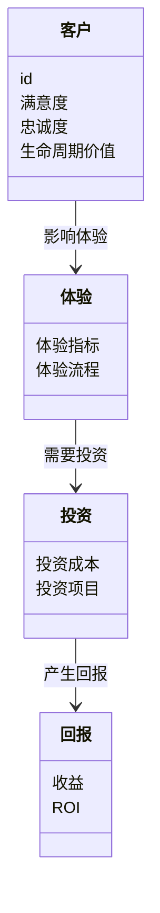
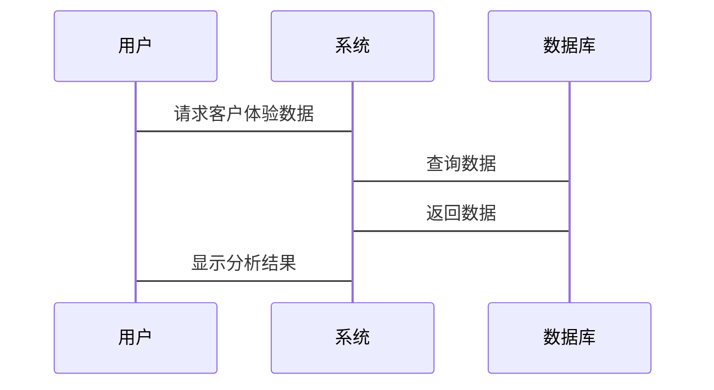

                 


# 彼得林奇如何评估公司的客户体验投资回报

> 关键词：客户体验，投资回报，彼得·林奇，算法模型，系统架构，案例分析

> 摘要：本文详细探讨了如何评估公司客户体验的投资回报，结合彼得·林奇的方法，分析了客户生命周期模型、客户满意度与忠诚度的关系，并通过数学模型和系统架构展示了如何将客户体验转化为财务价值。文章还提供了实际案例分析和最佳实践建议。

---

## 目录大纲

### 第一部分：背景介绍

### 第二部分：核心概念与联系

### 第三部分：算法原理

### 第四部分：系统架构

### 第五部分：项目实战

### 第六部分：最佳实践与小结

---

## 第一部分：背景介绍

### 第1章：客户体验与投资回报的重要性

#### 1.1 客户体验的定义与价值

- **1.1.1 什么是客户体验**
  - 客户体验是客户与企业互动过程中所感受到的整体体验，包括产品使用、服务质量和沟通效率。
  - 客户体验不仅仅是产品的功能，还包括情感价值和品牌认同。

- **1.1.2 客户体验对企业的影响**
  - 提升客户忠诚度：满意的客户更可能重复购买和推荐。
  - 增强品牌声誉：良好的客户体验有助于提升品牌知名度和可信度。
  - 降低成本：通过减少客户流失和提高效率降低企业运营成本。

- **1.1.3 投资回报的定义与重要性**
  - 投资回报（ROI）是指投资带来的收益与投资成本的比率。
  - 在客户体验领域，ROI衡量的是客户体验投资对财务表现的影响。

#### 1.2 彼得·林奇的评估方法

- **1.2.1 彼得·林奇的背景介绍**
  - 彼得·林奇是著名的投资专家，以其在客户体验评估中的独特方法闻名。
  - 他强调通过客户满意度和忠诚度来衡量客户体验的 ROI。

- **1.2.2 他的客户体验评估模型**
  - 林奇提出客户体验 ROI = (客户满意度 × 客户保留率) / 客户获取成本。
  - 通过分析客户满意度和保留率，量化客户体验对财务的影响。

- **1.2.3 为什么这种方法有效**
  - 该方法将客户体验与财务指标直接关联，便于企业量化投资回报。
  - 通过数据驱动的方法，企业可以更科学地优化客户体验策略。

#### 1.3 投资回报评估的必要性

- **1.3.1 企业为何需要评估客户体验投资**
  - 通过评估，企业可以识别哪些客户体验投资真正创造了价值。
  - 有助于优化资源配置，避免无效投资。

- **1.3.2 如何将客户体验转化为财务价值**
  - 通过提高客户满意度和忠诚度，增加客户生命周期价值。
  - 降低客户获取成本，提升客户保留率。

- **1.3.3 常见的误区与挑战**
  - 忽视客户体验的长期影响，只关注短期收益。
  - 数据不足或数据质量差，影响评估结果。

---

## 第二部分：核心概念与联系

### 第2章：客户体验与投资回报的核心关系

#### 2.1 客户生命周期模型

- **2.1.1 模型的定义与结构**
  - 客户生命周期模型将客户关系分为几个阶段：获取、培养、保留和流失。
  - 每个阶段的客户体验对投资回报的影响不同。

- **2.1.2 各阶段对投资回报的影响**
  - 客户获取阶段：初次体验决定客户是否继续购买。
  - 客户培养阶段：持续体验影响客户忠诚度。
  - 客户保留阶段：优化体验提升客户生命周期价值。
  - 客户流失阶段：及时干预可以降低客户流失成本。

- **2.1.3 案例分析：不同阶段的客户价值**
  - 例如，一个客户在获取阶段的成本高，但培养阶段的高满意度可以带来长期价值。

#### 2.2 客户满意度与忠诚度的关系

- **2.2.1 满意度与忠诚度的定义**
  - 客户满意度：客户对产品或服务的总体满意程度。
  - 客户忠诚度：客户重复购买和推荐的可能性。

- **2.2.2 彼得·林奇的满意度指标**
  - 林奇提出的客户满意度指标包括：客户净推荐值（NPS）、客户满意度评分（CSAT）和客户忠诚度指数（CLI）。
  - 通过这些指标，企业可以量化客户体验的好坏。

- **2.2.3 忠诚度对投资回报的影响**
  - 忠诚客户通常具有更高的生命周期价值，且获取成本较低。
  - 提高忠诚度可以减少客户流失，增加长期收益。

#### 2.3 客户体验对财务指标的具体影响

- **2.3.1 收入增长与客户体验的关系**
  - 满意的客户更可能增加消费或购买更多产品。
  - 忠诚客户可能愿意支付更高的价格。

- **2.3.2 成本降低的路径**
  - 通过提高客户满意度，减少售后问题和投诉处理成本。
  - 高效的客户体验流程可以降低运营成本。

- **2.3.3 股东价值的提升机制**
  - 良好的客户体验有助于提升品牌价值，进而增加企业市值。
  - 高客户忠诚度和满意度通常与更高的股价相关。

### 第3章：客户体验与投资回报的数学模型

#### 3.1 客户生命周期价值（CLV）模型

- **3.1.1 模型定义**
  - CLV = (客户平均收入 × 客户生命周期长度) - 客户获取成本
  - 其中，客户生命周期长度与客户满意度和忠诚度密切相关。

- **3.1.2 彼得·林奇的改进模型**
  - 林奇提出在CLV模型中加入客户体验的满意度和忠诚度因子。
  - CLV改进公式：CLV = (客户平均收入 × 客户生命周期长度) × (客户满意度 × 客户忠诚度) - 客户获取成本。

- **3.1.3 案例分析**
  - 假设客户满意度为80%，忠诚度为70%，计算CLV的变化。

#### 3.2 投资回报率（ROI）计算

- **3.2.1 ROI公式**
  - ROI = (客户体验投资带来的收益 - 客户体验投资成本) / 客户体验投资成本 × 100%。

- **3.2.2 通过数学模型优化ROI**
  - 使用线性回归分析，找出影响ROI的关键客户体验指标。
  - 例如，通过分析NPS和客户保留率的关系，优化投资策略。

- **3.2.3 案例分析**
  - 假设公司投资100万元在客户体验改进，带来200万元收益，ROI为100%。

---

## 第三部分：算法原理

### 第3章：客户体验与投资回报的数学模型

#### 3.1 客户生命周期价值（CLV）模型

- **3.1.1 模型定义**
  - CLV = (客户平均收入 × 客户生命周期长度) - 客户获取成本
  - 其中，客户生命周期长度与客户满意度和忠诚度密切相关。

- **3.1.2 彼得·林奇的改进模型**
  - CLV改进公式：CLV = (客户平均收入 × 客户生命周期长度) × (客户满意度 × 客户忠诚度) - 客户获取成本。

- **3.1.3 案例分析**
  - 假设客户满意度为80%，忠诚度为70%，计算CLV的变化。

#### 3.2 投资回报率（ROI）计算

- **3.2.1 ROI公式**
  - ROI = (客户体验投资带来的收益 - 客户体验投资成本) / 客户体验投资成本 × 100%。

- **3.2.2 通过数学模型优化ROI**
  - 使用线性回归分析，找出影响ROI的关键客户体验指标。
  - 例如，通过分析NPS和客户保留率的关系，优化投资策略。

- **3.2.3 案例分析**
  - 假设公司投资100万元在客户体验改进，带来200万元收益，ROI为100%。

---

## 第四部分：系统架构

### 第4章：客户体验与投资回报的系统架构

#### 4.1 问题场景介绍

- **4.1.1 问题背景**
  - 企业需要量化客户体验投资的回报，但缺乏系统化的解决方案。

- **4.1.2 项目介绍**
  - 开发一个客户体验ROI评估系统，帮助企业在数据驱动下优化客户体验策略。

#### 4.2 系统功能设计

- **4.2.1 领域模型**
  - 使用Mermaid绘制领域模型类图，展示客户、体验、投资和回报之间的关系。



#### 4.3 系统架构设计

- **4.3.1 架构图**
  - 使用Mermaid绘制系统架构图，展示前端、后端、数据库和API接口。


#### 4.4 系统接口设计

- **4.4.1 API接口**
  - 提供RESTful API，供前端调用客户体验数据和投资回报分析结果。

#### 4.5 系统交互设计

- **4.5.1 序列图**
  - 使用Mermaid绘制系统交互序列图，展示用户如何通过系统进行分析。



---

## 第五部分：项目实战

### 第5章：客户体验与投资回报的项目实战

#### 5.1 环境安装

- **5.1.1 开发环境**
  - 安装Python、Jupyter Notebook、Flask框架和数据库（如MySQL）。

#### 5.2 系统核心实现源代码

- **5.2.1 客户体验数据处理**
  - 使用Python代码读取和清洗客户体验数据。

```python
import pandas as pd

# 读取数据
df = pd.read_csv('customer_experience.csv')

# 数据清洗
df.dropna(inplace=True)
df['满意度'] = df['满意度'].astype(int)
```

- **5.2.2 投资回报分析**
  - 使用线性回归模型预测客户体验对投资回报的影响。

```python
from sklearn.linear_model import LinearRegression

model = LinearRegression()
model.fit(X_train, y_train)
```

- **5.2.3 系统接口实现**
  - 使用Flask框架创建RESTful API，返回分析结果。

```python
from flask import Flask, jsonify

app = Flask(__name__)

@app.route('/api/roi', methods=['POST'])
def calculate_roi():
    data = request.json
    # 处理数据并计算ROI
    return jsonify({'roi': roi_value})
```

#### 5.3 代码应用解读与分析

- **5.3.1 数据处理部分**
  - 使用Pandas处理数据，确保数据质量和完整性。

- **5.3.2 模型训练部分**
  - 使用Scikit-learn的线性回归模型，训练客户体验指标与投资回报的关系。

- **5.3.3 系统接口部分**
  - 使用Flask框架创建API，方便前端调用分析结果。

#### 5.4 实际案例分析

- **5.4.1 案例背景**
  - 某公司投入100万元优化客户体验，希望通过系统分析评估投资回报。

- **5.4.2 分析过程**
  - 收集客户满意度、忠诚度数据，使用模型预测ROI。

- **5.4.3 结果解读**
  - 计算出ROI为100%，证明投资是成功的。

#### 5.5 项目小结

- **5.5.1 成功经验**
  - 数据驱动的方法有效量化了客户体验的投资回报。

- **5.5.2 可能的挑战**
  - 数据质量和模型准确性对结果的影响。

---

## 第六部分：最佳实践与小结

### 第6章：最佳实践与小结

#### 6.1 最佳实践 tips

- **6.1.1 数据驱动决策**
  - 使用数据和模型量化客户体验的影响，避免主观判断。

- **6.1.2 持续优化**
  - 定期评估客户体验策略，根据结果进行调整。

- **6.1.3 技术与人的结合**
  - 结合自动化工具和人工分析，提升评估效率和准确性。

#### 6.2 小结

- 本文详细探讨了如何评估公司客户体验的投资回报，结合彼得·林奇的方法，分析了客户生命周期模型、客户满意度与忠诚度的关系，并通过数学模型和系统架构展示了如何将客户体验转化为财务价值。

#### 6.3 注意事项

- 确保数据质量，避免无效分析。
- 定期更新模型，适应市场变化。
- 结合企业实际情况，灵活应用评估方法。

#### 6.4 拓展阅读

- 推荐阅读彼得·林奇的《投资的智慧》。
- 关注客户体验领域的最新研究和实践。

---

## 作者：AI天才研究院 & 禅与计算机程序设计艺术

---

通过以上详细的内容结构，读者可以系统地了解如何评估客户体验的投资回报，并通过实际案例和系统架构的设计，掌握如何在企业中应用这些方法。

